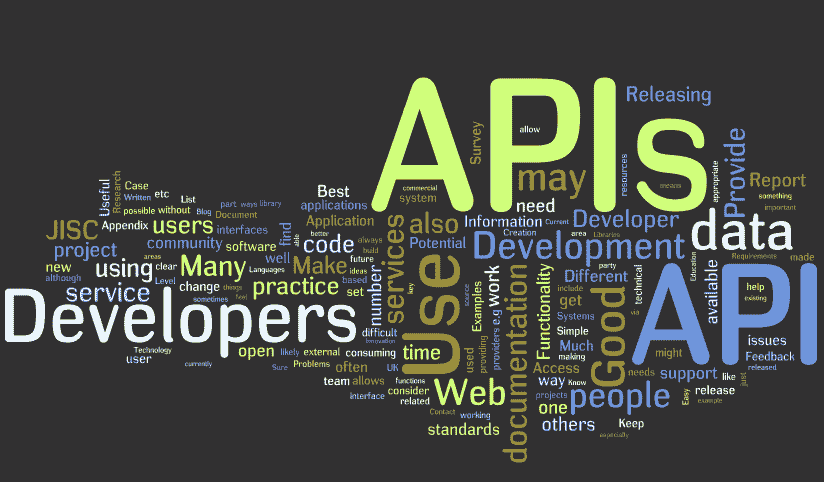

# 关于构建 API。

> 原文：<https://itnext.io/random-thoughts-on-building-apis-cbc9e7cd5ea2?source=collection_archive---------5----------------------->



slack 团队中一个名叫 Ian Gristol 的人说“API 是两个服务之间关于请求和响应形式的契约协议。代码只是副产品。它还包含这种数据交换的条款。”这非常有意义，因为当时包括我在内的大多数人都认为这只是编写代码和构建端点。

构建 API 时有各种过程或方法可以遵循，下面是我认为构建 API 时值得遵循的一些步骤。

1.  **选择一种 API 风格(REST/GRAPHQL)🤔**

```
**APIs** are not limited to just endpoints, business should always come first when choosing your API style. The API style that you choose should complement the solution you're trying to build and not the other way round.I honestly can't say much on when to use each style but then making proper research and knowing what your business needs should help out.An **API** endpoint is the point of entry in a communication channel when two systems are interacting.A **REST API** is an API that has different endpoints, doing different things.**GraphQL** doesn’t have an endpoint for different things but just one endpoint, you just tell the single endpoint what you want in a graphql query language.The difference between both is: a **REST API** is always going to return the same type of data if you give the endpoint the same parameter whereas a **GraphQL query**, even though you only want a very specific amount of data, you just ask for that specific amount of data.

The big difference is that **REST APIs** have many endpoints while **GraphQL** has just one endpoint.Other types of APIs in the past we’ve had **SOAP** but those are a thing of the past unless you’re working in a more matured industry like Banks and other financial institutions where you’re working with technologies that are 10-15 years old. Choosing any of these **APIs** depends on what exactly you want to do. REST is my personal favorite, by the way, I’m still **RESTing😅**Lastly, REST and GRAPHQL aren’t things you **`npm install graphql/rest`** or **`yarn install graphql/rest`** but they are certain methodologies as to how you want things to be structured. It’s not a piece of software that you go out and build but a way you tackle things.In the next steps, my focus is going to entirely be on building RES**T APIs** because that's what i'm mostly familiar with but i'll drop links down below for further reading on both **GraphQL and REST.**
```

**2。设置服务器💻**

```
Now you have to make use of a server that is going to accept the request whether a **REST** request or **GraphQL** request, do the work and return a response. You can do this in any language out there but being a javascript developer, I’d probably reach for Express, that is what I personally run all my own endpoints from. **Koa** seems to be a pretty popular server for specifically creating **APIs**.The thing about Express is that you’re going to need to reach out to middlewares for doing things like authentication or rate-limiting or even blacklisting.The beauty of Express is that for almost everything that you need there’s almost some sort of **middleware** or **plugin** that someone has written that will just immediately add all of that functionality to any of your requests. And of course, you can use any language you want to create an **API**, you could use Laravel if you write PHP, Ruby on Rails. Any server out there that can accept a request and return a response can be used to make an **API**.
```

**3。弄清楚如何正确命名 API 端点😓**

```
Naming things is one of the hardest parts of software development, it is quite difficult for developers to correctly name things. I generally like to use a noun for my API endpoints, never use a verb. There's a website called [RestfulAPI](https://restfulapi.net/resource-naming/), it has a whole page for best practices in naming **APIs.** It's easy to name APIs at first but when things get complicated it becomes quite difficult and messy. This is where **GraphQL** becomes advantageous and better than **REST APIs**, you don't need to create various endpoints with various names. You have just one endpoint doing everything.
```

**4。编写解析器/控制器✍️**

```
This is where we make things happen, I like to call it resolvers or controllers and this is where the actual work happens. 
When someone uses your API they are CRUD-ing (Create, Read, Update, Delete). Now when someone hits any of your API endpoints you need to do the work either looking up stuff in the database, authentication, saving data to a DB that's what I'd call a resolver. It gets the data, updates the data and send back to the user with a code to show the user what happened, these codes are called **Http** **Response Code**.
```

**5。找出如何保护它，防止它从恶意攻击❌**

```
The first point of securing your API is ensuring traffic is only allowed via https. There are a couple of ways you can secure an API also one of the simplest forms of security is to only accept requests from logged-in users, so that could be a cookie session, a JWT or you can use AUTH which is sort of complex. Other ways are to provide API keys for people accessing your APIs and also a random id so that you can track the number of requests that goes through that API key. You can use CORS(Cross-origin Resource Sharing), which means whether the API should be accessible in the browser or is it to be accessed on the server. There’s also keeping the access level of your users in mind, make sure only admin level users can have access to every user information.
Protecting your **API** is not necessarily the same thing as securing your API but it’s along the same lines though, you’d want to protect your servers, computers that are serving up this data from all sorts of malicious and intentionally and unintentionally threats. One of the things you can do is to rate limit by **API key** or by **IP Address**, so if somebody is doing something more than usual you can tell the user to chill for a while and try again or else you won’t serve the data again.
```

**6。记录 API📝**

```
This actually a huge thing, if you have an **API** and expect anyone to use it or even yourself, you need to document it. you have to pay close attention to how you are doing it and in my mind, the best option is to copy the people doing it well and don't try to make things up. For example, Stripe has a very good documentation, one of the best I've seen. Check it out [**here**](https://stripe.com/docs/api).Document what parameters, headers that can be accessed and even up to the tiniest of details. Parameters even if they aren't required. They need to be properly documented. Also, document needs to get back when someone hits a particular endpoint. You can also document your public **API** to match various languages in case your users are global, it's called **Internalization(i8n)** and **Localization.**Another thing you need to learn to put in your API documentation are the **HTTP verbs**. When you make a request in any language you can send that request as any number of different verbs, you can make a **GET** request which is used to get data from the server, a **POST** request which is used to send data to the server, **PUT** request which is used to update data and a **DELETE** request which is used to remove data.
```

*   **奖励:对 API 进行版本控制**

```
A lot of times, companies have different versions of an API because the existing structure of the current API is not going to be the same forever and many of these **APIs** give you the ability to use an older version of the API that way if you hit the API endpoint, it's not going to magically change on you. So by versioning it, it's kind of locking functionality to a given point in time.Companies that do this really well obviously, it's **Stripe**. 
Within their API docs, you can set the version of their API that you need.Versioning API an API is an extremely important thing because it gives you the correct version of the **API endpoint** that you want to hit. It also gives library authors the ability to update and change the API, but then you don't want to go and change things often and like crazy otherwise, you will get a lot of people upset.
```

延伸阅读:

*   [https://blog.back4app.com/2019/11/25/when-to-use-graphql/](https://blog.back4app.com/2019/11/25/when-to-use-graphql/)
*   [https://www . altex soft . com/blog/engineering/what-is-API-definition-types-specifications-documentation/](https://www.altexsoft.com/blog/engineering/what-is-api-definition-types-specifications-documentation/)
*   [https://www . moes if . com/blog/technical/graph QL/REST-vs-graph QL-APIs-the-good-the-bad-the-ugly/](https://www.moesif.com/blog/technical/graphql/REST-vs-GraphQL-APIs-the-good-the-bad-the-ugly/)
*   [https://xalitech.com/graphql-how-to-convince-your-boss/](https://xalitech.com/graphql-how-to-convince-your-boss/)
*   [https://dev . to/sadarshannayinar/graph QL-or-rest-what-should-I-use-38mj](https://dev.to/sadarshannaiynar/graphql-or-rest-what-should-i-use-38mj)
*   [https://developer . Mozilla . org/en-US/docs/Learn/JavaScript/Client-side _ web _ APIs/Introduction](https://developer.mozilla.org/en-US/docs/Learn/JavaScript/Client-side_web_APIs/Introduction)
*   [https://www.howtographql.com/](https://www.howtographql.com/)
*   [https://www.restapitutorial.com/](https://www.restapitutorial.com/)