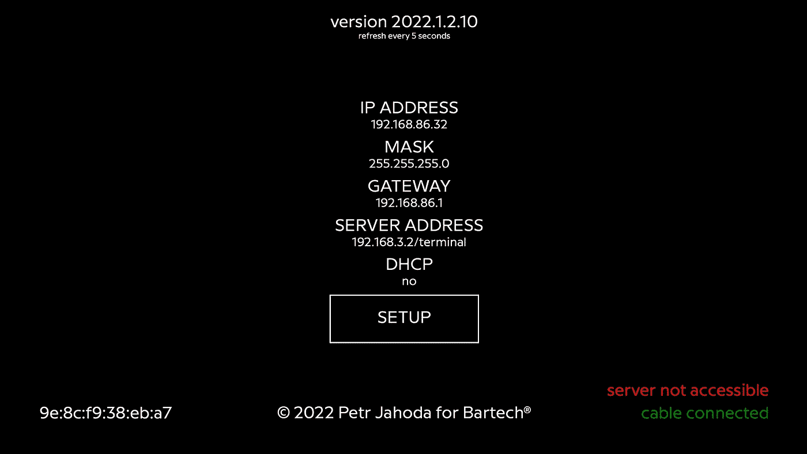

# Raspberry Pi 只读信息亭模式:2022 完整教程

> 原文：<https://itnext.io/raspberry-pi-read-only-kiosk-mode-2022-complete-tutorial-df7fc051fdaf?source=collection_archive---------0----------------------->

## 包括网络设置软件和远程控制



这是前一篇文章的更新。

[](/raspberry-pi-read-only-kiosk-mode-the-complete-tutorial-for-2021-58a860474215) [## Raspberry Pi 只读信息亭模式:2021 完整教程

### 包括网络设置软件和远程控制

itnext.io](/raspberry-pi-read-only-kiosk-mode-the-complete-tutorial-for-2021-58a860474215) 

本次更新的基础是 RaspberryPiOS 64 位，2022 年 1 月 28 日起的版本，牛眼 11，内核 5.10。

RaspberryPi 上运行的服务用新特性进行了更新。

在该过程中使用了树莓 Pi 4b。

后端 web 服务是用 Go 编写的(前端是普通的 html+css+js ),使用本教程:

[](https://medium.com/swlh/create-go-service-the-easy-way-de827d7f07cf) [## 以简单的方式创建 Go 服务

### 适用于 Windows、Linux、MacOS 和 Docker

medium.com](https://medium.com/swlh/create-go-service-the-easy-way-de827d7f07cf) 

源代码可以在这里找到:

[](https://github.com/petrjahoda/terminal_local_webservice) [## GitHub-petrjahoda/terminal _ local _ web service

### 通过在 GitHub 上创建一个帐户，为 petrjahoda/terminal _ local _ web service 开发做出贡献。

github.com](https://github.com/petrjahoda/terminal_local_webservice) 

# 1.准备树莓酱

*   使用来自[官方网站](https://www.raspberrypi.org/software/)的 raspbian lite 64 位成像仪进行安装
*   使用`sudo apt-get update && sudo apt-get upgrade`进行更新和升级
*   使用`sudo raspi-config`:启用控制台自动登录、启用 ssh、启用过扫描(或禁用欠扫描)
*   使用`sudo apt-get install maim`安装 maim
*   使用`sudo apt-get install network-manager`安装网络管理器
*   使用`sudo systemctl enable NetworkManager`启用网络管理器作为服务
*   使用`sudo systemctl start NetworkManager`将网络管理器作为服务启动
*   使用`sudo systemctl mask dhcpcd`禁用旧的 dhcp 服务
*   使用`sudo apt-get install ufw`安装 ufw
*   使用`sudo ufw allow 9999`启用端口 9999
*   使用`sudo reboot now`重启

现在测试一下一切是否正常，然后嘘嘘。

# 2.在 kiosk 模式下安装 Chromium

*   使用`sudo apt-get install --no-install-recommends xserver-xorg x11-xserver-utils xinit openbox`安装先决条件
*   使用`sudo apt-get install --no-install-recommends chromium-browser`安装铬合金
*   使用`sudo nano /etc/xdg/openbox/autostart`编辑自动启动文件，插入以下行:

```
# Disable any form of screen saver / screen blanking / power management
xset s off
xset s noblank
xset -dpms# Allow quitting the X server with CTRL-ATL-Backspace
setxkbmap -option terminate:ctrl_alt_bksp# Start Chromium in kiosk mode
sed -i 's/"exited_cleanly":false/"exited_cleanly":true/' ~/.config/chromium/'Local State'
sed -i 's/"exited_cleanly":false/"exited_cleanly":true/; s/"exit_type":"[^"]\+"/"exit_type":"Normal"/' ~/.config/chromium/Default/Preferences
chromium-browser --start-fullscreen --kiosk --incognito --noerrdialogs --disable-translate --no-first-run --fast --fast-start --disable-infobars --disable-features=TranslateUI --disk-cache-dir=/dev/null  --password-store=basic --disable-pinch --overscroll-history-navigation=disabled --disable-features=TouchpadOverscrollHistoryNavigation 'http://localhost:9999'
```

***附加信息:****chromium-browser 有一个附加标志:* `*temporary-unexpire-flags-m80*` *。这个标志从 2021 年 6 月 20 日起从 chromium 中删除，所以上面的命令被更新。感谢 Paul den Hertog 提供的信息。有一种可能性是，当你将来阅读这篇文章时，有些标志是不必要的。*

*   使用`sudo nano .bash_profile`使一切在引导时启动，插入以下行:

```
[[ -z $DISPLAY && $XDG_VTNR -eq 1 ]] && startx -- -nocursor
```

> *提示:按下* `*Ctrl-Alt-Backspace*` *可以杀死 chromium 并进入命令行*

# 3.将程序数据复制到 Raspberry

*   将/linux/terminal_local_linux 复制到/home/pi 中
*   将/config/*复制到/home/pi/*中
*   将/html/*复制到/home/pi/*中
*   将/css/*复制到/home/pi/*中
*   将/js/*复制到/home/pi/*中
*   将/font/*复制到/home/font/*中

> *示例:使用 scp 复制 rpi 程序文件:* `*scp linux/terminal_local_linux pi@<ipaddress>:/home/pi*`
> 
> *示例:使用 scp 复制所有目录:* `*scp -r config html css js font pi@<ipaddress>:/home/pi*`

# 4.使程序作为服务运行

*   使用`sudo nano /lib/systemd/system/terminal.service`创建新文件，插入以下行:

```
[Unit]
Description=Terminal Service
ConditionPathExists=/home/pi/terminal_local_linux
After=network.target
[Service]
Type=simple
User=root
Group=root
LimitNOFILE=1024
Restart=on-failure
RestartSec=10
WorkingDirectory=/home/pi
ExecStart=/home/pi/terminal_local_linux
PermissionsStartOnly=true
SyslogIdentifier=terminal_service
[Install]
WantedBy=multi-user.target
```

*   使用`sudo chmod 755 /lib/systemd/system/terminal.service`确保文件是可执行的
*   使用`sudo systemctl enable terminal.service`使服务自动启动
*   使用`sudo systemctl start terminal.service`立即启动服务

> *提示:使用* `*journalctl -f -u terminal.service*`搜索日志

# 5.干净的启动屏幕和信息

*   使用`sudo nano /boot/config.txt`禁用启动彩虹:添加行`disable_splash=1`
*   使用`sudo nano /boot/cmdline.txt`禁用引导信息:在第一行的末尾添加`silent quiet splash loglevel=0 logo.nologo vt.global_cursor_default=0`，用`console=tty3`替换`console=tty1`
*   禁用引导自动登录终端信息:运行`touch ~/.hushlogin`，运行`sudo nano /etc/systemd/system/getty@tty1.service.d/autologin.conf`，将线路`ExecStart=-/sbin/agetty --autologin pi --noclear %I xterm-256color`替换为`ExecStart=-/sbin/agetty --skip-login --noclear --noissue --login-options "-f pi" %I $TERM`

# 6.将 Raspberry Pi 设为只读

*   移除交换

```
sudo dphys-swapfile swapoff
sudo dphys-swapfile uninstall
sudo update-rc.d dphys-swapfile remove
```

*   更新和升级一切

```
sudo apt-get update
sudo apt-get dist-upgrade
sudo apt-get upgrade
sudo BRANCH=next rpi-update
```

*   使用`sudo reboot now`重启
*   使用`sudo mkinitramfs -o /boot/initrd`创建 initramfs
*   使用`sudo curl https://gist.githubusercontent.com/paul-ridgway/d39cbb30530442dca416734c3ee70162/raw/c490df8be1976dd062a8b5f429ef42ed1b393ecb/ro-root.sh -o /bin/ro-root.sh`添加脚本
*   使用`sudo chmod +x /bin/ro-root.sh`使脚本可执行
*   使用`sudo nano /boot/config.txt`将这些行添加到配置文件的末尾

```
initramfs initrd followkernel
ramfsfile=initrd
ramfsaddr=-1
```

*   使用`sudo nano /boot/cmdline.txt`将此文本添加到 cmdline 文件的末尾

```
init=/bin/ro-root.sh
```

*   使用`sudo reboot now`重启

> *提示:根分区挂载为* `*/ro*` *，您可以使用* `*sudo mount -o remount,rw /ro*` *使其可写，例如，使用* `*touch /ro/home/pi/test.txt*` *创建一个永久文件，并使用* `*sudo mount -o remount,ro /ro*` *使其全部恢复为只读，该文件将在引导后保持不变。这是你可以做一些改变的方法，这些改变在重启后仍然存在。*

# 7.密码

*   设置密码为`3600`

# 8.远程管理

*   `http://<ipaddress>:9999/screenshot`的实际截图
*   `http://<ipaddress>:9999/setup-remote`处的远程设置
*   使用 javascript 远程重启(比如绑定某个按钮):

```
let data = {
  password: "3600"
};
fetch("/restart", {
  method: "POST",
  body: JSON.stringify(data)
}).then((result) => {
  console.log(result)
}).catch((error) => { 
  console.log(error)
});
```

*   使用 javascript 远程关机(比如绑定某个按钮):

```
let data = {
  password: "3600"
};
fetch("/shutdown", {
  method: "POST",
  body: JSON.stringify(data)
}).then((result) => {
  console.log(result)
}).catch((error) => {
  console.log(error)
});
```

*   使用 javascript 设置 dhcp(比如绑定某个按钮):

```
let data = {
  password: "3600",
  server: server.value,         // server web, example: 192.168.86.100:80/terminal/1
};
fetch("/dhcp", {
  method: "POST",
  body: JSON.stringify(data)
}).then((result) => {
  console.log(result)
}).catch((error) => {
  console.log(error)
});
```

*   使用 javascript 设置 static(比如绑定到某个按钮上):

```
let data = {
  password: "3600",     
  ipaddress: ipaddress.value,   // ip address, example: 192.168.86.128
  mask: mask.value,             // mask, example: 255.255.255.0
  gateway: gateway.value,       // gateway, example: 192.168.86.1
  server: server.value,         // server web, example: 192.168.86.100:80/terminal/1
};
fetch("/static", {
  method: "POST",
  body: JSON.stringify(data)
}).then((result) => {
  console.log(result)
}).catch((error) => {
  console.log(error)
});
```

*   检查电缆是否已连接(如捆绑在某个按钮上):

```
fetch("/checkCable", {
  method: "POST",
}).then((result) => {
  result.text().then(function (data) {
    let connected = JSON.parse(data);
    console.log(connected["Result"])
    });
}).catch((error) => {
  console.log(error)
});
```