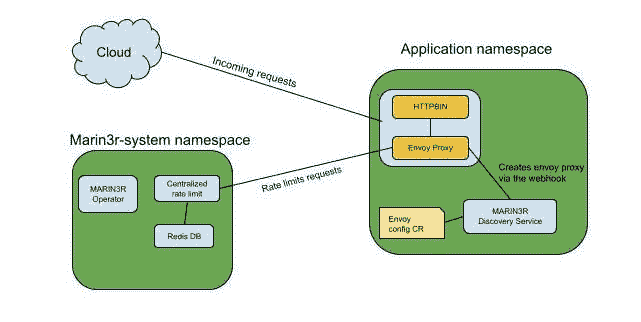

# MARIN3R 算子的速率限制

> 原文：<https://itnext.io/rate-limiting-with-marin3r-operator-5112858871be?source=collection_archive---------7----------------------->


[https://www . dw . com/en/Germans-at-logger-over-autobahn-speed-limits/a-47253578](https://www.dw.com/en/germans-at-loggerheads-over-autobahn-speed-limits/a-47253578)

最近我在做一个项目，其中一个需求是对传入请求的数量进行更多的控制，以保护服务免受攻击，并防止资源过载并最终崩溃。对此的解决方案是对系统中的关键服务进行速率限制，以保护应用程序免受不必要的请求。

在这篇博客中，我将解释速率限制负责什么，为什么我们在应用程序中需要它，并讨论我们用来添加在 OpenShift 集群上运行的集中式速率限制服务的方法。

## 什么是限速？

速率限制是一种用于控制来自和来自网络的请求速率的技术，例如，如果您使用的 API 允许每分钟一定数量的请求，并且如果超过此限制，则一分钟内的任何其他请求都将被拒绝，并且会返回一个*429-太多请求错误*以响应请求。

这对于防止服务器达到其最大容量或防止像 [DDoS](https://www.paloaltonetworks.com/cyberpedia/what-is-a-denial-of-service-attack-dos) 或任何恶意机器人活动的攻击是很重要的。因此，通过实施速率限制，我们可以确保服务不会因不需要的请求而过载，也不会消耗服务器上所有可用的资源。

我们还可以定义指标来监控当前正在处理或被阻塞的请求的数量，并调查是否需要扩展服务器中的资源，以便能够处理更多的请求。实现速率限制有几种方法，可以通过应用程序、web 服务器、缓存等。我们将介绍如何通过代理请求并将其计入允许的请求总数来实现速率限制。

**用 MARIN3R 运算符实现速率限制**

为了让速率限制服务工作，我们首先需要控制来自网络的每个请求，为此，我们可以使用 [Envoy](https://www.envoyproxy.io/) 作为代理服务器，在传入的请求到达应用程序服务之前拦截和响应它们。

我们将使用 [MARIN3R 操作符](https://github.com/3scale/marin3r)来促进 sidecar 容器的部署，使 Envoy 运行并配置为首先接收请求，然后将它们转发到我们的应用程序容器，这听起来可能有点混乱，但我将在稍后演示它是如何工作的。MARIN3R 允许我们通过向应用程序的部署对象添加注释和标签来定义哪些服务将具有注入的代理容器，并且我们可以通过创建 EnvoyConfig CRDs 来动态配置这些代理。

除了 MARIN3R 操作符，一个带有 Redis 数据库的 envoy [全局速率限制服务](https://github.com/envoyproxy/ratelimit)将被部署到我们的集群，以控制和存储处理和拒绝的请求总量。

**总结**

我们将使用这些服务为我们的应用程序添加速率限制:

*   特使代理
*   全球限速服务
*   Redis 数据库
*   MARIN3R 运算符



显示服务将如何集成的图表

## 演示

在开始进行演示之前，请确保您可以访问以下内容:

*   OpenShift 或 Kubernetes 集群
*   开源代码库
*   [*oc*](https://docs.openshift.com/container-platform/4.7/cli_reference/openshift_cli/getting-started-cli.html#installing-openshift-cli) 或 [*kubectl*](https://kubernetes.io/docs/tasks/tools/) CLI

在这个演示中，我将使用一个 OpenShift 集群，但是在 Kubernetes 集群上也可以这样做。

*   我们要做的第一件事是部署一个小的 rest 应用程序，它将与 envoy 代理容器一起运行，以限制传入请求的速率。

```
## Create application namespace
oc new-project rest-application

## Deploy the application
cat <<'EOF' | kubectl apply -f -
---
apiVersion: apps/v1
kind: Deployment
metadata:
  name: httpbin
  namespace: rest-application
  labels:
    app: httpbin
spec:
  selector:
    matchLabels:
      app: httpbin
  template:
    metadata:
      labels:
        app: httpbin
    spec:
      containers:
        - name: httpbin
          image: jsmadis/httpbin
          ports:
            - containerPort: 8080
              protocol: TCP
---
kind: Service
apiVersion: v1
metadata:
  name: httpbin
  namespace: rest-application
  labels:
    app: httpbin
spec:
  ports:
    - name: 8080-tcp
      protocol: TCP
      port: 8080
      targetPort: 8080-tcp
  selector:
    app: httpbin
EOF

## expose service
oc expose svc/httpbin

## verify if application is running
oc get pods
NAME               READY   STATUS      RESTARTS   AGE
httpbin-1-8tpdh    1/1     Running     0          53s
httpbin-1-deploy   0/1     Completed   0          55s
```

上面的命令在集群上部署了一个 REST API 应用程序，您应该能够通过从其 route 对象获取主机来访问该应用程序:

```
$ oc get route httpbin -o json | jq .spec.host
```

*   应用程序启动并运行后，将 MARIN3R Operator 克隆到本地计算机的一个文件夹中:

```
$ git clone https://github.com/3scale/marin3r.git
```

*   在集群上安装 MARIN3R 操作器，我将使用 [OLM](https://github.com/operator-framework/operator-lifecycle-manager) 来安装操作器，但是如果 OLM 没有安装在您的集群上，同样可以使用 [Kustomize](https://github.com/3scale-ops/marin3r#install-using-kustomize) 来完成:

```
$ oc apply -f examples/quickstart/olm-install.yaml
```

这将在集群`Namespace`、`CatalogSource`、`OperatorGroup`和`Subscription`上创建 4 个资源，以通过 OLM 触发 MARIN3R 的安装。

*   等到所有 MARIN3R 服务都处于运行状态:

```
$ oc -n marin3r-system get pods | grep Running
```

*   我们将需要修补`operatorgroup`资源，以将我们的 REST API 应用程序的名称空间添加到`targedNamespace`列表中，这将允许 MARIN3R 监视我们的 REST API 名称空间中的资源:

```
$ oc patch operatorgroup marin3r-system -n marin3r-system --type json -p='[{"op": "add", "path": "/spec/targetNamespaces", "value": ["rest-application"]}]'
```

*   为了动态注入 Envoy sidecar 容器，我们需要在运行应用程序的名称空间上部署发现服务，对于我们的示例，我们将在 rest-application 名称空间上创建发现服务:

```
cat <<'EOF' | kubectl apply -f -
apiVersion: operator.marin3r.3scale.net/v1alpha1
kind: DiscoveryService
metadata:
  name: discoveryservice
  namespace: rest-application
EOF
```

*   将 MARIN3R 标签和注释添加到应用程序 DeploymentConfig 对象，这将激活特使边车容器到 Pod 规范的注入:

```
$ oc patch deployment httpbin -n rest-application -p '{"spec":{"template":{"metadata":{"labels":{"marin3r.3scale.net/status":"enabled"}, "annotations": {"marin3r.3scale.net/node-id": "httpbin","marin3r.3scale.net/ports": "8080-tcp:8443"}}}}}'
```

我们应该看到两个容器在我们的应用程序的 pod 中运行

```
oc get pods -l app=httpbin
NAME              READY   STATUS    RESTARTS   AGE
httpbin-3-c4mpz   2/2     Running   0          3m31s
```

*   我们需要配置 envoy 代理将任何传入的请求重定向到我们的应用程序，当我们将标签`marin3r.3scale.net/ports`添加到`8080-tcp:8443`时，我们说来自服务端口`8080-tcp`的任何请求都将被重定向到端口`8443`，Envoy 配置将监听`8443`端口，如下所示:

```
cat <<'EOF' | kubectl apply -f -
apiVersion: marin3r.3scale.net/v1alpha1
kind: EnvoyConfig
metadata:
  name: httpbin
spec:
  nodeID: httpbin
  serialization: yaml
  envoyResources:
    clusters:
      - name: httpbin
        value: |
          name: httpbin
          connect_timeout: 2s
          type: STRICT_DNS
          lb_policy: ROUND_ROBIN
          load_assignment:
            cluster_name: httpbin
            endpoints:
              - lb_endpoints:
                  - endpoint:
                      address:
                        socket_address:
                          address: 127.0.0.1
                          port_value: 8080
    listeners:
      - name: http
        value: |
          name: http
          address:
            socket_address:
              address: 0.0.0.0
              port_value: 8443
          filter_chains:
            - filters:
              - name: envoy.http_connection_manager
                typed_config:
                  "@type": type.googleapis.com/envoy.config.filter.network.http_connection_manager.v2.HttpConnectionManager
                  stat_prefix: ingress_http
                  route_config:
                    name: local_route
                    virtual_hosts:
                      - name: httpbin
                        domains: ["*"]
                        routes:
                          - match:
                              prefix: "/"
                            route:
                              cluster: httpbin
                  http_filters:
                    - name: envoy.router
EOF
```

如果我们卷曲我们的应用程序端点，我们将看到一个特使头被添加到响应中，这意味着请求被代理:

```
$ curl -I "http://$(oc get route httpbin -o json | jq -r .spec.host)"
```

*   创建一个配置图来定义我们将如何限制请求，您可以在此处了解更多信息:

```
cat <<'EOF' | oc apply -f -
apiVersion: v1
kind: ConfigMap
metadata:
  name: ratelimit-config
  namespace: marin3r-system
  labels:
    app: ratelimit
data:
  kuard.yaml: |
    domain: httpbin
    descriptors:
      - key: generic_key
        value: slowpath
        rate_limit:
          unit: minute
          requests_per_unit: 1
EOF
```

*在这个例子中，我们定义每分钟只允许一个请求发送到我们的应用程序的路由*

*   部署 Redis 数据库，您可以在这里找到更多关于如何配置 Redis 的信息:

```
cat <<'EOF' | oc apply -f -
apiVersion: apps/v1
kind: Deployment
metadata:
  name: redis
  namespace: marin3r-system
  labels:
    app: redis
spec:
  selector:
    matchLabels:
      app: redis
  template:
    metadata:
      labels:
        app: redis
    spec:
      containers:
        - name: redis
          image: redis:alpine
          ports:
            - containerPort: 6379
              name: redis
              protocol: TCP
---
apiVersion: v1
kind: Service
metadata:
  name: redis-service
    namespace: marin3r-system
  labels:
    app: redis
spec:
  type: ClusterIP
  ports:
    - name: envoy-https
      port: 6379
      targetPort: 6379
  selector:
    app: redis
EOF
```

*   将速率限制应用程序部署到群集上:

```
cat <<'EOF' | oc apply -f -
apiVersion: apps/v1
kind: Deployment
metadata:
  labels:
    app: ratelimit
  name: ratelimit
  namespace: marin3r-system
spec:
  replicas: 1
  selector:
    matchLabels:
      app: ratelimit
  strategy:
    type: Recreate
  template:
    metadata:
      labels:
        app: ratelimit
    spec:
      containers:
        - name: ratelimit
          image: envoyproxy/ratelimit:v1.4.0
          command: ["ratelimit"]
          env:
            # - name: LOG_LEVEL
            #   value: debug
            - name: REDIS_SOCKET_TYPE
              value: tcp
            - name: REDIS_URL
              value: redis-service.marin3r-system.svc.cluster.local:6379
            - name: USE_STATSD
              value: "false"
            - name: RUNIME_ROOT
              value: /srv/runtime_data/current
            - name: RUNTIME_SUBDIRECTORY
              value: "/"
            - name: RUNTIME_IGNOREDOTFILES
              value: "true"
          ports:
            - name: http
              containerPort: 8080
            - name: grpc
              containerPort: 8081
            - name: debug
              containerPort: 6070
          resources: {}
          volumeMounts:
            - mountPath: /srv/runtime_data/current/config
              name: runtime-config
      volumes:
        - name: runtime-config
          configMap:
            name: ratelimit-config
---
apiVersion: v1
kind: Service
metadata:
  name: ratilimit-service
  namespace: marin3r-system
  labels:
    app: ratelimit
spec:
  type: ClusterIP
  ports:
    - name: ratelimit-8080
      port: 8080
      targetPort: 8080
    - name: ratelimit-8081
      port: 8081
      targetPort: 8081
    - name: ratelimit-6070
      port: 6070
      targetPort: 6070
  selector:
    app: ratelimit
EOF
```

*注意，* `REDIS_URL` *env 变量接收 Redis 服务地址，以允许速率限制应用程序连接到数据库。*

*   我们需要编辑 EnvoyConfig CR 来定义速率限制配置，这里我们对 REST API 应用程序的任何传入请求进行速率限制。

```
cat <<'EOF' | kubectl apply -f -
apiVersion: marin3r.3scale.net/v1alpha1
kind: EnvoyConfig
metadata:
  name: httpbin
  namespace: rest-application
spec:
  nodeID: httpbin
  serialization: yaml
  envoyResources:
    clusters:
      - name: httpbin
        value: |
          name: httpbin
          connect_timeout: 2s
          type: STRICT_DNS
          lb_policy: ROUND_ROBIN
          load_assignment:
            cluster_name: httpbin
            endpoints:
              - lb_endpoints:
                  - endpoint:
                      address:
                        socket_address:
                          address: 127.0.0.1
                          port_value: 8080
      - name: ratelimit
        value: |
          name: ratelimit
          type: STRICT_DNS
          connect_timeout: 2s
          lb_policy: ROUND_ROBIN
          http2_protocol_options: {}
          load_assignment:
            cluster_name: ratelimit
            endpoints:
              - lb_endpoints:
                - endpoint:
                    address:
                      socket_address: { address: ratilimit-service.marin3r-system.svc.cluster.local, port_value: 8081 }
    listeners:
      - name: http
        value: |
          name: http
          address:
            socket_address:
              address: 0.0.0.0
              port_value: 8443
          filter_chains:
            - filters:
              - name: envoy.http_connection_manager
                typed_config:
                  "@type": type.googleapis.com/envoy.config.filter.network.http_connection_manager.v2.HttpConnectionManager
                  stat_prefix: ingress_http
                  route_config:
                    name: local_route
                    virtual_hosts:
                      - name: httpbin
                        domains: ["*"]
                        routes:
                          - match:
                              prefix: "/"
                            route:
                              cluster: httpbin
                              rate_limits:
                                - stage: 0
                                  actions:
                                    - {generic_key: {"descriptor_value": "slowpath"}}
                  http_filters:
                    - name: envoy.rate_limit
                      config:
                        domain: httpbin
                        stage: 0
                        rate_limit_service:
                          grpc_service:
                            envoy_grpc:
                              cluster_name: ratelimit
                            timeout: 2s
                    - name: envoy.router
EOF
```

*   如果我们在一分钟的时间间隔内多次卷曲 REST API 应用程序主机，我们将得到一个响应`429 - Too many request`

```
for i in {1..3}; do curl -I "http://$(oc get route httpbin -o json | jq  -r .spec.host)"; done;
```

# 结论

最后，我想提一下给应用程序添加速率限制的重要性，这不仅是为了保护它们免受攻击，也是为了防止资源因不需要的请求而过载。

Envoy 是一个真正强大的可定制代理服务，允许您满足您的应用程序可能需要的任何潜在要求，包括对其路由的速率限制，并利用 MARIN3R Operator 部署和动态设置任何定义的配置，将消除维护您的服务保护所需的任何额外工作。