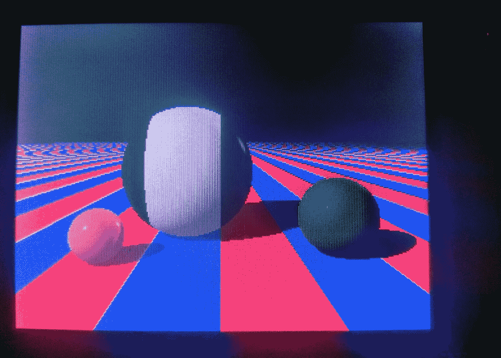
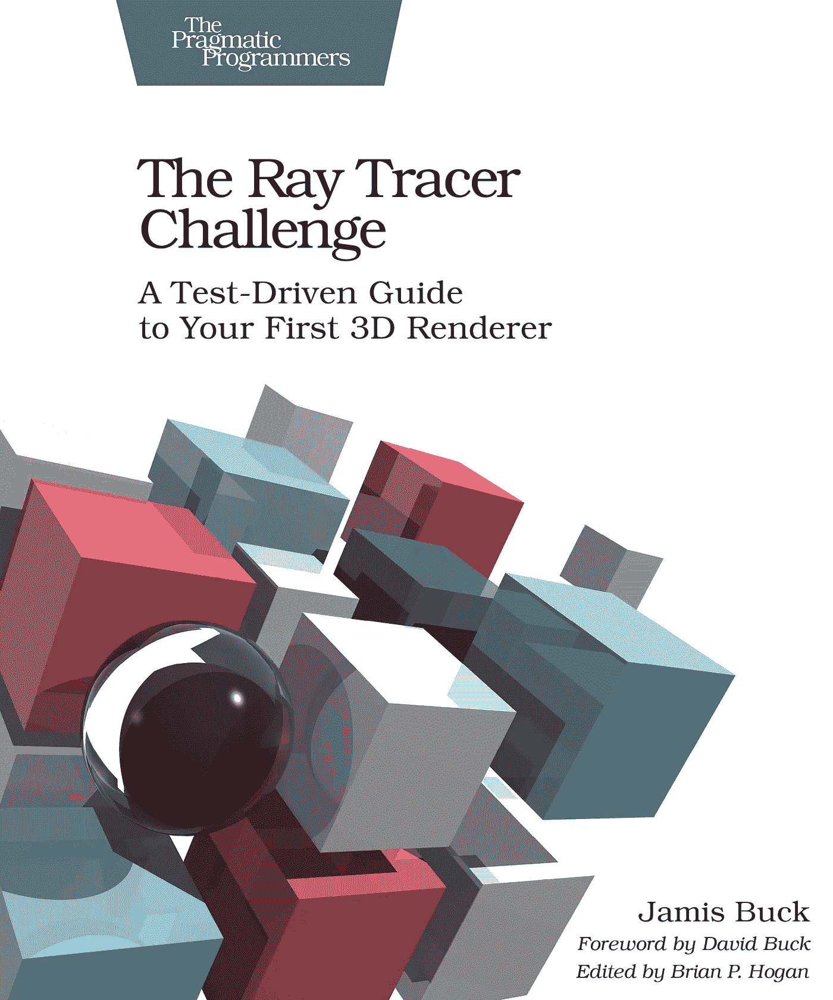
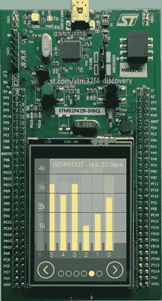
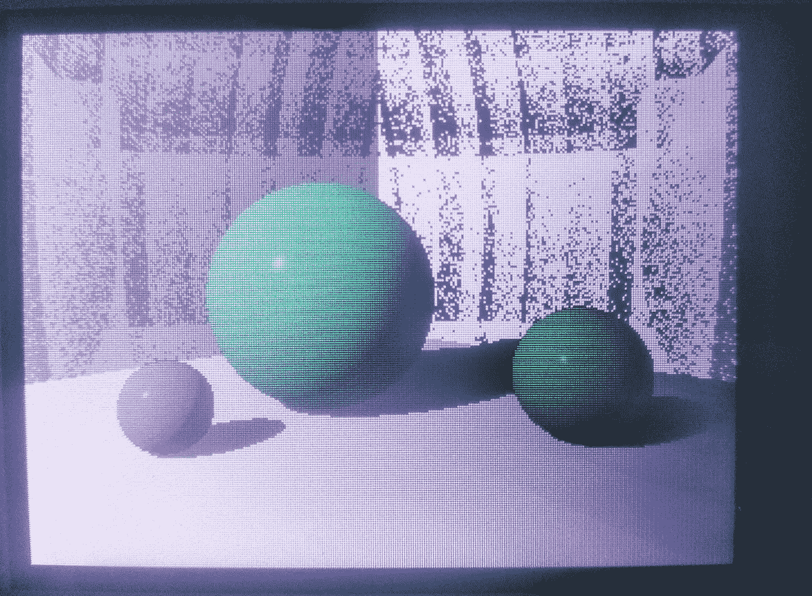
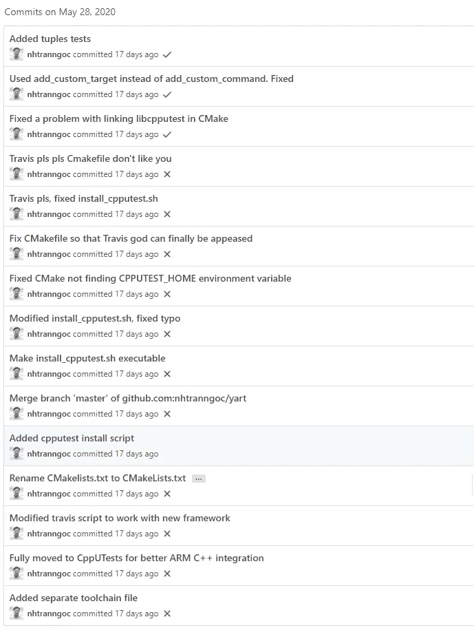

# STM32F429I-Discovery 板上的光线跟踪器挑战

> 原文：<https://itnext.io/ray-tracer-challenge-on-the-stm32f429i-discovery-board-9ca21d7bd49d?source=collection_archive---------3----------------------->



(基本完成的)光线跟踪器

很长时间以来，我一直想做一个射线追踪器，在浏览了 Jamis Buck 的[射线追踪器挑战](https://pragprog.com/titles/jbtracer/)的前几页后，我被吸引住了！这本书概述了如何从零开始建立一个光线追踪器，只使用简单的线性代数。

如果你不想读我令人厌恶的文字，你可以直接跳到 https://github.com/nhtranngoc/yart[的代码。](https://github.com/nhtranngoc/yart)



必读的一...

# **我为什么这么做**

几周前，我从 WPI 毕业，目前正在寻找工作。随着我的大量时间被释放，以及我不断增长的计划项目从我的眼角瞪着我，我认为这是一个好主意，重温我的一些技能，也许学习新的技能。

此外，Jamis Buck 在他精彩的书中使用了测试驱动开发(TDD)方法，这也是我想写进简历的东西。嵌入式系统中的测试驱动开发对我来说很陌生，尽管我已经阅读了 James Grenning 的[Test Driven Development for Embedded C](https://pragprog.com/titles/jgade/)，我很高兴尝试一下。

# **我正在使用什么技术**

几个月前，我从意法半导体拿到了 STM32F429-Discovery 板，一直想找个借口用它做点什么。该板配有 240x320 TFT LCD，STM32F429 微控制器配有浮点单元(FPU)。这使它成为我的光线跟踪器的完美候选。



STM32F429I-DISC 板

这本书是语言不可知的，这意味着读者可以自由地使用任何编程语言。我选择了 C++。部分是因为我想磨练我勉强存在的 C++技能，但主要是因为我以前从未用嵌入式 C++编程。这将是一个有趣的实验。

对于构建系统，我使用 CMake。CMake 是一个元构建系统，换句话说，CMake 构建构建系统。我开始为我的另一个 CHIP-8 仿真器 (YACE)项目使用 CMake，从那以后就爱上了它，因为它的优雅和易用。跨平台也是另一个优势，因为我运行的是 Linux 的 Windows 子系统(WSL)。(亵渎，我知道)。

对于选择的 STM32 库，我使用的是 [libopencm3](https://github.com/libopencm3/libopencm3) 。为什么？因为我听说过关于它的好消息——在使用了一段时间后，我不得不说它们确实是好东西。这个 API 比 HAL/CMSIS 优雅得多，尽管它确实需要一点学习。不利的一面是 libopencm3 仍然是一项正在进行中的工作，所以任何 API/函数调用都有可能被改变。但总的来说，我喜欢 STM32 系列的开源、多平台固件的想法。

最后但同样重要的是，由于这是一个 TDD 项目，我们需要使用一个测试框架。我最开始用 Google Tests，后来因为和 ARM cross 编译器不兼容而报废了。我选定的下一个框架是[cputest](https://cpputest.github.io/)，它简单得令人抓狂，并且附带了 CMake 集成。

有了这些，我们现在准备好建立我们的光线追踪器。

# **光线跟踪器**

光线跟踪器是一个可以在 3D 空间中渲染对象的程序，通过产生可以与对象相交并从对象反弹的光线。通过使用这些光线扫描显示器，然后计算得到的光线颜色，我们可以只使用矢量数学来进行照片级的渲染！

构建光线跟踪器的细节可以在书中找到，但我将概述我在 STM32 板上启动和运行我的项目时遇到的困难。

# libopencm3 & CMake

首先要做的是用 CppUTest 和 libopencm3 创建并运行 CMake。为了让 CMake 同时为两个目标工作，其中一个是交叉编译的，我们将不得不拆分我们的代码库:

```
├── CMakeLists.txt
├── README.md
├── arm-none-eabi-toolchain.cmake
├── build
├── include
│   ├── lcd
│   ├── patterns
│   ├── shapes
├── install_cpputest.sh
├── lib
│   └── libopencm3
├── src
│   ├── CMakeLists.txt
│   ├── lcd
│   ├── patterns
│   ├── shapes
├── stm32f429i-discovery.ld
├── tests
└   └── CMakeLists.txt
```

这是我的程序结构。`libopencm3`进入`lib/`，头文件在`include/`，代码在`src/`，测试在`tests`。这种分离使得选择我们想要编译的目标更加容易，并且将嵌入式逻辑和 x86 逻辑分开。

解决了这个问题，我们有了顶级制造商列表:

在 23 行代码中，我们设置了准系统 CMake，添加了公共标志——可用于 STM32 目标和测试目标，并添加了一个用于交叉编译的开关。

注意，在第 16 行和第 20 行，我们告诉编译器使用单精度常量，并警告我们任何可能的双重提升和浮点转换。由于 STM32F429 只支持单精度浮点，我们必须小心，只允许使用类型`float`。

当然，要启用交叉编译，我们必须添加一个工具链文件。这是我对 STM32F429I-DISC 板的配置:

接下来，我们有我们目标的制造商名单。这样做的目的是为我们的目标添加任何特定于 STM32 的编译器选项，比如定义、链接器标志，并添加`libopencm3`作为依赖项。

在第 7 行和第 8 行，我们设置了`-mfloat-abi=hard`和`-mfpu=fpv6-sp-d16`来启用板上 FPU。没有这一点，微控制器将不得不求助于软件浮点指令，这将大大降低我们的光线跟踪器。

最后，我们有用于测试的 CMakeLists 这相当简单，因为我们只需要在`include_directories`中包含所有源文件，并添加 CppUTest 作为库:

这就是我们启动射线追踪仪所需要的一切！花了一些时间来设置，但是一旦你设置好了，你就可以通过进入`build`文件夹来调用不同的构建目标，并输入:

*   `cmake ..`用于测试构建
*   `cmake -DCMAKE_TOOLCHAIN_FILE=path/to/toolchain ..`对于 STM32 版本

# 神秘的圆点

在启动并运行我的光线跟踪器后，有时在构建过程中，我会注意到渲染中的神秘点:



为什么会有圆点？他们为什么在那里？为什么它们只出现在背景上？

在项目的这一点上，所有的对象都是球体——这使得只有圆点出现在背景对象上变得很奇怪。经过大量的代码搜索和一点自我反省，我找到了令人不快的代码行:

```
@define EPSILON 0.0001 
[...]
comps.over_point = comps.point + (comps.normalv * EPSILON);
```

Epsilon 是一个用于比较浮点数的小值——因为理想情况下，您会希望看到两个浮点数在误差范围内是否相等。我注意到这个 bug 出现在实现 shadows 之后，shadows 计算投射阴影的对象的`over_point`值，所以很明显这是问题的原因。通过将法向量乘以一个小值，我们得到一个更小的值，它可以被 STM32 浮点计算截断。这导致颜色呈现为黑色，我们可以在上面看到。

通过将 EPSILON 的值更改为`0.01`，我们会损失一些精度，但鉴于我们的显示器分辨率仅为 240x320，我不认为我们会损失太多。窃听器没了，作为回报。

# 特拉维斯积分

这个太棒了。如果你看了我的提交历史，你会发现我花了相当多的时间来让 Travis 正常工作。剧透一下，还是没有。



是的，这一切都发生在同一天

显然当我使用 C++11 的特性时，比如`std::shared_from_this()`，Travis 的构建系统因为某些原因无法检测，导致链接错误。因为这个原因，我禁用了`.travis.yml`，唯一的罪证是我的自述文件上肮脏的`failing`建造徽章的存在。

# 我学到了什么

总的来说，这个项目花了我大约 2 周的时间，我学到了新的知识，改进了一些我已经知道的知识，复习了我的大学线性代数，并对嵌入式系统有了更好的理解。

具体来说，我了解到:

*   如何用 CMake 编译交叉目标？
*   使用测试驱动开发技术，并将它们应用到项目中。
*   有用的 C++技巧，比如模板，智能指针，`auto`声明(我最喜欢的 C++特性之一)，运算符重载。
*   以清晰简洁的方式组织我的代码库。

# 接下来是什么

现在，我决定停在第 11 章，反射和折射。也许我将来会重访——但是我的技能还有很多地方需要提高。

路线图上的内容:

*   实现包围盒层次(BVH)。这可以通过对照边界框检查单个光线来大大减少渲染时间，如果它们错过了，就丢弃它们。这可以大大减少渲染时间。
*   针对 STM32 平台进行优化。许多代码是用更高级的软件工程技术编写的，没有考虑太多嵌入式主板。诸如`sin`、`cos`、`tan`的数学计算可以用查找表代替。如果有时间，我想实现 CMSIS 的`arm_math`库来减少处理时间。
*   完成这本书。这本书非常吸引人，有几次我会连续看 10 个小时。不完成它将是一种耻辱。