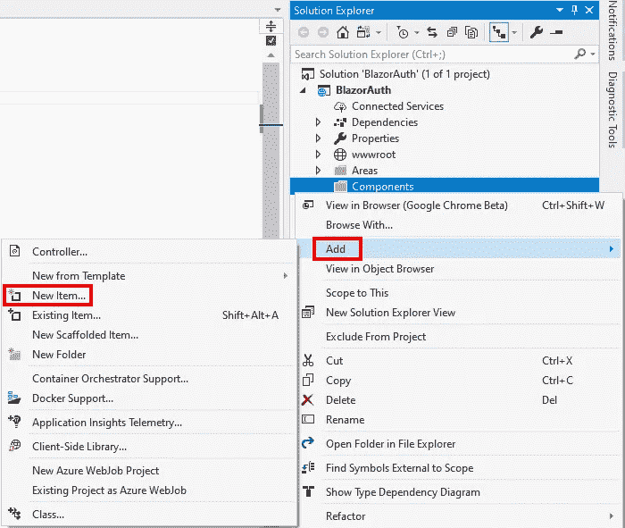
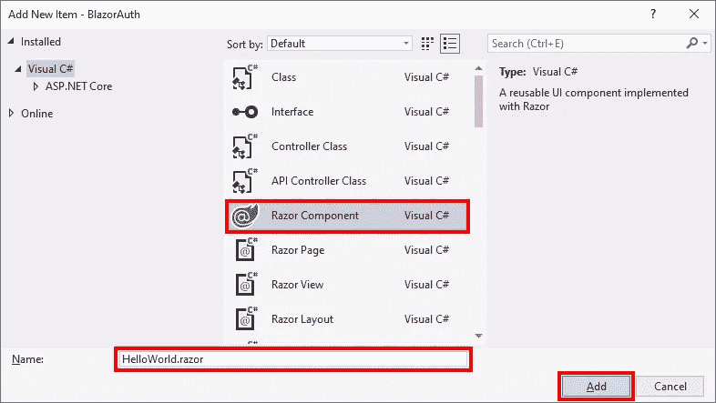
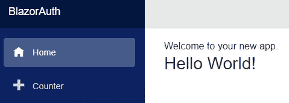
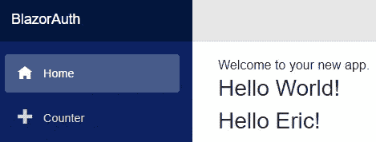

# Blazor 中的剃须刀组件

> 原文：<https://itnext.io/razor-components-in-blazor-92e70bb9963f?source=collection_archive---------5----------------------->

因为的发布候选。NET Core 3.0 越来越近了，这似乎是一个仔细研究 Blazor 的好时机，从 Blazor 最近的一系列帖子中可以看出这一点。在这篇文章中，我将第一次看到 Blazor 服务器端应用程序中的 Razor 组件。

这篇文章使用了下面文章中使用的相同示例项目。第一个包含了项目的创建，如果您想继续的话。

[ASP.NET 核心服务器端 Blazor 带认证](https://elanderson.net/2019/08/asp-net-core-server-side-blazor-with-authentication/)
[Blazor 认证:隐藏导航菜单项](https://elanderson.net/2019/08/blazor-authentication-hide-a-nav-menu-item/)

## 什么是剃须刀组件？

引用[文件](https://docs.microsoft.com/en-us/aspnet/core/blazor/components?view=aspnetcore-3.0):

> 组件是用户界面(UI)的自包含块，如页面、对话框或表单。组件包括 HTML 标记和注入数据或响应 UI 事件所需的处理逻辑。组件灵活轻便。它们可以嵌套、重用和在项目间共享。

基本上，Razor Components 为我们提供了一种创建智能可重用 UI 块的方法。

## 创建新的剃须刀组件

首先，我在我的项目中创建了一个新的**组件**目录。这不是必需的，但这是如何建立一个 [Blazor 示例项目](https://github.com/aspnet/AspNetCore.Docs/tree/master/aspnetcore/blazor/common/samples/3.x/BlazorSample)的。**注意**，如果您遵循此路径，请确保将新的名称空间添加到 **_Imports.razor** 中，否则您的组件将无法呈现。请不要问我花了多长时间才明白。

```
@using System.Net.Http
@using Microsoft.AspNetCore.Components.Forms
@using Microsoft.AspNetCore.Components.Layouts
@using Microsoft.AspNetCore.Components.Routing
@using Microsoft.JSInterop
@using BlazorAuth
@using BlazorAuth.Shared
@using BlazorAuth.Components
```

右键单击要创建组件的目录，并选择**添加>新项目**。



在添加新项目对话框中选择**剃须刀组件**，给组件命名并点击**添加**。



生成的文件将如下所示。

```
<h3>HelloWorld</h3>

@code {

}
```

对于这个组件，我没有任何代码，所以我删除了该部分，并在 Hello 和 World 之间添加了空格。要使用该组件，您可以将`<HelloWorld />`添加到任何现有的组件或页面中。例如，在示例应用程序中，我更改了 **Index.razor** 以包含新的组件。

```
@page "/"

Welcome to your new app.

<HelloWorld />
```

以上将呈现如下。



## 带有参数的组件

上面说的很好，但是我们都知道，一个只包含静态 HTML 的组件，如果不能使组件的某些部分更加动态，就不会非常有用。下面的示例只是将数据放入组件的方法之一。

下面的代码是一个新组件，它有一个私有名称属性，用**参数**属性标记。然后，可以以标准的 Razor 语法方式在组件的非代码部分使用该属性。

```
<h3>Hello @Name!</h3>

@code {
    [Parameter]
    private string Name {get; set;}
}
```

下面是 HelloName 组件在 **Index.razor** 中的用法，它通过 Name 参数传递一个名称。

```
@page "/"

Welcome to your new app.

<HelloWorld />
<HelloName Name="Eric" />
```

以及应用程序运行时的结果输出。



## 包扎

组件提供了很大的可重用性。我强烈建议你花些时间和他们一起玩。此外，请务必查看微软的[创建和使用 ASP.NET 核心剃须刀组件](https://docs.microsoft.com/en-us/aspnet/core/blazor/components?view=aspnetcore-3.0)文档，因为它涵盖了开发组件时的所有选项。

*原载于* [*埃里克·安德森*](https://elanderson.net/2019/08/razor-components-in-blazor/) *。*