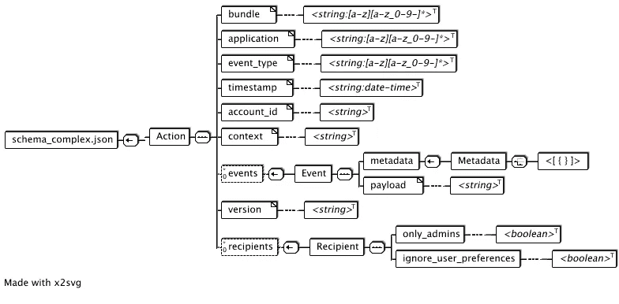
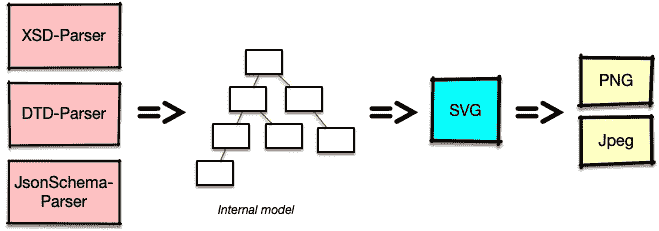

# (重新)介绍 x2svg

> 原文：<https://itnext.io/re-introducing-x2svg-fc0c836e729b?source=collection_archive---------5----------------------->

更具体地说，在 2008 年，我需要可视化像 dtd 或 XML 模式这样的数据结构。我创建了 x2svg，放在 SourceForge 上。

JsonSchema 的示例呈现

快进到 2021 年秋天。我正在研究 JsonSchema 和 Avro，需要一种方法来可视化组成模式的长文本块。我想起了我过去的工作，并能够挖掘出我的旧源代码，[把它们放在 GitHub](https://github.com/pilhuhn/x2svg) 上，并添加了第一轮 JsonSchema 解析器。

X2svg 的主要输出格式是可缩放矢量图形(svg)，因此得名。它还允许进一步将 svg 转换成光栅格式，如。png 或. jpg。

x2svg 内部使用多阶段方法，因此添加新的解析器不需要改变 svg 呈现或转换为光栅格式。

内部数据流

正如我上面提到的，源代码在 https://github.com/pilhuhn/x2svg[的 GitHub 上，请试用一下，并告诉我它是否有用。当然也欢迎投稿。](https://github.com/pilhuhn/x2svg)