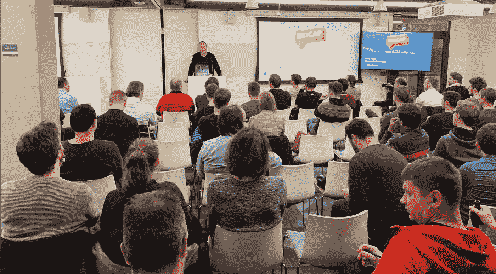
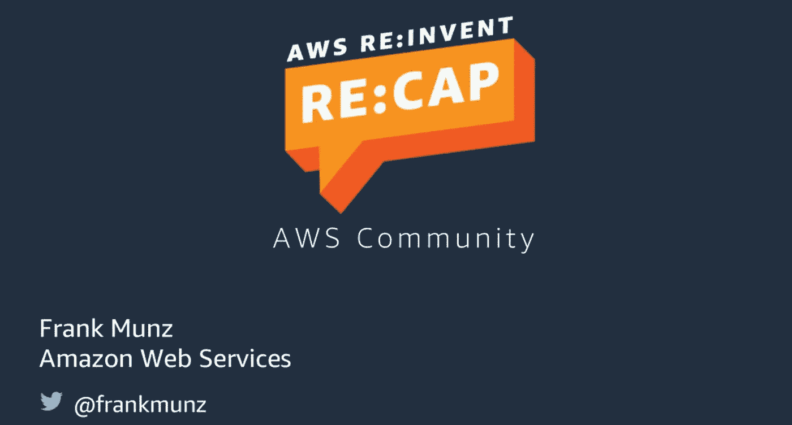

# re:Invent 2019: AWS 技术布道者 Recaps +幻灯片

> 原文：<https://itnext.io/re-invent-2019-recap-fa7f2aa64b30?source=collection_archive---------5----------------------->

*AWS:2020 年有什么新东西，你需要知道什么*

面对现实吧！在拉斯维加斯举办的 AWS 最大的会议 re:Invent 可能有点令人难以招架，有超过**65000 名与会者**和超过 **3000 场会议**。

我本人是 AWS 技术推广团队的一员，每年，我们都会在世界各地举办几十场技术革新回顾会议。下面的照片是在圣诞节前慕尼黑的总结会上拍摄的，有将近 150 人参加。

如果您想自己浏览回顾内容，您可以找到下面的[幻灯片](https://speakerdeck.com/fmunz/aws-re-invent-re-cap-2019)。或者查看您当地的 [AWS 用户组](https://aws.amazon.com/developer/community/usergroups/)参加您附近的回顾会议。此外，我们还为重新发明会议发布了**幻灯片。你可以在这里找到他们。**

你喜欢集装箱，码头，Kubernetes，法盖特，鞭炮？我整理了一份单独的推荐名单。看一看！

如果你像我喜欢写这篇文章一样喜欢阅读它，请跟随我在 Medium 为这篇文章鼓掌。我在 Twitter 上花的时间太多了，所以可以随意连接:[***@ frankmunz***](https://twitter.com/search?q=frankmunz)***。***