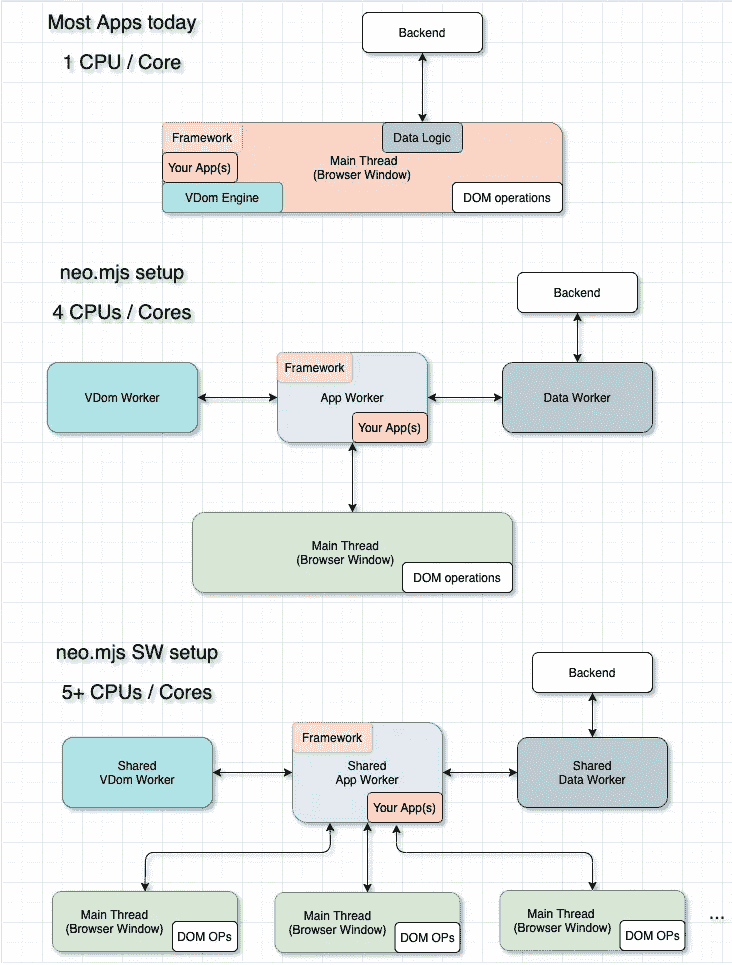
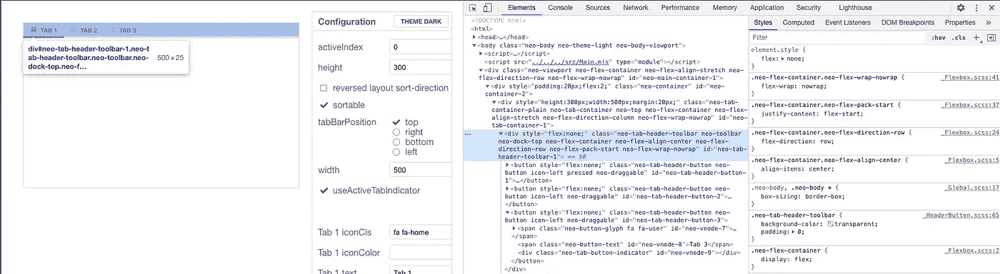
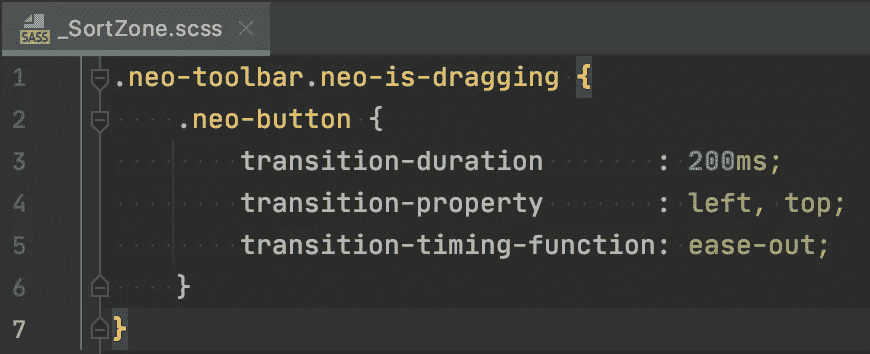
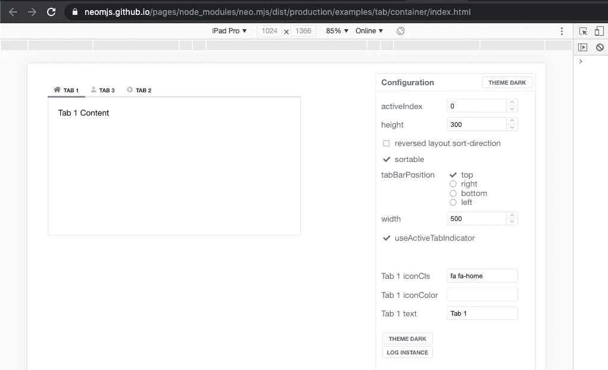
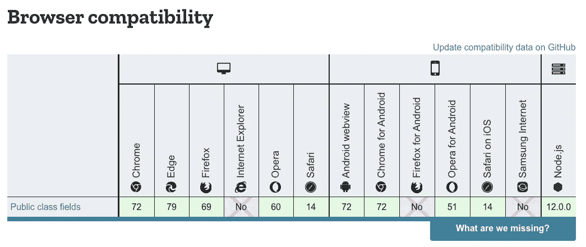

# 重新排序基于网络的标签，就像在谷歌浏览器中一样

> 原文：<https://itnext.io/re-sorting-web-based-tabs-like-it-works-in-google-chrome-38d749fc8ede?source=collection_archive---------4----------------------->

尤其是当你在浏览器中打开了很多标签页时，你很可能每天都在使用这个功能。基于拖放的重新排序使用起来很有趣，并且提供了很好的用户体验。

只是为了确保你脑子里有同样的画面:

现在，如果你看看今天大多数使用标签的基于网络的用户界面，你会注意到没有基于拖放的重新排序。

这实际上是一个问题，因为用户熟悉这个特性并且喜欢它。

我接受了为基于网络的应用程序实现相同的 UX 的挑战，包括垂直标签栏和倒置的 flexbox 布局。

本文将展示我在途中遇到的一些问题，并深入到编码方面。

# 内容

1.  介绍
2.  neo.mjs 是什么？
3.  如何给基于 flexbox 的工具栏添加动画？
4.  拖动:移动逻辑是如何工作的？
5.  标签重新排序是如何工作的？
6.  正在使用工具栏。SortZone 可选？
7.  视频示例的在线演示
8.  如何使用该功能
9.  neo.mjs 路线图上的下一个项目是什么？
10.  最后的想法

# 1.介绍

为了提前获得一个快速概览，这里有一个简短的视频，展示了基于拖放的标签重新排序，包括垂直标题工具栏，动态更改布局和主题:

我在基于开源的 neo.mjs UI 框架中实现了逻辑，但是您也可以让它适用于不同的场景。

# 2.neo.mjs 是什么？

neo.mjs 是一个极具颠覆性的基于 Javascript 的下一代 UI 框架。
它能让你创建超快的多线程前端。

你可以在这里找到麻省理工学院授权资料库:

 [## 近地天体

### neo.mjs 使您能够使用一个以上的 CPU 创建可扩展的高性能应用程序，而无需使用…

github.com](https://github.com/neomjs/neo) 

如果你想加入一个可爱的开源项目:neo.mjs 正在寻找更多的贡献者。对基于 neo.mjs 的 ui 的需求正在快速增长，因此如果您正在寻找新的客户项目，了解最新情况是有意义的。

# 3.如何给基于 flexbox 的工具栏添加动画？

TabHeader 只是`container.Toolbar`的一个类扩展。
显然它坚持使用 CSS3 并使用`display:flex`，所以标签(按钮)可以有一个灵活的样式来指定它们的宽度，或者使用一个固定的宽度。

想想看:
使用动画在 flexbox 布局中移动项目**是不可能的**。

那么，它是如何工作的呢？

主线程使用鼠标或触摸传感器，并将自定义的`drag:start`、`drag:move`和`drag:end`事件转发给应用程序工作人员。

如果你愿意，你可以选择使用 DragDrop 主线程插件。这确保了在你的应用不需要 DD 的情况下，没有关于文件大小的开销。详细描述插件会离题太远，所以我只是贴上它的源代码链接(以防你好奇):

[https://github . com/neom js/neo/blob/dev/src/main/addon/dragdrop . mjs](https://github.com/neomjs/neo/blob/dev/src/main/addon/DragDrop.mjs)

我们将要详细介绍的是新的`draggable.toolbar.SortZone`。

这个类是对`draggable.toolbar.DragZone`的扩展，它将订阅提到的与拖动相关的事件。

[https://github . com/neom js/neo/blob/dev/src/draggable/toolbar/drag zone . mjs # L35](https://github.com/neomjs/neo/blob/dev/src/draggable/toolbar/DragZone.mjs#L35)

启用动画选项卡移动的一种方法是将每个选项卡转换为绝对定位的元素。为此，我们需要获取相关的 DomRects，其中包含相关的大小和位置。

`Element.getBoundingClientRect()`助此:

 [## Element.getBoundingClientRect()

### 方法返回一个元素的大小和它相对于视图的位置…

developer.mozilla.org](https://developer.mozilla.org/en-US/docs/Web/API/Element/getBoundingClientRect) 

因为我们的代码在 App Worker 范围内运行，所以不能直接访问 DOM。不过这没什么大不了的，因为我们可以使用 remotes API 轻松地从主线程获取数据:

我们可以传递一个 id 数组，并异步获取相关数据。

`Neo.main.DomAccess`也不存在于 App Worker 范围内，但是 remotes API 将通过承诺使公开的方法可用。这个调用将从应用程序工作人员向主线程发送一条 postMessage，获取数据，向应用程序工作人员发回一条 postMessage，承诺就实现了。

完整的逻辑如下:

这里重要的部分是第 20 行`item.style=`。
虽然这可能看起来像一个赋值，但 Component.style 是一个基于 neo.mjs 的类配置。改变`style`的值将触发一个 setter，比较新的样式对象和当前的样式对象，并将相关的增量更新发送给主线程。

如果您一直在关注与 neo.mjs 相关的其他博客帖子，您将会知道在运行时动态更改 DOM 是这个框架的一大优势。

我们正在转换所有工具栏项目，包括我们正在拖动的项目。该项目将获得样式`visibility: 'hidden'`，以保持定位和移动逻辑一致。

# 4.拖动:移动逻辑是如何工作的？

此时，您可能想知道如何拖动隐藏的元素。我们没有。答案就在`draggable.DragZone`里面:

我们获取想要拖动的元素的 DomRect，并调用`createDragProxy()`方法。

这个正在克隆我们想要拖动的组件的 DOM 树，并且正在创建一个新的 DragProxyComponent。

对于我们的用例来说，`moveInMainThread`等于 true，所以我们不需要手动处理应用工人内部的运动。性能方面快了一个百分点。

我们还可以传递一个`boundaryContainerId`给主线程 DragDrop addon，它将移动限制在匹配的 DomRect。

# 5.标签重新排序是如何工作的？

我们的应用程序工作人员订阅了`drag:move`事件，因此我们可以轻松地添加更多应该发生的逻辑。

`draggable.toolbar.SortZone`逻辑看起来是这样的:

我试了几次才把代码做成这个形状。

它涵盖了 4 种使用情形:

1.  `flex-direction: row`
2.  `flex-direction: row`，`sort-direction: row-reverse`
3.  `flex-direction: column`
4.  `flex-direction: column`，`sort-direction: column-reverse`

请记住，当我们反转`sort-direction`时，索引从容器的另一侧开始，但是我们仍然需要以正确的方式比较`left`或`top`的值。

`switchItems()`的逻辑非常简单:

我们需要一个 indexMap，因为一个拖动操作可以触发多个`switchItems()`调用，我们只在`drag:end`触发时调整实际项目。

这也使我们能够在任何时间点停止拖动操作。
例如，我们可以在用户点击 ESC 键时添加一个`drag:cancel`事件，并删除绝对定位。

如果有人想添加这个功能，欢迎您加入:)

`updateItem()`逻辑很简单:

我们只是再次使用样式配置设置器。

更改左上方的值将自动触发基于 CSS3 的动画:

显然，`onDragEnd()`将删除绝对定位，恢复固定项目大小(如果它们存在的话)并触发相关的`Container.moveTo()`逻辑。

你可以在这里查看完整的`SortZone`源代码:

[https://github . com/neom js/neo/blob/dev/src/draggable/toolbar/sort zone . mjs](https://github.com/neomjs/neo/blob/dev/src/draggable/toolbar/SortZone.mjs)

有更多的边缘案例&隐藏的宝石等待你去发现。

# 6.正在使用工具栏。SortZone 可选？

是的，绝对是。`tab.header.Toolbar`有一个`sortable`配置，
将自动触发:

这个逻辑其实很美。

正如您所希望的那样，neo.mjs 开发模式直接在浏览器中运行，没有任何构建或代码转换。

因此，我们可以使用动态导入，浏览器只会在需要时加载相关文件。

这段代码也可以很好地与基于 webpack 的`dist/production`环境的相关构建一起工作。

正如我在我的跨应用拆分块博文中提到的:

 [## 跨应用捆绑——微前端的一种不同方法

### 捆绑分布式版本的应用程序代码一直是一个挑战，尤其是在您想要共享代码的情况下…

medium.com](https://medium.com/swlh/cross-app-bundling-a-different-approach-for-micro-frontends-e4f212b6a9a) 

我们确实有动态块。你可以将多个应用放在一个页面上，几乎没有任何开销。这也涵盖了一些场景，在这些场景中，你有一些模块的基本依赖项，而你已经将这些模块惰性加载到你的应用中了。

# 7.视频示例的在线演示

这个例子还没有完全适应移动设备，但是基于拖放的逻辑在那里工作得很好。

[https://neom js . github . io/pages/node _ modules/neo . mjs/dist/production/examples/tab/container/index . html](https://neomjs.github.io/pages/node_modules/neo.mjs/dist/production/examples/tab/container/index.html)

您可以使用 Chrome 开发工具切换到平板电脑视图:

**提示**:切换到手机模拟后，请确保**重新加载**页面。

框架要么使用`MouseSensor`要么使用`TouchSensor`，而不是同时使用两者。

我还添加了重新排序 neo.mjs 文档应用程序的选项卡。
是的，它也适用于动态添加的标签:

[https://neom js . github . io/pages/node _ modules/neo . mjs/dist/production/docs/index . html](https://neomjs.github.io/pages/node_modules/neo.mjs/dist/production/docs/index.html)

该功能还添加到了 Covid 仪表板以及 SharedWorkers 驱动的多浏览器窗口应用程序中。

您可以在此找到所有在线示例:

[https://neom js . github . io/pages/node _ modules/neo . mjs/dist/production/apps/website/index . html # main view = examples](https://neomjs.github.io/pages/node_modules/neo.mjs/dist/production/apps/website/index.html#mainview=examples)

# 8.如何使用该功能

为你的工具栏或标签容器使用拖放重新排序功能是非常简单的。你需要做的就是添加`sortable:true`配置。

# 9.neo.mjs 路线图上的下一个项目是什么？

现在，我正在做一个客户端项目，创建一个基于 neo.mjs 的 UI 生成器。有点类似于 WebFlow，但是它将创建基于 neo.mjs 的组件树。

感觉就像一部永恒的手机:

基于 neo.mjs 的 UI，使其应用程序用户能够通过拖放创建基于 neo.mjs 的 UI。

对于框架本身来说，这意味着接下来我将关注树的拖拽区域和排序区域。绝对是一个史诗项目。

因为此时浏览器对公共类字段的支持非常好:

 [## 公共类字段

### 静态和实例公共字段都是可写、可枚举和可配置的属性。因此，不像他们…

developer.mozilla.org](https://developer.mozilla.org/en-US/docs/Web/JavaScript/Reference/Classes/Public_class_fields) 

我想尽快把它添加到 neo.mjs 框架中。我们可以将所有“原始”配置移出`static getConfig()`逻辑。

这是该框架上市以来第一次真正的突破性变化，所以这将是 neo.mjs v2。

唯一阻碍我的是 webpack 还不支持公共类字段。更准确地说:他们使用的是 acorn 解析器，没有相关的 Stage3 提议。

到目前为止，我还没有运气覆盖 npm 依赖:

 [## 添加对公共类字段的支持问题#1228 neomjs/neo

### 解散 GitHub 是超过 5000 万开发者的家园，他们一起工作来托管和审查代码，管理项目，以及…

github.com](https://github.com/neomjs/neo/issues/1228) 

如果有人有一个好主意，帮助这一个是赞赏的！

# 10.最后的想法

通过基于拖放的标签重新排序，您可以轻松地将此功能添加到您的应用程序中。

非常欢迎您在其上构建自定义逻辑。

一旦基于树的拖放逻辑就位，我还想进一步增强日历组件，并进一步完善对话框的拖放。

特别是一个多浏览器窗口的拖放演示将是惊人的。在我的待办事项列表中，准备下一篇博文。

祝编码愉快，并在疫情期间保持安全！

最诚挚的问候，
托拜厄斯