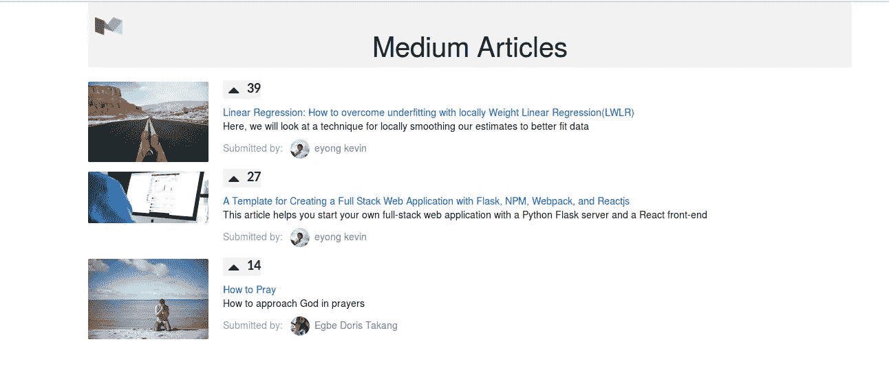
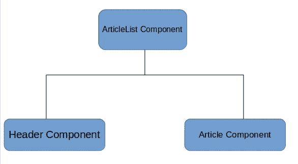
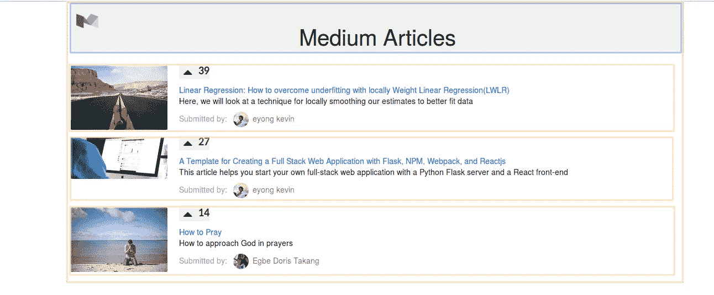
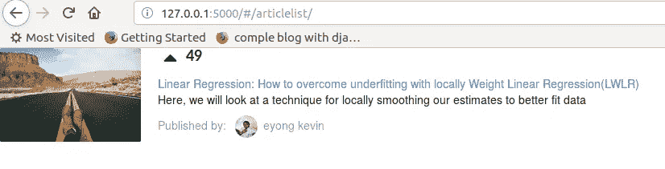
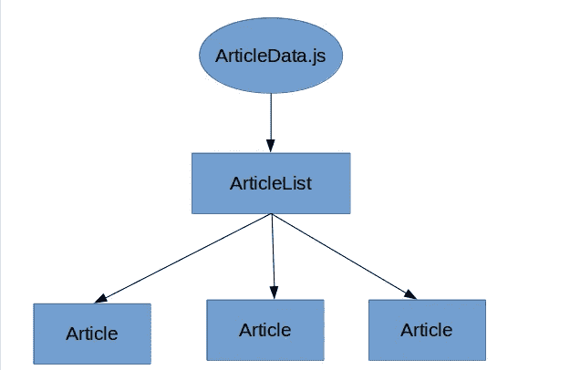
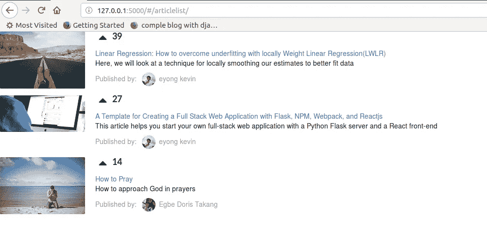

# React 和 Flask 全栈 Web app:面向组件和数据驱动

> 原文：<https://itnext.io/react-and-flask-full-stack-web-app-component-oriented-and-data-driven-dd60e005266?source=collection_archive---------1----------------------->


**图 1** :拼图:以逻辑的方式将碎片拼在一起，以得出正确的答案

软件开发最根本的问题是复杂性。只有一种处理复杂性的基本方法。打败他们的细节:分而治之的策略。查看各个部分，确定如何控制各个部分，制造纠纷并加以利用。

在本文中，我们将看到如何使我们的 web 应用程序**面向组件**和**数据驱动**。我们将从第 1 部分继续，在那里我们学习了如何用 flask、NPM、Webpack 和 Reactjs 构建一个全栈 web 应用程序。

> 你可以在这里获得我们在第 1 部分[中构建的项目代码。请克隆它并按照**自述文件**的说明启动并运行它。这个博客将会详细介绍这个 GitHub 链接](https://github.com/Eyongkevin/hello_template)[中的实现。然而，如果你跟随这篇博文，你会收获更多。](https://github.com/Eyongkevin/React-and-Flask-Full-Stack-Web-app-Component-oriented-and-Data-driven)

## 案例研究:创建我们的媒体文章



**图 2** :显示文章图像、点击次数、文章标题、文章描述、作者图像和作者姓名的媒体文章

本文的目的是向您展示如何在 React-Flask web 应用程序中使用面向组件和数据驱动的概念。

因此，我们将构建这个简单的中型文章 web 应用程序，它只显示文章列表，包括**文章图片、
点击次数、文章标题、文章描述、作者图片**和**作者姓名。**

我们的 web 应用程序由三个组件组成:**标题组件、文章列表组件**和**文章组件** t。我们将浏览每个组件，并将一起构建它。然而，让我们首先刷新一下组件到底是什么。

## **什么是组件？**

React 组件是一个带有 render 方法的 JavaScript 类，该方法返回组件 UI 的描述。因此，基本上，组件是自包含的、特定于关注点的，并且是 React UIs 的构建块。

在 React 应用程序中，一切都是由组件组成的。使用组件开发应用程序允许一种“**分而治之**”的方法，其中没有特定的部分需要特别复杂。这使得用较小的组件创建复杂的、功能更丰富的组件变得容易。

React 组件具有一些优点，包括:

*   鼓励关注点分离
*   可重复使用的
*   它是用普通的 javaScript 编写的，而不是传统上用于 web 应用程序 ui 的模板语言或 HTML 指令。这使得 React 能够使用全功能编程语言来呈现视图，这对于构建抽象的能力来说是一个很大的优势。

声明 React 组件有两种方式:

1.  **为 ES6 类**

```
class HelloWorld extends React.Component{
 render(){
  return(
   <p> Hello World </p>
  );
 }
}
```

> ES6 引入了类声明语法。ES6 类是 JavaScript 基于原型的继承模型的语法糖。
> 你可以从 MDN 上的[文档中阅读更多关于 ES6 类的内容](https://developer.mozilla.org/en-US/docs/Web/JavaScript/Reference/Classes)

**2。使用 React.createClass()方法**

```
const HelloWorld = React.createClass({
    render(){ return(<p> Hello World </p>)}})
```

> 如果您对 JavaScript 有所了解，您会注意到**返回值**的语法看起来不像传统的 JavaScript。是脸书写的 **JSX** (JavaScript 扩展语法)。使用 JSX 使我们能够以熟悉的、类似 HTML 的语法为组件视图编写标记。最后，这段 JSX 代码编译成普通的 javaScript。

## 我们的组件层次结构

如前所述，我们的应用程序将包含 3 个组件。下面是我们组件的层次结构。



**图 3** :我们 3 个组件的层次结构

让我们将应用程序的接口分成不同的组件类:



**图 4** :我们的应用程序接口分解成不同的组件类

从上面的**图 4** 中，我们看到三种不同的颜色代表我们不同的组件。

*   红色代表**物品清单组件**。该组件是父组件。
*   蓝色代表将显示页面主标题的**标题组件**。
*   金黄色代表将显示文章的**文章组件**。

> ***我觉得越来越无聊了*** 。重复和理论到此为止。让我们编码。

**物品组件**

创建文件`*hello_template/templates/static/js/components/Article.jsx*` 并输入下面的代码

**语义 UI 和图片:**你会从上面的代码中注意到一些事情。图像的**造型**和**来源**。我使用语义用户界面的风格。您可以按如下方式安装该库:

**1。**安装来自 [npm](https://www.npmjs.com/package/semantic-ui) 的语义 UI React 或遵循[文档](https://www.npmjs.com/package/semantic-ui)。语义 UI React 为我们的组件提供了 JavaScript

```
$ npm i semantic-ui-react --save
```

**2。**在你的`*hello_template/templates/static/*index.html`文件中添加语义 UI CDN 链接

```
<link rel="stylesheet" href="//cdnjs.cloudflare.com/ajax/libs/semantic-ui/2.3.1/semantic.min.css"></link>
```

> **注意**:我们要用`npm`做的每一个安装都应该在`package.json`所在的`hello_template/templates/static/`目录下打开的终端上。
> 
> 我们的`*Article.jsx*` *引用的是* `*public/images/article/*` *和* `*public/images/avatars/*` *的图像。您可以在此* *从已完成的项目 Github* [*下载图片文件夹，并将其包含在* `*hello_template/templates/public/*` *目录下* ***或*** *您可以提供自己的图片。*](https://github.com/Eyongkevin/React-and-Flask-Full-Stack-Web-app-Component-oriented-and-Data-driven/tree/master/templates/public/images)

**运行物品组件**

让我们运行我们的组件，看看是否一切正常。因为我们的 web 应用程序是 flask-react web 应用程序，所以 flask 的一个经验法则是，我们对应用程序的不同上下文有不同的视图。我们仍然可以使用相同的视图。但是我决定把它们分开，这样可以保持我的作品的整洁和易于维护。所以我们有两件事要编辑。我们的视野和路线。

视图:视图是 flask 特有的，使我们能够控制如何与 web 请求交互。创建目录`hello_template/templates/medium_articles/`。在这个目录中，创建两个文件`__init__.py`和`views.py`。在`views.py`文件中，输入以下代码

```
from flask import render_template, Blueprint
medium_blueprint = Blueprint('medium_article',__name__)[@medium_blueprint](http://twitter.com/medium_blueprint).route('/articlelist')
def index():
 return render_template("index.html")
```

> 在这段代码以及本文的任何其他代码中，确保在适当的地方缩进代码

我们的代码做两件重要的事情

*   它为我们的媒体文章创建了一个蓝图
*   它监听 URL `‘/articlelist’`并呈现位于`hello_template/templates/`目录中的模板文件`index.html`

> 我在第一部分解释了蓝图。

接下来，是注册我们的蓝图。编辑`hello_template/templates/__init__.py`文件如下:

```
from flask import Flask
app = Flask(__name__,
  static_folder = './public',
  template_folder="./static")from templates.hello.views import hello_blueprint
**from templates.medium_articles.views import medium_blueprint**
# register the blueprints
app.register_blueprint(hello_blueprint)
**app.register_blueprint(medium_blueprint)**
```

**React 路由器** : React 路由器是向 React 应用程序添加路由的最流行的解决方案。

> 请参考[第 1 部分](/a-template-for-creating-a-full-stack-web-application-with-flask-npm-webpack-and-reactjs-be2294b111bd)了解关于 React 路由器及其安装的详细说明。此外，如果您按照建议从第 1 部分的项目开始工作，那么 React 路由器已经安装好了

编辑`hello_template/templates/static/js/routes.js`文件如下:

```
import React from 'react';
import { HashRouter, Route, hashHistory } from 'react-router-dom';
import Home from './components/Home';
**import ArticleList from './components/ArticleList';**// import more components//The exact param disables the partial matching for a route and makes sure that it only
// returns the route if the path is an EXACT match to the current url.
export default (
    <HashRouter history={hashHistory}>
     <div>
      <Route exact path='/' component={Home} />
      **<Route  path='/articlelist' component={ArticleList} />**
     </div>
    </HashRouter>
);
```

根据上面的代码，我们做了两件事:

*   我们导入了文章列表组件
*   我们提供了组件的路由路径。

**物品列表组件**

如果你已经注意到在我们上面的代码中，我们使用了 articlelist 而不是 article。这是因为我们的文章组件将包含在文章列表组件中。

接下来，我们将编写文章列表组件。创建文件`*hello_template/templates/static/js/components/ArticleList.jsx*` *并在其中输入以下代码:*

```
import React, { Component } from 'react';
import Article from './Article';export default class ArticleList extends Component {
    render() {
       return (
          <div className='ui unstackable items'>
             <Article />
          </div>)
    }
}
```

我们可以从上面的代码中注意到两件事

*   我们导入了文章组件
*   我们在文章列表组件中调用了文章组件。因此，ArticleList 组件现在是 Article 组件的父组件

**运行**

按照[第一部分](/a-template-for-creating-a-full-stack-web-application-with-flask-npm-webpack-and-reactjs-be2294b111bd)中**运行应用**下的说明启动并运行项目，然后在你最喜欢的浏览器中打开这个地址`[http://127.0.0.1:5000/#/articlelist/](http://127.0.0.1:5000/#/articlelist/)`。



**图 5** :我们在 Firefox 网络浏览器上运行的网络应用程序显示了一篇文章

## 使文章数据驱动

到目前为止，我们用不太理想的数据对文章组件进行了硬编码。因此，我们需要我们的文章组件根据我们给它的数据动态呈现。

创建文件`hello_template/templates/static/js/articleData.js`并在其中输入代码:

我们的`articleData.js`包含一个 JavaScript 对象`articleData.article`，这是一个 JavaScript 对象数组，每个对象代表一个文章对象。每件物品都有一个独特的`id`和一些属性，包括`title`、`description`、`clapps`等等。

**使用道具**

我们希望我们的文章组件不再使用静态的、硬编码的属性。相反，我们希望它能够接受从其父级 ArticleList 传下来的数据。以这种方式设置我们的组件结构使我们的 ArticleList 组件能够动态呈现任意数量的文章组件，每个组件都有自己独特的属性。数据流将如下所示:



**图 6** :从父到子的数据流

在 React through props 中，数据从父节点流向子节点。当一个家长渲染一个孩子时，它可以发送孩子所依赖的道具。我们可以像 this.props 一样在子组件中访问这些属性

让我们来看看实际情况。让我们修改文章列表，将道具传递给文章组件。让我们从`articleData.article`数组中取出第一个对象，并将其用作一篇文章的数据。让我们修改`*hello_template/templates/static/js/components/ArticleList.jsx*`

```
import React, { Component } from 'react';
import Article from './Article';
**import articleData from '../articleData'**export default class ArticleList extends Component {
    render() {
       **const article = articleData.article[0];**
       return (
          <div className='ui unstackable items'>
  <Article  **article={article}**/>
 </div>)
    }
}
```

从上面的代码中，我们导入了我们的`articleData.js`，然后我们从 articleData.article 数组中取出了第一个对象，然后我们将它作为 prop 传递给我们的 article 组件。

让我们修改 Article 组件来访问父组件(ArticleList)发送的属性

```
import React, { Component } from 'react';export default class Article extends Component {
    render() {
 **const {article} = this.props**
       return (
          <div className='item'>
  <div className='image'>
   
  </div>
  <div className='middle aligned content'>
   <div className='header'>
   <i className='large caret up icon' />
   <b>**{article.clapps}**</b>
   </div>
   <div className='description'>
    <a href=**{article.url}**>**{article.title}**</a>
    <p>**{article.description}**</p>
   </div>
   <div className='extra'>
    <span>Published by: </span>
    
    <span className='author'>**{article.author}** </span>
   </div>
  </div>
 </div>)
    }
}
```

> 从上面的代码中，我们用`this.props`访问文章道具，然后我们用作为道具接收的数据替换所有硬编码的静态数据

如果刷新浏览器，您将看到没有任何变化。然而，我们的应用程序现在是数据驱动的。

**渲染多条**

如果你注意到了，我们的`articleData.js`有 3 个文章对象。它可能会更多，我们想展示所有的文章。我们将让 ArticleList 生成一组文章组件。每个都将从 articleData 数组中的单个对象派生。我们将使用[地图](https://medium.com/@tonyparkerkenz/javascript-array-prototype-map-b95e245f43c1)来做到这一点。让我们修改一下我们的`*hello_template/templates/static/js/components/ArticleList.jsx*`

```
import React, { Component } from 'react';
import Article from './Article';
import articleData from '../articleData'export default class ArticleList extends Component {
    render() {
 **const articleSort = articleData.article.sort((a,b)=>(
  b.clapps - a.clapps));
 const articleCom = articleSort.map((a)=>(
  <Article key={'article-'+a.id} article={a} />**
  )
 );
       return (
          <div className='ui unstackable items'>
               **{articleCom}**
          </div>)
    }
}
```

从上面的代码中，我们首先根据鼓掌次数对文章进行排序。然后，我们使用 [map](https://medium.com/@tonyparkerkenz/javascript-array-prototype-map-b95e245f43c1) 创建每个文章组件对象，将它们各自从 articleData 数组派生的对象作为道具传递。所以我们的[映射](https://medium.com/@tonyparkerkenz/javascript-array-prototype-map-b95e245f43c1)将返回一个商品组件数组，按照映射的要求，每个数组对象需要有一个惟一的键。所以这里我们使用每个文章对象 id 作为键。

现在，刷新浏览器，您将看到所有三篇文章显示



**图 7** :我们的 web 应用程序显示所有三篇文章

**割台组件**

列表中的最后一个组件是标题组件。这将在页面顶部显示标题。创建文件`*hello_template/templates/static/js/components/Header.jsx*`，并在其中粘贴以下代码:

```
import React, { Component } from 'react';
 export default class Header extends Component {
  render() {
    return (
 <div className='header-page'>
 
  <span className='header'>
   Medium Articles
  </span>
 </div>
    );
  }
}
```

我们的 Header 组件只显示一个文本' **Medium Articles** '和一个徽标。我们会注意到标识' **src** '已经从道具中获得为`this.props.logo`。这告诉我们这个组件是一个子组件，在本例中，是 ArticleList 组件的子组件。让我们修改`*hello_template/templates/static/js/components/ArticleList.jsx*`来包含我们的头组件:

```
import React, { Component } from 'react';
import Article from './Article';
import articleData from '../articleData'
**import Header from './Header';**export default class ArticleList extends Component {
    render() {
       const articleSort = articleData.article.sort((a,b)=>(
  b.clapps - a.clapps));
 const articleCom = articleSort.map((a)=>(
  <Article key={'article-'+a.id} article={a} />
  )
 )
       return (
 **<div className='container'>
         <Header logo={articleData.logo}/>**
         <div className='ui unstackable items'>
              {articleCom}
         </div>
    **</div>**)
    }
}
```

最后，让我们做一些造型。在`*hello_template/templates/public/css/main.css*`中添加以下 CSS 代码

```
.header-page {
  overflow: hidden;
  background-color: #f1f1f1;
  padding: 20px 10px;
  text-align: center;
  line-height: 25px;
  color: black;
  font-size:40px;
  border-radius: 4px;
}.header{
 color:black;
 text-align: center;
 font-size:40px;
 background-color: #f1f1f1;}
.logo{
 width:40px;
 height: 30px;
 clear:right;
}
.author{
color:#808080;
}
```

现在刷新你的浏览器。如果一切正常，你的浏览器应该会显示一个类似于**图 2** 的页面。如果没有，请再次阅读这篇文章，并尝试找出你可能错过了什么

## 仅此而已。您刚刚将 web 应用程序转变为面向组件和数据驱动的。

谢谢你的时间，我会相应地更新这篇文章。你可以通过评论、建议和分享这篇文章来做出贡献，这样我们就可以一起教育这个世界。

我会发布更多这样的文章，所以请确保你在媒体上关注我，这样你就不会错过我的任何新发布。

**新年快乐**


图 8:2019 年新年快乐

放下昨天。让今天成为一个新的开始，尽你所能做到最好，你就会到达上帝希望你去的地方。愿你所有的梦想和愿望都成真，愿繁荣触摸你的双脚。祝你新年快乐。