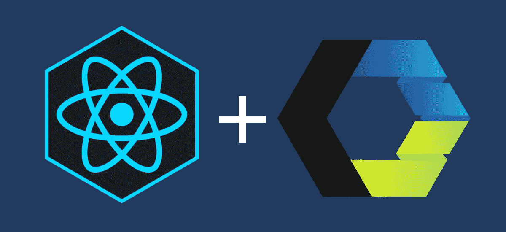
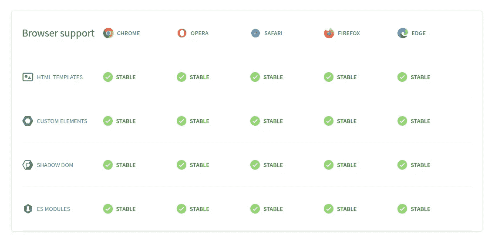
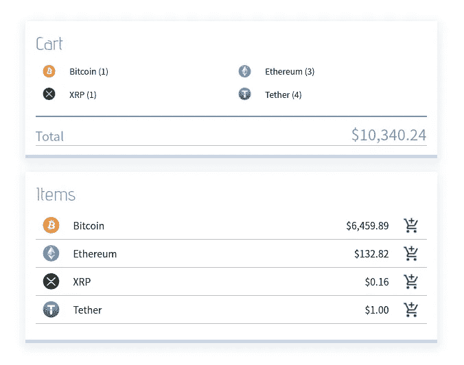

# React 和 Web 组件

> 原文：<https://itnext.io/react-and-web-components-3e0fca98a593?source=collection_archive---------1----------------------->



Web 组件变得越来越流行，而且它们肯定会继续流行下去。
正如我们所说的，对 Web 组件的支持正在增长，而且更多的资源、库和工具正变得对那些有兴趣创建和发布他们自己的 Web 组件的开发者可用。

在本文中，我将介绍如何使用 React 创建一个小应用程序，并将其构建为 Web 组件。

我将假设 React 和 Webpack 的基本经验。

# **TL；博士**

您可以构建一个 React 应用程序，并将其包装在一个 Web 组件中——只需稍加调整就能使其正常工作。

最简单的方法是使用[方向流](https://direflow.io/)


```
npm i -g direflow-clidireflow create
```

# 什么是 Web 组件？

Web 组件是一种构建自定义的、可重用的、封装的 HTML 标签的方式，可在网页和 web 应用程序中使用。
Web 组件基于现有的 Web 标准，可以与任何支持 HTML 的 JavaScript 库或框架结合使用。因此，它们是框架不可知的。

所有主流浏览器都支持基于 Web 组件标准构建的组件。



通过创建自定义 HTML 元素来使用 Web 组件，然后可以简单地将其用作任何其他 HTML 标记:

一旦构建了 Web 组件，就可以将其发布到在线注册表，以便其他开发人员可以在他们的项目中使用 Web 组件。
同样，您可以找到许多已经制作好并随时可以使用的 Web 组件。

在 Web Components 的官方网页上可以看到更多这些美好的东西[。](https://www.webcomponents.org/)

# 如何创建 Web 组件？

创建一个简单的 Web 组件实际上非常容易。
我们将使用 JavaScript 来定义一个新的 HTML 元素及其标签。

为了创建一个新的自定义 HTML 元素，我们将执行以下操作

*   创建一个新的`class`并扩展`HTMLElement`
*   使用此类创建组件及其逻辑
*   使用全局函数`customElements.define()`定义新元素

让我们看一个例子

就是这样。
现在我们可以像这样在页面中使用新的 Web 组件:
`<top-menu></top-menu>`

在这个例子中，我们使用了一个*影子 DOM* ，它是 Web 组件使用的四个主要概念之一。
详细介绍请参考 [Web 组件官方网页](https://www.webcomponents.org/introduction)

当然，像这样构建更复杂的组件很快就会变得很麻烦。
幸运的是，使用[聚合物项目](https://lit-element.polymer-project.org/)中的 Lit 元素，这变得非常方便和容易。

# 使用 React 创建 Web 组件

但是反应呢？如果我们可以使用 React 构建组件逻辑，然后将其构建为 Web 组件，这不是很棒吗？
嗯，绝对！

不幸的是，这不是我们能做的事情。
React 使用了一个 [*虚拟 DOM*](https://reactjs.org/docs/faq-internals.html) *，*这是实际 DOM 的一个虚拟表示。这经常与影子 DOM 的工作方式相冲突，导致诸如使用样式和事件之类的问题。

尽管如此，这是可以做到的。我们只需要稍微调整一下🤓

为了让 React 正常工作，我们需要进行以下更改:

*   **创建并定义一个新的自定义元素**
*   **将 React 应用程序安装到元素上**
*   **让我们的 React 应用对属性和特性的变化做出反应**
*   **确保 css 被正确应用**
*   **确保反应事件正确发出**

让我们从顶部开始，一步一步地完成这个列表。

**创建并定义一个新的自定义元素**

让我们假设我们已经将顶部菜单组件构建为一个 React 组件`<TopMenuComponent />`。继续定义一个扩展了`HTMLElement`的`class`，并使用`window.customElement.define()`定义它的元素，就像我们之前做的一样。

让我们在`index.jsx`(或者你的 React 应用的入口点)做这件事。
这是我们通常将 React 应用安装到文档中 id 为`root`的`div`元素的地方。

**将 React 应用程序安装到元素上**

让我们将 React 应用程序安装到我们定义的自定义元素上，而不是安装到`div`上。
根据以下内容更改代码:

现在，如果我们转到 id 为`root`的`div`所在的`index.html`文件，并将该 div 改为我们的 Web 组件。

移除:


添加:


*注意:如果你使用 Webpack，确保你的包被注入到你的 HTML 文件的* `<head>` *部分。*

这应该会呈现您的 Web 组件！然而——它可能看起来很奇怪，因为仍然需要修改样式。
别担心——我们一会儿会回到这个话题。

**让我们的 React 应用程序对属性和特性的变化做出反应**

我们先来听听属性变化。在这种情况下，我们希望 Web 组件能够接收两个属性:`menutitle`和`menucolor`。

我们将对`index.jsx`文件进行如下修改:

*   创建一个实例变量`attributes`。
*   创建一个方法`attributeChangedCallback()`，用新的属性更新变量`attributes`。
*   创建一个静态 getter 方法`observedAttributes()`，该方法返回一个属性列表以观察变化。
    ( *注意观察到的属性必须是小写*)。
*   最后，将更新的属性作为道具传递给我们的 React 应用程序

设置完属性后，我们还想再次调用`mountReactApp()`方法，以确保 rerender 被触发。

结果将如下所示:

现在我们还想处理属性。在这种情况下，我们希望 Web 组件能够接收一个字符串列表作为属性，这将是 Web 组件中菜单项的标题。

我们通过为我们的属性创建一个 setter 来处理这个问题。我们设想我们可能也想从 Web 组件中获取那个值，所以让我们也创建一个 getter。

当然，我们确保在设置属性值后调用`mountReactApp()`来触发 rerender。此外，我们将属性作为道具传递下去，就像我们对属性所做的那样。

我们的`index.jsx`文件现在完整地看起来像这样:

到目前为止一切顺利！
尝试转到您的`index.html`文件，并使用我们的一个属性:

```
<top-menu menutitle="Cool menu"></div>
```

现在转到你的 React 组件:`TopMenuComponent`，并`console.log`出道具。
你现在应该可以看到`'Cool menu'`作为道具的价值了！
同样的，一个改变的属性也应该可以通过道具获得。

为了测试它，在您的`index.html`文件的底部添加这个脚本标签:

```
<script>const topMenu = document.querySelector('top-menu');
topMenu.menuItems = ['Home', 'About', 'Log out'];</script>
```

一切都好！我们的 Web 组件现在可以对属性和特性做出反应，我们可以将它们作为道具传递给 react 应用程序👐

**确保正确应用 CSS**

您可能已经注意到，样式可能没有得到应有的应用。所以一切看起来有点乱。
这是因为 Shadow DOM 封装了它下面的所有东西，如果你在 Webpack 中使用`style-loader`、`css-loader`或类似的东西，这些样式就不会被应用。

幸运的是，有一个圆滑的小变通办法。
我们将使用一个名为 [style-it](https://www.npmjs.com/package/style-it) 的包将我们的样式直接注入到 DOM 中。

因此，请继续安装带有 npm 或 yarn 的 style-it。

```
yarn add style-it
```

我们还将更改我们的 Webpack 配置文件，以使用[来加载字符串](https://www.npmjs.com/package/to-string-loader)。

让我们更新我们的 Webpack 配置以使用 to-string-loader 插件:

如果您正在使用 create-react-app，您将需要首先弹出。

现在，我们将应用样式，如下例所示:

这将简单地在我们的组件上注入一个`<style>`标签。
还将生成一个唯一的 ID 来限定 css 类名的范围。试着检查一下 DOM，看看它——它很酷😁

**确保反应事件正确发出**

影子 DOM 的另一个特性是事件被重定向并封装在影子中。这是影子 DOM 的预期行为，然而，这与 React 的工作方式相冲突。
不幸的副作用是，从 React 应用程序调用的事件委托在影子中“丢失”。
结果是，当在 Web 组件中包装 React 时，单击和更改事件最终没有效果。

这意味着我们需要主动地将阴影中的事件重新定位到 React 可以到达的范围。

好消息是，这个变通办法已经被做成一个小的 NPM 包，我们可以非常容易地实现。

继续安装[反应-阴影-DOM-重定目标-事件](https://github.com/spring-media/react-shadow-dom-retarget-events)。

```
yarn add react-shadow-dom-retarget-events
```

然后我们将在我们的`mountReactApp()`方法中使用它:

我们将得到一个完整的`index.jsx`文件，看起来像这样:

基本就是这样！现在我们已经准备好疯狂使用 React，并最终将这一切构建成一个 Web 组件！🤟

# 使用直接流

这整件事可能有点麻烦，尤其是如果你想在不止一个场合做这件事。

因此，我亲自着手为这种事情构建了一个样板文件！随着我在这个样板文件的基础上不断构建，它很快就变成了一个在 React 中创建和管理 Web 组件的小型框架。

让我来介绍一下**导演。**


```
npm i -g direflow-clidireflow create
```

这将为你引导一个基于上述所有实践的模板，因此一堆其他的事情已经被处理了。

该模板使用 *react-scripts* 来获得最佳性能，您可以选择使用 TypeScript 或常规 JavaScript 来构建您的 Web 组件。
这也意味着包含了 IE11 支持所需的所有聚合填充物。

注册属性变得非常简单——你把它们放在一个文件中，它们将被自动观察并通过 props 提供给底层的 React 应用程序👌

同样，您可以非常容易地从 React 发出事件，当您使用 Web 组件时，可以为其添加侦听器🤙

**你可以在这里阅读更多关于这个项目的信息**
[https://direflow.io/](https://direflow.io/)

# 在网页上使用 Web 组件

现在您已经完成了 React 应用程序，并准备好构建您的 Web 组件。

捆绑 Web 组件最简单的方法是简单地使用通常捆绑应用程序的相同 Webpack 设置。

如果您正在使用[create-react-web-component](https://create-react-web-component.com/)，您可以通过使用以下命令来触发构建

```
yarn build
```

结果将是项目的`dist`文件夹中的一个 JavaScript 文件，带有组件的名称。
例如`dist/TopMenu.js`

为了在你的网页中使用这个组件，你所要做的就是在你的 HTML 文档的`<head>`标签中导入这个 JavaScript 文件，然后直接使用你的 Web 组件:

```
<script *src*="TopMenu.js"></script><TopMenu></TopMenu>
```

我用 Redux 制作了两个通过属性和事件发射进行交互的 Web 组件的实例。

自己尝试一下，或者[在代码沙箱上检查一下](https://codesandbox.io/s/direflow-demo-67kfu)

```
<head>
  // Import bundle
  <script src='https://direflow.io/demo-bundle.js' />
</head>

<body>
  // Use directly in browser
  <crypto-cart />
  <crypto-items />
</body>
```



# 发布您的 Web 组件

最后，如果你想发布你的 Web 组件，让任何人都可以使用你出色的工作，那么最好的地方可能是在 webcomponents.org

点击蓝色 [**发布元素**](https://www.webcomponents.org/publish) 按钮开始。

您还可以浏览社区中其他开发人员构建并发布的大量 Web 组件，供您免费使用！

最后，如果你喜欢这篇文章，请鼓掌👏扣几下吧！

**如果您使用了** [**导演**](https://direflow.io/) **并喜欢它，请在**[**GitHub**](https://github.com/Silind-Software/direflow)**上给该项目打一颗星。你的支持意义重大🙏😊**

**你也可以在**[**Twitter**](https://twitter.com/silindsoftware)**上找到我，我会在那里发布更多类似的内容。**