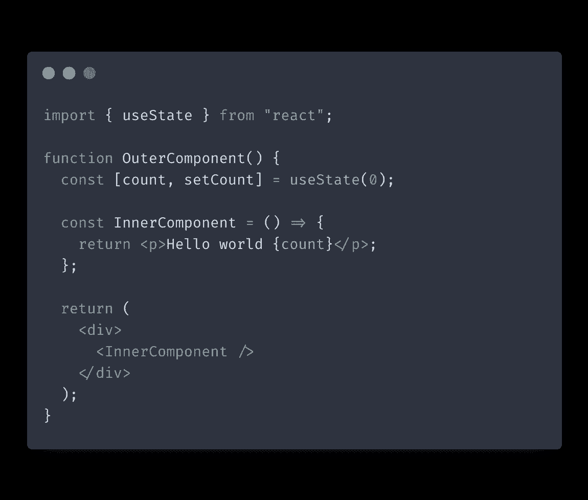
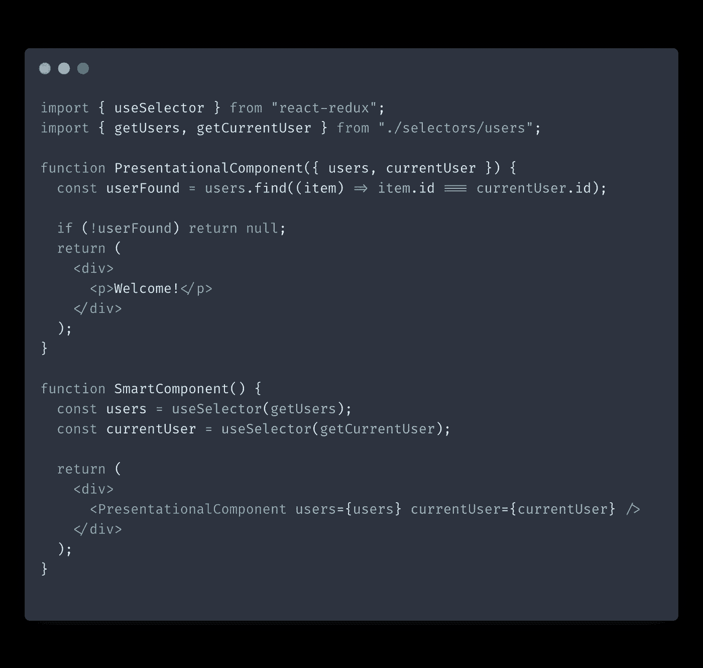
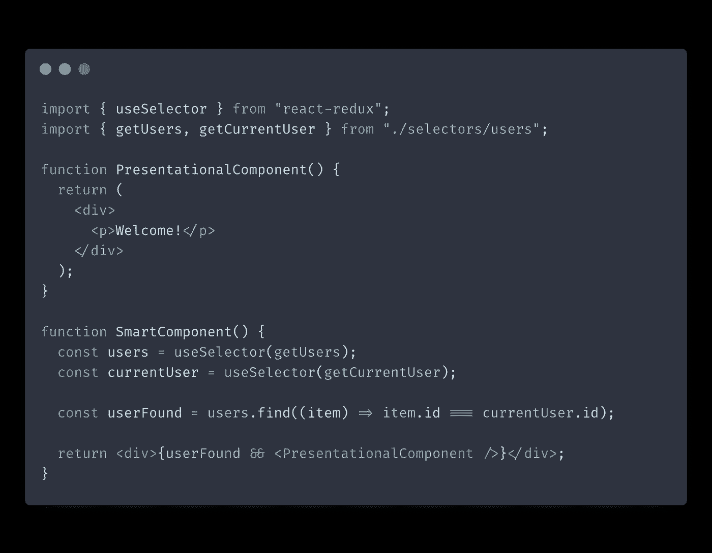
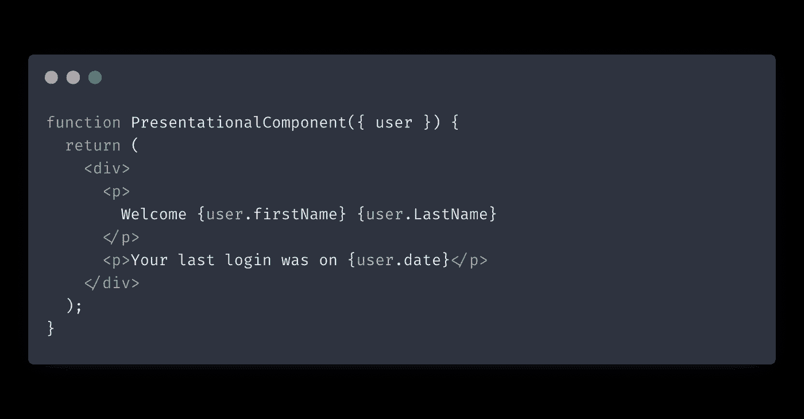
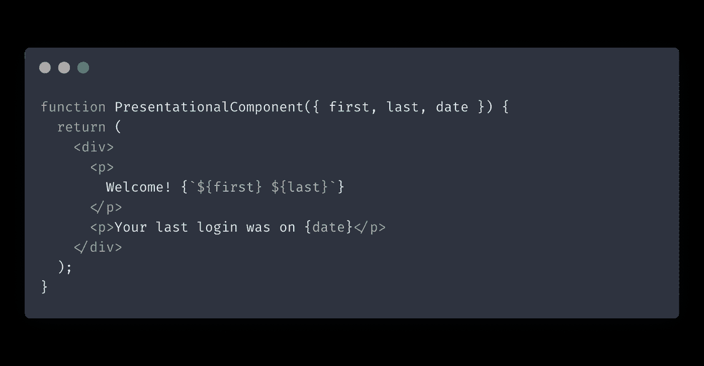
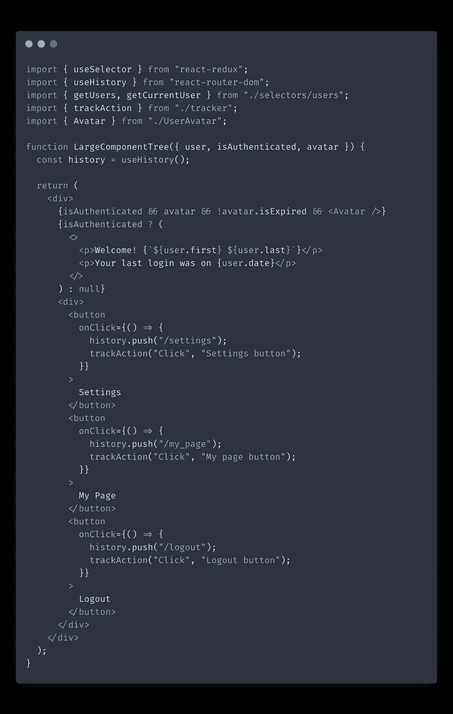
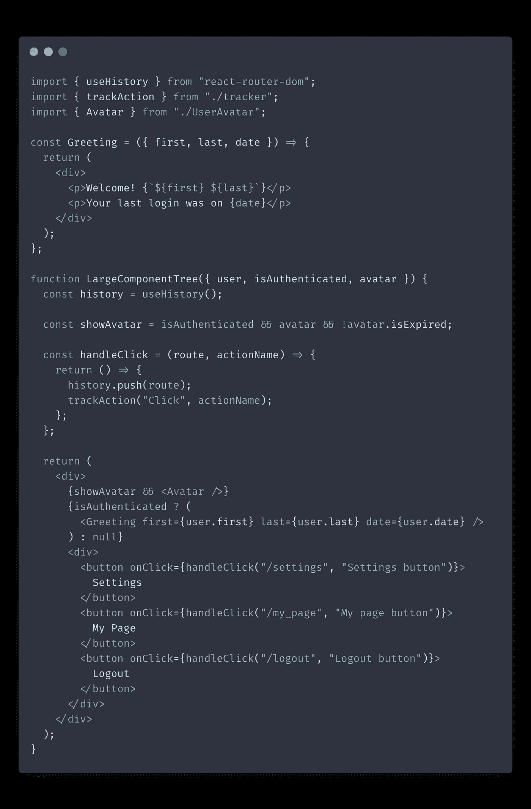

# 对反模式做出反应以避免

> 原文：<https://itnext.io/react-antipatterns-to-avoid-350929bdebf0?source=collection_archive---------0----------------------->

下面是 React 应用程序中最常见的一些反模式以及如何修复它们。如果您没有学会在早期识别和预防这些反模式，那么它们将会使您的代码库成为一场噩梦。

# 把一切都放在 Redux 中

Redux 很牛逼。它在幕后优化性能，并让我们轻松地进入应用程序的全局状态。

问题是，一旦新开发人员学会了 Redux，他们就开始像使用魔杖一样使用它来解决他们的所有问题。
这种方法有几个缺点:

*   你的代码失去了意图。如果所有东西都在 Redux 中，就不清楚你的代码应该是局部的还是全局的。做出改变更加棘手，因为你对应用程序中会受到影响的部分不太有信心。
*   当您对频繁事件使用 Redux 时，性能会下降，比如跟踪表单输入。由于 Redux 影响应用程序的全局状态，它肯定会导致更多的重新渲染。

**经验法则:只对真正的全局数据使用 Redux，比如用户会话或应用主题。对于其他任何事情，我喜欢为应用程序的特定部分创建上下文。**

# 将所有内容存储为一个状态

新开发人员遇到的另一个问题是没有充分利用[派生状态](https://isamatov.com/react-derived-state/)的概念。

很多变量都可以即时计算。例如，假设您有一组复选框项目。不需要在状态中存储`checkedCount`。您可以通过遍历项目数组并在每次渲染时过滤选中的项目来获得`checkedCount`。

**经验法则:在状态中存储一个变量之前，问自己:“我能不能基于我已经存储的其他数据导出这个变量？”**

# 到处使用 spread 运算符传递道具

我在 React 应用程序中见过很多这样的技巧。

您使用`{...props}.`将道具传递给子组件，这看起来很简洁，您可能认为您在使代码更加简洁。但事实是，随着时间的推移，您的代码将更难预测和理解。

当您开始使用 spread operator 到处传递道具时，并不能立即清楚您的子组件实际上需要哪些道具。重构变得几乎不可能。即使很小的重构努力也会打开一个蠕虫罐。此外，在组件树中跟踪 bug 要困难得多。

**经验法则:通常避免使用 spread 操作符传递道具。**有一次它被证明是正当的，那就是编写一个容器组件或 HOC 来呈现和增强其子组件。

# 在组件内部声明组件

在另一个组件中声明组件如下所示:

在它们的父组件内部编写组件是一个坏主意，原因有二:

*   您的代码变得紧密耦合。您的内部组件依赖于其父组件的闭包范围。
*   性能下降。父组件将在每次渲染时重新创建子组件的声明函数。

**经验法则:避免在父组件内部声明组件。**

# 向组件传递太多信息

不告诉你的组件你知道多少是好的。在决定要传递多少数据时，尽量记住智能组件和表示组件之间的区别。

表示组件是只输出 HTML 的组件。它们不持有状态，也不处理任何行为逻辑。

智能组件通常处理状态，并通过发出 API 请求、改变 redux 等方式向表示组件提供数据和行为。

对于表示组件，您应该只传递它呈现所需的数据。表示组件不应该决定是否呈现它们的内容。这种逻辑应该由智能组件来处理。

例如，看一下这段代码:

当您检查父组件时，不清楚我们的子组件是否有条件呈现逻辑。我们可以通过重新呈现条件逻辑并让我们的父组件决定是否呈现其子组件来澄清这段代码。

如果可能的话，只将原语传递给表示组件。这样做可以简化以后的性能优化。假设你像这样传递整个`user`对象:

相反，您可以传递用户的名字、姓氏和日期:

这使得使用`React.memo`减少重新渲染的次数更加容易。原因是 React 基于引用比较对象道具，而原语基于值比较。

总而言之，向组件传递太多信息存在以下问题:

*   更难区分智能组件和表示性组件。应用程序的主要逻辑应该由智能组件来处理，而表示组件只输出 HTML。
*   性能恶化。当你给组件传递太多的道具时，它会在每次这些道具改变时重新渲染，导致多余的重新渲染。

# 过度优化性能

有时候，开发人员在任何真正的问题出现之前就开始优化他们的代码。这是一种糟糕的做法，原因很简单:

*   复杂和过度设计的代码。试图在问题出现之前解决问题是使代码过于复杂的最可靠的方法。
*   浪费时间。你可以开发新的功能，解决重要的问题。

根据我的经验，智能地分离智能组件和表示组件可以解决 React 应用程序中大约 90%的性能问题。

# 巨大的组件树

最后但同样重要的是大型组件树。

通常，当您没有花时间正确地分离代码的逻辑部分和表示部分时，就会出现这个问题。

例如，看看这个组件:

恶心吧。很难理解这里发生了什么。我们有几个需要改进的地方:

*   将长条件语句重构为单独的变量。
*   将树分成更小的表示组件。
*   将箭头函数处理程序移出组件树。

让我们应用这些，看看组件现在是什么样子:

这个组件树看起来好多了。

经验法则:保持组件树的整洁，这样更容易看到组件应该在什么时候呈现什么。

# 结论

在这篇文章中，我们讨论了 React 反模式以及如何避免它们。通过从一开始就避免这些反模式，您将来就不需要花太多时间来重构代码。在这里查看我的帖子，了解更多关于编写干净的 React 代码的[技巧](https://isamatov.com/simple-tips-for-writing-clean-react-components/)。

感谢您的阅读！

*原载于 2021 年 9 月 19 日*[*https://isamatov.com*](https://isamatov.com/react-antipatterns/)*。*