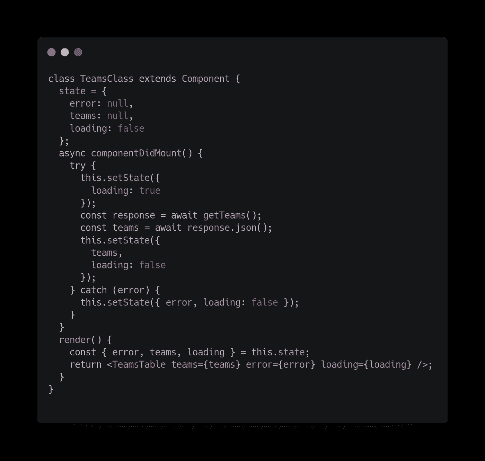
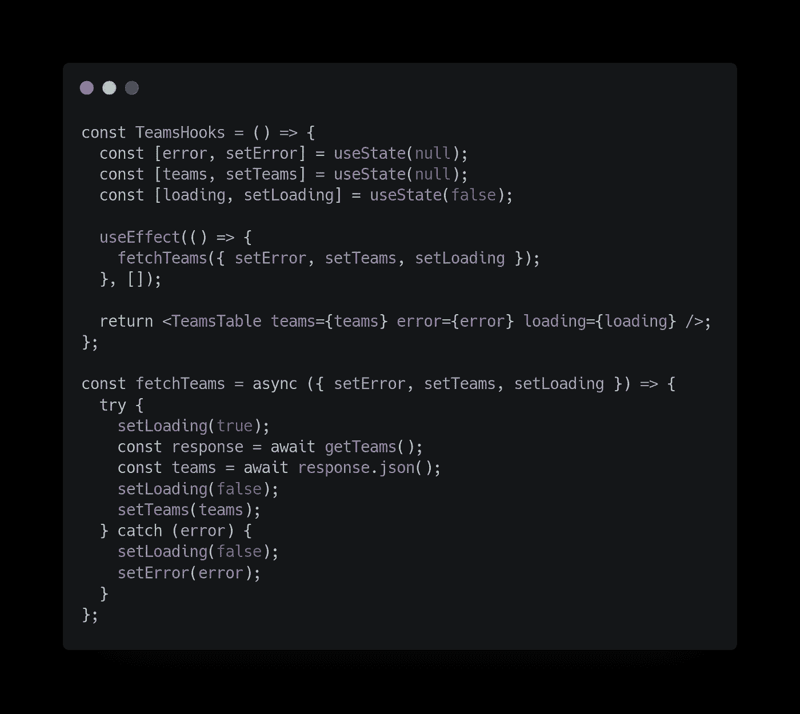
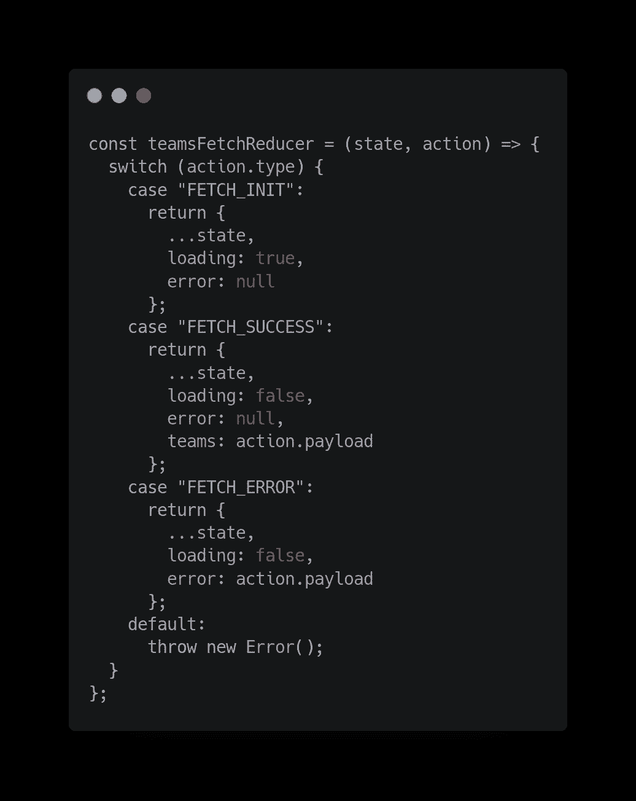
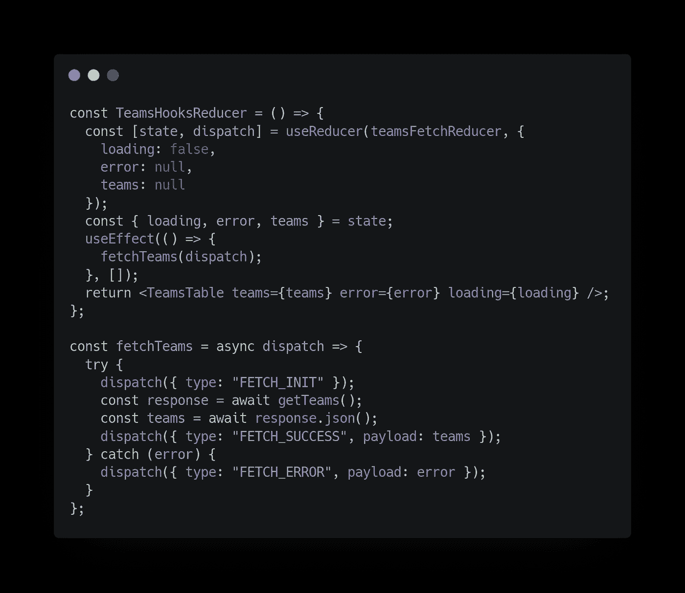
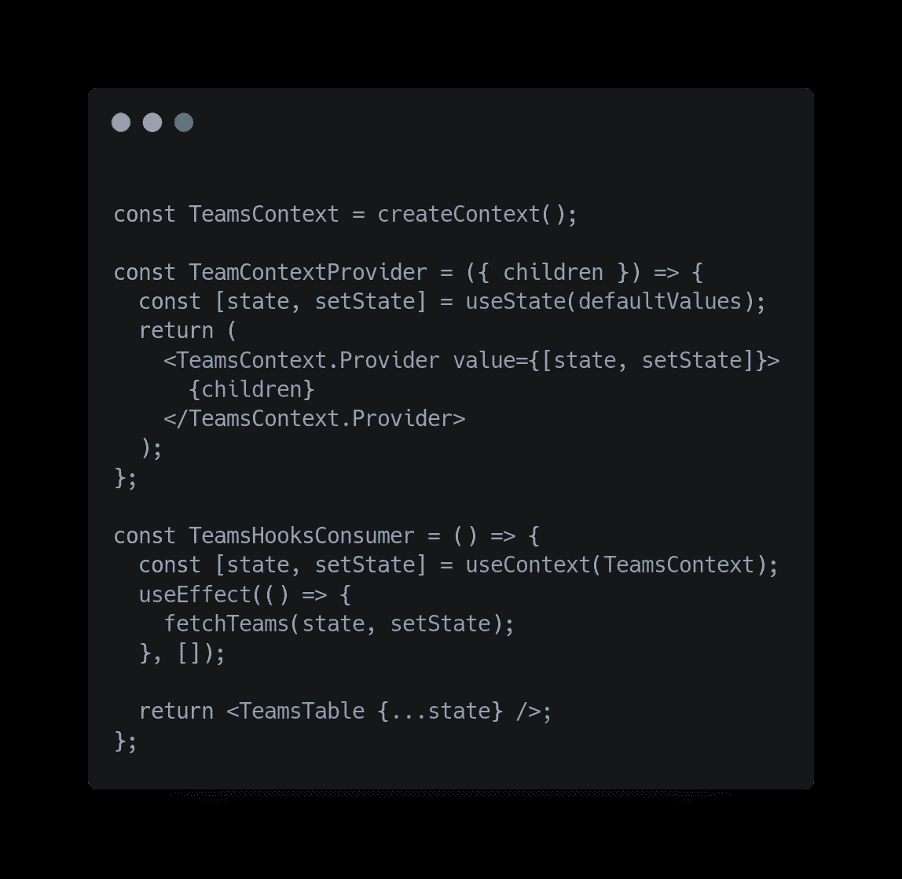
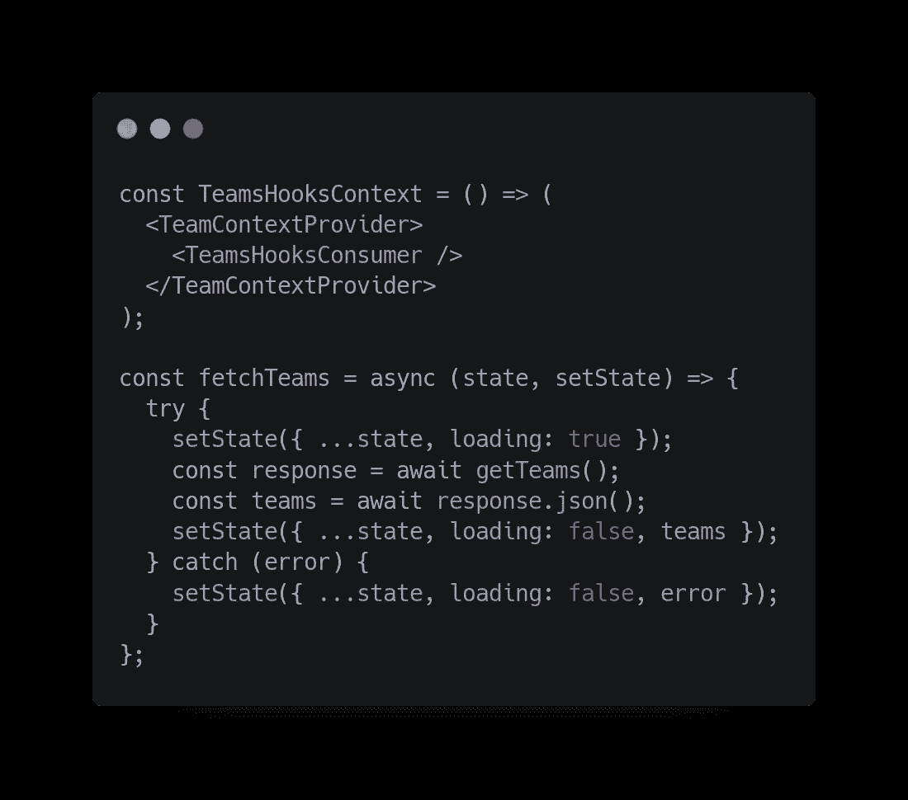
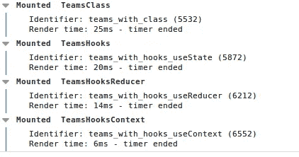

# React 异步组件:类与挂钩

> 原文：<https://itnext.io/react-async-components-classes-vs-hooks-1a9068b61b3f?source=collection_archive---------2----------------------->

就像你现在一样，从 React 16.8 开始，钩子是可用的。这个新特性允许我们编写没有类的组件，所以*组件*倾向于被弃用。

# 为什么是钩子？

三个最重要的原因是:

*   移除类。在 JavaScript 中，组合比继承好得多。更简洁的代码、性能和复杂性。
*   避免通过`super`类的未使用的生命周期方法。
*   复杂的类组件很难阅读和测试。那应该用钩子解决

所以，我们要用真实的例子来讲主要的区别。

我正在使用我为此创建的 [Github 库](https://github.com/boxgames1/react-hooks-async)。里面有 4 个例子可以比较:

*   类别组件
*   使用状态挂钩组件
*   useReducer 挂钩组件
*   userContext 挂钩组件

它们都实现了相同的功能。必须从这个 API 中获取一个列表，并呈现一个表格组件(传递一个数据数组，通过 props 加载和出错),这将关系到其余部分。

# 类别组件

类别组件

具有一个*状态*的典型类组件，一个管理异步调用的*组件和一个*呈现*。很难找到一个更简单的组件，我们已经在*组件中增加了一些复杂性。**

# 使用状态挂钩组件

使用状态挂钩组件

在这里，我们开始有一个孤立的状态管理。我们也可以将它们合并成一个单独的对象。*使用效果*替代*组件安装*。设置为空数组，他的第二个参数禁止使用相同的道具重新渲染。

*fetchTeams* 函数的复杂度与 *componentDidMount* 相似，所以我们没有赢得太多。

# useReducer 挂钩组件

这里，减速器是通过 3 个动作创建的。每个动作都是不可变的，只需一句话就可以设置新的状态。

*useReducer* 接收一个 Reducer 和一个初始值，然后返回*状态*和*调度*功能。

*fetchTeams* 功能也比之前的更加清晰

# 使用上下文挂钩组件

首先，创建一个工作环境。这里创建了**上下文状态。**

提供者有一个子属性，并且应该呈现所创建的上下文的自己的提供者，将*状态*和*设置状态*作为值属性传递。

*teamsookscontext*本身只有包装消费者的提供者。第二个是使用 **useContext 钩子**从上下文中获取*状态*和*设置状态*，并通过 useEffect 钩子管理异步调用。

最后但同样重要的是， *fetchTeams* 函数看起来也是清晰且不可变的。

**性能**

我已经使用 [react-performance](https://www.npmjs.com/package/react-performance) 来检查每个组件的加载时间，所以让我们看看…

表演

我不会一丝不苟地对待这件事，也不会明确地喜欢某样东西，因为这是一个非常小的时代，中间有一个网络因素。但是，我每次都点击了几次，这是一个准确的平均值。

这项研究是在一个非常小的组件中进行的，想象一下在一个更复杂的完整程序中的差异。

# 结论

毫无疑问，钩子是正确的选择。这不会是一个容易的转变，但是 React 允许我们循序渐进地完成它。我推荐 [Hooks FAQ 部分](https://reactjs.org/docs/hooks-faq.html)尤其是采用**策略部分**。

Reducer 和 context 选项更清晰 IMO 也更快。

关于使用哪种类型的钩子。通常这取决于具体情况。没有归纳，我会做这个作业:

*   只有一个状态项的组件。进入**使用状态**
*   具有复杂状态但没有太多业务逻辑的组件。T21 应该没问题
*   具有复杂状态和一些业务逻辑的组件。发展一个项目中的所有状态(如第四个例子中所示)并使用上下文。

如果你有一个非常复杂的情况，你也可以使用一些上下文，一些状态或一些减少。你也有更多可能对你有用的钩子。

完整的程序和一个演示页面在 Github 库中。

感谢阅读。