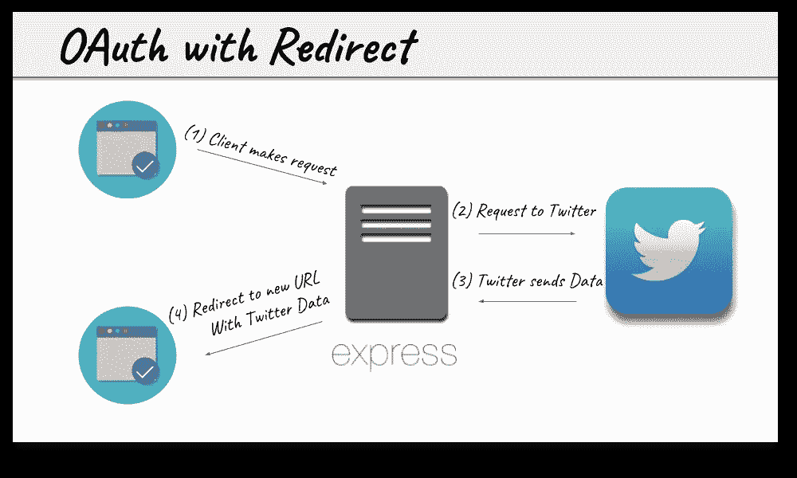
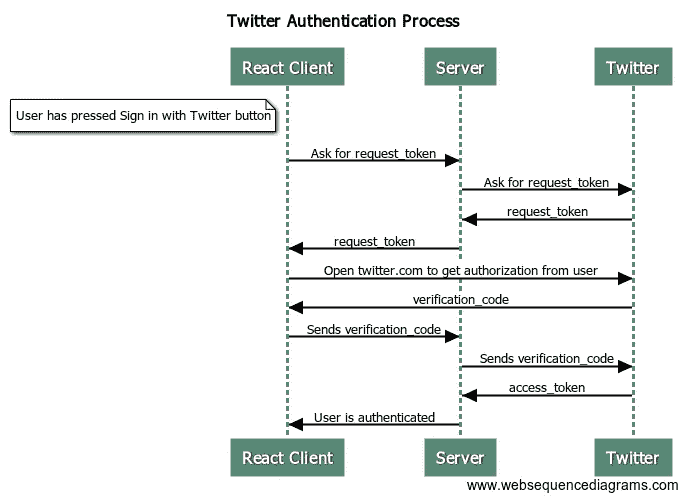

# 使用 Twitter 进行身份验证

> 原文：<https://itnext.io/react-authentication-with-twitter-2f6b7b0ee9d2?source=collection_archive---------1----------------------->

```
一个 demo 抵得上 1000 字或者跳到回购/pre>
```


> 如果你想更进一步，看看这篇关于与 Twitter、Google、脸书和 Github 进行 React 认证的文章。

OAuth 建立的前提是使用一个秘密的 api 密钥来验证用户进入应用程序的身份。由于客户端应用程序不能对密钥保密，因此需要服务器与 OAuth 提供者(如 Twitter)进行交互。

问题是客户机和服务器的分离已经成为现代 web 应用程序的架构标准。那么，运行在不同主机上的客户机如何成功地与 OAuth 提供者交互呢？

这个问题是有解决办法的。

有些，像 [React Auth Twitter](https://www.npmjs.com/package/react-twitter-auth#workflow) ，看起来设计过度。其他的，像 [Firebase](https://firebase.google.com/docs/auth/) 沉浸在黑魔法中，并抽象出所有的内部运作。

我想充分了解这个过程是如何运作的，并分享我的解决方案。



以上是传统的 OAuth 架构。客户端向服务器发起请求(但两者都运行在同一个端口上，本质上是向自己发出请求)。服务器中继到 Twitter，然后用 Twitter 提供的用户数据将用户重定向到一个新页面。

这是可行的，因为客户端和服务器本质上是一个实体，并且服务器能够隐藏 api 密钥和秘密。

不幸的是，React 应用程序通常与它们正在通信的服务器分离，这可能会导致像前面提到的 [React Auth Twitter](https://www.npmjs.com/package/react-twitter-auth#workflow) npm 包这样的工作流…



那里有很多出错的中继站，肯定有更好的方法…


这里，客户机和服务器通过请求启动身份验证过程和通过套接字接收响应来进行通信。所有敏感信息仍然保存在服务器上，客户端是一个完全分离的实体，与现代应用程序架构相匹配。

这就是方法，让我们进入一些代码来看看实现…

这个项目是用 [Create React App](https://github.com/facebook/create-react-app) 引导的。虽然我不会带你完成整个设置(有很多教程可以帮助你开始使用 React)。我想集中讨论一个问题，如何在一个解耦的单页面应用程序上与提供者进行认证。

下面是一个典型的 React 应用程序的设置，为了简单起见，许多变量都是硬编码的。

这里有一些基本的设置来连接套接字并将其指向适当的本地端口。

***componentdimount***是我们监听通过套接字从服务器发回的任何用户的地方，这样我们就可以更新用户的状态。

接下来，我们需要管理客户端通过弹出窗口向服务器发送请求。

上面我们有一些关于 ***App*** 类的方法，帮助我们与服务器启动的弹出窗口进行交互，并管理客户端的认证过程。

请注意，第 26 行的 ***url*** 上的 req.query 附有套接字 id。这是服务器将正确的用户数据发送回正确连接的套接字的关键。

***checkPopup*** 如果用户未经验证就关闭弹出窗口，则例行检查弹出窗口以重新启用登录按钮。

***openPopup*** 在服务器上启动弹出窗口，并传递套接字 id，以便它可以用于将用户数据发送回连接的客户端上的适当套接字。

***startPopup*** 启动在服务器上打开弹出窗口并监听弹出窗口的进程。它还禁用了登录按钮，因此用户无法尝试两次登录到提供商。

很肯定你能弄清楚那是做什么的:)

就是这样！

只需几行代码，我们就可以在服务器上触发一个请求，并在用户中止操作或服务器向我们发送相关用户信息时采取适当的操作。

现在渲染组件…

这里的 render 方法根据组件状态中是否存在用户来显示登录按钮或用户信息。

这就是客户端代码的全部内容。

在服务器上…

服务器也很简单。

除了 [PassportJS](http://www.passportjs.org/) 的常规设置之外，关键是使用中间件将套接字 id 添加到会话中(还记得我们在客户端触发弹出窗口时添加到请求中的套接字 id)，以便用户数据可以被发送回适当的套接字。

除此之外，一切都遵循典型 PassportJS 设置的模式。

上面的代码是为了只与 Twitter 的 OAuth 交互。这里是一个 ***Twitter only*** 设置的[客户端](https://github.com/funador/react-auth-client/tree/twitter-auth)和[服务器](https://github.com/funador/react-auth-server/tree/twitter-auth)的代码。

但是，假设我们想更进一步…


[Twitter/Google/脸书/Github 认证演示(该应用程序中不存储任何用户数据](https://react-auth-twitter.netlify.com)

在这里，我们将谷歌、脸书和 Github 添加为 OAuth 提供商([演示](https://react-auth-twitter.netlify.com))。这无疑引入了一些复杂性，尤其是脸书的要求，即即使是开发应用程序也必须使用 https 来访问它们的 API。但是一般模式是相同的，一旦 OAuth 成功，就使用套接字来传递用户数据。

因为 React 组件的性质(超级可重用！)以及不同提供商的 Passport 策略的重叠，我们可以用少量的代码来实现这一点。

以下是为[客户端](https://github.com/funador/react-auth-client)和[服务器](https://github.com/funador/react-auth-server)设置一个 ***完整 Twitter、谷歌、脸书、Github***的代码和说明。如果你想让我在以后的帖子中更详细地描述这个过程，请告诉我。

与所有编程问题一样，有一百万种解决方案来验证 React 应用程序。我认为套接字非常适合追求简单性，但如果你有不同的方法/解决方案，我很想听听。

[](https://github.com/funador/react-auth-client) [## funador/react-auth-client

### react-auth-client -使用 react 和 Express 的社交认证

github.com](https://github.com/funador/react-auth-client)