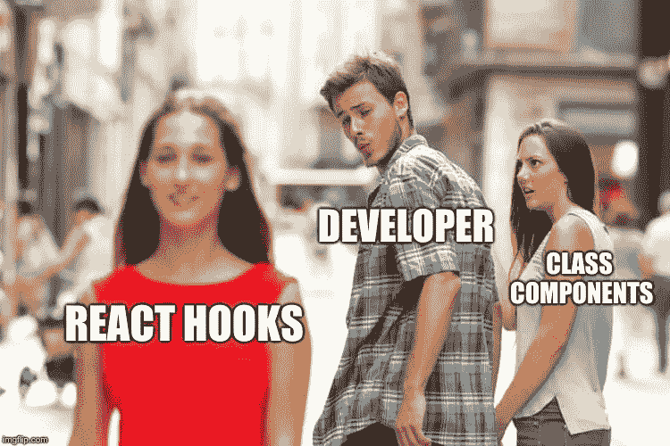
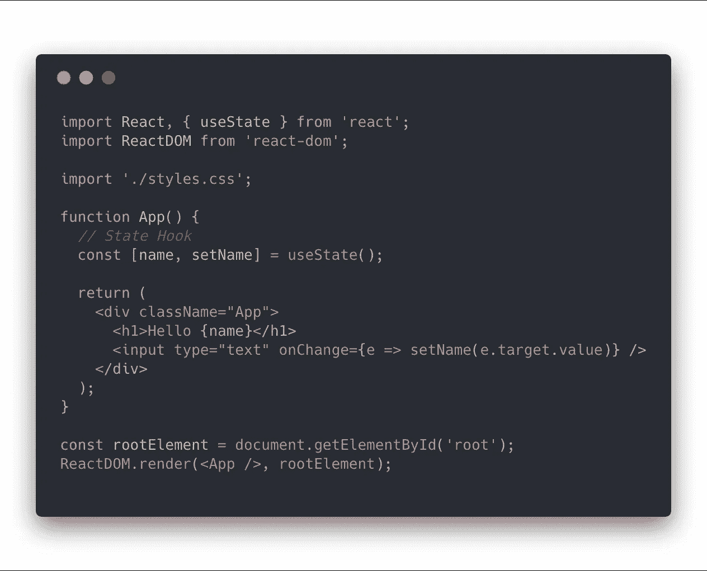
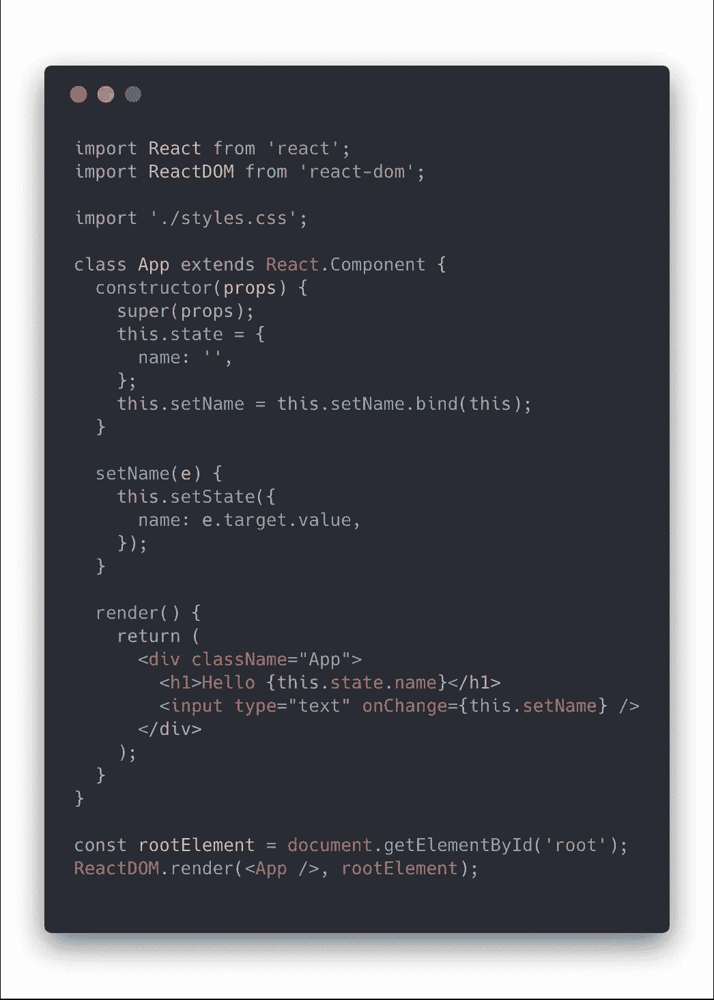
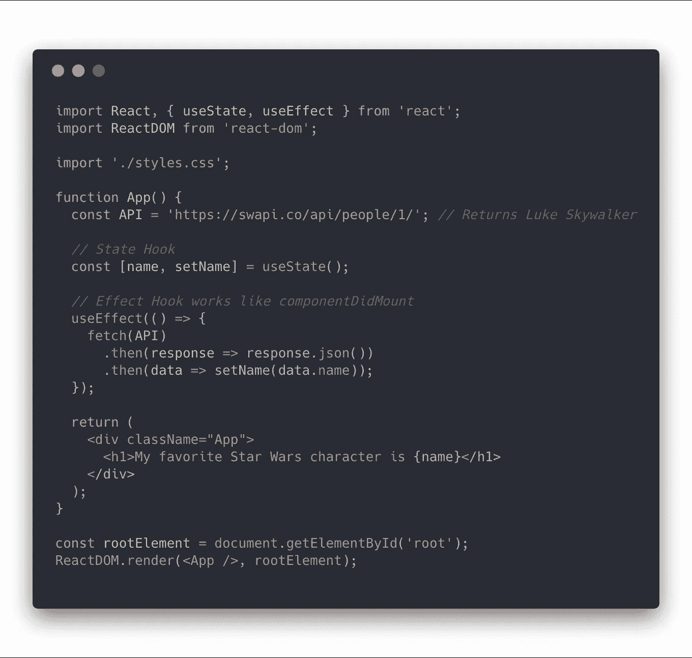

# React 类组件都死了？(提示:可能)

> 原文：<https://itnext.io/react-class-components-are-dead-hint-not-yet-1d0a151173b8?source=collection_archive---------1----------------------->


⚛ [React Conf 2018](https://conf.reactjs.org) 结束了。第一个演讲是关于 React 的今天和不久的将来。来自 React 团队的[索菲](https://twitter.com/sophiebits)和[丹](https://twitter.com/dan_abramov)提到了 React 目前的问题，并宣布了即将发布的令人兴奋的新功能。

# 反应—当今的问题

🔥包装地狱
📦巨大的部件
😕混乱的阶层

# 类组件有什么问题？

如果你曾经使用过 React，你就会知道决定组件类型总是很棘手。如果你创建了一个功能组件，并且需要一个**本地状态**或者任何一个**生命周期方法**来**获取数据**怎么办？(componentDidMount，componentWillUnmount 等。)很烦。

同样，类组件也有缺点；

*   **令人困惑的**(无论是人还是机器，尤其是在**绑定**和**这个**关键字)
*   **生命周期方法，**逻辑遍布不同的生命周期方法
*   **与功能组件相比，难以测试**
*   **编译代码大小**和**编译时间**

# 解决方案= >挂钩一览

> 钩子是一个新的特性提议，让你不用写类就可以使用状态和其他 React 特性。他们目前在**React v 16 . 7 . 0-α0**

在官方文档中，钩子被解释为:

> 允许您从功能组件“挂钩”反应状态和生命周期特性的功能。钩子在类内部不起作用——它们让你在没有类的情况下使用 React。



# 📌状态挂钩

状态挂钩允许在功能组件上使用本地状态。

## 如何使用它



`useState();`这里是一个**钩子**。我们调用这个钩子向组件添加一些本地状态。

`useState();`返回一对值:*当前状态值*和一个让你更新它的*函数*。

也可以增加多个**挂钩**，

```
const [age, setAge] = useState(33);const [location, setLocation] = useState('Amsterdam');
```

这是我们在当前的 React 版本中的做法，因此您可以看到不同之处，



欲了解更多详细信息，您可以查看[反应钩](https://reactjs.org/docs/hooks-state.html)文档页面。

# ⚡️效应钩

效果挂钩`useEffect`，增加了在功能组件中执行`componentDidMount`、`componentDidUpdate`和`componentWillUnmount`的能力。

## 如何使用它

下面是《星球大战》Api 中**效果挂钩**和**状态挂钩**的用法示例



您可以在单个功能组件中使用**多个效果挂钩**用于不同目的。

有关更多详细信息，您可以查看[效果挂钩](https://reactjs.org/docs/hooks-effect.html)文档。

# 结论

类组件不是死的。React 团队解释说，

> 没有从 React 中移除类的计划——我们都需要继续发布产品，并且负担不起重写。

但是他们建议尝试新代码/项目的钩子。

**使用钩子的好处:**

*   组件更轻，并且在组件之间共享一些逻辑
*   捆绑尺寸将会减小
*   你不需要仅仅为了传递数据而使用 hoc 和渲染道具
*   在大多数情况下，额外的挂钩会让你的生活更轻松

# 下一步是什么？

关于钩子还有更多要查。你可以在 [API 文档](https://reactjs.org/docs/hooks-reference.html)中找到关于**钩子**的所有细节

您可以查看**挂钩**页面[常见问题解答](https://reactjs.org/docs/hooks-faq.html)

你可以在 **React Conf 2018** 上观看[苏菲](https://twitter.com/sophiebits)和[丹](https://twitter.com/dan_abramov)关于**钩子**的完整对话

*我是*[*JavaScript Squad*](https://www.linkit.nl/en/what-we-do/services/javascript-squad)*at*[*LINKIT*](https://www.linkit.nl/en/)*的一名开发人员，是一家荷兰 IT 公司的成员，为荷兰的大客户工作。我们正在寻找开发者加入我们的团队。感兴趣吗？给我写封短信。*

## 如果您觉得这篇文章有帮助，请点击👏按钮。

# 请跟着我🔽在[推特上](https://twitter.com/altinilker)👍