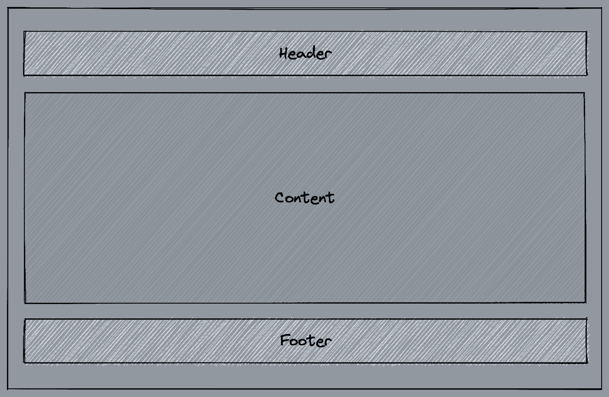

# 反应干净的代码

> 原文：<https://itnext.io/react-clean-code-f7b7946cb9d3?source=collection_archive---------0----------------------->


萨姆·洛伊德在 [Unsplash](https://unsplash.com?utm_source=medium&utm_medium=referral) 上拍摄的照片

*更新(2022 年 9 月 25 日):我在这篇* [*可维护反应备忘单*](https://icodeit.ck.page/maintainable-react-tips) *中总结了 7 个小技巧，可以在这里* *免费下载* [。](https://icodeit.ck.page/maintainable-react-tips)

*更新(2022 年 7 月 17 日):我最近总结了我在许多文章中讨论过的模式，并在 leanpub* *上发表了一本关于* [*的书。现在差不多完成了(90%)，如果你能给我提供任何反馈，那就太好了。*](https://leanpub.com/maintainable-react)

我们都知道干净代码是多么重要，我们也从书本上学到了诸如 S.O.L.I.D .等原则。但问题是如何将它们应用到我的项目中？

我不会说我们在 React 中清理代码的方式与其他语言/框架有太大不同，大多数原则仍然适用。然而，我相信有一些 React 特有的模式和技术您需要了解、掌握并在您的项目中使用。

在这篇文章中，我想分享我重构这样一个代码库的经验。从通用和简单的重构技术(命名、重命名、提取组件/文件等。)到更高级的模式(自定义挂钩、渲染道具等)。).所有的例子都是基于我们代码库中的真实场景(已经删除了所有敏感信息)，我希望你也能在你的代码中应用它们。

首先，什么是干净的代码？

# 定义

> 任何傻瓜都能写出计算机能理解的代码。优秀的程序员编写人类能够理解的代码。
> 
> *—马丁·福勒*

有很多关于干净代码的定义，或者每个开发人员都有他们对干净在他们的世界中意味着什么的定义。我发现很难清楚地定义它，但解释什么是*不干净的*代码对我来说更容易。

我有一个症状列表，这些症状在我参与的许多项目中相对常见:

*   长文件症状
*   难以测试的症状
*   症状难以改变
*   不遵循一般原则症状

我认为，如果我们能够消除这些症状，我们的代码就可以达到一个特定的阶段，你可以称之为干净的代码，也可以不称之为干净的代码。但是我向您保证，代码将更具可读性和可维护性，这对干净的代码至关重要。

让我们一个一个地看一下。

# 大文件症状

大文件症状是我列出的*不干净*代码症状的第一名。它可能是一个具有巨大功能或许多功能的文件。或者它是一个带有太多道具的 React 组件，而在其他情况下，该组件不处理一些“道具”,而只将它们传递给它们的子组件。

```
const OrderContainer = ({
  testID,
  orderData,
  basketError,
  addCoupon,
  voucherSelected,
  validationErrors,
  clearErrors,
  removeLine,
  editLine,
  hideOrderButton,
  hideEditButton,
  loading,
}: OrderContainerProps)
```

通常，程序员倾向于把相关的代码放在一起，看起来毫不费力。但根据我的经验，这是你犯过的代价最大的错误。

大文件不好的原因有很多。首先，很难阅读和理解。让我们钦佩的是，我们的大多数开发工作都是关于理解现有代码，而不是编写新代码。文件越长，就越难理解。大文件也意味着它试图在一个地方做太多的事情，或者你可以称之为缺乏抽象。

```
const { t } = useTranslation('order')const serviceText = serviceMethod === 'Pickup' ? t('PickUp') : t('Deliver')const storeNameOrDeliveryAddress =
serviceMethod === 'Pickup'
    ? selectedStore && selectedStore.media.name
    : selectedDeliveryAddress === undefined || '' || !selectedDeliveryAddress.displayAddress
    ? t('DeliveryAddressNotAvailable')
    : selectedDeliveryAddress.displayAddress
```

我们稍后将讨论如何解决这个问题。先说第二个症状。

# 难以测试的症状

以下常见的*不干净的*代码症状很难测试。有时你可能会在每个测试文件中看到一个很长的`mocks`列表，或者一个很长的`beforeEach`或`afterEach`函数。或者在其他情况下，您可能会看到测试验证数据结构而不是行为，但它们都符合`hard to test`类别。

```
const mockUseLocation = jest.fn().mockImplementation(() => ({ state: {} }))
jest.mock('@reach/router', () => ({
  ...jest.requireActual<{}>('@reach/router'),
  navigate: jest.fn(),
  useLocation: mockUseLocation,
}))const mockShowAlert = jest.fn()
jest.mock('@company/hooks-and-hocs', () => ({
  ...jest.requireActual<{}>('@company/hooks-and-hocs'), useSdkAvailable: jest.fn().mockImplementation(() => ({
    found: true,
  })), useAlert: jest.fn().mockImplementation(() => ({
    showAlert: mockShowAlert,
  })),

  //...
}))
```

# 症状难以改变

编程中最令人沮丧的事情是，当你想对代码进行简单的修改时——即使你知道这只是一行代码的修改——如果不破坏其他东西或者不让你自己感到恶心，这几乎是不可能实现的。另一种可能是，要改变一个东西，你需要先改变另一个东西，而要改变那个东西，你需要修改另一个地方，以此类推。要做出这么简单的/一句俏皮话是不可能的。

本质上，这可能是因为代码耦合的方向不正确，没有明确的模块边界，或者没有良好的抽象。从表面上看，做出改变并不容易。死循环是，因为很难改变，人们倾向于不改变它，而是在它上面添加补丁，这使得再次改变更加困难。

# 不遵循一般原则症状。

在计算机科学和软件工程行业不太长的历史中，我们有许多被证实的设计原则。例如，`S.O.L.I.D`，`Don't repeat yourself,`你不需要它，等等。在许多情况下，简单地遵循这些原则或模式就可以避免不干净的代码。不幸的是，许多开发人员并没有太关注这些原则，不管出于什么原因，他们只是将代码放在一起，并试图让应用程序运行起来。我在项目中看到的许多软件并不是设计出来的，只是放在一起，希望它能工作。


来源:[https://medium . com/bgl-tech/what-the-solid-design-principles-c 61 feff 33685](https://medium.com/bgl-tech/what-are-the-solid-design-principles-c61feff33685)

所以现在对干净代码的含义有点清楚了，也更接近我的定义了。

# 干净的代码

最重要的是，干净的代码意味着**易于阅读/理解**。其次，它遵循一些通用的设计原则，单一的责任，控制的逆，并使模块不那么耦合在一起。代码应该易于测试，也易于更改。

# 清理技术

React 和其他框架清理现有代码没有太大区别。尽管如此，您仍然需要遵循所有经过良好验证的模式，并使用有意义的变量名和函数名使组件简洁。但是有一些具体的反应方式。例如，您应该在应用程序中分离逻辑和视图，使组件更小，更多地使用组合 API(例如，子属性和渲染属性)，尽可能使用钩子将逻辑封装在普通的。

我们已经知道干净的代码是什么样的，我们应该拆除它们并清理它们。但是在我们开始之前，需要先做一些准备。

*   确保你的测试是可靠和正确的
*   使用小的重构技术来建立信心
*   加速的键盘快捷键
*   练习再练习

# 请给我看一些例子

假设我们有一个名为`Stack`的视图，一个包含`header`、`content`和`footer`的网页容器。通常，页眉没有什么特别的，只是页面顶部的一个简单的导航栏。



堆栈视图

在某些情况下，当设置了`showAccount`标志时，它会显示一个额外的链接，将用户指向`profile`页面。

```
const Navigation = ({ showAccount }: { showAccount: boolean }) => {
  return (
    <header>
      <nav className="navigation">
        <ul>
          <li>
            <a href="/">Home</a>
          </li>
          <li>
            <a href="/">About</a>
          </li>
        { showAccount && (<li>
            <a href="/profile">Profile</a>
          </li>)}
        </ul>
      </nav>
    </header>
  );
};const StackView = ({ showAccount, children }: { showAccount: boolean, children: React.ReactNode }) => {
  return (
    <div className="stack">
      <Navigation />
      <main>{children}</main>
      <footer>@Copyright 2022</footer>
    </div>
  );
};export default StackView;
```

如果我们必须重构它，我们可以从一些小的开始。注意，我们假设一个单元测试工厂已经支持了我们。我们可以从简单的`extract component`重构开始，将`<footer>`提取到一个单独的组件中:

```
const Footer = () => <footer>@Copyright 2022</footer>
```

就像这样使用它:

```
const StackView = ({ showAccount, children }: { showAccount: boolean, children: React.ReactNode }) => {
  return (
    <div className="stack">
      <Navigation showAccount={showAccount} />
      <main>{children}</main>
      <Footer />
    </div>
  );
};
```

同样，我们可以将`Navigation`重命名为`Header`,`StackView`变成:

```
const StackView = ({ showAccount, children }: { showAccount: boolean, children: React.ReactNode }) => {
  return (
    <div className="stack">
      <Header showAccount={showAccount} />
      <main>{children}</main>
      <Footer />
    </div>
  );
};
```

到目前为止还没有什么新奇的东西，但是我认为代码更干净了，因为我们引入了两个有意义的概念，`header`和`footer`，这正好符合读者对页面或堆栈视图的期望。

# 下一步

然后，如果我们查看`StackView`中的`showAccount` prop，它并不直接使用它，而是将它向下传递给`Header`，因此我们可以通过另一个抽象层来减少这种噪声。

我们让`StackView`的消费者决定他们想要哪个标题怎么样？

```
const StackView = ({ header, children }: { header: React.ReactNode, children: React.ReactNode }) => {
  return (
    <div className="stack">
      {header}
      <main>{children}</main>
      <Footer />
    </div>
  );
};
```

而在使用中，每当他们需要一个账号的时候就头:

```
const {isUserLoggedIn} = useAccount()
const header = <Header showAccount={isUserLoggedIn} />return (<StackView header={header}>
    <Content />
</StackView>)
```

同样，当页脚变得更高级时，我们可以将其提取出来，以保持“StackView”中的逻辑简单:

```
const {isUserLoggedIn} = useAccount()
const header = <Header showAccount={isUserLoggedIn} />
const footer = <Footer links={[...]} />return (<StackView header={header} footer={footer}>
    <Content />
</StackView>)
```

而`StackView`最终是一个只有容器的组件:

```
const StackView = ({ header, children, footer }: { header: React.ReactNode, children: React.ReactNode, footer: React.ReactNode }) => {
  return (
    <div className="stack">
      {header}
      <main>{children}</main>
      {footer}
    </div>
  );
};
```

所以在上面的例子中，正如你所看到的，我们使用了一些简单的技术来使代码更容易理解:

首先，我们将页脚提取到一个单独的地方，然后我们将 Navigation 重命名为 Header，以减少歧义。其次，我们分离了 header 和 StackView，现在传入 header 的正确版本是消费者的责任，Stack 纯粹是一个简单的容器。最后，我们对页脚进行了精确的修改，使 API 对我们的读者(未来的我们)来说更加一致和直观。

# 参考

*   [鲍勃大叔清理代码](https://blog.cleancoder.com/)
*   [马丁重构](https://martinfowler.com/articles/refactoring-2nd-ed.html)
*   [反应中的成分](https://javascript.plainenglish.io/did-someone-say-composition-c7843d898b2)
*   [放置您的业务逻辑](/the-right-way-to-place-business-logic-in-your-react-application-8bf16145f48d)