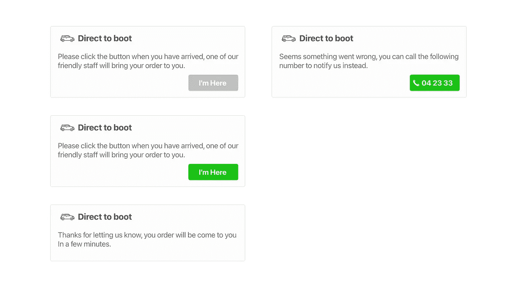
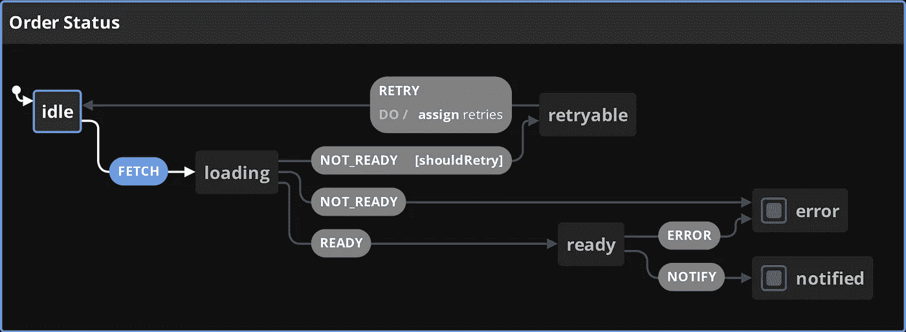
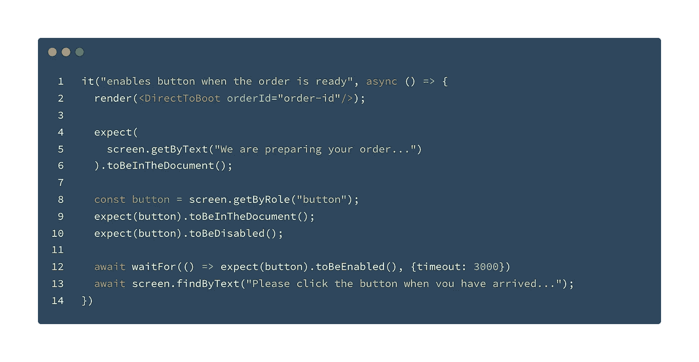
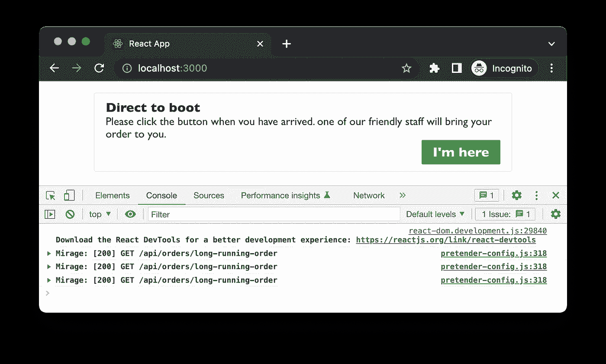

# 反应干净的代码-使用 Mirage.js 模拟网络场景

> 原文：<https://itnext.io/react-clean-code-simulate-network-scenarios-with-mirage-js-9b2c165b12e9?source=collection_archive---------0----------------------->

在我的书[可维护反应](https://leanpub.com/maintainable-react)中，我介绍了我不久前开发的一个特性。这个特性在很多方面都很有趣，我选择它是因为它涉及到视图中的几个状态——这也是为什么构建 UI 很复杂的原因之一。

它们不是典型的 UI 状态，而是服务器缓存状态，正如 Kent 在这里的文章中所描述的。所有的网络请求都可能出错、超时、请求过多甚至服务中断。在视图中，我们需要相应地反映这些网络状态。

如果你喜欢视频，我已经在我的频道上发布了两个相应的视频。

# 不同的地位

这里的**直接引导**的功能是，当用户开始进入页面时，我们需要检查订单的当前状态。如果正在进行，我们需要显示一个禁用的按钮`I'm here`和一些提示消息。在某些时候，当订单准备好提货时，需要启用按钮，这样我们就可以单击它来通知商店。点击该按钮时，会发送一条通知，订单会直接送到您的汽车行李箱中。此外，如果出现任何问题，我们会显示一个号码作为备用，这样我们就可以打电话给商店。



“直接到图书”应用程序的不同状态

所以我们至少需要考虑以下事情:

*   从服务器获取数据
*   如果网络出现问题，请重试
*   如果返回的数据不是我们想要的，请重试
*   当我们失败太多次时停止重试
*   向服务器更新数据
*   处理每个网络请求的错误

如果我们为上面的描述画一个`statechart`，会是下图这样的东西。在命令是`ready`之前，我们需要重试几次。并且通知可能有另一个重试计数器(在这个图表中我们没有这样做)。此外，每个网络请求都可能导致错误。注意，快乐路径(空闲→就绪→通知)只是分支中的**一个。**



直接启动的状态图

# 快乐之路

我们可以从快乐的道路开始，因为这是最容易的一步，也是我们希望确保发生的最重要的事情。

在测试中,(初始化→就绪)的最佳路径可以描述为:



我们快乐之路的第一个测试

# 嘲笑快乐之路的请求

在我的书中，我使用`msw`作为嘲讽服务器，它工作得相当好。为了简单起见，我在这里使用`mirage.js`。我也喜欢库的数据建模部分。这里没多大关系，你[可以用任何一个](https://miragejs.com/docs/comparison-with-other-tools/)。

例如，我们可以定义一个`get` API 来检查测试中的订单状态。它拦截发送到`/api/orders/<id>`的请求，并总是返回一个状态为`ready`的对象。

```
import { createServer } from "miragejs";

const createMockServer = () => createServer({
  routes() {
    this.get("/api/orders/:id", (schema, request) => {
      return {
        id: request.params.id,
        status: "ready",
      };
    });
  }
})
```

然后，我们在每次测试开始时创建一个服务器，并在测试结束时关闭它。

```
describe("Direct To Boot", () => {
  beforeEach(() => {
    server = createMockServer();
  })

  afterEach(() => {
    server.shutdown()
  })

  //...
});
```

该 API 看起来很直观，并且正如预期的那样工作。在我们的组件中，我们可以像对待真正的 API 一样发送请求和消费响应。

# 用 react-query 实现提取

在[我之前的文章](/the-pragmatic-guide-to-react-network-programming-c6f9de9962ed)中，我详细讨论了提出一个“简单”的网络请求需要考虑多少琐碎的事情。以及如果您使用`react-query`而不是手动实现它会有多简单。

要使用`react-query`，首先我们需要定义一个`query`函数。注意这里如果`res.data.status`不是`ready`，会抛出一个错误。并且`react-query`可以检测该错误并触发`refetch`(如果配置的话)。

```
const fetchOrder = (orderId: string) => {
  return axios.get(`/api/orders/${orderId}`).then((res) => {
    if (res.data.status === "ready") {
      return res.data;
    } else {
      throw new Error("fetch error");
    }
  });
};
```

现在有了`fetchQuery`函数，我就可以调用`useQuery`，并将整个逻辑封装在一个钩子`useOrder`中

```
const useOrder = (orderId: string) => {
  const [status, setStatus] = useState<string>("initialised");

  useQuery(["fetchOrder"], () => fetchOrder(orderId), {
    retry: 5,
    onError: () => setStatus("error"),
    onSuccess: () => setStatus("ready"),
  });
    return { status }
}
```

我将 retry 设置为 5，这样无论何时发生实际错误(比如服务器端发生 500 个错误)或者当`res.data.status`不是`ready`时，`react-query`都会重试。并且[它不会立即重试](https://tanstack.com/query/v4/docs/react/guides/query-retries#retry-delay)，而是等待一段时间，作为每次失败之间的延迟。

# 模拟错误

在`mirage.js`中，模拟测试要捕捉的错误相当简单。我还发现有几个会触发错误的`id`很有帮助，这样您就可以测试不同的错误处理逻辑。

例如，我们可以定义一个在使用时指示错误的`id`列表。

```
this.get("/api/orders/:id", (schema, request) => {
  if(['error-id', 'timeout-id'].includes(request.params.id)) {
    return new Response(500, {}, {error: "something went wrong"});
  }

  return {
    id: request.params.id,
    status: "ready",
  };
});
```

然后，在我们的测试中，我们可以使用`error-id`或`timeout-id`作为`orderId`来模拟误差:

```
it("shows a fallback call the store button", async () => {
  render(<DirectToBoot orderId="error-id"/>);

  await waitFor(() =>
    expect(
      screen.getByText("Seems something went wrong...")
    ).toBeInTheDocument(), { timeout: 3000});

  const button = screen.getByText("04 23 33");
  await waitFor(() => expect(button).toBeInTheDocument(), {timeout: 3000})
});
```

# 请求失败时模拟重试

在我们的特性中，我们还想模拟`long-running`顺序，以确保 UI 不会被初始获取阻塞。我们可以通过定义一个具有`initialised`状态的变量来模拟它，然后使用一个定时器来更新这个值。

```
const longRunningOrder = {
  id: 'long-running-order',
  status: "initialised",
}

//...
const createMockServer = () => createServer({
  routes() {
    this.get("/api/orders/:id", (schema, request) => {
      if(['long-running-order'].includes(id)) {
        const timerId = setTimeout(() => {
          longRunningOrder.status = 'ready'
          clearTimeout(timerId);
        }, 2000)
        return longRunningOrder;
      }
    });
  }
})
```

然后在几次重试之后，视图最终获得了`ready`状态，并准备好通知商店。请注意控制台中的“幻影”在这种情况下已经重试了三次。



mirage.js 在控制台中重试

# 最终代码

让`react-query`来处理所有与网络相关的逻辑，可以想象最终的`Direct To Order`组件本身可以被简化得多么简单。

```
export function DirectToBoot({ orderId }: { orderId: string }) {
  const {status, notifyStore} = useOrder(orderId);

  return (
    <div className="container">
      <h3>Direct to boot</h3>
      <p>{getMessage(status)}</p>
      <div className="buttonContainer">
        {createButton(status, notifyStore)}
      </div>
    </div>
  );
}
```

所以本质上，组件`DirectToBoot`接受`orderId`作为参数，使用一个钩子获取状态，使用一个函数更新状态。

我们使用钩子作为状态机，就像我们在文章开始时展示的**状态图**一样。

# 摘要

在本文中，我们已经讨论了如何使用`mirage.js`来简化网络模拟，如果您在前端代码中与真正的 API 对话，无论是不可能还是困难的情况。我们看了使用`mirage.js`的快乐路径、错误处理和重试，以及使用`react-query`来简化实现网络相关代码的逻辑是多么容易。

你可以在这里找到这篇文章的完整源代码。如果你喜欢视频，我已经在我的 YouTuBe 频道上发布了这些长达 2 小时的视频。

**如果你喜欢阅读，请** [**报名参加我的邮件列表**](https://icodeit.com.au/#subscribe) **。我每周通过** [**博客**](https://juntao-qiu.medium.com/)**[**书籍**](https://leanpub.com/u/juntao) **和** [**视频**](https://www.youtube.com/@icodeit.juntao) **分享干净代码和重构技术。****