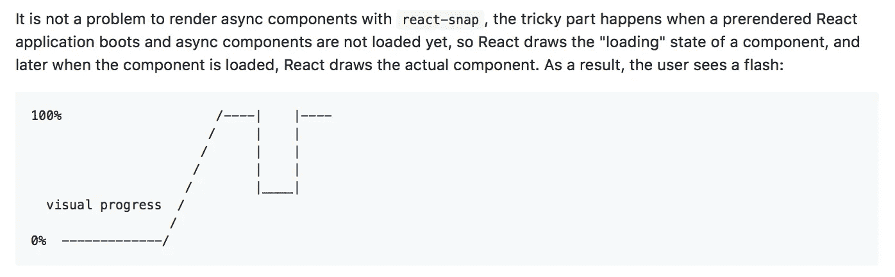

# 2019 年反应代码拆分

> 原文：<https://itnext.io/react-code-splitting-in-2019-9a5d2776c502?source=collection_archive---------3----------------------->

都 2019 年了！每个人都认为他们知道代码分解。所以——让我们仔细检查一下！


[http://www.pacesettersinitiative.org/broken-pieces/](http://www.pacesettersinitiative.org/broken-pieces/)

# 代码拆分代表什么？

简而言之，代码拆分就是不加载整个元素，而是只加载其中的一部分。当你阅读这个页面时，你不必加载整个网站。当您从数据库中选择单个行时，您不必获取所有数据。*明显的*？代码分割也很明显，它不仅仅是关于你的数据，而是你的代码。

# 是谁在做代码拆分？

反应。懒惰？不，它只是在使用它。代码拆分是在捆绑级别完成的——网络包、包，或者在“本机”esm 模块的情况下，只是您的文件系统。代码分割只是文件，你可以“以后”在某个地方加载的文件。

# 谁在使用代码分割？

`React.lazy`正在使用它。只是**使用**你的捆绑器的代码分割。在渲染时调用`import`。仅此而已。

# React-loadable 是什么意思？

`React.lazy`取而代之。并且提供了更多的功能，像`Suspense`来控制加载状态。所以——用`React.Lazy`代替。

> 是的，就这些。感谢您的阅读，祝您愉快。

# 为什么文章还没写完？

嗯……有一些关于 React.lazy 和代码分割的灰色地带，我忘了说了。

# 灰色区域 1–测试

测试“React.lazy”并不容易，因为它的*异步特性*。`mount(MyLazyComponent)`的结果只会是“空”，只要 `MyLazy`后面的`Component`、*，就是**还没有加载。****即使是——`import`返回，`lazy`接受，**承诺**，总是在**下一个滴答**执行。所以——你永远不会在**当前节拍**中得到分量。这是法律！***

```
const LazyComponent = lazy(() => import('/path/to/dynamic/component'));
const Fallback = () => <div />;
const SuspenseComponent = () => (
    <Suspense fallback={<Fallback />}>
      <LazyComponent />
    </Suspense>
);const wrapper = mount(<SuspenseComponent />)
expect(wrapper.find('Fallback')).to.have.lengthOf(1)
expect(wrapper.find('DynamicComponent')).to.have.lengthOf(0)
// ^ not loaded**await wrapper.waitUntilLazyLoaded()**expect(wrapper.find('Fallback')).to.have.lengthOf(0)
expect(wrapper.find('DynamicComponent')).to.have.lengthOf(1)
// ^ loaded!
```

**建议的解决方案？你可能不相信，但建议的解决方案是使用**同步标签**。**

**[](https://github.com/facebook/react/pull/14626) [## gaearon Pull 请求#14626 facebook/react 支持为 lazy()同步名称

### 为什么不呢？目前，由于竞争条件(状态设置为“已解决”,但是……,它们会因一个令人困惑的错误而失败

github.com](https://github.com/facebook/react/pull/14626) 

```
const LazyText = lazy(() => ({
   **then**(cb) {   
      cb({default: Text});
      // this is "sync" thenable
   },
})); const root = ReactTestRenderer.create(
  <Suspense fallback={<Text text="Loading..." />}>          
     <LazyText text="Hi" /> // this lazy is not very lazy
  </Suspense>,
);
```

将导入函数转换成记忆的同步名称并不困难。

```
const syncImport = (importFn) => {
   let preloaded = undefined;
   const promise = importFn().then(module => preloaded = module);
   // ^ "auto" import and "cache" promise      return () => preloaded ? { then: () => preloaded } : promise;
   // ^ return sync thenable then possible
}const lazyImport = isNode ? syncImport : a => a; 
// ^ sync for node, async for browserconst LazyComponent = React.lazy(lazyImport(() => import('./file'));
```

# 灰色区域 2–SSR

> 如果你不需要 SSR 请继续阅读文章！

`React.lazy`是 SSR 友好的。但是它需要`Suspense`才能工作，`Suspense`是**而不是**服务器端友好的。

有两种解决方案:

*   把`Suspense`换成`Fragment`，只是**模仿**出来。然后-使用改变版本同步`thenable`使懒惰也同步。

```
import React from 'react';const realLazy = React.lazy;
React.lazy = importer => realLazy(syncImport(importer));
React.Suspense = React.Fragment; // :P// ^ React SSR just got fixed.
```

这是一个很好的选择，但是它对客户端不太友好。为什么？让我们定义第二种可能的解决方案:

*   **使用专门的库**来跟踪使用过的脚本、组块和样式，并在客户端加载它们(尤其是样式！)在进行水合反应之前。否则——你会呈现出空洞，而不是代码分离的组件。再一次，你没有加载你刚刚分割的代码，所以你不能渲染任何你将要渲染的东西。

## 看看代码分割库

*   [通用组件](https://www.npmjs.com/package/react-universal-component)——最古老且仍可维护的库。它“发明”了代码分割，并教会了 Webpack 代码分割。
*   [React-loadable](https://www.npmjs.com/package/react-loadable)–**非常受欢迎，但是没有维护的库。让代码吐槽成为一件流行的事情。问题是封闭的，所以周围没有社区。**
*   可加载组件–一个功能完整的库，使用起来很愉快，拥有最活跃的社区。
*   [导入组件](https://www.npmjs.com/package/react-imported-component)–单个库，不绑定到 Webpack，即能够处理包裹或 esm。
*   [React-async-component](https://www.npmjs.com/package/react-async-component)–已经死了的库(但仍然很流行)，它对代码分割、自定义 React 树遍历和 SSR 的所有方面都产生了重大影响。
*   *另一个库—****有*** *许多库，其中许多没有通过 Webpack evolution 或 React 16——我没有在这里列出它们，但是如果你知道一个好的候选库——就给我发邮件。*

# 选哪个图书馆？

它很简单——不是反应式加载的——它很难维护，而且已经过时，即使它仍然很流行。*(再次感谢你推广代码分割)*

*   可加载组件–可能是一个非常好的选择。它写得很好，积极维护，支持开箱即用的一切。支持“全动态导入”，允许你根据给定的道具导入文件，但是*不可类型化*。**支持暂停**，所以可以替换`React.lazy`。
*   **通用组件**——实际上是完全动态导入的“发明者”——只要**他们在 Webpack** 中实现了它。还有许多其他低层次的东西，像 *css 语块、报告语块和其他语块*–**他们做到了**。这个库的作者也是 webpack 团队的成员。我会说——这个库有点硬，有点不太用户友好。可加载组件文档是无与伦比的。如果不使用这个库，那么阅读文档是值得的——有很多细节你应该知道…
*   **React-imported-component**–有点*古怪*。它是 *bundler 独立的*，所以它永远不会坏(没有什么可坏的)，可以与 Webpack 5 和 55 一起工作，但是**有一个成本**。不支持完全动态导入，如`React.lazy`，因此是可类型化的。另外**支持悬念**。在 SSR 上使用`synchronous thenables`。它也有完全不同的 CSS 方法，和完美的**流渲染**支持。

也许解释这个库的“成本”更好——简而言之——它可能会推迟 TTI(交互时间)。

SSR 期间的“普通”库会将所有使用过的脚本添加到页面主体，并且您将能够**以并行方式**加载所有脚本，并且一旦它们都准备好了，就“水合”您的应用程序。

> TTI 会是`max(mainTime, chunk1Time, chunk2Time)`

`imported`是“bunder-independent”，而**不知道**要加载的文件名。因此，它将首先等待主包加载，然后从主包内部调用原来的“`imports`”，让`bundler`加载块，就像在简单的`React.lazy`中一样。这是一个非常可靠的解决方案，但是，你必须先装载主捆扎机。

> TTI 会是`mainTime + max(chunk1Time, chunk2Time)`

而且，说实话，^that^可能只比 t43 慢两倍 t44。

除了一些实现细节——列出的库在质量或受欢迎程度上没有区别，我们都是好朋友——所以用心挑选一个吧。

[](https://github.com/smooth-code/loadable-components) [## 平滑代码/可加载组件

### 反应代码分裂使✂️✨.变得容易通过在…上创建帐户，为平滑代码/可加载组件的开发做出贡献

github.com](https://github.com/smooth-code/loadable-components) [](https://github.com/theKashey/react-imported-component) [## kashey/react-导入组件

### 适用于任何延迟组件的独立于 Bundler 的解决方案，可实现更好的 SSR、代码分割和 React-Hot-Loader。没有✨…

github.com](https://github.com/theKashey/react-imported-component) [](https://github.com/faceyspacey/react-universal-component) [## 面空间/反应通用组件

### 🚀React 通用组件的最终答案:同步 SSR +代码拆分…

github.com](https://github.com/faceyspacey/react-universal-component) 

# 灰色区域 3–混合渲染

SSR 是个好东西，但是你知道很难。小项目可能希望有一个 SSR——有很多理由需要它——但不想建立和维护它。

> SSR 可能会非常非常难。如果你想快速取胜，试试 razzle 或 Next.js。

因此，SSR 最简单的解决方案，尤其是简单的 SPA，应该是**预渲染**。比如在浏览器中打开你的 SPA，点击“保存”按钮。比如:

*   [React-snap](https://github.com/stereobooster/react-snap) —使用[木偶师](https://github.com/GoogleChrome/puppeteer)在“浏览器”中渲染你的页面并保存结果
*   Rendertron——做同样的事情，但是以不同的方式(在谷歌云中)。

预渲染是没有“服务器”的“SSR”。是 SSR 使用客户端。神奇！开箱即用… …但不是为了代码分离。

所以——您只需在浏览器中呈现您的页面，保存 HTML，并请求加载相同的内容。但是**服务器端特定代码**(收集所有使用过的块)没有被使用，因为**没有服务器**！



反应快照文档

在上一部分中，我指出了在收集关于使用的块的信息方面绑定到 webpack 的库——它们根本不能处理混合渲染。

> react-snap 部分支持可加载组件版本 2(与当前版本 5 不兼容)。支持没有了。

可以处理这种情况，只要它不受捆绑者/一方的约束。所以没有区别——不管是 SSR 还是 Hybrid——它甚至可以在混合模式下工作，但只适用于`react-snap`可以提供的混合模式，只要它为*“状态水合”*提供一些钩子，而`rendertron`只是*渲染一切*。

> 写这篇文章时发现了`react-imported-componen`使用 react-snap 的能力，在 — [见示例](https://github.com/theKashey/react-imported-component/tree/master/examples/hybrid/react-snap)之前**并不知道。这很容易。**

这里你不得不使用另一个解决方案，它只是**垂直于**所有其他的库。

## 反应预渲染组件

这个库是为*部分水合*而创建的，可以部分再水合你的应用，保持其余部分仍然*脱水*。它适用于 SSR 和混合渲染器，没有任何区别。

这个想法很简单:

*   在 SSR 期间——渲染组件，用包装
*   在客户端——找到那个 div，使用`innerHTML`,直到`Component`准备好替换*死的* HTML。
*   您不必加载，并等待带有分割组件的块加载到`"NOT render a *white hole* instead of it"`——使用预先呈现的 HTML。你从服务器上得到的代码已经包含了你需要显示的所有 HTML。这就是为什么我们必须在`hydrate`之前等待所有的块加载——以匹配服务器渲染的 HTML。这就是为什么我们可以使用服务器渲染的 HTML 片段，直到客户端没有准备好。

> 这就是为什么我们必须在 hydrate 之前等待所有数据块加载完毕，以匹配服务器呈现的 HTML。这就是为什么我们可以使用服务器渲染的 HTML 片段，直到客户端没有准备好——它相当于我们只准备生产的一个。

```
import {PrerenderedComponent} from 'react-prerendered-component';const importer = memoizeOne(() => import('./Component'));
// ^ it's very important to keep the "one" promiseconst Component = React.lazy(importer); 
// or use any other library with ".prefetch" support
// all libraries has it (more or less)const App = () => (
  <PrerenderedComponent live={importer()}> 
   {/* ^ shall return the same promise */ }
    <Component /> 
   {/* ^ would be rendered when component goes "live" */ }
  </PrerenderedComponent>
);
```

还有另一篇关于它的文章，以前写的，没有混合渲染的想法:

[](https://medium.com/@antonkorzunov/react-server-side-code-splitting-made-again-a61f8cbbd64b) [## React 服务器端代码拆分已完成..又

### React 代码拆分在一年前就成为了一件事。从那时起，我们正在寻找新的方法来代码分割和延迟组件…

medium.com](https://medium.com/@antonkorzunov/react-server-side-code-splitting-made-again-a61f8cbbd64b) 

# TLDR？

*   不要使用 react-loadable，它不会增加任何有价值的价值
*   懒惰是好的，但是太简单了。
*   SSR 是一件很难的事情，你应该知道
*   混合木偶师驱动的渲染是一件事。有时甚至更难的事情。

请将 kudos 发送至:

[伯格·格雷格](https://medium.com/u/2210cd491fe0?source=post_page-----9a5d2776c502--------------------------------) —可加载组件作者

Sean Matheson—react-async-component(即使他们有点死)

詹姆斯·吉尔摩和[扎克·杰克森](https://medium.com/u/9ef1379caffc?source=post_page-----9a5d2776c502--------------------------------)——通用部件的创造者

[Anton Korzunov](https://medium.com/u/742f2d568062?source=post_page-----9a5d2776c502--------------------------------) —针对 react-imported 和 prerendered 组件

以及所有那些发明新方法和新原则的人，他们使我们的生活有时更容易，有时更困难。

> 还在为 React 高兴懒？
> 
> 很酷，但我们必须更深入。**