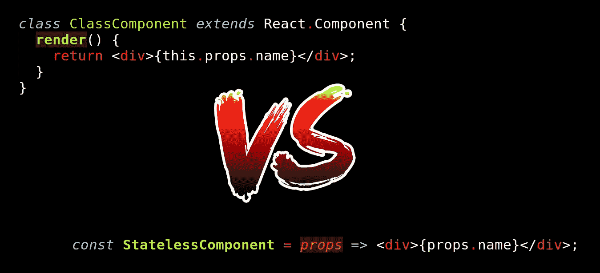
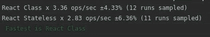

# React:类组件与功能组件

> 原文：<https://itnext.io/react-component-class-vs-stateless-component-e3797c7d23ab?source=collection_archive---------0----------------------->



[*点击这里在 LinkedIn* 上分享这篇文章](https://www.linkedin.com/cws/share?url=https%3A%2F%2Fitnext.io%2Freact-component-class-vs-stateless-component-e3797c7d23ab)

大多数新的 react 开发人员通常会问这个问题:有什么不同，我应该使用哪一个？在本文中，我们将尝试了解基本的区别以及您应该使用哪一种。我们开始吧。

首先，我们需要了解这两个组件是什么:

一个**功能性**(又名**无状态**)组件只是一个普通的 javascript 函数，它将 props 作为一个参数并返回一个 react 元素。

```
const MyStatelessComponent = props => <div>{props.name}</div>;
// without JSX
const MyStatelessComponent = props => React.createElement('div', null, props.name);
```

无状态组件没有状态(很明显，不是吗？)，意思是你够不到里面的‘this . state’。它也没有生命周期，所以你不能使用 componentDidMount 和其他[钩子](https://reactjs.org/docs/react-component.html)。

当我说它应该返回一个 react 元素时，你可能还不清楚。React 元素是一个有两个属性的对象(实际上更多，但是我们现在只对两个属性感兴趣):类型(字符串)，属性(对象)。我们的无状态组件的元素如下所示:

```
{
   type: 'div',
   props: {
     children: props.name,
   }
}
```

当 react 渲染我们的无状态组件时，它所需要做的只是调用 MyStatelessComponent 函数并在那里传递属性。就是这样。

组件类稍微复杂一点。它有一个状态，生命周期挂钩，它是一个 javascript 类，这意味着 React 创建它的实例。React 应该初始化组件类，以便调用生命周期挂钩、调用构造函数、初始化状态等等。

```
class MyComponentClass extends React.Component {
  render() {
    return <div>{this.props.name}</div>;
  }
}
```

这是我们的无状态组件看起来的样子，如果它被写成一个组件类的话。React 希望它从其呈现函数中返回一个 react 元素。如果我们比较 render 函数返回的内容和无状态组件函数返回的内容，我们会发现这两个元素是相同的。

现在我们知道有什么区别了，那么我们应该用哪个呢？

我们知道创建一个类的实例比调用一个函数花费更多的时间，对吗？如果我们渲染 10000 个无状态组件和类组件的元素会怎么样？哪一个会更快？我很惊讶，因为这两个渲染的渲染时间没有区别。其实是有的，只是微不足道，总是不一样。

[测试](https://jsfiddle.net/69z2wepo/136096/)。



它没有我们预期的那么快，但是还有另一个区别——代码量。如果对于一个无状态组件代码，在将其转换为 [ES5](https://babeljs.io/repl/) 后看起来是这样的:

```
var MyStatelessComponent = function MyStatelessComponent(props) {
  return React.createElement(
    "div",
    null,
    props.name
  );
}
```

组件类应该是这样的:

```
var _createClass = function () { function defineProperties(target, props) { for (var i = 0; i < props.length; i++) { var descriptor = props[i]; descriptor.enumerable = descriptor.enumerable || false; descriptor.configurable = true; if ("value" in descriptor) descriptor.writable = true; Object.defineProperty(target, descriptor.key, descriptor); } } return function (Constructor, protoProps, staticProps) { if (protoProps) defineProperties(Constructor.prototype, protoProps); if (staticProps) defineProperties(Constructor, staticProps); return Constructor; }; }();function _classCallCheck(instance, Constructor) { if (!(instance instanceof Constructor)) { throw new TypeError("Cannot call a class as a function"); } }function _possibleConstructorReturn(self, call) { if (!self) { throw new ReferenceError("this hasn't been initialised - super() hasn't been called"); } return call && (typeof call === "object" || typeof call === "function") ? call : self; }function _inherits(subClass, superClass) { if (typeof superClass !== "function" && superClass !== null) { throw new TypeError("Super expression must either be null or a function, not " + typeof superClass); } subClass.prototype = Object.create(superClass && superClass.prototype, { constructor: { value: subClass, enumerable: false, writable: true, configurable: true } }); if (superClass) Object.setPrototypeOf ? Object.setPrototypeOf(subClass, superClass) : subClass.__proto__ = superClass; }var MyComponentClass = function (_React$Component) {
  _inherits(MyComponentClass, _React$Component);function MyComponentClass() {
    _classCallCheck(this, MyComponentClass);return _possibleConstructorReturn(this, (MyComponentClass.__proto__ || Object.getPrototypeOf(MyComponentClass)).apply(this, arguments));
  }_createClass(MyComponentClass, [{
    key: "render",
    value: function render() {
      return React.createElement(
        "div",
        null,
        this.props.name
      );
    }
  }]);return MyComponentClass;
}(React.Component);
```

差别挺大的吧？当然，在通过任何构建器(webpack，gulp，grunt)运行后，它会被缩小，但即使这样，差异仍然很大:1.2kb 对 97 字节。

现在我们知道了性能方面的差异，但是我们还需要知道其他的差异吗？为什么有两种 React 组件类型而不是一种？现在让我们试着回答这个问题:

什么时候应该使用无状态组件:

无状态组件(或哑组件)只是状态的表示(道具)。它只能渲染道具，它应该只做这个。一个很好的例子是一个按钮组件:假设我们有一个按钮需要特别设计，所以我们创建一个按钮无状态组件，如下所示:

```
const Button = props => (
   <button className="our_button" onClick={props.onClick}> {props.label}
   </button>
);
```

你不需要在一个按钮组件中有一个状态、生命周期挂钩或任何内部变量，你只需要简单地呈现它们。

什么时候应该使用类组件:

当你需要处理状态时，应该使用一个类组件，它可能是 redux、relay 或内部 react 状态。每当您需要在呈现组件之前获取数据时，您都应该在 componentDidMount 中调用一个 fetch data 函数，以确保您的数据会尽快被获取。你不能在渲染函数中使用任何副作用，所以你应该在生命周期钩子中使用副作用。所以规则应该是:如果你的组件需要一些数据，而这些数据不能作为一个属性传递，那么使用类组件来获取这些数据。如果您需要在组件(可扩展块)中保存 UI 状态，那么在组件状态中保存该信息是一个好地方。

结论。简单回顾一下:一个功能组件没有状态，没有生命周期方法，很容易编写(普通函数)，一个类组件有状态，生命周期方法，React 每次渲染时都会创建一个类组件的实例。如果你不需要使用状态或生命周期，我会推荐你使用函数组件，但是如果你需要其中的一个(状态，生命周期方法)，我会建议你使用类组件。

如果你喜欢这篇文章，请鼓掌并分享:)