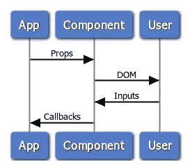

# 反应组件测试

> 原文：<https://itnext.io/react-component-testing-ee087a67cfef?source=collection_archive---------4----------------------->

> [点击这里在 LinkedIn 上分享这篇文章](https://www.linkedin.com/cws/share?url=https%3A%2F%2Fitnext.io%2Freact-component-testing-ee087a67cfef%3Futm_source%3Dmedium_sharelink%26utm_medium%3Dsocial%26utm_campaign%3Dbuffer)

在 ACL，我们有一个名为 acl-ui 的共享 React 组件库，帮助我们跨不同的云模块创建更加统一的用户体验。该项目主要由表示性组件组成，每个组件都包含自己的 CSS 文件，该文件包含所有特定于组件的样式。大多数组件也是完全受控的，所有状态管理都由消费应用程序负责。我们使用 React Storybook 在开发过程中呈现组件，并在内部网站上展示该库。

由于这些组件由多个应用程序使用，因此它们的行为符合预期非常重要。在测试它们的时候，我们使用了一种有点独特的方法。

# 我们的方法

测试任何软件组件的一般方法是

1.  将部件放在测试线束中

*   这基本上是一个隔离的环境，尽可能精确地模拟组件运行的真实环境。

2.通过面向公众的接口与组件交互

*   这个想法是测试组件的行为，而不是测试组件的实现。

3.验证实际行为是否与预期行为相同。

React 组件的运行环境是一个 web 浏览器，其面向公众的接口如下所示:

因此，我们的测试工具需要模拟 web 浏览器，并允许与面向应用程序和面向用户的界面进行交互。

模拟 web 浏览器最准确的方法是使用实际的 web 浏览器。在浏览器中自动化用户交互的最简单方法是使用基于 Selenium Webdriver 的工具之一。WebdriverIO (wdio)运行在 NodeJS 上，有一个易于使用的同步 API，这使它成为在我们的测试中模拟用户的完美工具。它使得选择元素和调用像`isVisible()`和`hasFocus()`这样的函数来验证用户“看到”什么变得很容易。并且还提供了类似`click()`和`setValue()`的功能来模拟用户“做”什么。

由于我们的项目只是一个组件库，所以没有 App。相反，我们为每个组件创建一个故事书故事，它模拟一个应用程序，用一组给定的道具呈现组件。这已经提供了我们的测试工具需要做的很多事情。如果没有进一步的增强，我们可以用不同的 prop 值创建故事，然后使用 wdio 来验证显示给用户的内容。我们甚至可以只创建一个故事，并使用[故事书旋钮插件](https://github.com/storybooks/storybook/tree/master/addons/knobs)来允许我们在飞行中改变道具。

剩下的工作就是验证是否调用了正确的回调来响应来自 wdio 的用户输入。问题是这些回调没有暴露给 wdio。幸运的是，除了所有的用户交互函数，wdio 还提供了一个非常强大的函数`browser.execute()`，它将在浏览器中执行任何给定的脚本。公开回调的一个简单方法如下。

我们已经传递了一个 stub `onClose()`回调函数，它只是在全局窗口对象被调用时设置一个属性。(注意:Storybook 在自己的 iframe 中呈现每个故事，每个 iframe 都有自己的私有`window`对象。)然后，我们可以使用如下所示的`browser.execute()`来验证这个值是在我们的测试脚本中设置的。

我们的测试工具现在能够公开组件的面向应用程序和面向用户的界面，这是一个很好的开始，但是仍然有很大的改进空间。代替简单的回调存根，可以使用专门构建的模拟库来传递实际的函数 spy。既然我们使用了`window`对象来公开回调，我们能不能也用它来公开可以动态改变的输入属性呢？这将避免我们不得不创建具有不同属性值的单独的故事，或者使用故事书旋钮，这会带来很多开销。此外，我们是否可以避免为每个故事手动写出所有这些功能？

Storybook 提供了一个有用的方法`addDecorator`，它可以用来将主要故事包装在父组件中。我们决定编写一个简单的装饰器，可以用来向`window`对象公开任何输入和回调属性。装饰器被称为`windowHandles`，用法如下。

每个属性被声明为输入属性或回调属性，并且可以选择为输入属性传递一个默认值。然后装饰者在`window.<componentName>.<propName>`展示每个道具。输入属性被公开为标准属性，可以简单地对其赋值以更新组件。使用 Sinon.js 模拟回调属性，函数 spy 是在窗口对象上公开的。人们现在可以在 Chrome 中查看这个故事，并通过在调试工具控制台中输入`window.SidePanel.isOpen = true`打开侧面板。

使用上面的故事，测试可以编写如下:

其中页面对象定义为:

结果是可读性很好的测试脚本，清楚地记录并验证了每个组件的预期行为。一旦故事书故事和页面对象被创建，编写测试实际上只需要很少的努力，完整的功能覆盖是很容易实现的。

这个解决方案的缺点是执行时间。一个很大的时间浪费是必须在每次测试之间刷新页面，以防止测试相互影响。为了解决这个问题，我们在`windowHandles`中添加了一个`reset()`函数，当被调用时，它会重新创建所有回调间谍，将所有输入属性恢复到它们的初始值，并重新呈现组件。在用`sidePanel.reset()`替换了`browser.refresh()`之后，测试仍然没有标准单元测试运行得快，但是对于我们的需求来说还是可以接受的。

我们的`windowHandles`装饰器的源代码可以在[这里](https://github.com/jeremyhewett/storybook-windowhooks/blob/master/index.js)获得。

# 为什么不直接用 Jest 快照呢？

编写测试的主要好处之一是定义和验证行为。这有助于开发人员考虑组件的不同行为，并为未来的开发人员提供一种文档形式。测试甚至可以在行为实现之前编写，从而产生 TDD 工作流。

以上都不适用于 Jest 快照。这是因为 Jest 快照纯粹用于回归测试，不涉及定义任何行为。因此，它们不提供组件实际工作的任何验证。即使回归测试工具是你正在寻找的，Jest 快照也不是最好的。它使用起来很快，没有痛苦，这使它非常受欢迎，但它非常脆弱，因为它将原始 HTML 与组件的实现细节(标记名、元素层次结构等)紧密结合在一起。).这会导致测试失败，即使组件实际上仍然工作良好。像 [Screener](https://screener.io/) 这样的工具有更智能的比较策略。Screener 是一个基于浏览器的可视化回归测试工具，它不那么脆弱，因为它的比较是基于组件的渲染输出。

总之，Jest 快照可能有它的位置，但肯定不是作为主要的组件测试工具。

# 好吧，那酵素呢？

Enzyme 是一个很好的工具，实际上是我们的第一选择(我们仍然在一些组件测试中使用它),因为它在很多测试场景中工作得非常好。Enzyme 能够渲染 React 组件，然后轻松提取关于渲染输出的信息，如文本内容和类名。它还允许模拟诸如“点击”、“改变”等事件。这听起来类似于 wdio API，因为它就是，但是有一些关键的区别。

Enzyme 不是为在真实的浏览器环境中使用而设计的，而是为在模拟浏览器中使用而设计的，比如 JSDOM。因此，它的 API 更加有限，不包括我们在上面使用的像`isVisibleInViewPort`这样的函数。这是因为没有布局引擎，因此无法确定元素是否可见以及在视口中的位置。对于很多测试场景来说，这是完全可以接受的，但是对于一个表示组件库来说，浏览器呈现的内容是至关重要的。

酶还有其他问题。我们有几个组件利用了所谓的“门户”元素。这些是附加到父组件层次结构之外的 DOM 的元素。这在酶文档中的“常见问题”下解决，“像‘门户’这样的东西目前不能用酶直接测试”。对此有一个解决方法，但该解决方法涉及到从组件中手动公开门户元素，这意味着违反了封装原则，并且只有在您能够控制生成元素的代码的情况下才有可能，也就是说，如果第三方库生成门户元素，它将不起作用。

我们有时做的另一件事是在`document`或`window`上添加事件监听器。例如，为了关闭模式面板或侧面板而监听退出键。我们需要在全球范围内倾听这一事件，我们需要能够测试它。这对于酶来说是不可能的。查询`:focus`和`:hover`状态也是不可能的。事实上，在 React 范围之外发生的任何事情都很难或者不可能用酶来测试。

# 结论

理想的测试套件应该

1.  保证行为和视觉的正确性，
2.  执行起来不需要几秒钟，
3.  不需要努力开发。

这些都是崇高的目标，它们之间往往有所取舍，因此，对于我们的组件库，我们选择优先考虑第一个目标。我们还希望有一个单一的测试框架，能够覆盖所有组件并在所有边缘情况下工作，因此所描述的解决方案最适合我们的需求。虽然完成最初的开发需要一些时间，但是编写测试实际上并不需要比其他方法更多的努力，所以我们也没有牺牲第三个目标。