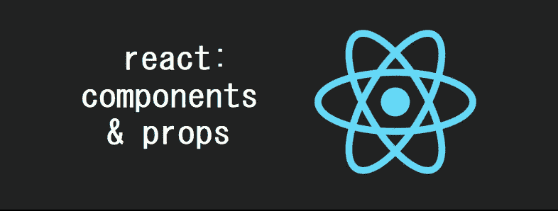

# 反应:组件和道具

> 原文：<https://itnext.io/react-components-props-db1db95c04c8?source=collection_archive---------6----------------------->



React 中的组件是独立的、可重用的 UI 片段。一个典型的网页可能由导航栏、内容区和页脚组成。在 React 中，我们将这些区域创建为组件(而组件又可能由其他组件组成！).它节省了代码重复&正如我们将看到的，允许巨大的灵活性。

另一种看待组件的方式类似于 JavaScript 函数。它们接收的不是参数，而是“道具”，然后返回 React 元素来构建我们在屏幕上看到的东西！

🤓*想了解最新的网站开发信息吗？*
🚀想要将最新的新闻直接发送到您的收件箱吗？
🎉加入一个不断壮大的设计师&开发者社区！

**在这里订阅我的简讯→**[**https://ease out . EO . page**](https://easeout.eo.page/)

# 成分

事实上，在 React 中，一切都是组件！即使是标准的 HTML 标签也是组件，它们是内置的，是默认添加的。

让我们来看一个例子:

```
import React from 'react'
import ReactDOM from 'react-dom'ReactDOM.render(<h1>I'm a component!</h1>, document.getElementById('myapp'))
```

这里我们使用 JSX 将`<h1>I'm a component!</h1>`插入到 id 为`myapp`的元素中。我们的`h1`被认为是一个组件，感谢`React.DOM`，事实上所有的 HTML 标签也是如此。你可以通过在浏览器控制台输入`React.DOM`来查看它们。

# 构建自定义组件

这很好，但是我们如何构建自己的组件呢？这是我们的 React 超越，它让我们能够通过组合我们自己的自定义组件来构建 UI。

我们可以用两种方式定义组件，现在让我们来看看每种方式:

## **功能组件**

函数组件实际上只是 JavaScript 函数:

```
function Greeting(props) {
  return <h1>Hello, {props.username}!</h1>;
}
```

使这个函数成为 React 组件的是，它接受“props”(或属性)作为带有数据的参数，然后返回 React 元素。

## 类别组件

ES6 类也可以用来创建组件:

```
class Greeting extends React.Component {
  render() {
    return <h1>Hello, {this.props.username}!</h1>;
  }
}
```

我们上面的两个代码示例是等价的——并且是创建组件的完全有效的方法。

直到最近，在 React 世界中，我们更频繁地使用类组件——因为类组件允许用它们自己的状态来定义组件(我将在下一篇文章中讨论状态！).

然而，随着 React Hooks 的出现，功能组件现在比以前强大得多，我们可能会看到这种趋势切换回来。

钩子超出了本文的范围！所以让我们继续组件和道具..

# 渲染组件

我们可以呈现表示 DOM 标签的元素:

```
const element = <div />;
```

我们还可以使用用户定义的组件来呈现我们的元素:

```
const element = <Greet username="Bruce" />;
```

当元素包含用户定义的组件时，它会将 JSX 属性作为对象传递给组件。在反应中这个物体就是我们所说的“道具”。

# 小道具

所以“道具”是我们的组件获得属性的方式。

让我们来看看实际情况:

```
function Greeting(props) {
  return <h1>Hello, {props.username}!</h1>;
}const element = <Greet username="Bruce" />;ReactDOM.render(
  element,
  document.getElementById('root')
);
```

这段代码将呈现“你好，布鲁斯！”在页面上。

这里发生了什么事？

*   用`<Greet username="Bruce" />`元素调用`ReactDOM.render()`。
*   React 调用以`{name: 'Bruce'}`为道具的`Greet`组件。
*   我们的`Greet`组件返回一个`<h1>Hello, Bruce!</h1>`元素作为结果。
*   React DOM 更新 DOM 以匹配`<h1>Hello, Bruce!</h1>`。

*注意:*始终以大写字母开始组件名称！因为 React 将以小写字母开头的组件视为 DOM 标签。

# 功能组件中的道具

应该注意的是，当处理有多个子组件的组件时(见下面的`h1`和`p`)，每个子组件都从父组件获得道具。

当使用一个函数组件时，props 是所有被传递的东西，它们可以通过添加`props`作为函数参数来获得:

```
const BlogPostInfo = props => {
  return (
    <div>
      <h1>{props.title}</h1>
      <p>{props.description}</p>
    </div>
  )
}
```

# 类组件中的道具

在类组件中，默认情况下会传递属性。它们可以作为组件实例中的`this.props`来访问。

```
import React, { Component } from 'react'class BlogPostInfo extends Component {
  render() {
    return (
      <div>
        <h1>{this.props.title}</h1>
        <p>{this.props.description}</p>
      </div>
    )
  }
}
```

将属性传递给子组件是在应用程序中传递值的一种很好的方式。组件要么保存数据(有状态)，要么通过它们的 props 接收数据。

# 额外学分…

现在我们知道了如何在组件中使用道具。让我们来看看我们可能会遇到的一些更常见的任务:

## 属性默认值

如果组件初始化时缺少任何值，我们需要提供一个默认值。可以指定默认值，如下所示:

```
BlogPostInfo.propTypes = {
  title: PropTypes.string,
  description: PropTypes.string
}BlogPostInfo.defaultProps = {
  title: '',
  description: ''
}
```

## 传递道具

当我们初始化一个组件时，我们像这样传递我们的属性:

```
const desc = 'My blog post description'

<BlogPostInfo title="My blog post title" description={desc} />
```

如果我们正在处理字符串，我们可以把我们的道具作为一个字符串传入(就像我们上面的‘title’一样)。否则，我们使用变量，正如我们将上述描述设置为`desc`一样。

## “儿童”道具

`children`道具与常规略有不同。它包含在组件的`body`中传递的任何值，例如:

```
<BlogPostInfo title="My blog post title" description="{desc}">
  More words
</BlogPostInfo>
```

在本例中，在`BlogPostInfo`中，我们可以通过`this.props.children`访问“更多单词”。

## 组件中的组件

组件可以在其输出中包含其他组件。

创建一个`MyApp`组件完全没问题，它可以多次呈现`Greet`:

```
function Greet(props) {
  return <h1>Hello, {props.username}!</h1>;
}function MyApp() {
  return (
    <div>
      <Greet name="Bruce" />
      <Greet name="Bethany" />
      <Greet name="Bilbo" />
    </div>
  );
}ReactDOM.render(
  <MyApp />,
  document.getElementById('root')
);
```

## 道具是只读的！

不管你的组件是声明为函数还是类组件，它永远不能修改自己的 props。请参见以下示例:

```
function sum(a, b) {
  return a + b;
}
```

这是一个“纯”函数，因为它不试图改变它的输入，并且对于相同的输入总是返回相同的结果。

“不纯”函数是指改变其自身输入的函数:

```
function withdraw(account, amount) {
  account.total -= amount;
}
```

反应过来，这是一个大忌！每一个组件都必须像一个纯函数一样工作。

我的下一篇文章将讨论 React 中的“状态”。有了状态，我们的组件能够改变它们的输出以响应触发器，比如用户动作或网络响应——而不违反这条规则。

***你准备好让你的 JavaScript 技能更上一层楼了吗？*** *今天就开始用我的新电子书吧！无论你是想学习你的第一行代码，还是想扩展你的知识面并真正学习基础知识..*[*JavaScript 掌握完全指南*](https://gum.co/mastering-javascript) *带你从零到英雄！*


*现已上市！👉*[https://gum.co/mastering-javascript](https://gum.co/mastering-javascript)

# 结论

我们走吧！我们已经介绍了构建组件的基础知识，以及如何将它们融入 React 应用程序的整体结构。我们还看到了如何使用属性来赋予组件属性。我们已经看了一些在使用组件和道具时可能会遇到的常见任务。

我希望这篇文章对你有用！你可以在 Medium 上[关注我](https://medium.com/@timothyrobards)。我也在[推特](https://twitter.com/easeoutco)上。欢迎在下面的评论中留下任何问题。我很乐意帮忙！

# 关于我的一点点..

嘿，我是提姆！👋我是一名开发人员、技术作家和作家。如果你想看我所有的教程，可以在我的个人博客上找到。

我目前正在撰写我的[自由职业完整指南](http://www.easeout.co/freelance)。坏消息是它还不可用！但是如果这是你可能感兴趣的东西，你可以[注册，当它可用的时候会通知你👍](https://easeout.eo.page/news)

感谢阅读🎉