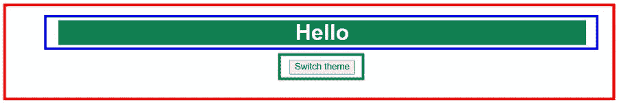
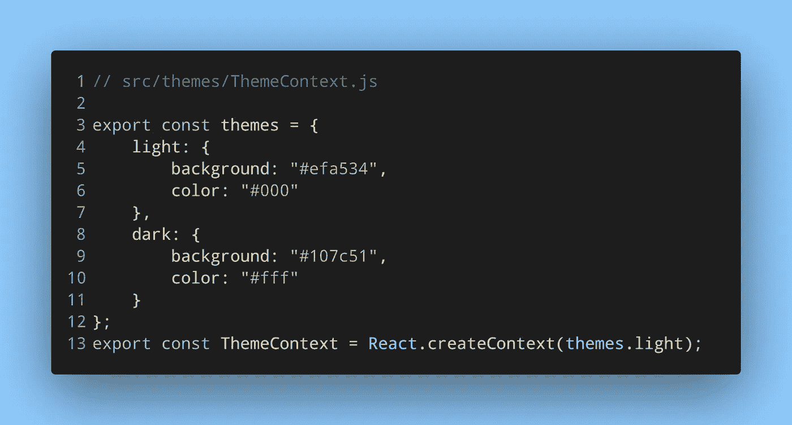
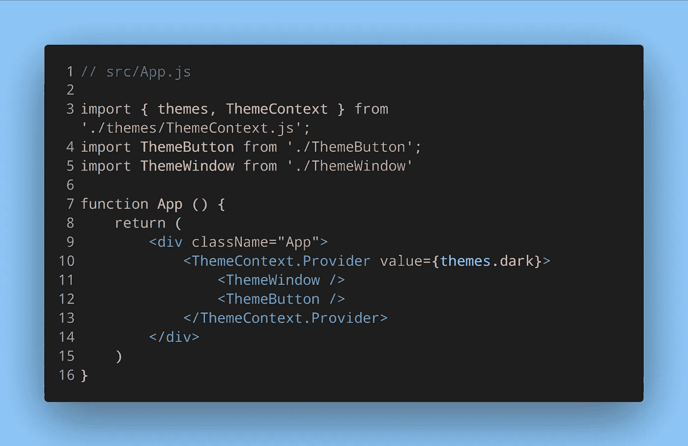
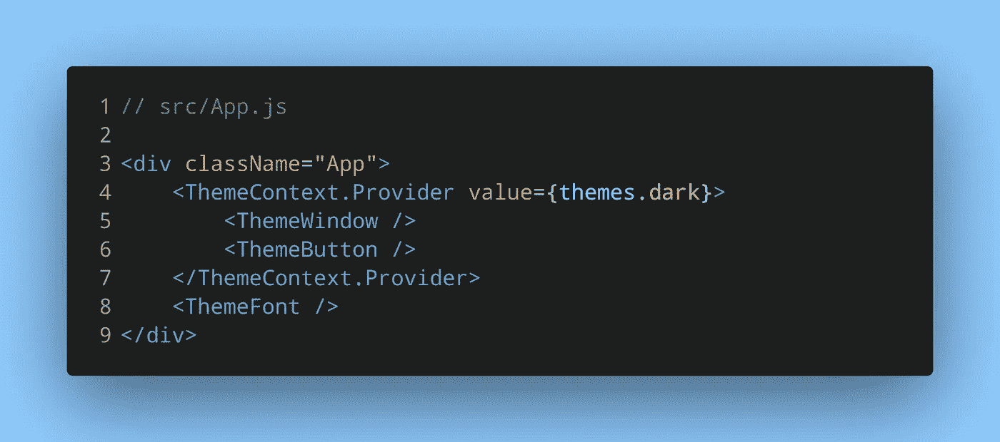
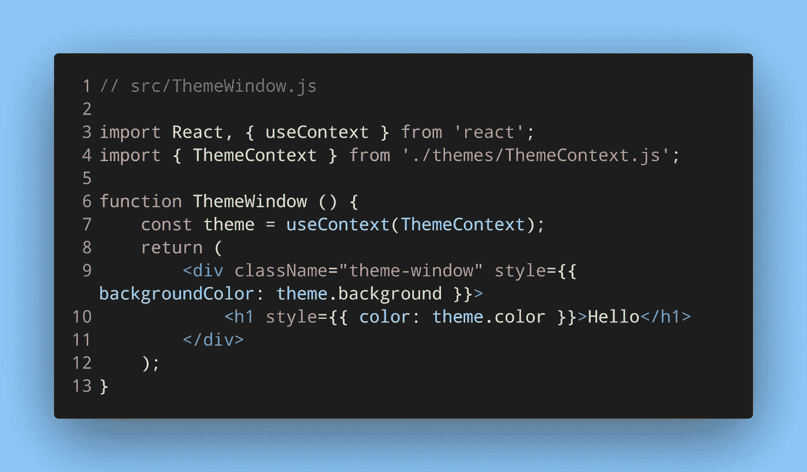

# React 上下文和钩子:传递数据的好方法

> 原文：<https://itnext.io/react-context-and-hooks-an-excellent-way-to-pass-data-26c3f48b9bf5?source=collection_archive---------0----------------------->

照片由[劳塔罗·安德烈亚尼](https://unsplash.com/@lautaroandreani?utm_source=medium&utm_medium=referral)在 [Unsplash](https://unsplash.com?utm_source=medium&utm_medium=referral) 上拍摄

# 什么是语境？

上下文基本上是一个 JavaScript 对象，可以有效地从一个父组件传递到几个子组件。Props 也可以向组件传递值。但是，如果需要将一个值传递给组件树深处的子组件，使用 props 意味着该值也会传递给不需要它的组件。或者，如果一个值是几个组件所需要的，那么 props 会使它变得困难。

这是一个很好的上下文用例。道具需要从一个组件传递到另一个组件。有了上下文，父组件提供值，需要它的子组件可以访问它。

# 用上下文和钩子传递值

让我们举一个常见的例子来说明上下文——主题。考虑以下用户界面:

在这里，带有红色边框的是主要的`App.js`组件。绿色边框的是一个叫做`ThemeButton.js`的组件，蓝色边框的是`ThemeWindow.js`组件。`App`组件将另外两个作为它的子组件。点击`ThemeButton`中的按钮将会在亮暗之间切换主题。主题的结果会在`ThemeWindow`中体现出来。

我们需要首先创建一个上下文，然后让`App`组件*为其子组件*提供一个值。子组件将*使用*这个提供的值。我们来设置一下。

# 1.创建上下文

可以在一个单独的文件中或者在`App`组件本身中创建一个上下文，但是为它创建一个单独的文件通常更好。因为取决于你的应用程序，你可能需要不同特性的多个上下文。因此，拥有单独的文件是很有用的。

创建一个新文件来保存上下文并将其导出:

创建上下文和主题对象

在这个文件中，我们导出两样东西——一个包含主题值的对象和我们的上下文。`createContext()`函数返回一个上下文对象。它接受一个类似于`useState`钩子的初始值参数。在这种情况下，灯光主题对象是`ThemeContext`的默认值。

# 2.用提供者组件传递值

既然已经创建了上下文，那么让我们将其添加到`App.js`中。

提供者组件是 React 在创建上下文对象时提供的东西

每个上下文对象(用`React.createContext()`创建)都有一个**提供者**组件。这个提供者组件应该被包装在所有将要访问`ThemeContext`的子组件周围。反过来，也有**消费者**的成分。如果你没有使用基于类的组件，你也可以使用`useContext`钩子。

您一定想知道为什么**亮**对象被用作默认值，但是提供者组件已经传递了**暗**对象。首先，Provider 组件中使用的`value`属性是 React 可以识别的属性，因此您不能对该属性使用不同的名称。

通过`value`道具传递的东西就是子组件消耗的东西。如果一个组件试图访问`ThemeContext`，但是在上面的树中没有**提供者**组件，它将使用上下文对象的默认值(light 主题)。

举个简单的例子，假设有第三个组件叫做`ThemeFont.js`。但是第三个组件没有包含在提供者组件中

ThemeFont 组件不在 Provider 组件的范围内

因为`ThemeFont`没有被提供者组件包装，所以它不会接收新值。虽然它仍然可以访问`ThemeContext`，但是它将接收默认值，也就是我们传递给`createContext`的值 light themes 对象。

> *不将需要访问上下文的组件包装在提供者组件中，仍然可以访问上下文的默认值。*

不过，你可能不会经常遇到这种情况。一个组件需要来自上下文的值，但是不能被包装在提供者组件中——这种情况很少见。

# 3.在子组件中使用上下文

让我们使用 React 钩子来消费所提供的上下文值。

与提供者组件类似，在创建上下文对象后，还有一个消费者组件可用。它可以用来代替 useContext

运行此应用程序，您会得到以下结果:

`ThemeWindow`当然有一个黑暗的主题。但是，切换主题的按钮不起作用。下一篇文章将演示如何更新通过上下文传递的值。

# 一些资源链接

*   [如何有效使用 React 语境](https://kentcdodds.com/blog/how-to-use-react-context-effectively)作者[肯特·c·多兹](https://twitter.com/kentcdodds)
*   [反应上下文公文](https://reactjs.org/docs/context.html)

*原载于 2022 年 1 月 14 日* [*我的博客*](https://niharraoteblog.netlify.app/intro-to-context) *。*