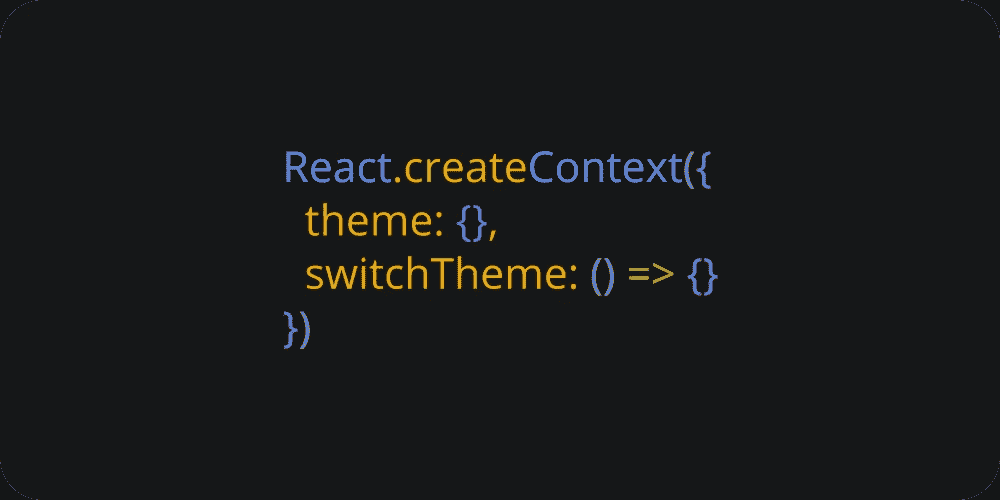
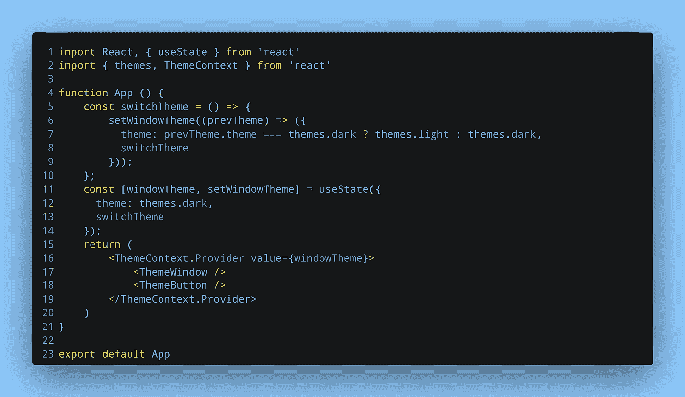
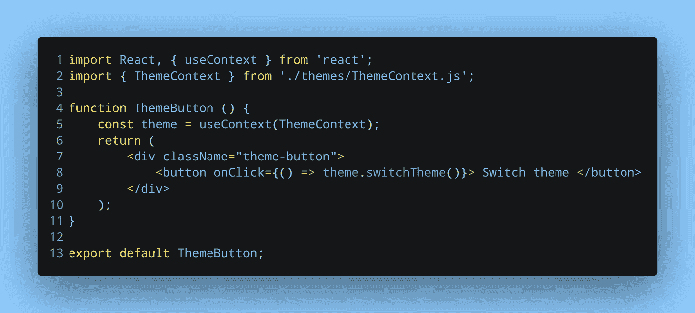
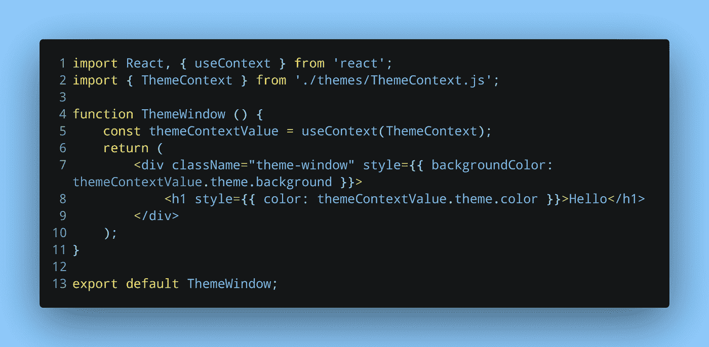

# React Context 和 Hooks:轻松传递数据和更新数据

> 原文：<https://itnext.io/react-context-and-hooks-pass-data-and-update-it-easily-d2f659cceab?source=collection_archive---------0----------------------->

封面图像

在[之前的文章](/react-context-and-hooks-an-excellent-way-to-pass-data-26c3f48b9bf5)中，我们研究了什么是上下文以及如何传递值。在本文中，我们将研究如何从子组件中更新上下文值。对于我们的主题示例，这意味着单击按钮将会在亮和暗之间切换主题。

# 更新上下文值

在上一篇文章中，我们通过提供者组件直接传递了主题。尽管该值被传递给了`ThemeButton.js`和`ThemeWindow.js`组件，但是我们不能更新该值。

为了在两种主题类型之间切换，我们还需要传递一个函数。这个功能将允许我们在两个主题之间切换。

所以我们需要通过 Provider 组件将这个函数和黑暗主题一起传递。为此，我们可以创建一个包含主题和功能的有状态对象。这种方式 React 可以跟踪主题，并在更新时执行必要的重新渲染。

创建有状态对象

这很简单。包含主题类型和函数的有状态对象通过提供者组件传递。虽然`ThemeWindow`组件只需要很小的改动，但是我们确实需要在`ThemeButton`组件中实现这个功能。

# 实现主题切换功能

实现这个函数不需要做什么特别的事情。按下按钮时调用它会切换主题。

向 ThemeButton 组件添加主题切换功能

就这么简单。点击该按钮，将执行`switchTheme()`功能。这将更新有状态值，从而触发重新渲染。最后，更新后的主题将呈现在`ThemeWindow`组件中。

反映 ThemeWindow 组件中的微小变化

# 包扎

这是上一篇关于 React 上下文的文章的结论。如您所见，React Context 是一个强大的工具。

然而，这个简单的例子并没有真正展示它的威力。在有几十个组件的复杂应用程序中，值和状态需要传递给几个不同的组件，React Context 将使这项工作比普通的 props 容易得多。

*原载于* [*我的博客*](https://niharraoteblog.netlify.app/update-context-from-child-component) *。*