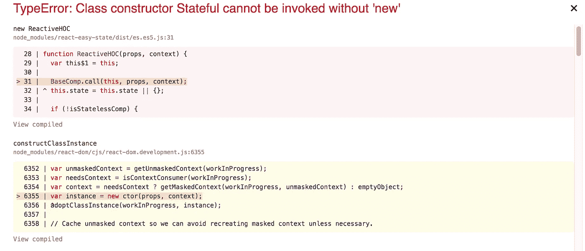

# 反应轻松状态 6

> 原文：<https://itnext.io/react-easy-state-6-3dafcb1d759b?source=collection_archive---------4----------------------->

## 妥协的故事

[Easy State](https://github.com/solkimicreb/react-easy-state) 是一个极简的基于代理的 React 状态管理工具，非常注重实用性而不是理论上的美观。它生来就有这种哲学，并将一直坚持下去。我小心翼翼地不让不必要的功能污染它；事实上，我认为这是功能完整的一年多了。我不得不不时调整一些东西来跟上潮流，并与你的反馈保持一致。版本 6 做了两个小的改变。两者都花了几分钟来实现，但却迫使我在事前进行长时间沮丧的头脑风暴会议。最后，我让步了，承认有时候妥协是不可避免的。


图片由 Noppakaw 提供

# 定量

在两次绘制事件之间多次重新渲染某物会影响性能，而且没有任何好处。这就是为什么大多数框架都有一些渲染批处理逻辑。

React 的状态更新自然是由`setState`批量处理的，所以它不用担心这么多。人们很少连续调用两个`setStates`但是它仍然有一个基本的批处理机制。单个**事件处理程序**中的多个`setState`调用不会导致多重渲染，尽管在其他地方会导致多重渲染。这是同步批处理的一种形式，以有限的范围换取透明的好处。

从应用程序开发人员的角度来看，它没有可见的工件，但是要实现它，框架开发人员必须完全控制状态更改的来源。框架必须在状态变化代码执行前阻塞渲染，并在它完成后立即释放它们。React 本身调用事件处理程序，因此它可以很好地控制它们的执行方式。它只是在调用事件处理程序之前停止渲染，并在完成后继续渲染。另一方面，它对许多其他任务源没有控制权，比如计时器和网络事件。作为对来自 API 的一些数据的响应，调用两次`setState`将导致两次渲染，因为 React 无法到达并批处理该代码。

有很多方法可以解除这种限制，但代价是失去透明度。异步批处理通过在第一次状态突变时停止重新呈现并在一段时间后使用`requestAnimationFrame`或`Promises`恢复它们来收集整个调用堆栈的呈现。这种方法不关心任务源，但是增加了一层异步性。从用户的角度来看，什么都不会改变，但应用程序开发人员必须小心避免错误的假设。看看 [Vue 的测试文件](https://vue-test-utils.vuejs.org/guides/#what-about-nexttick)中一个真实的例子。

通过为所有可能的任务源打补丁以获得对状态突变片段的控制，可以将同步和异步批处理的优点结合起来。这种方法保持了同步批处理的透明性，而没有将范围缩小到仅仅几个任务源。猴子打补丁感觉很脏，但它有一个工作的大尺度例子——有角。

我不知道 React 的发展方向，但我怀疑它会加入 Vue 和异步批处理。与此同时，虽然，我被迫去与猴子补丁。Easy State 不具备自然`setState`批处理的舒适性，而且它也负担不起在其当前同步批处理之上添加一个异步层。因此，我在版本 6 中用批处理逻辑修补了最常见的任务源，以避免不必要的渲染。实际上，它的意思是这样的。

```
import { store, view } from 'react-easy-state'

const clock = store({ time: new Date() })// this will cause only one render per second, right after the callback function finished running
setInterval(() => {
  clock.time = new Date()
  clock.time = new Date()
}, 1000)

const ClockView = view(() => <div>clock.time.toString()</div>)
```

> 当 React 发布其新的异步批处理行为时，Easy State 自己的批处理将被弃用，并被删除。

# 默认为 ES6

Easy State 基于不可多填充的 ES6 代理，但我仍然不得不以透明的 ES5 格式发布了整整一年。相当愚蠢。

如今一个前端开发人员的生活不仅仅是编码和放到互联网上。在这两者之间，他们运行捆绑、透明和缩小的构建过程。如果这些工具中的任何一个不支持 ES6，构建过程就会失败，代码永远不会到达互联网，即使目标浏览器支持它。在这种情况下，薄弱环节是一个迷你丑八怪。它被广泛使用，但在 ES6 方面赶上其他工具已经太晚了，这迫使我在一个 transpiled ES5 捆绑包中发布不兼容 ES5 的 Easy State。这两个包具有相同的功能和大致相同的性能，所以坚持 ES5 应该没问题。但是它不是…在 ES5 和 ES6 类之间有一个不兼容性。

比方说，你想创建一个 ES6 及以上版本的新应用，这在当今并不罕见。您可以导入 transpiled ES5 Easy State 包，并在您的 ES6 代码中使用它，每个包都有自己的老式或新的类实现。当你试图用 ES6 类扩展 ES5 类时，问题就出现了。



在这种情况下，强制的`super()`调用会破坏应用程序。我认为当只有 ES6 的应用程序成为主流时，这个问题会更频繁地出现，研究让我得出结论，这无法修复或正确转换。如果你认为你能解决这个问题，请发表评论！

长话短说，我必须在为我的前瞻性 ES6 用户和使用旧工具链的用户打破体验之间做出决定。我的最佳选择是监控用户群和前端工具链的状态，并决定何时切换。版本 6 最终默认为 ES6 版本，同时保留了一个选项[在必要时手动选择旧的 ES5 版本](https://github.com/solkimicreb/react-easy-state#alternative-builds)。

# 结论和未来

我倾向于发现自己越来越多地处于这些不完美的情况中，我希望分享它们可以帮助其他人快速做出决定，而不是无休止的令人沮丧的大脑崩溃。有时候我也需要这种推动来放下事情。

半年多来，我一直在开发一个新的 React 库，它给了代理一些令人兴奋的新用途。我被一些艰难的决定所阻碍，但希望在不远的将来，我能给你们带来一些令人兴奋的消息。

感谢阅读！