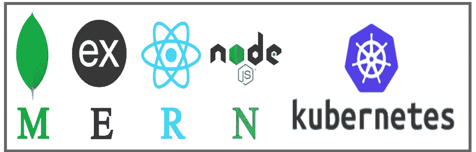
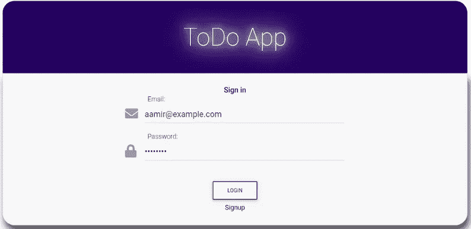
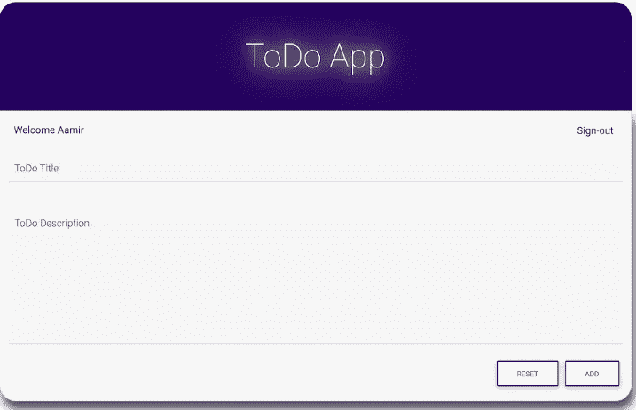
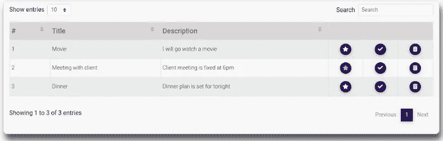
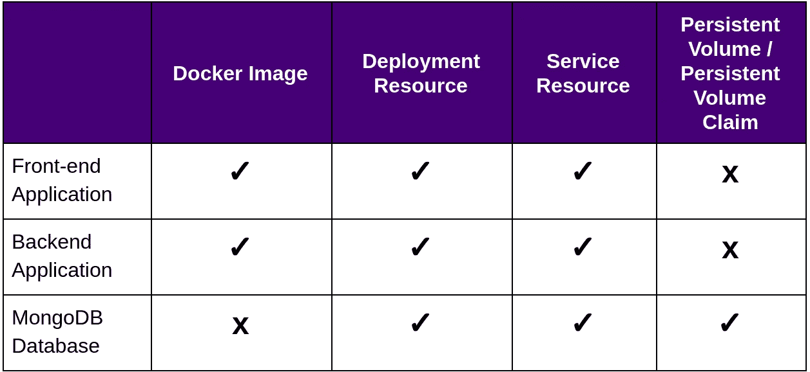
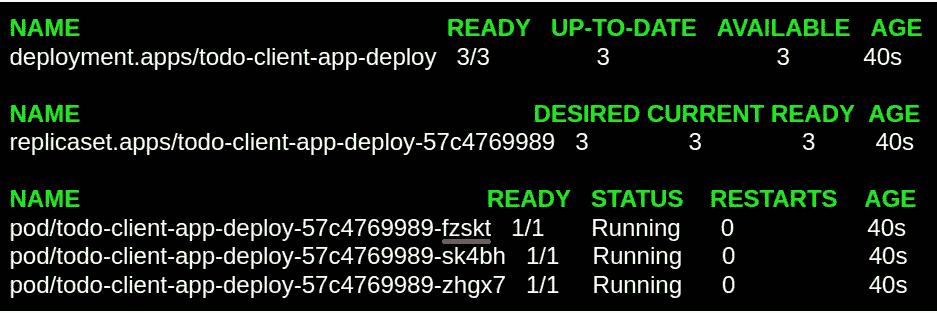
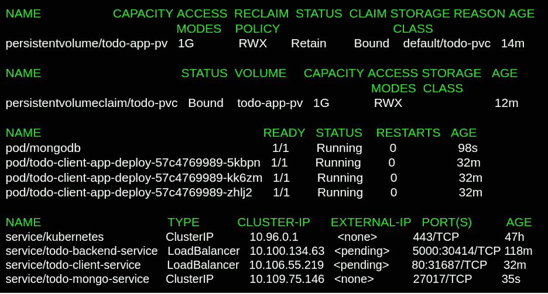
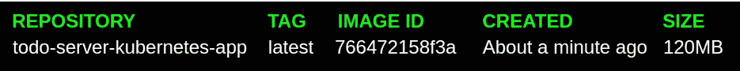

# Kubernetes 上基于 React、Express、Node Js 和 MongoDB (MERN 堆栈)微服务的应用部署

> 原文：<https://itnext.io/react-express-node-js-and-mongodb-mern-stack-microservices-based-application-deployment-on-ec4607cec74d?source=collection_archive---------0----------------------->



ubernetes 是最近的热门话题，许多大公司要么已经将其基础设施转移到 Kubernetes，要么计划很快这样做。Kubernetes 已经成为最强大的开源容器编排工具，作为任何云的操作系统，它都变得越来越重要。本文将一步一步地帮助我们如何将一个具有**前端→后端→数据库层**的基本的基于微服务的应用作为独立的实体部署到 Kubernetes 集群，并使它们可伸缩。

为此，我创建了一个简单的待办事项应用程序，包括以下内容

*   使用 React 构建的前端应用程序。
*   后端服务器是使用 Node Js、Express 和 mongoose 构建的。
*   数据库层将使用 NoSQL 数据库，即 MongoDB。

作为此 ToDo 应用程序的简要概述，当用户从浏览器访问前端应用程序时，将出现一个带有注册选项的登录屏幕。用户必须首先注册注册，然后在注册成功后，可以使用注册的电子邮件和密码登录到应用程序。



**登录界面**

成功登录后出现的下一个屏幕，将用于添加新的待办事项任务和已添加到待办事项的列表。用户还可以通过点击星号将任何特定的待办事项标记为重要，将它们标记为已完成，并在需要时删除任何特定的待办事项。用户还可以使用 ToDo 搜索选项，并根据序列号、标题或描述对分页列表进行排序。



**登录后的待办事宜**

以上是应用概述。一个简单的小 MERN 堆栈应用程序！。现在让我们进入部署阶段。

在进入部署阶段的 Kubernetes 部分之前，很明显，我们将需要所有的应用程序及其在容器映像中的依赖项。Kubernetes 稍后将使用这些图像来创建包装在 Kubernetes Pod 资源中的容器实例。毕竟，Kubernetes 是一个编排工具，可以帮助我们部署、扩展和管理容器化的应用程序。

我们将为我们自己的前端应用程序和后端应用程序创建一个自定义映像，我们将使用 MongoDB 官方映像作为我们的数据库层。

对于部署，我将使用 Minikube，它为 Kubernetes 环境提供了一个单节点集群设置，对于开发人员来说，在开发过程中拥有一个真正相似的 Kubernetes 环境是一件幸事。

要在本地获取 ToDo 项目，您可以从以下 GitHub 链接克隆它:

```
**git clone** [https://github.com/aamirpinger/todo-app-client-server-kubernetes.git](https://github.com/aamirpinger/todo-app-client-server-kubernetes.git)
```

克隆后，转到应用程序的文件夹:

```
**cd** todo-app-client-server-kubernetes
```

您将有两个目录:

1.  客户端(用于前端应用程序)
2.  服务器(用于后端应用程序)

在这些目录中，它分别包含前端和后端应用程序的 ToDo 应用程序源代码，两个文件夹都有用于应用程序容器化的 Dokcerfile 和用于在 Kubernetes 上部署的 YAML 文件。


**应用数据流**

上图显示了数据的流向。从左边开始，用户将从使用 React 构建的浏览器访问前端应用程序(所有源代码都在“客户端”文件夹中)。然后，前端应用程序将使用使用 Express 和 Node JS 构建的 REST APIs 与后端应用程序连接。最后但并非最不重要的后端应用程序将保存和检索 NoSQL MongoDB 数据库中的数据。

下面是我们将在整个应用程序部署过程中创建的资源的小图表。



**所需资源图表**

我们将首先转到“client”文件夹，从现有的 docker 文件创建一个映像

要更改目录:

```
**cd** client
```

该文件夹包含前端应用程序的所有源代码。这里我们有两个选择，一个是在容器内安装 node 和 npm，使用这个源代码文件夹，然后像我们在开发阶段一样，使用 *npm start* 命令运行应用程序，所有这些都在容器内完成。

我在本文中遵循的第二个也是首选选项是，在任何 web 服务器(如 Nginx)的容器中只使用一个生产就绪的构建文件夹。我之所以说这是首选方式，是因为当我们对代码进行生产就绪构建时，在浏览器上速度会快一点，因为构建是代码的编译形式，并且总是推荐用于生产环境。

在这个文件夹中，您会找到一个 docker 文件:

```
**FROM** node:alpine as todo-app-build**WORKDIR** /client**COPY** package.json yarn.lock ./**RUN** yarn**COPY** ./public ./public**COPY** ./src ./src**ENV** REACT_APP_baseAPIURL=**<backend-app-service-ip>:<port>****RUN** yarn build**FROM** nginx:latest**LABEL** maintainer=Aamir-Pinger**COPY** - from=todo-app-build /client/build/ /usr/share/nginx/html**EXPOSE** 80____________________________________________________________________
                    **Dockerfile (client folder)**
```

在构建任何图像之前，让我们首先理解“客户端”文件夹的 docker 文件中所写的步骤。

从第一行的**开始，它说从官方**节点的起点开始构建这个图像:alpine** 图像，我选择了 **:alpine** 只是为了保持图像较小以便快速下载。 **"as"** 部分只是一个引用/标记名，在我们的示例中是 **"todo-app-build"** ，我们将在后面的 docker 文件中使用它来引用映像构建的这一部分。**

下一行是 **WORKDIR** ，它只是将 ***"/client"*** 作为这个容器映像中的当前工作目录(PWD)。然后是**复制**指令，它将上述文件复制到映像内的 PWD 中。

**RUN *yarn*** 指令将安装 *package.json* 文件中列出的所有依赖项，这将最终在映像中创建一个 *node_modules* 文件夹。接下来的两行，**临摹。/public。/public 和 COPY。/src。/src** 正在将 public 和 src 文件夹从我们的系统复制到镜像中。 **ENV** 创建一个名为 **REACT_APP_baseAPIURL** 的环境变量，我们将添加该变量的值来替换**<back end-APP-service-IP>:<port>**。这里之所以需要它，是因为当稍后在 Dockerfile 中进行构建时，创建生产就绪代码时的构建过程会将前端应用程序的 React 代码中 Axios base-URL 中使用的 env 变量替换为字符串值。字符串值就是我们将在这个 env 变量中添加的内容。Axios 是我们用于从前端应用程序到后端服务器的所有 API 调用的工具，用于登录、验证、添加新的待办任务等。**运行纱线**构建将创建生产就绪构建。

这里 Dockerfile 的第一部分完成了。

第二部分是从标签再次以**开始。在 docker 文件中，当来自标签的*再次出现时，docker 将启动一个全新的映像构建过程，丢弃之前映像构建阶段的所有内容。没错，之前的所有步骤都被丢弃了。你一定在想，如果所有的东西都被丢弃了，那我们为什么要做那些步骤。你一定听说过一句名言，*在这个世界上没有什么是无用的，一切都是为了某种目的而制造的*。Docker 允许从第二个 FROM 标记开始的下一个构建阶段，如果需要的话，从前面的阶段复制任何文件，这就是我们现在如何将我们新创建的构建文件夹从前面的阶段复制到这个新的阶段，以便可以通过浏览器使用任何 web 服务器(如 Nginx)访问这个构建文件夹中的文件。***

我们可以在 Dockerfile 中的映像构建的单个阶段中完成所有这些，即使用来自标签的一个*，就像我们可能已经在前一阶段安装了 *Nginx* web 服务器，并使用它的构建文件夹，但这将不必要地增加映像大小，因为要进行构建，我们需要*节点*映像，并且在构建创建后，我们将不再需要*节点*映像用于任何其他用途，而是我们将使用 *Nginx* web 服务器映像。*节点*图像的大小大于 *Nginx* 图像，当我在另一个 docker 文件中单独尝试第一阶段以确认这一点时，图像的大小约为 480MB，当您完成制作这个完整的图像时，我确信图像大小不会超过 140MB。永远记住，图像必须是轻量级的。*

第二阶段的第一行说使用标签为*“最新”的 *Nginx* 官方**图像**。*第二行是设置一个**标签**，其只是为了标注。以 **COPY** 开头的第三行是将前一阶段的任何***/client/build***复制到当前阶段的文件夹**/usr/share/Nginx/html**中，我们已经为其指定了标签名***todo-app-build***(您可以向上查看 Dockerfile 的第一行)，该文件夹是 Nginx web 服务器的默认文件夹如果我在一行中重复这一点，我们已经将我们的构建文件夹复制到 Nginx 默认文件夹，这样用户就可以从浏览器访问它。Nginx 默认监听端口 80，因此，以 **EXPOSE** 开头的 docker 文件的最后一行通知 docker 这个应用程序正在监听端口 80。

现在，在我们从上述 Dockerfile 实际构建映像之前，我们需要将上述 Dockerfile 中的**<back end-app-service-ip>:<port>**替换为我们后端服务器端口号的 URL 或 IP 地址。在 Kubernetes 中，如果我们为后端应用程序创建一个 LoadBalancer 类型的服务资源，我们就可以获得这个 IP 和端口号。为什么说是服务资源的负载平衡器类型，因为当我们到达部署步骤时，我们将使用多个副本来扩展我们的后端应用程序，因此此负载平衡器类型服务将管理所有副本之间的负载，以实现更好的扩展。为了获得这个 IP 和端口，我们必须在为我们的前端应用程序构建映像之前首先为后端应用程序创建一个服务资源，并且为了创建一个后端应用程序服务资源，我们需要暂时将目录从*客户端*文件夹更改为*服务器*文件夹*。*

```
**cd** ../server
```

在此文件夹中，您会找到 server-app-service.yaml:

```
**apiVersion**: v1**kind**: Service**metadata**: **name**: todo-backend-service**spec:** **ports**: - **port**: 5000 **targetPort**: 5000 **selector:** **app:** todo-server-app**type**: LoadBalancer____________________________________________________________________
    **                  server-app-service.yaml**
```

上面是一个简单的 YAML 文件，用于创建一个负载平衡器类型的服务资源，它与容器的端口 5000 进行对话。我们为端口分配了 5000，因为我们的基于节点 js 的后端应用程序将在端口 5000 监听连接请求。

要创建此服务:

```
**kubectl** create -f server-app-service.yaml
```

要列出服务资源:

```
**kubectl** get service
```


**服务资源列表**

如果您部署在任何云提供商的 Kubernetes 服务器上，那么在一段时间内，外部 IP 状态**<>**将被一个 IP 自动更改，该 IP 随后可以使用上述端口号从外部世界访问该服务。在 Minikube 设置中，我们将使用 Minikube IP 和上面的端口号，在我的情况下是 **30414** (您可能会有不同，所以使用您的)

要获取 Minikube ip，您可以键入以下命令:

```
**minikube** ip
```


**命令输出**

我们将在前端 app Dockerfile 中使用***192 . 168 . 99 . 100:30414***替换 **<后端-app-service-ip > : <端口>** 。你可能会得到不同的 IP，你会用在你的身边，而不是这个以上的 IP。

我们需要返回到*客户端*文件夹，继续更改 Dockerfile 中的值，并开始构建一个供将来使用的映像。

要返回到*客户端*文件夹:

```
**cd** ../client
```

我们将把**<back end-app-service-ip>:<port>**替换为[**http://192 . 168 . 99 . 100:30414**](http://192.168.99.100:30414)(检查您的 IP 和端口号)，然后再继续。

现在是构建此映像的时候了，为此，我们将运行以下命令(完成此映像构建过程可能需要一点时间):

```
**docker** image build -t todo-client-kubernetes-app .
```

映像构建完成后，您可以使用以下命令再次确认映像创建成功:

```
**docker** image ls
```


**图像列表**

看我告诉你，它甚至不是 140 兆。这就是前端应用程序映像构建，现在我们将进入下一步，创建前端应用程序的 Kubernetes 资源，其中包括一个负载平衡器类型的服务资源和一个包含 3 个副本的部署资源。

前端应用程序部署资源的 YAML 文件:

```
**apiVersion**: apps/v1**kind**: Deployment**metadata**: **name**: todo-client-app-deploy**spec:** **replicas**: 3 **selector**: **matchLabels**: **app**: todo-client-app **template:** **metadata:** **labels:** **app**: todo-client-app **spec**: **containers**: - **image**: todo-client-kubernetes-app:latest **name**: container1 **imagePullPolicy**: IfNotPresent____________________________________________________________________
 **client-app-deploy.yaml**
```

上面的 YAML 文件包含 Kubernetes 创建部署资源的基本指令，并将 **todo-client-app-deploy** 指定为其名称，将 **3 个 pod 作为副本**并匹配选择器中设置的**标签 app: todo-client-app** 以跟踪资源组。选择器指令之后是 pod 模板，它将被用作配置，通过 Kubernetes 在部署资源下创建的 replicaSet 来创建任何 Pod。这些豆荚将与标签为**的****app:todo-client-app**分组，要使用的**图像**是**todo-client-kubernetes-app:latest**和 last instruction 告诉先在本地查看图像，如果没有找到，则只查看 docker hub 进行下载。我选择这个**映像拉取策略**来避免推送和下载我们的前端和后端应用程序映像。您可以根据需要选择映像拉取策略。

如果您使用 Minikube，默认情况下，它运行在虚拟机 VM 内，而我们用来构建映像的 docker 运行在本地系统上，即 Minikube VM 之外。这就是为什么 docker 在我们的本地机器上创建的新创建的映像将无法从 Minikube VM 访问，并且这将导致通过部署资源使用上述 YAML 文件创建的 pod 的 ImagePullError。为了解决这个问题，我们首先有两个选择，要么将这个映像推送到我们的 docker hub 帐户，并在上面的 YAML 中使用*<docker _ hub _ username>/todo-client-kubernetes-app:latest*，要么第二个选择是运行以下命令，将这个映像的副本从我们本地系统的文件系统保存到 Minikube 的 VM 环境中。如果您在任何云的 Kubernetes 服务器上部署，则不需要下面的命令。

要将副本保存到 Minikube 虚拟机，我们将执行以下命令:

```
**docker** save todo-client-kubernetes-app | (eval $(minikube docker-env) && docker load)
```

要最终创建部署资源，请运行以下命令:

```
**kubectl** create -f client-app-deploy.yaml
```

要列出新创建的部署、复制集和 Pod 资源，请键入以下内容:

```
**kubectl** get deploy,rs,pod
```



**部署、复制器和容器的列表**

接下来，我们将创建一个负载平衡器类型的服务资源，以便我们可以向外界公开我们的前端应用程序。

前端应用服务资源的 YAML 文件:

```
**apiVersion**: v1**kind**: Service**metadata**: **name**: todo-client-service**spec**: **selector**: **app**: todo-client-app **ports:** - **port**: 80 **targetPort**: 80 **type**: LoadBalancer____________________________________________________________________
 **client-app-service.yaml**
```

上面是一个简单的负载平衡类型服务资源的 YAML 文件，它将与容器的端口 80 对话。

要创建此服务资源，请执行以下操作:

```
**kubectl** create -f client-app-service.yaml
```

要获取服务资源列表:

```
**kubectl** get service
```


**服务资源列表**

我们已经成功创建了负载平衡器类型的服务，现在是时候在浏览器上检查我们的应用程序是否真的成功部署并工作了。要从浏览器访问此服务，我们需要一个外部 IP 和上面服务资源列表中端口号的右边部分，但正如您在上面看到的，外部 IP 显示的是***<>***，它应该在一段时间后更改为某个 IP，但在我们的情况下，它稍后也不会在这里显示任何 IP。这样做的原因是因为我们使用 Minikube 并在浏览器上访问任何服务。当使用 Minikube 时，我们不使用外部 IP，因为它不像任何云提供商那样提供任何 IP，但我们使用 Minikube 自己的 IP 在浏览器上访问此服务。当您在任何云提供商部署您的应用时，这个问题不会出现，因为他们会为我们创建的每个负载平衡器类型的服务分配一些外部 IP。

要获取 Minikube ip，您可以键入以下命令:

```
**minikube** ip
```


**命令输出**

我在这里获得了一个 IP，您可能会获得一些不同的 IP，对于我来说，我在浏览器中使用 192.168.99.100:31687 来访问我们刚刚部署的前端应用程序。另外，请记住，当您创建服务时，我得到的端口号也可能与您的不同，所以请使用您的端口号。


**前端应用屏幕**

你做得很好！！您的前端应用程序已启动并正在运行。不要试图兴奋地登录，因为我们的后端服务器还没有启动和运行，所以它不会进一步发展。

这就是前端应用程序部署的全部内容，现在我们将把目录从*客户端*切换到*服务器*以进行后端应用程序部署。

要更改目录:

```
**cd** ../server
```

现在，在我们创建后端应用程序资源之前，我们必须安装 MongoDB，这样当我们的后端应用程序被创建并在任何阶段寻找 MongoDB 数据库时，它都能找到它。

为了创建 MongoDB，我们将创建持久卷和持久卷声明，以便我们的 MongoDB 实例可以使用这些集群级存储来保存我们的数据库文件。这很重要，因为我们不希望在 pod/container 重建时丢失数据。

永久卷的 YAML 文件:

```
**apiVersion**: v1**kind**: PersistentVolume**metadata**: **name**: todo-app-pv**spec**: **accessModes**: - ReadWriteMany **capacity**: **storage**: 1G **hostPath**: **path**: /tmp/todo-pv ____________________________________________________________________
 **persistent-vol-server-app.yaml**
```

作为对上述 YAML 文件的解释，它创建了一个访问模式为 *ReadWriteMany* 的持久卷资源，根据定义，读写可以由多个节点完成。容量设置为 *1gb* ，主机路径设置为 */tmp/todo-pv* ，如果需要，可以设置为任何其他目录。

要创建永久卷资源，请执行以下操作:

```
**kubectl** create -f persistent-vol-server-app.yaml
```

接下来是 YAML 永久卷索赔文件:

```
**apiVersion**: v1**kind**: PersistentVolumeClaim**metadata**: **name**: todo-pvc**spec**: **accessModes**: - ReadWriteMany **resources**: **requests**: **storage**: 1G **storageClassName**: “”____________________________________________________________________
 **persistent-vol-claim-server-app.yaml**
```

上面的 YAML 文件将创建一个持久卷声明资源，该资源将查找访问模式为 *ReadWriteMany* (与我们最近创建的 PV 相匹配)的持久卷，请求存储容量为 *1gb* ，由于我们在创建持久卷时没有添加任何存储类，因此为了匹配，我们将在这里使用 *storageClassName* 到 *""* ，这表示查找没有存储类的 PV。

要创建永久卷声明资源，请执行以下操作:

```
**kubectl** create -f persistent-vol-claim-server-app.yaml
```

现在，我们可以为 MongoDB 创建一个 pod 资源作为独立的容器实例，为此，我们将使用以下 YAML 文件:

```
**apiVersion**: v1**kind**: Pod**metadata**: **name**: mongodb **labels**: **app**: todo-mongodb**spec**: **volumes**: - **name**: todo-mongo-vol **persistentVolumeClaim**: **claimName**: todo-pvc **containers**: - **image**: mongo **name**: container1 **command**: - mongod - “ — bind_ip” - “0.0.0.0” **ports**: - **containerPort**: 27017 **volumeMounts**: - **name**: todo-mongo-vol **mountPath**: /data/db____________________________________________________________________
 **mongodb-pod.yaml**
```

上面的 YAML 文件将创建一个**名为 ***monogodb-pod*** 的 pod。**标签**被设置为***app:todo-MongoDB***，当我们为这个 pod 创建一个服务时，将需要这个标签。**卷**与 ***todo-pvc*** 创建持久卷声明，以便它可以由 Mongodb 容器挂载，这样做的目的只是使数据库文件在集群级别持久化。容器使用的是 MongoDB 在 docker hub 上的官方图像。**命令****

要创建 MongoDB pod:

```
**kubectl** create -f mongodb-pod.yaml
```

接下来，我们将为上述 pod 创建一个服务，以便其他资源可以访问我们的 MongoDB 实例

```
**apiVersion**: v1**kind**: Service**metadata**: **labels**: **app**: todo-mongodb **name**: todo-mongo-service**spec**: **ports**: - **port**: 27017 **targetPort**: 27017 **selector**: **app**: todo-mongodb____________________________________________________________________
 **mongodb-service.yaml**
```

从上面的 YAML 文件为 MongoDB Pod 创建服务资源:

```
**kubectl** create -f mongodb-service.yaml
```

上面的 YAML 文件将为我们的 MongoDB Pod 创建 ClusterIP 类型的服务。为什么我选择 ClusterIP 类型而不是任何其他类型的服务，是因为这个实例将只在集群内部调用，我们不希望有人从外部访问它。

让我们确认一下我们创建的上述所有资源是否已经启动并运行

```
**kubectl** get pv,pvc,pod,svc
```



**PV、PVC、pod 和服务资源列表**

PV、PVC、MongoDB pod、通过部署创建的客户端应用 pod 以及所有服务资源都已启动并运行。

现在，我们将为后端应用程序部署所有剩余的所需资源。从这个文件夹开始获取应用程序 Dockerfile:

```
**FROM** node:alpine**WORKDIR** /server**COPY** package*.json yarn.lock ./**RUN** yarn**COPY** ./src ./src**EXPOSE** 5000**CMD** [ “yarn”, “start” ]____________________________________________________________________
 **Dockerfile (server folder)**
```

我们在为前端应用程序构建 docker 映像时，已经讨论过 Dockerfile every instruction 的用途。我不会对这个后端应用程序 Dockerfile 进行更多的细节描述，但正如演练一样，这个 Dockerfile 从**节点开始:alpine** 映像，使 **/server** 成为 PWD，然后复制**包*。json 和 yarn.lock** 文件到映像(这些文件包含运行该应用程序所需的要安装的依赖项列表)，下一步是使用 **yarn** 命令安装所有依赖项。安装完所有依赖项后，下一个指令是**将所有文件从我们系统的 src 文件夹复制到映像中的 src 文件夹。 **Expose** 标签通知 docker 这个 app 正在监听端口 **5000** 。以 **CMD** 开头的 Dockerfile 的最后一行保存了 docker 将在创建该映像的任何容器实例时执行的命令，这是我们通常用来在本地系统上运行任何 node js 应用程序的命令。**

要构建图像:

```
**docker** image build -t todo-server-kubernetes-app .
```

您可以使用以下命令重新确认成功的映像创建:

```
**docker** image ls
```



**图像列表**

要像我们对前端应用程序映像所做的那样在 Minikube VM 中复制此映像，以便当我们创建部署资源时，它可以从那里找到它，我们将使用以下命令:

```
**docker** save todo-server-kubernetes-app | (eval $(minikube docker-env) && docker load)
```

现在，我们将在几个 YAML 文件的帮助下部署我们的后端服务器，就像我们在上面为客户端应用程序所做的那样。

后端应用配置资源的 YAML 文件:

```
**apiVersion**: v1**kind**: ConfigMap**metadata**: **name**: server-side-configs**data**: **PORT**: “5000” **CLIENT**: ***<front-end-app-service-ip>:<port>*** **MONGODB_URL**: todo-mongo-service.default____________________________________________________________________
 **server-app-configs.yaml**
```

请将 **<前端应用服务 ip > : <端口>** 替换为前端应用服务资源的外部 IP/Minikube 和端口号。在我的例子中，我将把它替换为 [**。**](http://192.168.99.100:31687.)

要创建配置映射资源:

```
**kubectl** create -f server-app-configs.yaml
```

我们已经创建了一个 configMap 资源来保存我们的变量值作为键/值对，我们需要在后端应用程序容器中使用它作为环境变量。在上面，三个键/值对第一个是**端口**，它将使我们的应用程序监听端口 5000。第二个密钥是**客户端**，它保存前端应用程序的 IP 和端口号，我们也使用它从浏览器访问它，在我们的例子中，它是 minikube IP 和客户端应用程序服务端口号。这是必需的，因为我们的后端应用程序将只接受来自我们将在此定义的路径的传入 API 请求。这是因为我们后端应用中的跨源资源共享(CORS)限制，所以从逻辑上讲，我们通过提供前端应用的完整 URL 来正确地做到了这一点。第三个键是 **MONGODB_URL** ，它拥有我们的 MONGODB 服务资源的完全合格的域名(FQDN)。这样，当我们的后端应用程序调用 MongoDB 时，Kubernetes 内部 DNS 服务器会将该请求转移到 MongoDB pod，它是我们为 MongoDB 实例创建的 clusterIP 类型服务的后台。

接下来，我们将创建一个秘密资源来保存 JSON Web Token (JWT)的秘密字符串，我们将在后端应用程序中使用它来生成 auth token。我们可以像上面为 configMap 所做的那样，通过创建一个 YAML 文件来做到这一点，但我更喜欢从命令行创建一个秘密资源，因为我不想将我的秘密写在 YAML 文件中，并在某个阶段错误地将其推送到 GitHub，即使我在 GitHub 的回购是私有的。

要创建秘密资源，请执行以下操作:

```
**kubectl** create secret generic server-side-secrets — from-literal=JWT_SECRET=thisIsMySecretKeyForJWT*@.[123
```

当然，您可以通过选择 string 来更改上述键的值。

创建完以上内容后，我们就可以用最近创建的 configMap 和 secret resource 中的环境变量为我们的后端应用程序创建部署资源了。

后端应用程序部署资源的 YAML 文件:

```
**apiVersion**: apps/v1**kind**: Deployment**metadata**: **name**: todo-server-app-deploy**spec**: **replicas**: 3 **selector**: **matchLabels**: **app**: todo-server-app **template**: **metadata**: **labels**: **app:** todo-server-app **spec**: **containers**: - **image**: todo-server-kubernetes-app:latest **name**: container1 **ports**: - **containerPort**: 5000 **imagePullPolicy**: IfNotPresent **envFrom**: - **configMapRef**: **name:** server-side-configs - **secretRef**: **name**: server-side-secrets____________________________________________________________________
 **server-app-deploy.yaml**
```

我希望你没有在上面的 YAML 文件中找到任何法语，因为除了 *envFrom* 之外的每个标签都与我们在前端应用部署 YAML 文件中的标签相似。 ***envFrom*** 是用于从我们最近创建的 configMap 和 secret resource 添加环境变量的标签。这不是很简单吗？

要从上述 YAML 文件创建部署资源，请执行以下操作:

```
**kubectl** create -f server-app-deploy.yaml
```

执行完上述命令后，我们在 Kubernetes 集群上成功部署了一个完整的基于 MERN 堆栈微服务的应用程序，该应用程序也是可扩展的，因为我们为前端和后端应用程序创建了 3 个副本，如果这还不够，我们可以通过以下一条命令增加副本数量，使其更具可扩展性或减少副本数量，以节省成本:

要放大或缩小前端应用程序:

```
**kubectl** scale deploy **todo-client-app-deploy** --replicas=**<count>**
```

要扩展或缩减后端应用程序:

```
**kubectl** scale deploy **todo-server-app-deploy** --replicas=**<count>**
```

**<计数>** 将被替换为您当前希望运行的副本数量。

我们已经完成了我们完整的 MERN 堆栈应用程序的基本部署所需的所有步骤，现在是时候通过 **< minikube_IP > : <前端 _ 服务 _ 端口>** 在浏览器中使用它的完整功能了。不要忘记在登录前先注册，因为最初数据库中没有用户。

# 夏天似的

这篇文章是关于如何在一个最著名和最强大的容器化应用编排工具 Kubernetes 上部署一个完整的基于 MERN 堆栈微服务的应用。本文帮助您一步步地将微服务容器化，部署它们，扩展它们，并公开它们，使它们相互之间以及与外部世界进行通信。

在本文中，我们自己制作了两个 docker 映像，一个用于前端，另一个用于后端应用程序，我们还使用了一个 MongoDB 的官方映像来制作 MongoDB 数据库实例，作为 Kubernetes 集群上的独立微服务。我们还使用了持久卷和持久卷声明资源，这是 Kubernetes 提供的一个救命特性，使我们的数据库在集群级别上持久化，这样即使我们的 MongoDB Pod/Container 被破坏或重启，我们也不会丢失数据。

在前端微服务容器化过程中，我们首先构建了一个基于 React 的前端应用程序，然后将该构建与 Nginx web 服务器一起使用，以获得更好的性能，并保持我们的映像在大小方面是轻量级的。然后，我们部署了它，为了使它可扩展，我们制作了它的 3 个副本，并使用负载平衡类型的服务资源将其暴露给外部世界。

后端服务器是使用 Express 和 Node JS 框架构建的。我们部署了后端应用程序，用 3 个副本将其封装起来，使其具有可扩展性。我们还公开了一个负载平衡器类型的 Kubernetes 服务资源，以便 Kubernetes 可以自动执行适当的负载管理。

然后，我们还讨论了如何扩展或缩减任何微服务，以实现经济高效和更好的性能。

我希望现在您可以在 Kubernetes 集群上部署具有任意数量微服务的任何应用程序，并且您现在很清楚如何使它们相互通信，以及如何通过拥有多个副本和负载平衡器类型的服务来使它们可扩展。

我希望这篇文章能帮助您理解基于微服务的部署。一定要在评论中写下反馈或建议改正。请随意分享，这样每个人都会从中受益。