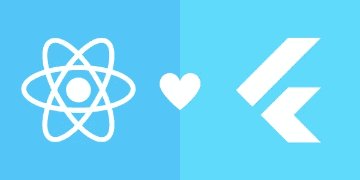

# 反应+颤动=自然

> 原文：<https://itnext.io/react-flutter-native-f616013b108a?source=collection_archive---------1----------------------->

# 挑战

*在颤振顶部运行反应*

目前网络上充斥着 Flutter vs. React 的本地文章和视频，它们给出了比较和意见，今天该学习哪一个。本文的目标是结束这场关于 Flutter 与 React Native 的争论，不是宣布谁是赢家，而是提供一个新的视角或可能性。

*为什么 React❤不振翅高飞——享受这两种框架呢？*



当已经了解 React 的人开始涉足 web 和浏览器之外的领域时，他自然会利用自己的知识，转向 React Native。在玩了 Flutter 之后，我可以诚实地说，这是一个令人愉快的框架和开发环境。但是我放松进入 Flutter 的很大一部分原因是因为我最近完成了几个 React web 项目。设计原则和范例——小部件和组件、构建和呈现、状态、声明性 UI——在这些框架之间感觉都很相似。甚至连 Flutter 的语言——Dart 看到 *aysncs* 和*等待*的时候都觉得 javascripty。

从一个框架转移到另一个框架或者甚至学习两个框架并不一定意味着加倍的工作。

## *反应+颤动=原生*

上面的等式根本不是一个定理。本文附带的应用程序和源代码是我称之为 ***的组装工作*** : *组装、蹩脚、丑陋、愚蠢，但足以工作。*它展示了一个概念证明，其目的仅仅是为了检验一个假设。

挑战用一种更具体的说法:

*构建一个原生应用——Todo 应用——用 javascript 和 React 编码，用 Flutter 渲染。*

# 动机

*终极代码编辑器*

在疫情隔离期间，我编写了自己的文本编辑器。而我从那以后一直在尝试开发*终极代码编辑器* ( [阿什拉代码](http://www.munchyapps.com/)、[阿什拉文本](https://github.com/icedman/ashlar-text)、[终端-阿什拉](https://github.com/icedman/tashlar)、[编辑器-从头开始](https://levelup.gitconnected.com/build-a-text-editor-with-flutter-ui-under-1000-lines-of-code-5a9dd2a053da)、[颤振编辑器](https://github.com/icedman/flutter_editor))。

终极代码编辑器必须是真正的跨平台的。因此——颤动。[阅读我的另一篇文章](https://levelup.gitconnected.com/build-a-text-editor-with-flutter-ui-under-1000-lines-of-code-5a9dd2a053da)来理解我为什么这么认为。

更重要的是，*终极代码编辑器，*也必须是“可破解的”——就像 Atom 一样，或者用 Visual Studio 代码术语来说是“可扩展的”。它必须通过脚本语言支持插件或扩展系统。“可破解”和“可扩展”不仅指应用功能，也指用户界面。有了 javascript，自然会想到 React。

如果我们能够运行我们的 *Todo 应用程序——一个为*React+Flutter = Native*equation*，*而被*美化了的 hello world，那么通过 javascript 和 React 让 Flutter 应用程序在功能和界面上都可扩展的想法就成为了可能。我们离创建*终极代码编辑器又近了一步。*

把*终极代码编辑器*换成自己的*“终极 _____ app”。上述动机可能仍然适用。*

# 战略

1.  为 Flutter 应用程序添加脚本功能—使用 QuickJS
2.  添加创建 Flutter 小部件的动态或运行时方法—创建小部件生成器或工厂类；
3.  添加构建 UI 树的动态或运行时方法—创建树数据结构来模拟声明性 UI；
4.  使用 React 从脚本创建小部件和构建 UI——在 Flutter 和 QuickJS 之间建立一座沟通桥梁

# QuickJS

[Ashlar Text](https://github.com/icedman/ashlar-text) 实际上包含了一个支持 React 的[脚本引擎](https://github.com/icedman/js-qt-native)。但是它运行在 Qt 上并使用 QtWebKit，这意味着 Ashlar Text 需要一个功能齐全的 web 浏览器(尽管从视图中隐藏)作为其脚本引擎。

我们想要便携、轻便、快如闪电的东西。

[*QuickJS*](https://bellard.org/quickjs/) *是法布里斯·贝拉开发的一个小型可嵌入的 Javascript 引擎*。(他还创造了 ffmpeg，qemu，tinygl)。如果你正在寻找一个小的、快速的、跨平台的、稳定的脚本引擎，不用再找了——这个引擎是由一个天才维护的。

我之前的 C++移植到 Flutter 的文章——[第一部分](https://levelup.gitconnected.com/port-an-existing-c-c-app-to-flutter-with-dart-ffi-8dc401a69fd7)和[第二部分](https://levelup.gitconnected.com/port-an-existing-c-c-app-dungeon-crawler-rogue-to-flutter-with-dart-ffi-a701284aa289)。可以帮助我们在 Flutter 应用程序中嵌入 QuickJS。但是 [Flutter JS](https://pub.dev/packages/flutter_js) 的维护者在软件包页面上写下了令人信服的论点，为什么他们的插件比其他任何脚本引擎都要好。我确信。

```
flutter pub add flutter_js
```

# 声明式用户界面

在继续之前，我们需要知道 Flutter 和 React 都使用了*声明式 UI* 范例。我们需要对这两种框架的含义有一个直觉。

在*声明式 UI* 中，我们定义了用户界面应该是什么样子。按钮部件应该有边框，文本在中间。我们还可以根据给定的状态定义按钮的外观。按下的按钮应该向下倾斜。禁用时，它应该是灰色的文本。

CSS 就是这样做的:

```
<style>
button {
   border: 1;
   bevel: raised;
   textColor: white;
}
button.pressed {
  bevel: down;
}
button.disabled {
  textColor: grey;
}
</style><button onPressed={classNamed='pressed'} onClick={this.disabled=true}>
Click Me
</button>
```

另一方面，在*命令式 UI 中，*用户界面看起来受代码影响(不仅仅是声明的)。用户界面是以编程方式操作的。

```
Button btn;
btn.border = 1;
btn.bevel = raised;
btn.textColor = white;btn.onPressed = () => {
   this.bevel = down;
}
btn.onReleased = () => {
   this.bevel = raised;
}
```

我说*直觉*是因为我们只需要记住在*声明式 UI 中，*无论是 React 还是 Flutter，我们都处理 ***状态*** 。在 React 和 Flutter 中，我们操纵*状态*，并把如何基于给定的*状态构建或呈现小部件或整个 UI 树的任务留给框架。*

我说*直觉*是因为要理解在 Flutter and React 中使用的*声明式 UI* 的内部工作原理需要几篇文章——部件树、虚拟 DOM、渲染树、真实 DOM。

为什么要在*声明式 UI* 上走这条弯路？… ***状态***

React 维护一个虚拟 DOM(文档对象模型)。Flutter 维护一个小部件树。两者都有一个树状的数据结构来保存应用程序和用户界面状态。通过同步*反应状态*和*颤动状态*，我们可以利用颤动作为我们的反应渲染器。

# 在运行时创建小部件和小部件树

在 Flutter 中，小部件树在设计时或编码时是固定的。

```
List<String> items = [];Widget build(context) {
   return Document(children: [
      ...items.map((string) => Text(string))
   ]);
}
```

然而，*状态*是动态的。在上述情况下，*项*可能在运行时被操纵，从而不仅影响小部件的呈现，还影响小部件的子部件的呈现。

我们以上面的例子为例，应用*构建器模式*。

```
class Element {
  String type;
  Json attributes;
}...List<Element> items = [];Widget build(context) {
   return Document(children: [
      ...items.map((element) {
           switch(element.type) {
            case 'text':
               return Text(element.attributes['text']);
            case 'button':
               return Button(element.attributes['text']);
      })
   ]);
}
```

因此，我们可以创建一个数据结构，不仅包含我们的应用程序*状态*，还包含 UI 或小部件树的定义。

```
document = {
    type: 'document',
    items: [
       {
          type: 'text',
          text: 'Hello World'
       },
       {
          type: 'button',
          text: 'Click Me'
       }
    ]
}
```

在 Flutter 中，*文档*被存储为一个 JSON——实际上是一个能够模拟 JSON 的*动态*变量。

## 注册表类

我们将有一个名为 *Registry* 的类，它保存并提供一种方法来操作这个结构或*状态*。

```
registry.createElement('root', 'document');registry.createElement('text1', 'text', *state*: {'attributes': {'textContent': 'hello world','style': {'color': '#ff0000'} }});registry.appendChild('root', 'text1');registry.updateElement('text1', {'attributes': {'textContent': 'hello flutter+react'}});
```

每个元素都创建有一个 ID，每当进行更新时，该 ID 将用作参考。

当我们开始弥补与 javascript 和 React 之间的差距时,*注册表*方法被特意设计成 javascript 开发人员熟悉的样子。

实际上, *Registry* 类不仅仅操纵一个 JSON 文档。它维护了一个由*元素*组成的树形结构，每个元素都拥有自己的*状态——存储在 JSON 中的*。

```
class Element {
  String type;
  Json attributes;
  List<Element> items;
}
```

## 元素小部件

我们将有一个名为 *ElementWidget* 的构建器小部件。它获取一个*元素*数据，根据*元素.类型.*构建一个小部件，并进一步构建*元素小部件*作为*元素的子元素。*物品*。*

```
class ElementWidget extends StatelessWidget {
   ElementWidget(this.element);

   Widget build() {
      Widget buildMe = (element) => (switch(element.type) {
            case 'text':
               return Text(element.attributes['text']);
            case 'button':
               return Button(element.attributes['text'])
      }); List<Widget> buildMyChildren = this.elements.items.map((child) => ElementWidget(child)); return Column(children: [ buildMe, ...buildMyChildren ];
   }
}
```

我们从我们的*注册表*构建*根*元素，开始递归*元素小部件*构建。

```
Scaffold(body: ElementWidget(element: Registry.findById('root')));
```

# 里程碑

此时，我们已经实现了一种在运行时声明 UI 并操纵*状态*的方法。如果我们将我们的*注册表*类和方法 *createElement、removeElement、appendChild、updateElement、*暴露给 QuickJS，我们将能够完全从 javascript 构建和操作 UI。

或者，我们可以实现一个 XML 解析器来读取一些 UI 标记语言甚至 HTML。我们可以有自己的 HTML 渲染器。此外，我们可以让我们的 HTML 呈现器与启用了 HttpRequests 的 QuickJS 一起工作，并且我们可以拥有一个基本的 web 浏览器。

在我们超越自我和失去焦点之前，让我们转移到这个*杂牌军*的 javascript 和 React 方面。

# 反应渲染器

React 可以存在于浏览器之外。这是可能的，因为 React 遵循了*声明式 UI* 范例。它操纵*状态*或虚拟 DOM。最终，会有一个*渲染器*把虚拟的东西变成视觉的。但是*渲染器*与 React 是松散解耦的。

*呈现器*可以是 ReactDOM，它在浏览器中创建 HTML 元素。在浏览器之外，可以是 ReactDOMServer，它在服务器端准备或预呈现应用程序。或者它可以是反应性的，根据具体情况创建原生 Android 小部件或原生 iOS 组件。

或者，*渲染器*可以是我们自己用 Flutter 创建的东西。

# 挑战—重申

使用 Flutter 创建一个 React 渲染器——并使用 React Todo 应用程序打招呼。

react 有一个名为[***React-reconciler***](https://github.com/facebook/react/tree/main/packages/react-reconciler)*的包——“一个用于创建自定义 React 渲染器的包”，带有“实验性的，使用风险自担”的*字样。我们正处于实验阶段——所以我们忽略了警告。**

**react-reconciler* 位于 react 和我们的自定义渲染器之间。它就像一个虚拟 DOM 的监听器，等待 createInstance、createTextInstance、appendChild、removeChild、commitUpdate 等事件。*

*每当这些事件被触发时，我们通过 QuickJs 通知 Flutter 虚拟 DOM 的变化。*

```
*reconciler(hostConfig: {
  createInstance: (type, props) {
     sendMessage("onCreate", JSON.stringify({type,...props}));
  },
  commitUpdate: (element) {
     sendMessage("onUpdate", JSON.stringify(element));
  }
});*
```

*函数 *sendMessage* 是一个 *flutter_js* 公开函数。它允许从 javascript 向 flutter 发送消息。我们在 Flutter 中的自定义*呈现器*将通过创建、添加、删除*注册表*中的*元素*以及更新每个元素的状态来响应这些事件。*

```
*// in Flutter/DartflutterJs.onMessage('onCreate', (*dynamic* *args*) {
   registry.createElement('', '', *state*: *args*);
});flutterJs.onMessage('onAppend', (*dynamic* *args*) {
   registry.appendChild(*args*['parent'], *args*['child']);
});flutterJs.onMessage('onRemove', (*dynamic* *args*) {
   registry.removeChild(*args*['parent'], *args*['child']);
});flutterJs.onMessage('onUpdate', (*dynamic* *args*) {
   registry.updateElement(*args*['element'], *args*);
});*
```

*我们在 javascript 中定义 React 组件。*

```
*src/components
 ./button.js
 ./text.js// The button
export default class Button extends Component {
   render() {
     return (
       <button *style*={{ ...*this*.props.style }} *onClick*= {*this*.props.onClick}>
       {*this*.props.children}
       </button>
     );
    }
}*
```

*另一方面，我们的 *ElementWidget* 或 builder Widget 将处理一个“按钮”或任何类型来创建适当的 Widget。*

```
*Widget build() {
      return (element) => (switch(element.type) {
            case 'text':
               return Text(element.attributes['text']);
            **case 'button'**:
               return Button(element.attributes['text'])
      });
}*
```

*要将 UI 事件从 Flutter 发送到 JavaScript——点击或文本输入——我们只需启动一个脚本，传递 *element.id* 、事件及其参数。还是那句话 *flutter_js* 是我们的朋友。*

```
*GestureDetector(*onTapDown*: (*details*) {
   try {
      final script = 'onEvent("${*element*?.*id*}", "onClick")';
      JsEvalResult? jsResult = flutterJS.evaluate(script);
   } catch (err, msg) {
      print(err);
   }
},
*child*: child);*
```

# *挑战完成*

*我们现在有了自己的用 Flutter 制作的 React 渲染器。*

```
*> git clone [https://github.com/icedman/react-qjs-native](https://github.com/icedman/react-qjs-native)*
```

*该代码提供了三个自定义渲染器。第一个是用 c++和 quickjs 编写的简单终端应用程序。这个应用程序仅仅打印出通过 react-reconcile ler 触发的事件。*

*为了将 React app 打包成 QuickJS 可加载模块，使用了 ***rollupJS*** 。*

```
*> yarn build // or npm build
             // or yarn dev to keep watch of changes
> meson build
> ninja -C build
> build/react-qjs*
```

*另一个*呈现器*是浏览器 DOM 实现。这里使用了 ***parcelJS*** 在本地主机上封装并提供 Todo 应用。*

```
*> yarn sample*
```

*最后，我们有基于颤振的*渲染器*。*

```
*> yarn build // or yarn dev for hot reload
> flutter pub get
> flutter run -v // or flutter build apk for Android*
```

# *结论*

*我必须承认，我还没有完全沉浸在 React Native 中。所以我只能猜测说，如果 *React Native* 是使用 Flutter 重新创建的，那么关于使用 *React Native 还是 Flutter* 的争论将最终结束。我们将在 React 中编码，在 Flutter 中使用原生小部件或创建新部件，在 Android、iOS(包括桌面 Linux、Windows、macOS)上构建跨平台，而无需处理原生 Android 或原生 iOS、Kotlin、Java 或 Swift。*

*这个假设已经被证实了。 ***反应过来+扑动=原生*** 都有可能。而且，Flutter 可能会以一种最意想不到的方式挑战 React Native 通过使用 React 本身。*