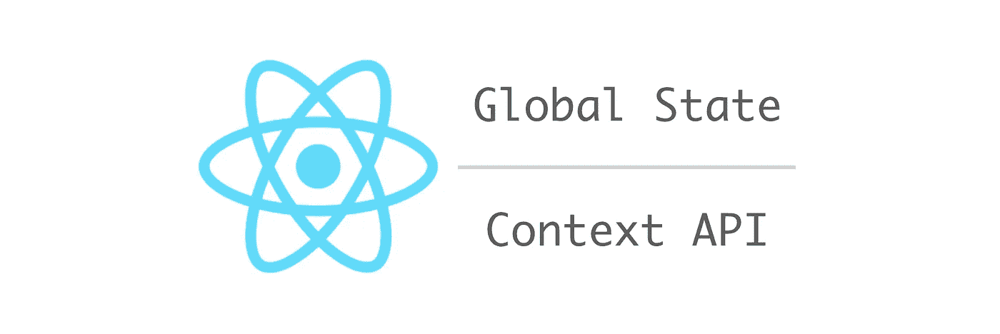

# 通过 TypeScript 的上下文 API 反应全局状态

> 原文：<https://itnext.io/react-global-state-by-context-api-for-typescript-eaf9f4cf1381?source=collection_archive---------2----------------------->

一个微型库，帮助在 React 中存储 JavaScript 和 TypeScript 的全局状态。



*注意:本帖与 React Hooks API 无关。*

在我之前的文章中，我介绍了一个名为 react-context-global-state 的库。过了一段时间，我对打字稿有了更好的了解(是的，我是初学者！)，并提出相当好的类型定义。我刚刚发布了一个新版本。

[](https://www.npmjs.com/package/react-context-global-state) [## 反应-上下文-全局-状态

### 上下文 API 反应的简单全局状态

www.npmjs.com](https://www.npmjs.com/package/react-context-global-state) 

## TypeScript 中的示例代码

让我简要地展示一下代码在 TypeScript 中的样子。

在一个名为 state.ts 的文件中，我们定义了一个全局状态并导出函数组件。`State`类型也被导出。

```
import { createGlobalState } from 'react-context-global-state';

const initialState = {
  counter1: 0,
  person: {
    age: 0,
    firstName: '',
    lastName: '',
  },
};

export type State = typeof initialState;

export const { StateProvider, StateConsumer } = createGlobalState(initialState);
```

在 App.tsx 中，我们使用上下文提供状态。

```
import * as React from 'react';

import { StateProvider } from './state';

import Counter from './Counter';

const App = () => (
  <StateProvider>
    <h1>Counter</h1>
    <Counter />
    <Counter />
  </StateProvider>
);

export default App;
```

在 Counter.tsx 中，我们通过指定名称来使用状态的一部分。

```
import * as React from 'react';

import { StateConsumerType } from 'react-context-global-state';

import { State, StateConsumer } from './state';

const Counter1StateConsumer = StateConsumer as StateConsumerType<State, 'counter1'>;

const Counter = () => (
  <Counter1StateConsumer name="counter1">
    {(value, update) => (
      <div>
        <span>
          Count:
          {value}
        </span>
        <button type="button" onClick={() => update(v => v + 1)}>+1</button>
        <button type="button" onClick={() => update(v => v - 1)}>-1</button>
      </div>
    )}
  </Counter1StateConsumer>
);

export default Counter;
```

注意上面是如何定义`Counter1StateConsumer`的。我不太确定这是不是打字稿中最好的方式。或许，如果它能被`name="counter1"`道具所约束就更理想了。

资源库中提供了完整的示例代码。

[](https://github.com/dai-shi/react-context-global-state/tree/master/examples/02_typescript) [## 代时/反应-语境-全局-状态

### 上下文 API 反应的简单全局状态。通过创造……为 Dai-Shi/react-context-global-state 的发展做出贡献

github.com](https://github.com/dai-shi/react-context-global-state/tree/master/examples/02_typescript) 

并且，您可以像下面这样运行它，并在浏览器中打开 [http://localhost:8080](http://localhost:8080) 来查看它的工作情况。

```
git glone [https://github.com/dai-shi/react-context-global-state.git](https://github.com/dai-shi/react-context-global-state.git)
npm install
npm run examples:typescript
```

## 一些想法

虽然全局状态很方便，但最好不要过度使用它。它本质上是一个全局变量，通常应该避免使用。在 React 中，我们应该首先考虑使用本地状态，并在组件树中传递它。如果树中相距很远的两个组件需要共享一个值，那么全局状态肯定是有用的。在这种情况下，上下文 API 可能非常合适。这个库是为相当小的应用程序设计的，在这些应用程序中使用 Redux 或类似的东西需要太多的工作。