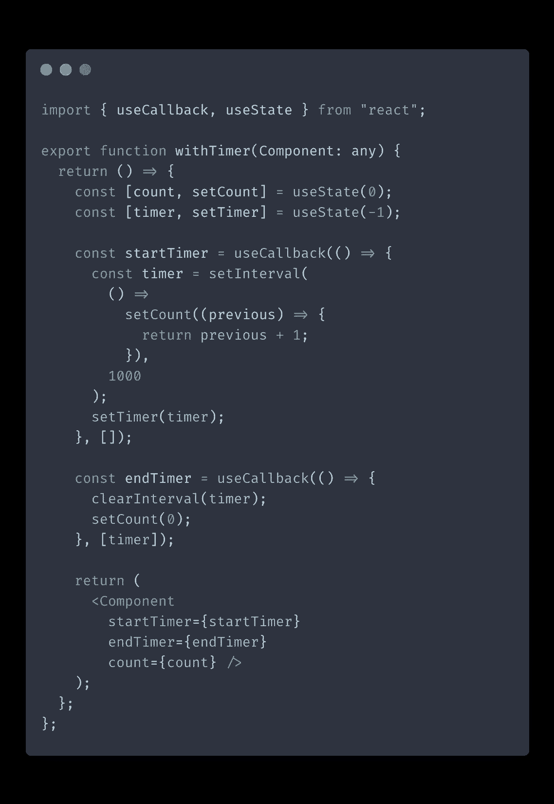
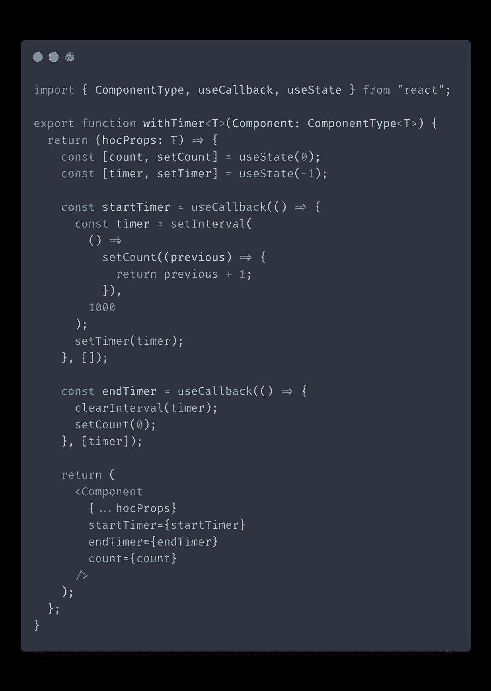
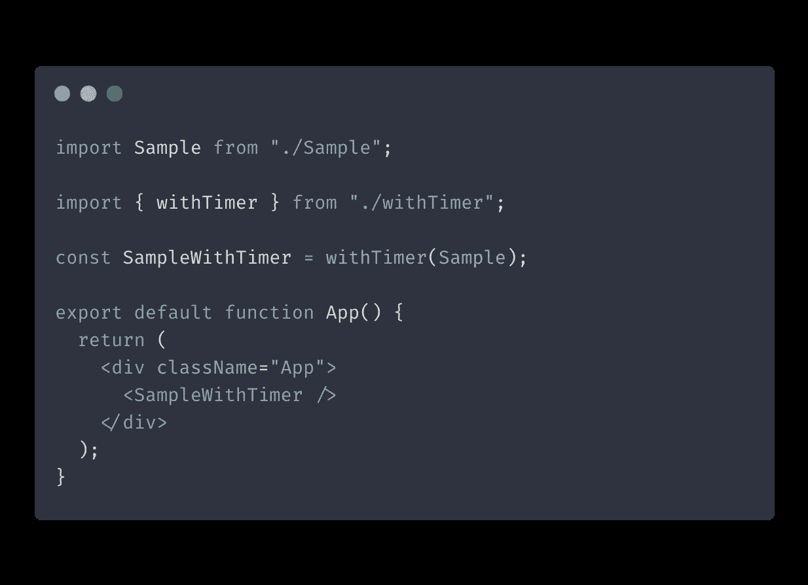
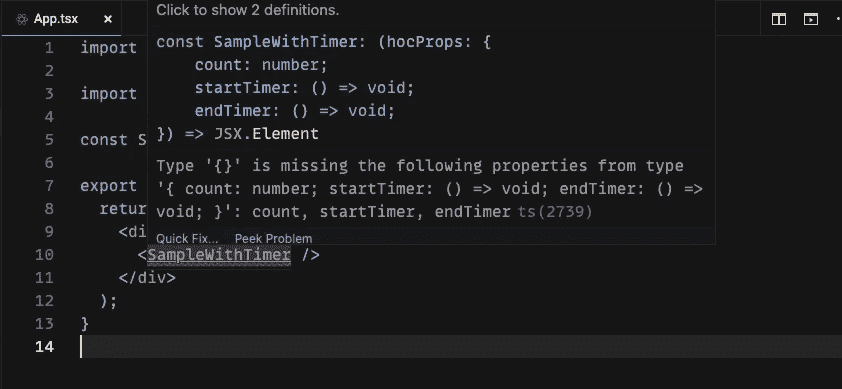
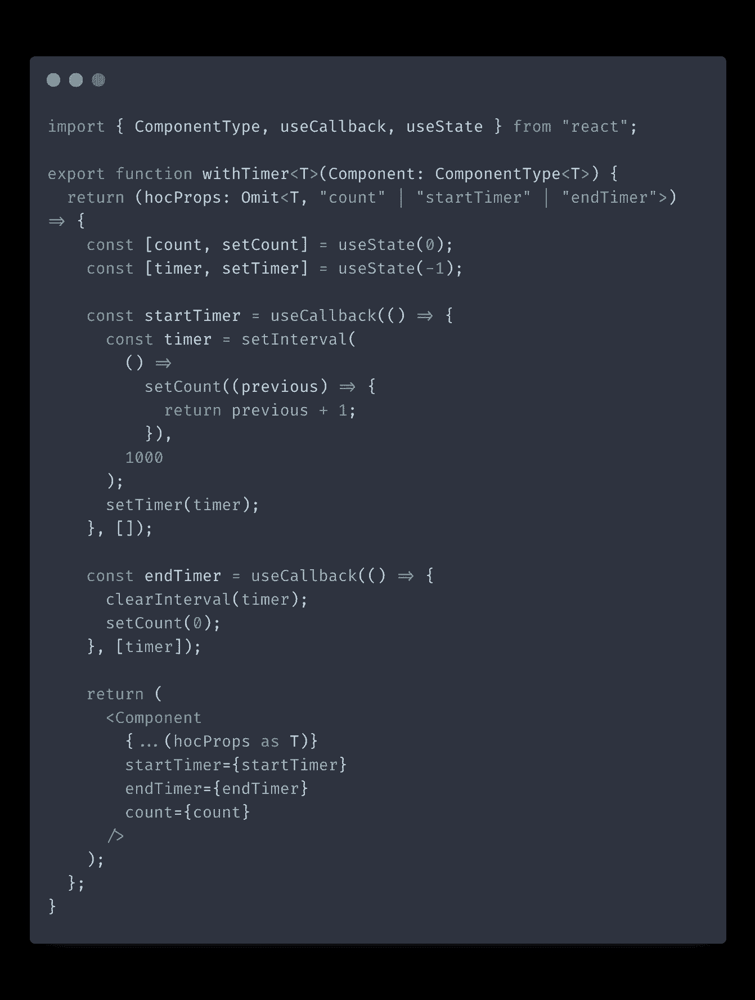

# 用 TypeScript 反应高阶组件

> 原文：<https://itnext.io/react-higher-order-components-with-typescript-e41c64954825?source=collection_archive---------0----------------------->

有些 React 模式在 TypeScript 中实现起来比其他模式更棘手，需要了解正确的方法并利用正确的 TypeScript 特性。高阶分量就是这样一种模式。

在本帖中，我们将探索如何从头开始创建一个高阶组件，并使用泛型和实用程序类型动态计算它的正确需求。

# 什么是高阶分量？

[高阶组件](https://reactjs.org/docs/higher-order-components.html) (HOC)是一个接受另一个组件并将附加属性注入其中的函数。可以把它想象成用一个额外的层来包装你的组件，给它更多的功能。

hoc 的目的通常是重用组件之间的公共逻辑，并将逻辑层和表示层分开。随着钩子的引入，HOCs 在很大程度上退居二线。尽管你很少看到它们，hoc 仍然是相关的，并且比钩子有一定的优势，例如，与基于类的组件有更好的兼容性。

一个众所周知的例子是来自`react-router`库中的 [withRouter](https://reactrouter.com/web/api/withRouter) 函数。

# 设置特设

让我们先从搭建我们的 HOC 开始。我们将创建一个简单的特设，为我们的组件添加计时器功能。我们的第一次迭代不会有严格的类型，但是随着我们的进展，我们会把它收紧。

这是我们的高阶组件的第一个版本:

此时，我们的 HOC 不是很安全，因为我们为目标组件的类型设置了`any`。没有类型检查来确保我们传递的组件接受我们试图注入的道具。

现在让我们开始加强类型检查。

# 添加泛型

让我们这样做，使我们的 HOC 只接受 React 组件，并期望与目标组件相同的属性。我们可以使用 TypeScript 泛型来实施这些约束:

[ComponentType](https://flow.org/en/docs/react/types/#toc-react-componenttype) 是 React 提供的一种特殊类型，用于处理 TypeScript 中的组件。

另外，请注意我们对泛型的使用。我们在几个地方使用了`T`类型:

*   我们将参数类型设置为`ComponentType<T>`。现在，在这个函数的范围内，`T`表示目标组件的道具类型。
*   我们还将`hocProps`类型设置为`T`，以强制我们的 HOC 组件接收与目标相同的道具。

多亏了泛型，TypeScript 可以动态计算我们的原始组件接受的所有属性，并对 HOC 实施相同的限制。你可以从[类型脚本文档](https://www.typescriptlang.org/docs/handbook/2/generics.html)中了解更多关于泛型的知识。

# 使用实用程序类型

到目前为止，我们的 HOC 中的类型检查看起来不错。下面是我们如何使用它:

但是我们还有一个问题需要解决。当您使用我们的 HOC 时，会从 TypeScript 中得到一个错误:

早些时候，我说过特设应该期待与目标组件完全相同的道具`T`，但这并不完全是真的。我们的 HOC 不应该期待道具`counter`、`startTimer`和`endTimer`，因为首先注入这些道具是高阶组件的工作。

我们可以通过使用[省略实用程序类型](https://www.typescriptlang.org/docs/handbook/utility-types.html#omittype-keys)来解决这个问题。使用 Omit，我们可以告诉 HOC 期待我们的目标组件所期待的所有道具，除了它注入的那些:

我们对代码又做了两处修改:

*   现在我们的 HOC 接受`hocProps: Omit<T, "count" | "startTimer" | "endTimer">`类型的道具。使用`Omit`，我们创建了一个新的类型，期望除了`count`、`startTimer`和`endTimer`之外的所有道具`T`。
*   由于`Omit`创建了一个新的类型，我们不得不使用一个变通方法`{...(hocProps as T)}`让 TypeScript 知道我们期望`hocProps`与`T`几乎相同，除了我们省略的属性。

现在我们的高阶组件可以使用了！

# 结论

在这篇文章中，我们讨论了在 TypeScript 中编写高阶组件的正确方法。我们使用 TypeScript 的泛型和实用程序类型使我们的 HOC 既灵活又安全。看看我的帖子，了解更多对 React 有用的其他 [TypeScript 实用工具类型。](https://isamatov.com/typescript-utility-types-for-react/)

这里是本教程的[代码沙箱](https://codesandbox.io/s/hoc-with-typescript-vjrmh)的链接。感谢您的阅读！

*原载于 2021 年 8 月 8 日*[*【https://isamatov.com】*](https://isamatov.com/react-hoc-typescript/)*。*