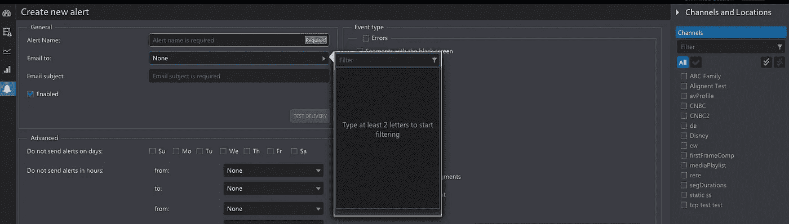

# React 挂钩、表单验证和复杂状态。

> 原文：<https://itnext.io/react-hooks-and-two-way-data-binding-dd4210f0ed94?source=collection_archive---------3----------------------->

在 v16.8.0 中引入了一个新的 [React Hooks API](https://reactjs.org/docs/hooks-intro.html) ，扩展了功能组件的能力以处理状态和副作用。今天，我们将探索依靠新的 hooks API 来处理组件状态的非常规方法，并帮助解决许多人认为是 React 弱点的领域:

1.  使用表单的一般困难，尤其是涉及输入验证时。
2.  难以处理复杂的复合状态。

为了简要说明这个概念，让我们看一个最简单的有状态表单组件的例子。只是绑定到单个状态元素的单个字段。

如果你不熟悉 React，你可能会想为什么我们每次插入控件时都要写 *onChange* 处理程序。为什么它看起来不像许多框架中的声明性绑定？这是 React 的薄弱环节吗？有可能用 React 来做吗？

例如，为什么它看起来不像这样呢？

好问题，对吧？现在，*熟悉 react 的人可能希望我给出通常的解释，比如“双向数据绑定从根本上来说不是 React 式的”，“它打破了单向数据流”等等。*

我要告诉你的是，上面的代码快照实际上是完美运行的代码。欢迎来到 [NestedLink](https://github.com/Volicon/NestedLink) 的神奇世界，这个小的*纯功能性的* *双向数据绑定库*证明了 React forms 代码不必难看。

## 这个“useLink”是什么，“useState”有什么问题？

这个*使用链接*是类固醇的 [*使用状态*挂钩](https://reactjs.org/docs/hooks-state.html)，它有一点令人惊讶的魔力。请看，react *useState()* hook 返回一个对象，该对象是一个包含*值*的数组，以及更新该值的*函数。链接本质上是同一个对象，但它不是一个数组。它是一个类实例，包含相同的 pair *{value，set}* 以及允许您以多种方式转换它的方法。就像上面的例子一样, *link.props* 自动创建一对*值*和*onChange*props*供*输入*组件使用，然后使用对象扩展操作符来注入它们。所以，只要 *{…name.props}，*和你的状态绑定，就可以双向输入控制。**

*现在你可能想知道 *Link* 还能做什么。很多事情，但最重要的是其中的两个:客户端*表单验证、*和*复杂状态的处理*(比如，在根组件中拥有复杂的共享状态，其片段被传递给子组件，并且他们仍然可以修改它)。*

## *表单验证*

*关于链接验证的主要文章是[这里是](https://medium.com/@gaperton/react-forms-with-value-links-part-2-validation-9d1ba78f8e49)，我会给你一个简单的概述。*

*在 plain React 中，带有内联验证错误的表单验证往往会很快将一个简单的表单弄得几乎无法理解，因为我们必须同时处理三件事情:值、验证错误和 onChange 处理程序。我们*会*喜欢在自定义组件中隐藏重复的模式，但是这几乎没有帮助，因为我们仍然需要向它们传递三个道具。*

*那么，*链接*怎么可能解决这种情况呢？答案是:i *t 可以封装验证错误。*看下面的例子，你可以将验证器序列应用到链接上(验证器是一个普通的函数)，而链接作为错误消息的传输工具，将它传递给感兴趣的人。自定义*输入*组件*，本例中为*。*

*这种方法允许您将验证逻辑与标记完全分离。您是否有验证—您保持标记的干净和简洁。您可以为多次重用创建自己的验证函数，并且可以将验证转移到专用函数中，以使您的呈现方法更加简洁。或者，如果您愿意，可以在标记内部进行内联检查，就像这样:*

**<输入 link={name.check( x = > x，“这个名字真的很需要。真的")} / >**

## *处理共享状态*

*关于这一点的主要文章是[这里](https://medium.com/@gaperton/state-and-forms-in-react-part-3-handling-the-complex-state-acf369244d37)，但我将再次简要概述这个想法。因此，让我们假设我们有一个复杂的页面，并希望在本地拥有它的状态，将它的片段传递给孩子，以便他们可以修改它。我们如何做出简单的反应呢？我们将传递值和函数来更新它作为道具。使用钩子，我们可能只是传递一个由 *useState，*返回的数组，尽管很多人会说这很难看*。**

*有了*链接，*我们在前面的例子中已经秘密地用一种没人注意到的方式完成了这个把戏:)。仔细看，这正是那里正在发生的事情。*输入*修改有链接的父组件的状态。它可能会显式调用 *link.set(value)，*它只是不需要它。*

*因此，*链接是对状态值*的可写引用，可以自由传递*。*然而吸引人的可能是*，*这还不是最有趣的部分。当我们在状态中存储对象和数组时，乐趣就开始了。*

**link.map* 处理包含数组和对象的链接的方式与普通的 *array.map* 完全相似。唯一不同的是，它生成的链接包装了它遍历的所有元素。 *link.at(key)* 方法以类似的方式工作，它挑选一个具有特定键的元素，并将其包装在一个链接中。当这样一个链接将被更新时，它将导致整个数据结构的适当的“纯功能性”更新(这意味着上层元素将被它们修改后的副本替换，而不是就地更新)，因此根组件将注意到这种变化并重新绘制自己。*

*你可以用这种方式构建非常复杂的页面，这里有一些例子。我想补充一点，我自己用这种状态管理方法构建了非常大和复杂的单页面应用程序，这几乎是真的。虽然我们的 200 个 KLOCs React 单页视频监控和合规应用程序(由 Volicon 和威瑞森开发)依赖 NestedLink 作为数据绑定和表单验证的解决方案，但在如此规模的应用程序中，我们需要比普通 JS 对象更高级的东西来进行状态管理(这里的[是](https://volicon.github.io/Type-R/)，但这是另一回事)。*

*然而，如果你不需要像我们一样设计*那个巨大的*温泉浴场(很可能你不需要)，单单[嵌套链接](https://github.com/Volicon/NestedLink)和它的*使用链接*挂钩就足够了。*