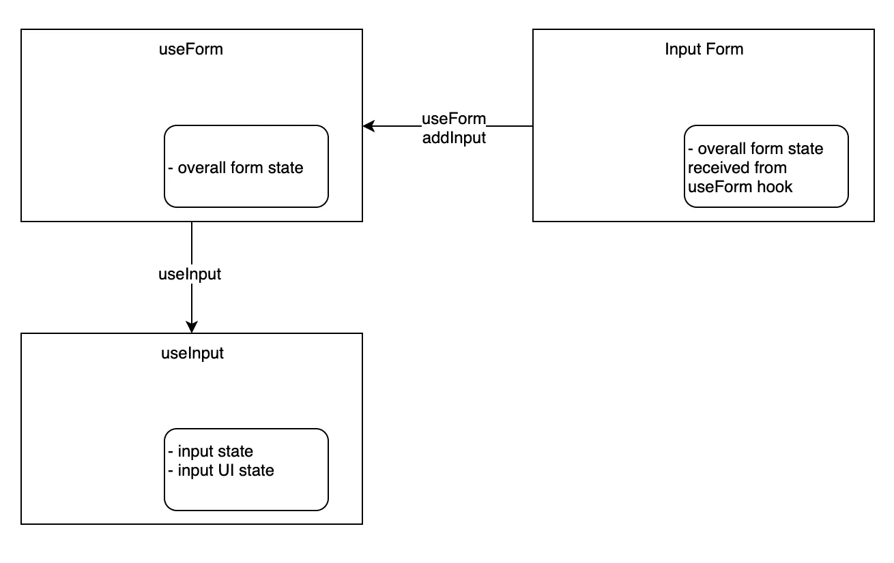

# React 钩子——设计简单的表单 API——第 2 部分

> 原文：<https://itnext.io/react-hooks-designing-a-simple-forms-api-part-2-1fe5d12f23d9?source=collection_archive---------3----------------------->

在本系列的第 1 部分[中，我们研究了如何使用 React 钩子来设计一个`useForm` React 表单库。第 1 部分介绍了这个库的动机和一些总体设计目标。](https://medium.com/@shanplourde/react-hooks-designing-a-simple-forms-api-part-1-307b04bc6007)

在第 2 部分中，我们将创建一个`useInput`钩子，回顾状态管理，合并一些额外的测试，更详细地回顾测试策略，并扩展我们从第 1 部分开始的解决方案。让我们开始吧！

对了， [part 3](/react-hooks-designing-a-simple-forms-api-part-3-validation-and-a-running-example-18b835a3b817) 和 [part 4](/react-hooks-designing-a-simple-forms-api-part-4-scaling-to-other-input-types-e738db0a3fc3) 上线了💪。

# 为`useInput`设计公共 API

我发现设计 hooks APIs 的最佳起点是首先理解你希望它做什么，然后你将如何使用它。在第 1 部分中，我们创建了`useForm`钩子，但是它本身是没有用的。输入控件也需要得到支持，以便消费者能够连接一个完整的 HTML 表单。

## 我们希望 useInput 做什么

*   `useInput`钩子将是 HTML 输入的状态管理钩子。它将跟踪输入到输入中的值，并将跟踪关于给定输入的一些附加状态属性
*   `useInput`钩子应该跟踪用户是否已经“访问”了输入字段
*   `useInput`钩子应该跟踪输入的值是否不同于它的原始值

## 我们希望消费者如何使用 useInput？

对于我们的新`useInput`钩子，我们需要考虑如何管理这个新钩子。我们希望表单库的最终用户直接使用`useInput`钩子吗？还是应该与最终用户隔离开来？对我来说，要回答这个问题，我们应该考虑如何管理表单上所有输入的状态。



图 1-使用表单和使用输入状态管理和 API 使用

如图 1 所示，我希望表单消费者直接使用`useForm`钩子，让`useForm`直接管理所有的`useInput`钩子。我更希望消费者不必自己处理管理所有的`useInput`挂钩。原因是:

*   `useForm`作为整体窗体的钩子应该对一个窗体的整体状态负责。否则，如果消费者直接使用`useInput`钩子，表单的状态管理可能会令人困惑
*   我想保持使用模式简单和一致
*   如果需要的话，通过扩展`useForm`钩子 API，将来可以很容易地扩展`useForm`以支持定制输入

## 状态管理

如图 1 所示，`useForm`和`useInput`都管理自己的状态。`useInput`将保持代表输入值的内部状态，以及输入是否被访问过，以及输入值是否已经改变。`useForm`将冗余地存储它正在跟踪的所有输入。从这个意义上说，`useForm`将是跟踪表单上所有输入值的主要位置。这将使 API 的最终消费者更容易处理表单值，因为`useForm`将能够以一种易于消费者使用的方式呈现表单值。

输入表单将通过`useForm`钩子接收所有的表单状态。

## 使用输入挂钩源代码和说明

在我们的`useInput`钩子的第一次迭代中，我们跟踪状态中的 3 个事物。当前输入值— `inputValue`、`originalValue`跟踪输入是否被更新，最后`visited`跟踪用户是否访问了输入字段。

钩子返回一个对象，该对象具有表示输入状态的属性和一些 API 函数，钩子的使用者可以使用这些函数来改变输入的状态。

我们向从钩子返回的对象添加一个`pristine`派生属性，它将原始值与输入值进行比较。

```
import { useState } from "react";export const useInput = ({ name, value, props = {} }) => {
  const [inputValue, setInputValue] = useState(value);
  const [originalValue] = useState(value);
  const [visited, setVisited] = useState(false);const getInputProps = () => ({
    id: name,
    value: inputValue,
    ...props,
    onChange: event => {
      const val = event.target.value;
      setInputValue(val);
      props.onChange && props.onChange(name, val);
    },
    onFocus: evt => {
      setVisited(true);
    }
  });return {
    id: name,
    value: inputValue,
    api: {
      setValue: val => {
        setInputValue(val);
      }
    },
    uiState: {
      visited,
      pristine: inputValue === originalValue
    },
    getInputProps
  };
};
```

## 添加到`useForm`以支持向表单添加新输入

由于`useForm`将是使用`useInput`钩子的主要入口点，我们需要添加入口点，并更新`useForm`钩子来跟踪输入状态。下面显示了`useForm`钩子的源代码，与`useInput`相关的代码以粗体显示。

`useForm`通过`onInputChange`功能跟踪输入的变化。这个函数设置`formValues`属性，这是一个简单的键值对对象，其中键是输入名称，值是输入值。例如，如果一个表单有输入字段`firstName`和`lastName`，`formValues`将如下所示:

```
{ firstName: 'firstNameValue', lastName: 'lastNameValue' } 
```

`formValues`被`useForm`的消费者用来轻松接收表单值的键/值对列表。

您会注意到我们没有为`formValues`使用 useState 的 set 属性。如果我们这样做，React 将会遇到一个循环更新问题，所以我们改变了`formValues`的值。我更倾向于解决这个问题，这样就不需要突变，如果你们中的任何人对此有任何建议，我将不胜感激。

`addInput`是消费者用来向表单添加输入的 API。`addInput`函数的初始版本接收输入名称和值。在内部，`useForm`钩子调用`useInput`钩子初始化输入。此外，`useForm`然后更新它的内部输入集合和表单值。

```
import { useState } from "react";
import { useInput } from "./use-input";export const defaultFormProps = {
  autoComplete: "on"
};
export const useForm = (name, initialState = {}) => {
  const [formValues] = useState({
    ...initialState
  });
  const [uiState, setUiState] = useState({
    isSubmitting: false
  });
 **const [inputs] = useState({});**const getFormProps = (props = {}) => ({
    ...defaultFormProps,
    ...props,
    onSubmit: async evt => {
      evt.preventDefault();
      try {
        setUiState({ isSubmitting: true });
        props.onSubmit && (await props.onSubmit({ evt, formValues }));
      } finally {
        setUiState({ isSubmitting: false });
      }
    }
  });**const onInputChange = (name, value) => {
    formValues[name] = value;
  };****const addInput = ({ name, value }) => {
    const input = useInput({
      name,
      value,
      props: { onChange: onInputChange }
    });
    inputs[name] = input;
    formValues[name] = value;
    return input;
  };**return {
    getFormProps,
    formValues,
    uiState,
    inputs,
 **api: {
      addInput
    }**  };
};
```

# 测试策略

在开发的这个阶段，我们的库本质上仍然是 React hooks。出于这个原因，我们将继续使用 Jest 和[react-hooks-testing-library](https://www.npmjs.com/package/react-hooks-testing-library)。库是用来测试钩子的。它为单元测试挂钩提供了一个简单的组件包装器和实用工具。

然而，我们也应该用样本表单测试钩子。在 API 的开发过程中，我创建了一个简单的表单来验证钩子。不过，我们可能希望尽快开始测试样本表单，以便对`useForm`构建的输入表单进行端到端验证。对于这种测试，我可能会选择[反应测试库](https://github.com/kentcdodds/react-testing-library)。

现在，我们可以为`useInput`钩子添加测试，并更新`useForm`测试。

## 使用输入单元测试

我测试`useInput`的目标是试图从黑盒的角度测试 API 的所有方面，以及它跟踪的状态。测试也很好地解读了`useInput`打算提供的特性。

```
import { renderHook, cleanup, act } from "react-hooks-testing-library";
import { useInput } from "./use-input";describe("useInput tests", () => {
  afterEach(cleanup);it("should initialize an input", () => {
    const { result } = renderHook(() =>
      useInput({ name: "test", value: "123" })
    );
    const { id, value, api, uiState, getInputProps } = result.current;
    expect(id).toEqual("test");
    expect(value).toEqual("123");
    expect(api).toBeDefined();
    expect(uiState).toBeDefined();
    expect(getInputProps).toBeDefined();
  });it("should support reset", () => {
    const { result } = renderHook(() =>
      useInput({ name: "test", value: "123" })
    );
    expect(result.current.value).toEqual("123");
    act(() => {
      result.current.api.setValue("");
    });
    expect(result.current.value).toEqual("");
  });it("should support custom input props", () => {
    const { result } = renderHook(() =>
      useInput({ name: "test", value: "123" })
    );
    expect(result.current.value).toEqual("123");
    act(() => {
      result.current.api.setValue("");
    });
    expect(result.current.value).toEqual("");
  });it("should change visited state on focus", () => {
    const { result } = renderHook(() =>
      useInput({ name: "test", value: "123" })
    );
    expect(result.current.uiState.visited).toEqual(false);
    act(() => {
      result.current.getInputProps().onFocus();
    });
    expect(result.current.uiState.visited).toEqual(true);
  });it("should change pristine after API setValue", () => {
    const { result } = renderHook(() =>
      useInput({ name: "test", value: "123" })
    );
    expect(result.current.uiState.pristine).toEqual(true);
    act(() => {
      result.current.api.setValue("234");
    });
    expect(result.current.uiState.pristine).toEqual(false);
    act(() => {
      result.current.api.setValue("123");
    });
    expect(result.current.uiState.pristine).toEqual(true);
  });it("should change pristine and value when onChange event is triggered", () => {
    const { result } = renderHook(() =>
      useInput({ name: "test", value: "123" })
    );
    act(() => {
      result.current.getInputProps().onChange({
        target: { value: "234" }
      });
    });
    expect(result.current.uiState.pristine).toEqual(false);
    expect(result.current.value).toEqual("234");act(() => {
      result.current.getInputProps().onChange({
        target: { value: "123" }
      });
    });
    expect(result.current.uiState.pristine).toEqual(true);
    expect(result.current.value).toEqual("123");
  });
});
```

## 使用表单单元测试更新

`useForm`现在有了用于输入的 API，useForm 的 API 与第 1 部分相比略有变化，只是稍微清理了一下 API。因此，此时的全套测试如下:

```
import { renderHook, cleanup, act } from "react-hooks-testing-library";
import { useForm } from "./use-form";const noop = () => {};jest.useFakeTimers();describe("useForm tests", () => {
  afterEach(cleanup);it("should return empty form props and form state", () => {
    const { result } = renderHook(() => useForm());
    const { getFormProps, formValues } = result.current;
    expect(getFormProps).toBeDefined();
    expect(formValues).toEqual({});
  });it("should return an initial uiState", () => {
    const { result } = renderHook(() => useForm());
    const { uiState } = result.current;
    expect(uiState).toEqual({
      isSubmitting: false
    });
  });it("should support custom form props", () => {
    const { result } = renderHook(() => useForm());
    const { getFormProps } = result.current;
    const formProps = getFormProps({ foo: "bar" });
    expect(formProps.foo).toEqual("bar");
  });it("should support custom onSubmit", async () => {
    const { result } = renderHook(() => useForm());
    const { getFormProps, uiState } = result.current;const onSubmit = jest.fn();const formProps = getFormProps({ onSubmit });
    expect(formProps.onSubmit).toBeDefined();// Could be some weirdness right now due to
    // [https://github.com/facebook/react/issues/14769](https://github.com/facebook/react/issues/14769)
    act(() => {
      formProps.onSubmit({ preventDefault: noop });
    });
    expect(uiState).toEqual({
      isSubmitting: false
    });
    expect(onSubmit).toHaveBeenCalledTimes(1);
  });it("should support async onSubmit", async () => {
    const { waitForNextUpdate, result } = renderHook(() => useForm());
    const { getFormProps, uiState } = result.current;const onSubmit = evt =>
      new Promise(r => {
        setTimeout(() => {
          r();
        }, 1000);
      });const formProps = getFormProps({ onSubmit });
    expect(formProps.onSubmit).toBeDefined();// Could be some weirdness right now due to
    // [https://github.com/facebook/react/issues/14769](https://github.com/facebook/react/issues/14769)
    act(() => {
      formProps.onSubmit({ preventDefault: noop });
    });
    jest.runAllTimers();
    expect(result.current.uiState).toEqual({
      isSubmitting: true
    });
    await waitForNextUpdate();
    expect(uiState).toEqual({
      isSubmitting: false
    });
  });it("should gracefully handle onSubmit errors", async () => {
    const { result } = renderHook(() => useForm());
    const { getFormProps, uiState } = result.current;const onSubmit = evt => new Error();const formProps = getFormProps({ onSubmit });
    expect(formProps.onSubmit).toBeDefined();// Could be some weirdness right now due to
    // [https://github.com/facebook/react/issues/14769](https://github.com/facebook/react/issues/14769)
    act(() => {
      formProps.onSubmit({ preventDefault: noop });
    });
    expect(uiState).toEqual({
      isSubmitting: false
    });
  });it("should gracefully handle async onSubmit errors", async () => {
    const { waitForNextUpdate, result } = renderHook(() => useForm());
    const { getFormProps, uiState } = result.current;const onSubmit = evt =>
      new Promise((resolve, reject) => {
        setTimeout(() => {
          reject();
        }, 1000);
      });const formProps = getFormProps({ onSubmit });
    expect(formProps.onSubmit).toBeDefined();// Could be some weirdness right now due to
    // [https://github.com/facebook/react/issues/14769](https://github.com/facebook/react/issues/14769)
    act(() => {
      formProps.onSubmit({ preventDefault: noop });
    });
    jest.runAllTimers();
    expect(result.current.uiState).toEqual({
      isSubmitting: true
    });
    await waitForNextUpdate();
    expect(uiState).toEqual({
      isSubmitting: false
    });
  });it("should be able to add inputs", () => {
    const { result } = renderHook(() => useForm());
    const { api } = result.current;
    expect(api).toBeDefined();renderHook(() => api.addInput({ name: "test", value: "123" }));
    expect(result.current.formValues).toEqual({ test: "123" });
    expect(result.current.inputs.test).toBeDefined();
    let inputProps = result.current.inputs.test.getInputProps();
    expect(inputProps.id).toEqual("test");
    expect(inputProps.value).toEqual("123");renderHook(() => api.addInput({ name: "secondtest", value: "234" }));
    expect(result.current.formValues).toEqual({
      test: "123",
      secondtest: "234"
    });
    expect(result.current.inputs.test).toBeDefined();
    inputProps = result.current.inputs.secondtest.getInputProps();
    expect(inputProps.id).toEqual("secondtest");
    expect(inputProps.value).toEqual("234");
  });
});
```

## 使用示例表单进行测试

最后，这是使用示例表单进行测试的当前代码。

```
import React from "react";
import { useForm } from "../../components/form/use-form";
import { sleep } from "../../utils/async";function SampleForm(props) {
  const { getFormProps, formValues, uiState, api } = useForm("settingsForm", {
    firstName: "George",
    lastName: "OfTheJungle",
    email: "[george@thejungle.com](mailto:george@thejungle.com)"
  });
  const firstName = api.addInput({
    name: "firstName",
    value: formValues.firstName
  });
  const lastName = api.addInput({
    name: "lastName",
    value: formValues.lastName
  });
  const email = api.addInput({
    name: "email",
    value: formValues.email
  });const onSubmit = async ({ evt, formValues }) => {
    evt.preventDefault();
    await sleep(2000);
    console.log("sample-form onSubmit", formValues);
  };return (
    <div>
      <h2>Settings</h2>
      {uiState.isSubmitting && <div>Submitting</div>}
      <form {...getFormProps({ onSubmit })}>
        <div>
          <label htmlFor={firstName.id}>
            First name {JSON.stringify(firstName.uiState)} *
          </label>
          <input type="text" {...firstName.getInputProps()} />
        </div><div>
          <label htmlFor={lastName.id}>
            Last name {JSON.stringify(lastName.uiState)} *
          </label>
          <input type="text" {...lastName.getInputProps()} />
        </div><div>
          <label htmlFor={email.id}>
            Email address {JSON.stringify(email.uiState)}*
          </label>
          <input type="text" {...email.getInputProps()} />
        </div><div>* - Indicates required field</div><div>
          <button type="submit">Save</button>
        </div>
      </form>
    </div>
  );
}export { SampleForm };
```

# 摘要

在这篇文章中，我们设计了`useInput`钩子，修改了`useForm`钩子来支持它，在 useForm 中创建了一个 API 供表单创建者使用，并决定了在解决方案中管理的状态。我们还编写了几个单元测试，以确保在开发过程中尽可能多地进行测试，并且更新了示例页面。

在第 3 部分中，我们将讨论验证、异步验证和异步表单提交。在后面的部分中，我计划深入研究 React 解决方案的性能含义，以及设计优化等。

如果您有任何问题、反馈或建议，或者您希望我介绍本系列中的其他内容，请告诉我。