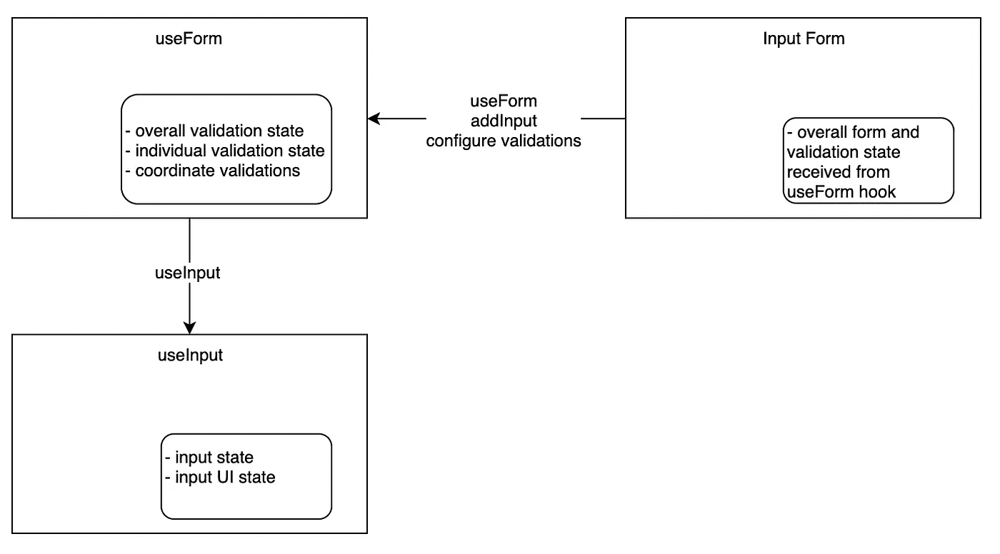

# react Hooks——设计简单的表单 API——第 3 部分——验证和运行示例！

> 原文：<https://itnext.io/react-hooks-designing-a-simple-forms-api-part-3-validation-and-a-running-example-18b835a3b817?source=collection_archive---------4----------------------->

在本系列的第 1 部分中，我们研究了如何使用 React 钩子来设计一个 React 表单库。第 1 部分介绍了这个库的动机和一些总体设计目标。

在本系列的第 2 部分[中，我们创建了一个`useInput`钩子，回顾了我们的解决方案的状态管理，合并了一些额外的测试，并且更详细地回顾了测试策略。](https://medium.com/@shanplourde/react-hooks-designing-a-simple-forms-api-part-2-1fe5d12f23d9)

在第 3 部分中，我们将讨论验证、异步验证和异步表单提交。我们还将确保涵盖异步单元测试，并更新我们的样本表单。一旦我们有了这些部分，我们就基本上构建了基于 React hooks 的表单 API 的所有关键元素。

对了，[第四部](/react-hooks-designing-a-simple-forms-api-part-4-scaling-to-other-input-types-e738db0a3fc3)上线了💪。

让我们开始吧！

# 工作示例

到目前为止，我还没有发布我们 API 的运行示例，因为它缺少一些关键特性。在本文中，我们将完成表单 API 的所有关键元素。因此，让我们来看看到目前为止我们所建立的一切的演示。

示例表单展示了我们将在第 3 部分中开发的所有表单特性

下面展示了我们的标准 HTML 表单解决方案。如果你检查一下 HTML，你会看到我们只是使用常规的旧的`<form />`、`<label />`和`<input />`标签。`useForm`提供表单的功能需求。UI 由最终表单创建者来实现。

[完整的解决方案可以在我的 github](https://github.com/shanplourde/react-hooks-form-util) 中找到。演示中有很多样板文件，但我希望在这一点上有非常明确的例子。请注意，由于 CodeSandbox 设计决定不支持从`package.json`加载`devDependencies`，测试此时不会通过 CodeSandbox。

# 设计公共 API 以支持`validation`

我发现在设计 React hooks API 时，最好的起点是首先理解你希望它做什么，然后你将如何使用它。尽早编写单元测试有助于改进 API。

## 我们希望验证做什么？

*   支持多种开箱即用的验证，如 required、email 等。
*   支持自定义验证
*   使新的验证易于添加
*   支持异步验证
*   支持可选的输入模糊验证
*   表单提交时应支持验证

## 验证未来美好生活

*   onBlur 异步验证可能需要支持取消
*   onBlur 异步验证可能希望在运行异步操作之前支持延迟——比如一个[去抖算法](https://levelup.gitconnected.com/debounce-in-javascript-improve-your-applications-performance-5b01855e086)
*   可以增强 API 以减少样板文件
*   API 可以通过 JSON 模式库支持模式验证
*   更大的测试覆盖范围

## 我们希望消费者如何使用验证？

遵循第 2 部分中描述的相同的`useInput`哲学，其中`useInput`从表单创建者中抽象出来，验证也将被抽象出来。`useForm`的最终用户将通过`useForm` API 配置他们的输入验证。



图 1-使用表单和验证状态管理以及 API 使用

如图 1 所示，我希望表单消费者直接使用`useForm`钩子进行验证，并让`useForm`直接处理管理整体表单验证和单个表单字段验证。`useForm`将配置需要在输入模糊和表单提交时触发的验证。`useForm`将向表单创建者提供此验证状态。这将允许表单创建者:

*   基于单个输入查询验证错误
*   查询整体表单有效性
*   在表单创建者的`onSubmit`回调期间，表单创建者可以检查整体有效性，并决定是否要提交表单数据
*   查询异步验证当前是否正在运行(例如，表单创建者可以阻止额外的表单提交)

此外，表单创建者应该能够:

*   异步验证或提交运行时阻止表单提交
*   可以选择允许输入存储无效数据，也可以选择阻止输入存储无效数据，这取决于输入如何作用于验证状态
*   根据表单的设计，提交或阻止提交无效表单

## 状态管理设计

如图 1 所示，`useInput`不会管理任何类型的验证状态。我更喜欢用`useInput`钩子来管理输入状态和输入 UI 状态(原始的，已访问的)。

我更喜欢用`useForm`来管理验证状态。我的直觉告诉我，可以创建一个验证挂钩**，但是我现在看不到这个需要。**

****整体 UI 验证状态****

**`useForm`通过`uiState`属性跟踪整个表单的有效性状态。一个例子:`{“isValidating”:false,”isValid”:true,”isSubmitting”:false}`。一旦评估了所有验证，将在提交表单时重新评估整个表单的有效性。`isValidating`跟踪异步验证是否正在运行。`isValid`跟踪所有输入是否有效。**

****个人输入验证状态****

**`useForm`通过`formValidity`属性跟踪单个验证器的验证状态。在下面的示例值中，`formValidity`有 3 个字段，`firstName`、`lastName`和`email`，它们都被标记为有效:**

```
**{"firstName":{"field":"firstName","valid":true},"lastName":{"field":"lastName","valid":true},"email":{"field":"email","valid":true}}**
```

**在下面的例子中,`lastName`字段被标记为无效，而`errors`属性是一个失败的验证集合——在本例中是必需的。`email`字段被标记为无效，验证失败的是 INVALID_EMAIL:**

```
**{"firstName":{"field":"firstName","valid":true},"lastName":{"field":"lastName","valid":false,"errors":["REQUIRED"]},"email":{"field":"email","valid":false,"errors":["INVALID_EMAIL"]}}**
```

**使用`formValidity`属性，错误被设计为支持多个验证。然而，我对验证的偏好是一旦一个失败就停止评估它们。我相信这提高了 UI 性能，减少了不必要的网络往返，等等。所以这在未来可能会改变，但我喜欢它提供的可伸缩性。**

**表单创建者可以决定在发生验证错误时向最终用户显示哪些错误内容。**

****跟踪异步输入验证的状态****

**`formValidity`属性也跟踪异步验证状态。以下示例显示名为`custom`的字段当前无效。除了无效之外，该字段还被再次异步验证，如`isValidating: true`属性所示。当`isValidating`为真时，添加`value`属性，如果输入值仍然相同，则允许忽略重叠的异步 onBlur 验证。**

```
**{"field":"custom","valid":false,"errors":["CUSTOM_ASYNC_ERROR"],"isValidating":true,"value":"custom"}**
```

****未来重构的考虑事项****

**在模糊时触发的异步验证的理想长期设计还应该包括去抖动和承诺取消，因为这些将有助于防止过多的异步验证在输入模糊时触发。**

**如果在以后的某个时刻，很明显需要进一步的抽象，那么验证可以从`useForm`中抽象出来。我通常更喜欢持续重构，而不是在愿景不完全清晰的情况下从一开始就过度工程化。**

**输入表单将通过`useForm`钩子接收所有的验证状态。**

## **源代码和说明**

**为了获得基本的验证支持，需要对源代码进行大量的修改。本节将回顾一部分代码变更，但是整个解决方案可以在 github 中回顾。**

****validators.js****

**`validators.js`是一个新文件，它提供了一个 API 来创建新的验证器，并提供了一些现成的股票验证器。关于设计和实现的一些设计:**

*   **表单库的最终用户将使用导出的`createValidator`，以及库存的`email`和`required`验证器**
*   **`createValidator`函数返回一个带有`validate`函数的对象，这个函数将被`useForm`钩子使用**
*   **在表单提交之前，`useForm`钩子将使用`runValidators`函数来运行表单上的所有验证器**
*   **`useForm`钩子将保存所有验证器的集合**
*   **虽然`useForm`钩子将是`validate`函数的消费者，但是最终用户也可以使用`validate`库**
*   **还需要一些与验证相关的东西，比如“验证器应该在什么时候触发”。为了限制该文件的责任，这些将是`useForm`钩子的责任。**
*   **`validate`将阻塞异步验证函数，直到它们返回**
*   **如果 validate 函数出错，`validate`将返回`undeterminedValidations`，这是一个未能完成的验证器的集合。`useForm`钩子的最终用户可以检查这个集合并决定是否提交一个表单**
*   **我们使用`[async](https://developer.mozilla.org/en-US/docs/Learn/JavaScript/Asynchronous/Async_await)` [/](https://developer.mozilla.org/en-US/docs/Learn/JavaScript/Asynchronous/Async_await) `[await](https://developer.mozilla.org/en-US/docs/Learn/JavaScript/Asynchronous/Async_await)`使我们的异步代码更具可读性**

```
**export const constants = {
  undetermined: "undetermined"
};export const runValidators = async ({
  field,
  validators,
  eventType,
  value
}) => {
  const valPromises = [];
  validators
    .filter(validator => {
      return validator.when.some(whenItem => whenItem === eventType);
    })
    .forEach(async validator => {
      valPromises.push(validator.validate(value));
    });
  const validationResults = await Promise.all(valPromises);
  const validationErrors = validationResults.filter(
    result => !result.valid && !result.undeterminedValidation
  );
  const undeterminedValidations = validationResults
    .filter(
      result =>
        result.undeterminedValidation &&
        result.undeterminedValidation.length > 0
    )
    .map(validation => validation.undeterminedValidation);
  const undetermined =
    undeterminedValidations.length === 0
      ? null
      : {
          undeterminedValidations
        };if (validationErrors.length === 0)
    return { field, valid: true, ...undetermined };
  return {
    field,
    valid: false,
    errors: validationErrors.map(error => error.error),
    ...undetermined
  };
};/**
 * Returns a new validator definition
 * [@param](http://twitter.com/param) {*} validateFn - validation function. Receives
 *        value
 * [@param](http://twitter.com/param) {*} error - Error constant if validation fails
 *            Readable copy would be provided by application
 */
export const createValidator = ({ validateFn, error = "ERROR_KEY" }) => {
  return {
    validate: async text => {
      try {
        const isValid = await validateFn(text);
        if (typeof isValid === "boolean" && isValid) {
          return { valid: true };
        }
        return { valid: false, error };
      } catch {
        return { undeterminedValidation: error };
      }
    }
  };
};/**
 * A required field validator that fires on blur and submit
 */
export const required = createValidator({
  validateFn: text => (text || "").length > 0,
  error: "REQUIRED"
});/**
 * An email validator that fires on blur and submit
 */
export const email = createValidator({
  validateFn: text => {
    const re = /^(([^<>()[\]\\.,;:\s@"]+(\.[^<>()[\]\\.,;:\s@"]+)*)|(".+"))@((\[[0-9]{1,3}\.[0-9]{1,3}\.[0-9]{1,3}\.[0-9]{1,3}\])|(([a-zA-Z\-0-9]+\.)+[a-zA-Z]{2,}))$/;
    return !text || re.test(String(text).toLowerCase());
  },
  error: "INVALID_EMAIL"
});**
```

****validators.test.js****

**`validators.test.js`包括覆盖`validations.js`文件的单元测试。完整的测试文件可以在 github repo 中找到。**

*   **我们正在测试同步和异步验证逻辑**
*   **我们正在测试 validations.js 文件的所有路径和状态**

****使用形式. js****

**与验证相关的更新在下面的`useForm`中以粗体显示。**

*   **`useForm`用`formValidity`状态对象跟踪有效状态。在`formValidity`中，每个输入字段都有一个单独的键**
*   **表单的整体 UI 状态跟踪`isValidating`和`isValid`。这些允许表单创建者跟踪验证是否正在运行，以及表单整体是否有效**
*   **`onSubmit`永不屏蔽。阻止提交由表单作者决定。表单作者接收验证状态**
*   **`onInputBlur`执行一个简单的测试，如果异步验证当前正在使用相同的测试值进行，该测试可防止异步验证再次运行**

```
**import { useState } from "react";
import { useInput } from "./use-input";
**import { runValidators } from "./validators";**export const defaultFormProps = {
  autoComplete: "on"
};export const useForm = (name, initialState = {}) => {
  const [formValues] = useState({
    ...initialState
  });
 **const [formValidity, setFormValidity] = useState({});
  const [validators] = useState({});**  const [uiState, setUiState] = useState({
 **isValidating: false,
    isValid: true,**    isSubmitting: false
  });
  const [inputs] = useState({});**const validateAll = async () => {
    const promises = [];
    let newUiState = { ...uiState };****Object.keys(validators).forEach(async field => {
      promises.push(
        runValidators({
          field,
          validators: validators[field],
          eventType: "onBlur",
          value: inputs[field].value
        })
      );
    });****newUiState = {
      ...newUiState,
      isValidating: true
    };
    setUiState(newUiState);****const results = await Promise.all(promises);
    results.forEach(result => {
      formValidity[result.field] = result;
    });****setUiState({ ...newUiState, isValidating: false });
  };**const onSubmit = async (evt, props) => {
    evt.preventDefault();
    let newUiState = { ...uiState };
    try {
 **await validateAll();
      const isFormValid = !Object.keys(formValidity).some(
        field => !formValidity[field].valid
      );**newUiState = {
        ...newUiState,
        isSubmitting: true,
 **isValid: isFormValid**      };
      setUiState(newUiState);
      if (props.onSubmit) {
        await props.onSubmit({ evt, formValues });
      }
      setUiState({ ...newUiState, isSubmitting: false });
    } catch {
      setUiState({ ...newUiState, isSubmitting: false });
    }
  };const getFormProps = (props = {}) => ({
    ...defaultFormProps,
    ...props,
    onSubmit: evt => onSubmit(evt, props)
  });const onInputChange = (name, value) => {
    formValues[name] = value;
  };**const onInputBlur = async (name, value) => {
    if (validators[name]) {
      if (
        formValidity[name] &&
        formValidity[name].isValidating &&
        formValidity[name].value === value
      ) {
        // No need to do anything at this point since validator is already running
        return;
      }
      setFormValidity({
        ...formValidity,
        [name]: { ...formValidity[name], isValidating: true, value }
      });
      const validationResults = await runValidators({
        field: name,
        validators: validators[name],
        eventType: "onBlur",
        value
      });
      setFormValidity({ ...formValidity, [name]: validationResults });
    }
  };**const addInput = ({ name, value**, validators: inputValidators = []** }) => {
    const input = useInput({
      name,
      value,
      props: { onChange: onInputChange, onBlur: onInputBlur }
    });
    inputs[name] = input;
    formValues[name] = value;
 **validators[name] = inputValidators;**
    return input;
  };return {
    getFormProps,
    formValues,
 **formValidity,**
    uiState,
    inputs,
    api: {
      addInput
    }
  };
};**
```

****use-form.test.js****

**添加了与验证相关的 use-form.test.js 更新，可以在 github 资源库中找到。下面显示了 use-form.test.js 中的一个测试。它展示了我们如何在触发模糊的异步验证过程中测试状态变化。**

```
**it("should be able to add an input with valid asynchronous validation and get correct formValidity input state", async () => {
    const customValidator = createValidator({
      validateFn: async text =>
        await new Promise(resolve => {
          setTimeout(() => resolve(true), 1);
        }),
      error: "CUSTOM_ASYNC_ERROR"
    });const { result, waitForNextUpdate } = renderHook(() => useForm());renderHook(() =>
      result.current.api.addInput({
        name: "test",
        value: "",
        validators: [{ ...customValidator, when: ["onBlur"] }]
      })
    );
    await result.current.inputs.test.getInputProps().onBlur({
      preventDefault: noop,
      target: {
        value: ""
      }
    });
    expect(result.current.formValidity).toEqual({
      test: { isValidating: true, value: "" }
    });jest.runAllTimers();
    await waitForNextUpdate();expect(result.current.formValidity).toEqual({
      test: { field: "test", valid: true }
    });
  });**
```

# **摘要**

**在这篇文章中，我们设计了基本的输入验证支持，修改了`useForm`钩子来支持它，决定了验证状态解决方案，添加了适当的测试覆盖，并扩展了我们的表单示例。**

**在后面的部分中，我们将讨论其他主题，比如减少样板文件、从 JSON 模式添加验证、承诺取消、去抖动、钩子性能考虑和其他设计优化。**

**如果您有任何问题、反馈或建议，或者您希望我介绍本系列中的其他内容，请告诉我。**