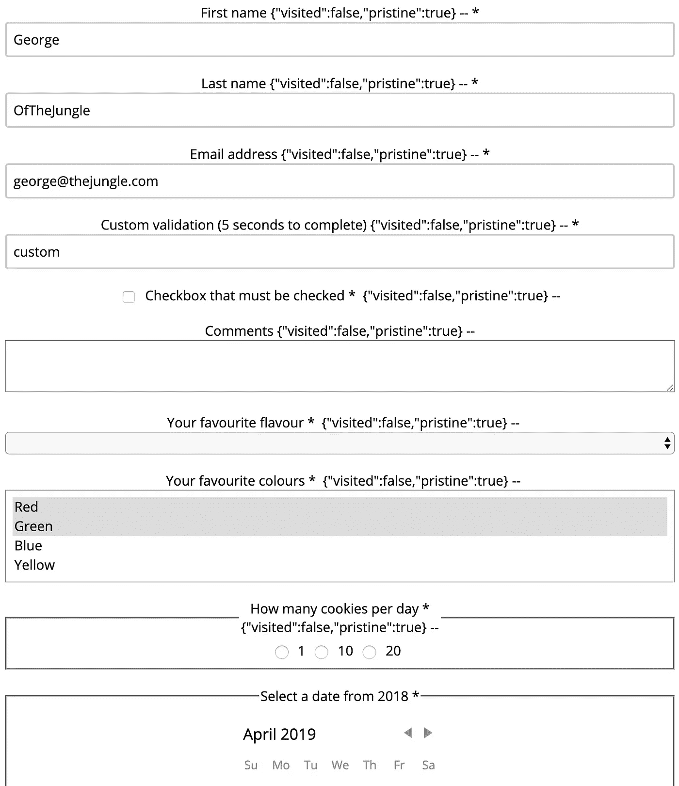
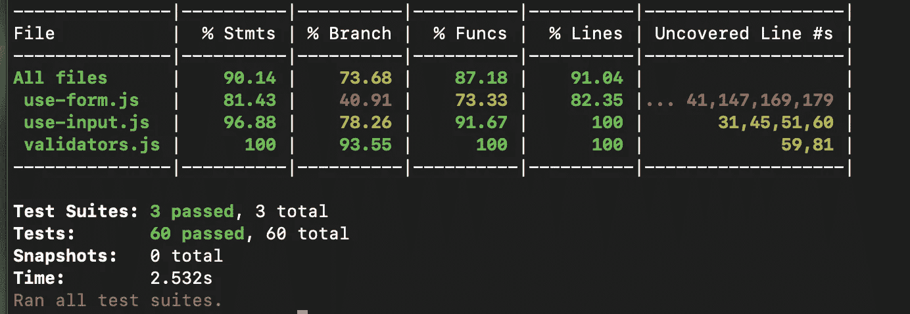

# react Hooks——设计简单的表单 API——第 4 部分——扩展到其他输入类型

> 原文：<https://itnext.io/react-hooks-designing-a-simple-forms-api-part-4-scaling-to-other-input-types-e738db0a3fc3?source=collection_archive---------2----------------------->



下面是我们将在第 4 部分中构建的表单元素

在本文中，我们将回过头来回答这个问题“我们的表单 API 会支持今天的大多数标准表单吗？”而这个问题的答案是，绝对不行！单选按钮、复选框、多选等。将无法正常工作。我们有一个很好的设计，但我们需要验证它是否可以扩展到支持其他输入类型。所以这将是我们这篇文章的目标。

在本系列的第 1 部分中，我们研究了如何使用 React 钩子来设计一个 React 表单库。第 1 部分介绍了这个库的动机和一些总体设计目标。

在本系列的第 2 部分[中，我们创建了一个`useInput`钩子，将其集成到我们的`useForm`钩子中，回顾了我们的解决方案的状态管理，合并了一些额外的测试，并且更详细地回顾了测试策略。](https://medium.com/@shanplourde/react-hooks-designing-a-simple-forms-api-part-2-1fe5d12f23d9)

在第 3 部分中，我们讨论了验证、异步验证和异步表单提交。它为我们提供了基于 React hooks 的表单 API 的关键元素。

# 工作示例

让我们来看看这一部分将包含的所有内容的演示。

示例表单展示了我们将在第 4 部分中开发的所有表单特性

[完整的解决方案可以在我的 github](https://github.com/shanplourde/react-hooks-form-util) 中找到。演示中有很多样板文件，但我希望在这一点上有非常明确的例子。请注意，由于 CodeSandbox 设计决定不支持从`package.json`加载`devDependencies`，测试在此时没有通过 CodeSandbox。

# 设计公共 API 以支持其他输入类型

此时，`useForm`只支持基于文本的输入。我认为以下是最关键的后续步骤:

*   支持单选按钮组(`<input type=’radio’/>`)
*   支持复选框(`<input type=’checkbox’/>`)
*   支持多值选择(`<select multiple=’true’/>`)
*   支持自定义输入，如日期选择器
*   允许自定义组件基于类或基于函数
*   确保验证支持库存 HTML 输入类型和定制组件
*   确保我们的库允许定制组件挂钩到`onBlur`和`onFocus`，以便可以跟踪验证、访问状态和原始状态

表单创建者不应该做任何特殊的事情来让标准的 HTML 输入工作，只需要在需要的时候做一些 HTML 特定的实现细节。但是他们不应该担心那些实现细节。我们将在本文中回顾实现示例。

## 定制输入设计要求

自定义输入应该遵循一致的 API。`useForm.addInput`用于配置一个新的输入，无论是标准的 HTML 输入还是自定义输入。`useForm.addInput`返回定制组件应该支持的一堆输入属性。下面是输入属性`useForm.addInput`的返回结果:

*   `id`:输入 id 允许`useForm`跟踪表单字段(必填)
*   `value`:输入值(必输项)
*   `onFocus`:允许`useInput`跟踪输入是否被访问过
*   `onBlur`:允许`useForm`在模糊时验证组件
*   `onChange`:允许`useInput`跟踪输入值是否已经改变(`pristine`)(必需)

所有这些属性都是标准的 React 属性和事件。这使得 API 与 React 的模型保持一致。


图 1 —定制组件和输入道具

如图 1 所示，要添加一个定制组件:

1.  定义您的 React 自定义组件
2.  在自定义组件中实现从`addInput`返回的`id` 和`value`属性
3.  在自定义组件中调用从`addInput`返回的`onChange`事件。`onChange`需要传递两个值，事件值和输入值。`useForm`不知道`value`属性在定制组件的事件对象中的位置，所以明确该值可以简化事情
4.  可选地在您的定制组件中实现从`addInput`调用返回的`onFocus`和`onBlur`函数。这允许`useInput`跟踪访问过的和原始的状态，也允许对模糊进行表单验证

## 支持`useForm`的定制组件示例

让我们创建一个使用 [react-day-picker](https://github.com/gpbl/react-day-picker) 组件的样本日期选择器组件。我们的组件支持所有`useForm`支持的属性。例如，有自定义模糊和对焦功能。请注意，我们的组件是一个类组件。使用`useForm`的组件可以是基于类或函数的，没有限制。

我们的定制组件没有任何显式的`useForm`依赖关系。这使得定制组件很好地与`useForm`库解耦，而不是调用`props.onChange`、`props.onBlur`和`props.onFocus`(如果它们存在的话)。这些是`useForm`库使用的事件。

在`render`中，`<DayPicker {…this.props} />`展开传递给组件的所有`useForm`属性。

```
import React from "react";
import DayPicker from "react-day-picker";
import "react-day-picker/lib/style.css";export class DatePicker extends React.Component {
  handleOnDayClick = (value, modifiers, event) => {
    console.log("custom change code...");
    this.props.onChange && this.props.onChange(event, value);
  };
  handleOnBlur = event => {
    console.log("custom blur code...");
    this.props.onBlur && this.props.onBlur(event, this.props.value);
  };
  handleOnFocus = event => {
    console.log("custom focus code...");
    this.props.onFocus && this.props.onFocus(event);
  };render() {
    const { value } = this.props;return (
      <React.Fragment>
        <DayPicker
          onDayClick={this.handleOnDayClick}
          {...this.props}
          onBlur={this.handleOnBlur}
          onFocus={this.handleOnFocus}
        />
        {value && <p>You clicked {value.toLocaleDateString()}</p>}
      </React.Fragment>
    );
  }
}
```

**使用自定义组件和使用表单**

使用定制组件与使用普通 HTML 组件是一样的。在下面的示例表单代码中，我们创建了一个定制验证，并使用`api.addInput`函数来配置我们的定制组件并连接验证。

我们看到从表单的`useForm`调用中返回了`api`。这个 API 允许表单创建者为他们的表单定义输入。代码然后调用`api.addInput`来注册新的`preferredDate`日期字段。当调用`api.addInput`时，新的`dateRangeValidator`被传递，这允许`useForm`使用验证器，并使用其余的标准`useForm`验证错误来跟踪验证错误。这应该使表单验证更容易推理和维护。

最后，我们有了`<DatePicker {…preferredDate.getInputProps()} />`,这就是我们如何将所有的`api.addInput`属性传递给我们的定制组件。就是这样！

```
import { DatePicker } from "./date-picker";...function KitchenSink(props) {
  const { getFormProps, formValues, uiState, **api**, formValidity } = useForm(
    "settingsForm",
    {
      firstName: "George",
      lastName: "OfTheJungle",
      email: "[george@thejungle.com](mailto:george@thejungle.com)",
      custom: "custom",
      agreeToTerms: false,
      comments: "",
      favouriteFlavour: "",
      favouriteColours: ["red", "green"],
      cookiesPerDay: null,
 **preferredDate: null**
    }
  );...// Not a real reference example of how to validate dates :)
  const dateRangeValidator = createValidator({
    validateFn: date => {
      const startDate = new Date(2018, 1, 1);
      const endDate = new Date(2018, 12, 33);
      return date && date >= startDate && date <= endDate;
    },
    error: "DATE_RANGE_ERROR"
  });const preferredDate = api.addInput({
    id: "preferredDate",
    value: formValues.preferredDate,
    validators: [
      { ...required, when: ["onBlur", "onSubmit"] },
      { ...dateRangeValidator, when: ["onBlur", "onSubmit"] }
    ]
  });<fieldset className="field-group">
          <legend>Select a date from 2018</legend>
 **<DatePicker {...preferredDate.getInputProps()} />**
          <div>
            {JSON.stringify(preferredDate.uiState)} --{" "}
            {JSON.stringify(formValidity.preferredDate)}
          </div>
</fieldset>
```

# **实现股票 HTML 输入**

## **复选框**

复选框期望`value`为布尔值。在下面的代码示例中，表单代码添加了一个`agreeToTerms`输入。输入使用股票`mustBeTrue`验证器，它期望给定输入的`value`等于 true。我们设置验证运行`onBlur`和`onSubmit`。我们用代码`<input type=”checkbox” **{…agreeToTerms.getCheckProps()}** />`扩展从`api.addInput`返回的输入属性。`mustBeTrue`是一个新的股票验证器，用于验证复选框是否被选中。

**与复选框相关的表单代码示例:**

```
///
const agreeToTerms = api.addInput({
    id: "agreeToTerms",
    value: formValues.agreeToTerms,
    validators: [{ ...mustBeTrue, when: ["onBlur", "onSubmit"] }]
  });///
<input type="checkbox" {...agreeToTerms.getCheckProps()} />
          <label htmlFor={agreeToTerms.id}>
            Checkbox that must be checked *
          </label>
```

**与复选框相关的 use-input.js 代码:**

```
const getCheckProps = inputProps => ({
    ...getSharedProps(),
 **checked: value,**
    ...(typeof inputProps === "function" ? inputProps(props) : inputProps)
  });
```

**与复选框相关的 validators.js 代码**

```
validators.mustBeTrue = createValidator({
  validateFn: value => value !== null && value !== undefined && value === true,
  error: "MUST_BE_TRUE"
});
```

## **单选按钮**

单选按钮需要跟踪`value`和`checked`。这与文本输入和复选框不同，前者只跟踪值，后者只跟踪选中的值。要添加一组单选按钮，调用`api.addRadioGroup`。没有必要传递单选选项。对于每个`<input type=”radio” />`，我们调用`getInputProps`并传递一个唯一的单选按钮`id`。但是每个单选按钮都获得相同的`name`值。这是配置单选按钮组的标准 HTML 方式。

与单选按钮相关的表单代码示例:

```
///const cookieOptions = [
    { id: "1", value: "1" },
    { id: "10", value: "10" },
    { id: "20", value: "20" }
  ];
const cookiesPerDay = api.addRadioGroup({
    id: "cookiesPerDay",
    value: formValues.cookiesPerDay,
    validators: [{ ...required, when: ["onBlur", "onSubmit"] }]
  });///<fieldset className="field-group">
          <legend>
            How many cookies per day *
            <br />
            {JSON.stringify(cookiesPerDay.uiState)} --{" "}
            {JSON.stringify(formValidity.cookiesPerDay)}
          </legend>
          {cookieOptions.map(cookie => (
            <React.Fragment key={cookie.id}>
 **<input
                {...cookiesPerDay.getInputProps({
                  name: "cookiesPerDay",
                  id: `cookiesPerDay_${cookie.id}`,
                  value: cookie.value
                })}
                type="radio"
                checked={cookie.value === formValues.cookiesPerDay}
              />**              <label htmlFor={`cookiesPerDay_${cookie.id}`}>
                {cookie.value}
              </label>
            </React.Fragment>
          ))}
</fieldset>
```

**与单选按钮相关的 use-form.js 代码**

每当单个单选按钮模糊时，就会触发`onRadioGroupBlur`功能。然而，当用户在同一个组中的单选按钮之间移动时，我们不希望引发 onBlur 事件。因此`onRadioGroupBlur`调用`isBlurWithinRadioGroup`来查看模糊是否到达同一个组中的单选按钮，或者其他什么地方。这要求表单创建者确保组中的每个单选按钮都有相同的`name`属性值。

```
const isBlurWithinRadioGroup = (event, id) =>
    event.relatedTarget && event.relatedTarget.getAttribute("name") === id;const onRadioGroupBlur = async ({ id, value, event }) => {
    if (isBlurWithinRadioGroup(event, id)) return;if (validators[id]) {
      if (isValidatorAlreadyRunning(id, value)) {
        // No need to do anything at this point since validator is already running
        return;
      }setFormValidity({
        ...formValidity,
        [id]: { ...formValidity[id], isValidating: true, value }
      });
      const validationResults = await runValidators({
        field: id,
        validators: validators[id],
        eventType: "onBlur",
        value
      });
      setFormValidity({ ...formValidity, [id]: validationResults });
    }
  };
```

## **多选**

多重选择使用字符串值数组。在下面的表单代码中，我们将`favouriteColours`初始化为`[“red”, “green”]`。然后我们用`api.addInput`初始化`favouriteColours`。与单选按钮组一样，我们不传递值的集合。最后，我们使用带有`<select {…favouriteColours.getInputProps()} multiple={true}>`的输入，这与文本输入的用法相同。

当我们扩展`favouriteColours.getInputProps()`时，我们得到一个`value=[“red”, “green”]`属性，该属性扩展到`<select />`标签中。这就是 React 期望将多选值传递给选择输入的方式。

```
const { getFormProps, formValues, uiState, api, formValidity } = useForm(
    "settingsForm",
    {
      firstName: "George",
      lastName: "OfTheJungle",
      email: "[george@thejungle.com](mailto:george@thejungle.com)",
      custom: "custom",
      agreeToTerms: false,
      comments: "",
      favouriteFlavour: "",
 **favouriteColours: ["red", "green"],**
      cookiesPerDay: null,
      preferredDate: null
    }
  );/// const favouriteColours = api.addInput({
    id: "favouriteColours",
    value: formValues.favouriteColours,
    validators: [{ ...required, when: ["onBlur", "onSubmit"] }]
  });///<div className="field-group">
          <label htmlFor={favouriteColours.id}>Your favourite colours *</label>
          {JSON.stringify(favouriteColours.uiState)} --{" "}
          {JSON.stringify(formValidity.favouriteColours)}
          <select {...favouriteColours.getInputProps()} multiple={true}>
            <option value="red">Red</option>
            <option value="green">Green</option>
            <option value="blue">Blue</option>
            <option value="yellow">Yellow</option>
          </select>
        </div>
```

**多选相关的 use-input.js 代码**

`getInputValue`是生成多选值的地方。对于多重选择(`type === “select-multiple”`)，我们迭代选择的选项，找到被选择的选项，并基于被选择的选项创建一个值数组。选择选项作为 React 合成事件的一部分传递，用于更改、模糊和聚焦。因此表单创建者不必将选择选项传递给`addInput`。

```
const getInputValue = ({ type, checked, value, options }) => {
  if (type === "checkbox") return checked;
  if (type === "select-multiple")
    return [...options]
      .map(option => ({
        value: option.value,
        selected: option.selected
      }))
      .filter(option => option.selected)
      .map(option => option.value);
  if (type === "radio") {
    if (checked) return value;
    return undefined;
  }
  return value;
};
```

# 使用表单代码更改来支持自定义输入

在这一点上，支持定制输入不需要进行大的改变。为库存 HTML 输入奠定的基础支持定制输入。

# 第 3 部分的错误修复

第 3 部分中的一些错误已经得到了修复:

*   必需的验证器现在可以处理空值或未定义的值
*   即使第一个输入产生了验证错误，对单个输入的所有验证都会运行。我倾向于在出现第一个验证错误后停止处理，以避免不必要的验证逻辑检查、网络往返等。验证码会更新以反映这一点
*   我几乎在所有地方都将`name`重命名为`id`,因为这个库并没有真正将 id 扩展为`name`属性，而`id`是一个更为一致的术语，用于描述事物的唯一 ID
*   在表单提交期间，`useForm`没有验证`onSubmit`验证器。它之前正在验证`onBlur`验证器
*   `useForm`通过异步验证以不正确的方式改变验证状态。它现在使用更加一致的方法来改变验证状态，与 [useRef React hook](https://reactjs.org/docs/hooks-reference.html#useref) 同时运行验证。我计划写一篇关于这个的文章，因为这是使用`setState`管理共享状态时可能遇到的常见问题，共享状态可能会以不确定的顺序异步更新。在这种情况下，`useRef`可以帮助解决这些问题，因为`useState`保证了一个钩子的完整功能执行的状态的一致拷贝

# 单元测试和代码覆盖率—💯% ?

到目前为止，我只是在编写单元测试，而没有检查代码覆盖率。我们的单元测试覆盖了很多标准路径，但是它们没有提供 100%的覆盖率。不过话说回来，我们可能不需要 100%的覆盖率。我们甚至可能不需要 90%的覆盖率，但我们可能应该有超过 40%或 50%的覆盖率。



不错，但是测试覆盖率需要提高

Martin Fowler 关于测试覆盖率的文章有一些值得考虑的问题:

> 如果你把一定程度的覆盖率作为一个目标，人们会努力去实现它。问题是高覆盖率的数字太容易被低质量的测试所达到。
> 
> 如果以下是真的，我会说你做了足够的测试:
> 
> -你很少会遇到逃脱到产品中的 bug，并且
> -你很少会因为担心会导致产品 bug 而犹豫改变一些代码。

我认识的大多数人都和福勒先生有相似的观点。我目睹过测试覆盖率低得可怕的生产代码库，以及测试覆盖率高的生产代码库。出于输入库的目的，我倾向于确保所有代码路径都经过了所有级别的测试，因为可以独立于其他部分使用 API 的各个方面。

使用 Jest，只需添加`--coverage` [就可以自动获得代码覆盖报告](https://jestjs.io/docs/en/cli#coverage)。然后，这些报告可以在持续构建/持续集成环境中使用，但是目前测试将在开发期间从终端窗口运行。

# 放大演示表单

演示表单现在演示了以下内容:

*   模糊和提交时的复选框和“必须选中”验证
*   模糊和提交时的单选按钮组和验证
*   模糊时选择输入和验证并提交
*   模糊和提交时的多选输入和验证
*   自定义组件(即日期选择器)和模糊和提交时的验证

查看在线演示和 github 资源库中的代码，了解一切如何协同工作。

# 摘要

在这篇文章中，我们扩展了表单库以支持大多数标准的 HTML 输入，以及自定义输入。我们修复了第 3 部分中存在的一些错误，讨论了测试覆盖范围，并扩展了我们的表单示例。

在后面的部分中，我们将讨论其他主题，比如减少样板文件、从 JSON 模式添加验证、承诺取消、去抖动、钩子性能考虑和其他设计优化。

此时，该库可能已经“足够好”可以用于生产了😃。在开始自己制作表单库之前，请记住制作一个“足够好”的表单库需要付出的努力和思考！

除非您有一个不需要验证逻辑的极其简单的表单，是的，您可以用 React 拼凑一个表单，但是它会非常有限。一旦你需要越过简单的表单，使用表单库。否则你可能没有充分利用你的时间。除非你是出于自己的学习目的，当然，我总是建议通过开发你感兴趣的东西来学习。

如果您有任何问题、反馈或建议，或者您希望我介绍本系列中的其他内容，请告诉我。