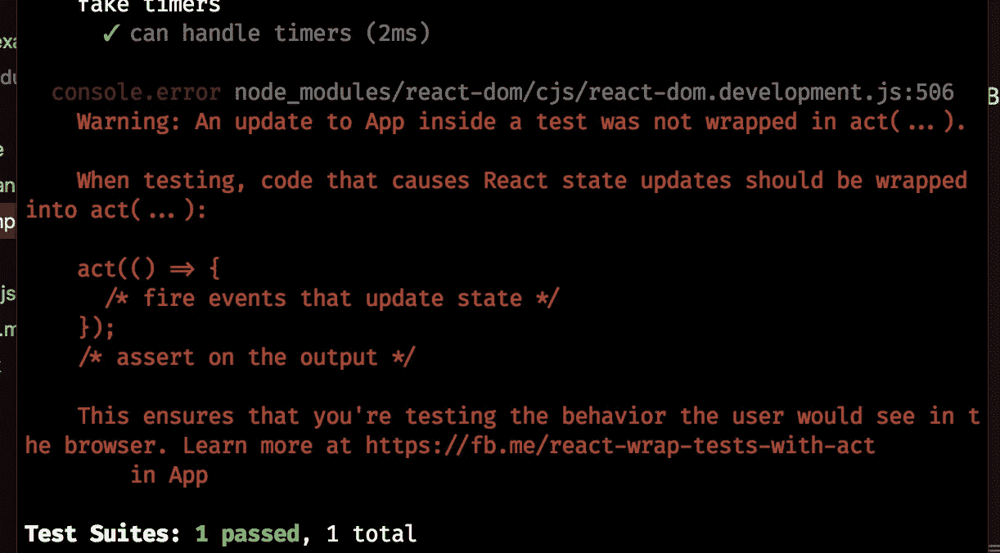

# react Hooks——设计简单的表单 API——第 5 部分——动态表单

> 原文：<https://itnext.io/react-hooks-designing-a-simple-forms-api-part-5-dynamic-forms-b8ceea4a4ff?source=collection_archive---------5----------------------->

在本文中，我们将确保我们的 React 基于钩子的表单库能够支持动态表单，并在此过程中了解一些关于钩子状态和钩子测试的有趣事情。我们的库已经支持带有预定义输入集的表单，但是它不支持输入数量需要随着时间增加或减少的表单。

在本系列的第 1 部分[中，我们研究了如何使用 React 钩子来设计一个`useForm` React 表单库。第 1 部分介绍了这个库的动机和一些总体设计目标。](https://medium.com/@shanplourde/react-hooks-designing-a-simple-forms-api-part-1-307b04bc6007)

在本系列[的第 2 部分](https://medium.com/@shanplourde/react-hooks-designing-a-simple-forms-api-part-2-1fe5d12f23d9)中，我们创建了一个`useInput`钩子，将其集成到我们的`useForm`钩子中，回顾了我们的解决方案的状态管理，合并了一些额外的测试，并更详细地回顾了测试策略。

在第 3 部分中，我们讨论了验证、异步验证和异步表单提交。它为我们提供了基于 React hooks 的表单 API 的关键元素。

[在第 4 部分](/react-hooks-designing-a-simple-forms-api-part-4-scaling-to-other-input-types-e738db0a3fc3)中，我们扩展了我们的解决方案，以支持标准 HTML 输入类型和自定义输入。

# 工作示例

让我们来看看这一部分将包含的所有内容的演示。

演示我们将从第 5 部分开发的动态表单

[完整的解决方案可以在我的 GitHub](https://github.com/shanplourde/react-hooks-form-util) 中找到。演示中有很多样板文件，但我希望在这一点上有非常明确的例子。请注意，由于 CodeSandbox 设计决定不支持从`package.json`加载`devDependencies`，测试在此时没有通过 CodeSandbox。

# 支持动态改变表单输入的动机

我能想到许多添加或删除表单字段的功能有用的表单示例。例如:

*   捕获表格数据，并允许用户添加或删除行
*   你的工作或居住历史(我最近不得不填写这些表格中的一种，作为我即将开始的新工作的背景调查的一部分😃)
*   基本上任何 1:n 的数据输入场景

这个特性肯定会增加价值，我认为确保`useForm`设计支持它是值得的。

# 设计支持动态表单的公共 API

`useForm`允许表单开发人员使用`api.addInput`功能添加新的输入。但是表单开发人员不能删除输入，如果表单已经呈现，当前版本的`api.addInput`就会中断。

## 将 api.removeInput 添加到`useForm` API

`api.removeInput`应该允许从现有表单中删除输入。当被调用时，它应该移除与被移除的输入相关联的所有状态，例如输入值、验证状态等。

## 修正了`api.addInput`不允许新输入被添加到渲染表单的错误

虽然`api.addInput`是添加新输入的基础，但 React 钩子有一个关键要求——渲染的钩子数量必须等于上一个渲染周期。

这是问题的根本原因。点击这里查看我的相关文章。本质上，我的`useInput`钩子不支持动态表单，因为 React 钩子在每个渲染周期都需要这种一致性。很高兴知道你是否打算用钩子来设计一个可以伸缩的结构。

# 实施细节

`api.removeInput`是对`useForm`的一个微不足道的补充。它只需要删除与被删除的输入相关联的所有状态:

```
const removeInput = id => {
    delete inputs[id];
    delete inputUiState[id];
    delete validators[id];
    delete formValidity[id];
    delete inputValues[id];
    delete originalValues[id];setInputUiState(inputUiState);
  };
```

`useInput`是一个钩子，React 不允许我们使用它来增加或减少输入，因为钩子的设计决策要求在渲染周期中调用的钩子数量保持一致。所以我们必须移除`useInput`钩子，并将`useInput`管理的所有状态移入`useForm`。

## 使用输入状态摘要

useInput 保持以下状态。所有这些状态都需要转移到`useForm`:

*   `inputValue`
*   `originalValue` —用于跟踪原始状态
*   `visited` —当输入获得焦点时改变

## 使用表单状态摘要

`useForm`已经跟踪所有输入值。所以`useInput.inputValue`在某种程度上是多余的。useForm 不需要做任何事情来支持`useInput.inputValue`。

## 使用输入⟹input.js

由于`useInput`不再是钩子，我决定改名为`input.js`。`createInput`是取代`useInput`的新功能。`createInput`没有国家。所有状态将由`useForm`管理。因此，`createInput`确保对于它处理的每个事件，它都将事件传递给传入的`props`。

```
const getInputValue = ({ type, checked, value, options }) => {
  if (type === "checkbox") return checked;
  if (type === "select-multiple")
    return [...options]
      .map(option => ({
        value: option.value,
        selected: option.selected
      }))
      .filter(option => option.selected)
      .map(option => option.value);
  if (type === "radio") {
    if (checked) return value;
    return undefined;
  }
  return value;
};export const createInput = ({ id, value, props = {} }) => {
  const getSharedProps = () => ({
    id,
    ...props,
    onChange: (event, inputValue) => {
      const value = inputValue || getInputValue(event.target);
      props.onChange && props.onChange({ event, id, value });
    },
    onBlur: (event, inputValue) => {
      const value = inputValue || getInputValue(event.target);
      props.onBlur && props.onBlur({ event, id, value });
    },
    onFocus: evt => {
      props.onFocus && props.onFocus({ evt, id, value });
    }
  });const getInputProps = inputProps => ({
    ...getSharedProps(),
    value: value,
    ...(typeof inputProps === "function" ? inputProps(props) : inputProps)
  });const getCheckProps = inputProps => ({
    ...getSharedProps(),
    checked: value,
    ...(typeof inputProps === "function" ? inputProps(props) : inputProps)
  });return {
    id,
    value,
    getInputProps,
    getCheckProps
  };
};
```

## 使用表单更改

在这次`useForm`的迭代中，最大的变化是迁移了所有由`useInput` hook 管理的状态。 `api.removeInput`被添加。

**异步验证码发布和修复**

我之前使用了一个`useRef`钩子来试图通过异步验证保持最新的状态。我忘记了`useState`和`setState`几乎是一样的，所以如果你需要根据当前状态改变状态为一个值，你需要使用函数版本的 useState。例如:

```
const [formValidity, setFormValidity] = useState({});...setFormValidity(current => ({
        ...current,
        [id]: { isValidating: true, value }
      }));
```

useForm.js 的完整源代码如下:

```
import { useState, useRef } from "react";
import { createInput } from "./input";
import { runValidators, validateInputEvents } from "./validators";export const defaultFormProps = {
  autoComplete: "on"
};export const useForm = ({ id, initialState = {} }) => {
  const [inputValues] = useState({
    ...initialState
  });
  const [formValidity, setFormValidity] = useState({});
  const [validators] = useState({});
  const [uiState, setUiState] = useState({
    isValidating: false,
    isValid: true,
    isSubmitting: false
  });
  const [inputs] = useState({});
  const [inputUiState, setInputUiState] = useState({});
  const [originalValues] = useState({});const validationRuntimeMap = useRef(new Map());const validateAll = async eventType => {
    const promises = [];
    let newUiState = { ...uiState };Object.keys(validators).forEach(async field => {
      promises.push(
        runValidators({
          field,
          validators: validators[field],
          eventType,
          value: inputs[field].value,
          inputValues
        })
      );
    });newUiState = {
      ...newUiState,
      isValidating: true
    };
    setUiState(newUiState);const results = await Promise.all(promises).catch(() => {
      // Do nothing, validation library handles errors.
    });
    results.forEach(result => {
      formValidity[result.field] = result;
    });setUiState({ ...newUiState, isValidating: false });
  };const onSubmit = async (evt, props) => {
    evt.preventDefault();
    let newUiState = { ...uiState };
    try {
      await validateAll(validateInputEvents.onSubmit, evt.timeStamp);
      const isFormValid = !Object.keys(formValidity).some(
        field => !formValidity[field].valid
      );newUiState = {
        ...newUiState,
        isSubmitting: true,
        isValid: isFormValid
      };
      setUiState(newUiState);
      if (props.onSubmit) {
        await props.onSubmit({ evt, inputValues });
      }
    } catch (e) {
      setUiState({ ...newUiState, isSubmitting: false });
    } finally {
      setUiState({ ...newUiState, isSubmitting: false });
    }
  };const getFormProps = (props = {}) => ({
    ...defaultFormProps,
    ...props,
    onSubmit: evt => {
      onSubmit(evt, props);
    }
  });const onInputChange = ({ event, id, value }) => {
    inputValues[id] = value;
    setInputUiState({
      ...inputUiState,
      [id]: { ...inputUiState[id], pristine: value === originalValues[id] }
    });runInputValidations({
      id,
      value,
      eventType: validateInputEvents.onChange,
      timeStamp: event.timeStamp
    });
  };const isValidatorAlreadyRunning = (id, value) =>
    formValidity[id] &&
    formValidity[id].isValidating &&
    formValidity[id].value === value;// Discard oldest async validations on a given input
  const isCurrentValidationRunLatest = (runtimeMap, id, timeStamp) =>
    runtimeMap.get(id) === undefined || runtimeMap.get(id) <= timeStamp;const runInputValidations = async ({ id, value, eventType, timeStamp }) => {
    validationRuntimeMap.current.set(id, timeStamp);
    const filteredValidators = validators[id].filter(validator => {
      return validator.when.some(whenItem => whenItem === eventType);
    });
    if (filteredValidators.length === 0) return;if (validators[id]) {
      const isCurrentRunLatest = () =>
        isCurrentValidationRunLatest(
          validationRuntimeMap.current,
          id,
          timeStamp
        );if (isValidatorAlreadyRunning(id, value)) {
        // No need to do anything at this point since validator is already running,
        return;
      }
      if (!isCurrentRunLatest()) return;setFormValidity(current => ({
        ...current,
        [id]: { isValidating: true, value }
      }));if (!isCurrentRunLatest()) return;if (!isCurrentRunLatest()) return;setFormValidity(current => ({
        ...current,
        [id]: { ...current[id], isValidating: true, value }
      }));if (!isCurrentRunLatest()) return;try {
        const validationResults = await runValidators({
          field: id,
          validators: validators[id],
          eventType: eventType,
          value,
          runId: timeStamp,
          inputValues
        });if (!isCurrentRunLatest()) return;setFormValidity(current => ({ ...current, [id]: validationResults }));
      } catch {
        // Do nothing, validation library handles errors
      }
    }
  };const onInputBlur = async ({ event, id, value }) => {
    runInputValidations({
      id,
      value,
      eventType: validateInputEvents.onBlur,
      timeStamp: event.timeStamp
    });
  };const onInputFocus = ({ event, id }) => {
    setInputUiState({
      ...inputUiState,
      [id]: { ...inputUiState[id], visited: true }
    });
  };const isBlurWithinRadioGroup = (event, id) =>
    event.relatedTarget && event.relatedTarget.getAttribute("name") === id;const onRadioGroupBlur = async ({ id, value, event }) => {
    if (isBlurWithinRadioGroup(event, id)) return;runInputValidations({
      id,
      value,
      eventType: validateInputEvents.onBlur,
      timeStamp: event.timeStamp
    });
  };const addInput = ({
    id,
    value,
    validators: inputValidators = [],
    inputProps = {
      onChange: onInputChange,
      onBlur: onInputBlur,
      onFocus: onInputFocus
    }
  }) => {
    originalValues[id] =
      typeof originalValues[id] === "undefined" ? value : originalValues[id];
    inputValues[id] =
      typeof inputValues[id] === "undefined" ? value : inputValues[id];const input = createInput({
      id,
      value: inputValues[id],
      props: inputProps
    });
    inputs[id] = input;
    inputUiState[id] = inputUiState[id] || {
      pristine: true,
      visited: false
    };
    validators[id] = inputValidators;
    return input;
  };const addRadioGroup = ({ id, value, validators = [], inputProps }) => {
    const input = addInput({
      id,
      value,
      validators,
      inputProps: {
        ...inputProps,
        onChange: onInputChange,
        onBlur: onRadioGroupBlur,
        onFocus: onInputFocus
      }
    });
    return input;
  };const removeInput = id => {
    delete inputs[id];
    delete inputUiState[id];
    delete validators[id];
    delete formValidity[id];
    delete inputValues[id];
    delete originalValues[id];setInputUiState(inputUiState);
  };return {
    id,
    getFormProps,
    formValidity,
    uiState,
    inputs,
    inputValues,
    inputUiState,
    api: {
      addInput,
      addRadioGroup,
      removeInput
    }
  };
};
```

# 测试更新

作为此次更新的一部分，对测试进行了许多更改。在我的测试中，我没有始终如一地使用`act()`。我从 threepointone 的 [react-act-examples](https://github.com/threepointone/react-act-examples/blob/master/sync.md) 中学到了一些好的技巧，帮助我提高了对`act()`的使用。

在我的钩子测试中，我在嘲笑计时器。在我的一些测试中，时间的流逝会更新状态。例如，模拟长时间运行验证的异步测试使用 setTimeout，因此验证库将首先将`useForm.uiState`验证状态设置为`isValidating`，这是我想要测试的，然后一旦时间过去，`uiState.isValidating`将被设置为`false`，并且验证结果被设置。

我对`jest.runAllTimers`的调用修改了钩子的状态，任何时候钩子的状态被修改，你调用的函数应该被包装在一个动作中，即`act(() => jest.runAllTimers());`。这可以减轻终端中的测试警告，如下图所示:



由于 jest.runAllTimers()修改挂钩状态但未在 act()内调用，导致测试警告

```
it("should be able to add an input with valid asynchronous validation and get correct formValidity input state", async () => {
    const customValidator = createValidator({
      validateFn: async ({ value }) =>
        await new Promise(resolve => {
          setTimeout(() => resolve(true), 1);
        }),
      error: "CUSTOM_ASYNC_ERROR"
    });const { result, waitForNextUpdate } = renderHook(() =>
      useForm({ id: "test" })
    );act(() => {
      result.current.api.addInput({
        id: "test",
        value: "",
        validators: [{ ...customValidator, when: [validateInputEvents.onBlur] }]
      });
    });
    act(
      async () =>
        await result.current.inputs.test.getInputProps().onBlur({
          preventDefault: noop,
          target: {
            value: ""
          }
        })
    );
    expect(result.current.formValidity).toEqual({
      test: { isValidating: true, value: "" }
    });act(() => jest.runAllTimers());
    await waitForNextUpdate();expect(result.current.formValidity).toEqual({
      test: { field: "test", valid: true }
    });
  });
```

# 摘要

在这篇文章中，我们重构了我们的解决方案以支持动态表单，并创建了一个动态表单示例。

在后面的部分中，我们将讨论其他主题，比如减少样板文件、从 JSON 模式添加验证、承诺取消、去抖动、钩子性能考虑和其他设计优化。

此时，该库可能已经“足够好”可以用于生产了😃。在开始自己制作表单库之前，请记住制作一个“足够好”的表单库需要付出的努力和思考！

除非您有一个不需要验证逻辑的极其简单的表单，是的，您可以用 React 拼凑一个表单，但是它会非常有限。一旦你需要越过简单的表单，使用表单库。否则，你可能没有充分利用你的时间。除非你是出于自己的学习目的，当然，我总是建议通过开发你感兴趣的东西来学习。

如果您有任何问题、反馈或建议，或者您希望我介绍本系列中的其他内容，请告诉我。