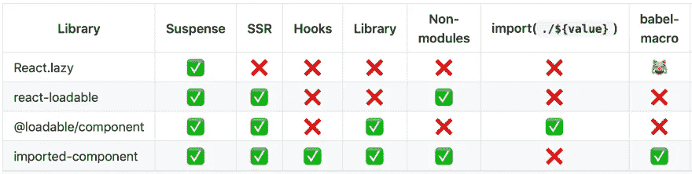
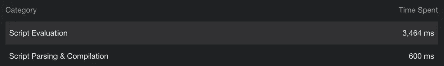
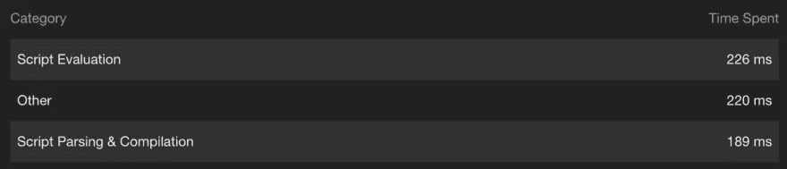
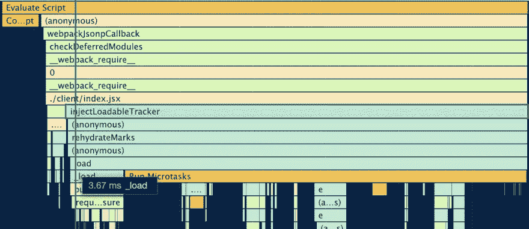
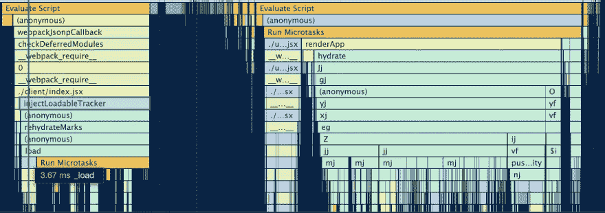

# 📦反应导入组件 v6

> 原文：<https://itnext.io/react-imported-component-v6-430a51ed8186?source=collection_archive---------3----------------------->

React-imported-component v6 是第一个带有暴露的 **hooks API** 的代码拆分库，也是第一个 **Create-React-App 兼容的**库，这要感谢 babel **宏**的支持。


这艘船上有你可能需要的一切:先进的，简单的 API，**服务器端渲染**支持，加载优化，可以处理任何情况。下面是对比表:



功能对照表

准备好了吗？跳进来！

[](https://github.com/theKashey/react-imported-component) [## kashey/react-导入组件

### 它真的永远不会让你失望。一切都归功于你的 bundler。阅读有关此表显示的内容的更多信息关键…

github.com](https://github.com/theKashey/react-imported-component) 

# 使用进口挂钩

懒加载不仅仅是关于`React.lazy`和`Components`——在任何变体的背后，除了一个动态的`import`，它能够加载绝对的一切。您所需要的是一个适当的“反应集成”来管理加载状态。

```
// a STATIC table with imports
const languages = {
  'en': () => import('./i18n/en'), // it's probably a json...
  'de': () => import('./i18n/de'),
}
// just a helper function
const pickLanguage = (lng) => languages[lng];
// your componentconst MyI18nProvider = ({lng, children}) => {
  // let's pick and provide correct import function for our language
  const {
   imported: messages = {} // defaulting to empty object
  } = useImported(pickLanguage(lng)); // set messages to the Provider
  return <I18nProvider value={messages}>{children}</I18nProvider>
}
```

仅此而已。一旦呈现了这个组件，所需的语言将被导入并提供给上下文。您可以选择如何处理加载状态——通过设置一个`default`值，抛出到最近的`Suspense`，或者显示其他内容。这是个圈套——你想干什么就干什么。

`useImported`可以加载你想要的任何东西，任何其他由`react-imported-component`公开的 API 都建立在它的基础上。

# 导入模块和导入模块

`useImported`并不总是最佳选择，有时更具*宣示性的*可能更好。你知道，声明式是我们喜欢的反应。
于是，就有了一个助手，通过 react **渲染道具**接口导入你想要的任何东西。对于大多数人来说，这种模式更好地被称为 [loadable.lib](https://www.smooth-code.com/open-source/loadable-components/docs/library-splitting/) (然而它最初是为导入而引入的)

```
import {importedModule, ImportedModule} from 'react-imported-component';// you can use it to codesplit and  use `momentjs`, no offence :)
const Moment = importedModule(() => import('moment'));<Moment fallback="long time ago">
  {(momentjs /* default imports are auto-imported*/) => momentjs(date).fromNow()}
</Moment>// or, again, translations<ImportedModule
 import={() => import('./i18n/en')}
 // fallback="..." // will throw to the Suspense boundary without fallback provided
>
 {(messages) => <I18nProvider value={messages}>{children}</I18nProvider> }
</ImportedModule>
```

# 进口又懒

还有两个“通用”API—`imported`和`lazy`。
其中`lazy` -嘎嘎叫的像个`React.lazy`，**是**懒于生产，而`imported`是，嗯，用兼容代码拆分库*第一代*的 API 导入的老货。

```
const Component = importedComponent( () => import('./Component'), {
  LoadingComponent: Spinner, // what to display during the loading
  ErrorComponent: FatalError // what to display in case of error
});Component.preload(); // force preload// render it
<Component... />
```

# 额外的东西

# 创建 React 应用支持

关于 CRA，你应该知道三件事:

*   很难改变项目的配置，我们鼓励你不要这样做
*   它支持 SSR 或预渲染
*   这使得更好的代码分割变得有点复杂

然而，尽管其他 SSR 友好的代码分解解决方案需要 **babel** 和 **webpack** 插件才能工作，但`react-imported-component`不需要 webpack 中的任何东西，它是独立于 bundler 的，并提供了一个 **babel 宏**，这是 CRA 唯一开箱即用的东西。

就用`react-imported-component/macro`，收工

```
import {imported} from "react-imported-component/macro";imported(()=>import('./aGoodDay'));
```

在任何其他情况下也可以随意使用宏——它们比 babel 插件使用起来要方便得多，并且会使您的代码更具可移植性和可重用性。

# 联邦独立

这又意味着 3 件不同的事情:

*   它与**包裹捆绑器兼容**，或汇总，或系统 js。你用哪个捆扎机并不重要——他们可以一起玩。
*   它是[反应式快照](https://github.com/stereobooster/react-snap)兼容的。“使用追踪”从未停止，在一个无头浏览器中呈现你的页面后，你可能会问它——“你需要再次呈现相同的哪些块”，并得到一个列表。(有关详细信息，请阅读 react-snap 文档)。
*   它与非托管的【真实 一起工作。我的意思是未受污染的 es 进口，你可能会使用真正的 ESM 模块。基本没关系。
*   它**不如其他具有更深 bunlder 集成的代码分割解决方案有效，因此它们可以在 SSR 期间刷新使用过的块。正如我所说——的确如此。**

# 正在加载业务流程

让脚本再水合更快的第一个方法是让加载过程更高效。`imported-component`提供了一个独立的入口点- `/boot`在主脚本评估之前启动初始化过程，因此加载延迟脚本有点“早”。一个伟大的解决方案，为 CRA 或包裹，在那里你可能不知道真实的名字块文件(没有额外的插件安装)内联到 HTML。

```
import "../async-requires";
import {injectLoadableTracker} from "react-imported-component/boot";
// ^ just 1kb// injects runtime
injectLoadableTracker('importedMarks'); // give browser a tick to kick off script loading
Promise.resolve().then(() =>
  Promise.resolve().then(() => { 
    // the rest of your application
    // imported with a little "pause"
    require('./main')
  })
);
```

这很简单，有趣的是——你的 js 被解析，被评估，但是**没有完全执行**。然后`imported`将触发加载呈现页面所需的块，然后您的应用程序将继续执行。

让我提供两个 lighthouse 快照(4x 减速，3Mb JS 包)来解释这个想法:

*   在“双重承诺”中要求`main`，如上例所示



3500 毫秒加载脚本

*   在承诺中不需要`main`，就像上面的例子一样(只是把它移到了`catch`，所以它没有被执行。但是，所有代码仍然在包中)



更快的解析和评估，这是相同的脚本！

所以——我们需要 4200 毫秒来解析和执行整个脚本，而只需要 400 毫秒就可以到达“初始块”(别忘了我们说的是 x6 减速)。这就给了 3800 秒来加载其他所需的块。免费的。

这里有一个火焰图来解释这种巨大的差异。这是一个“第一”，左边部分是“最初的大块”，右边是“双重承诺”。



注意左边的小“时间盒”,右边是给浏览器的微任务“T1 ”,用来启动网络内容。

在给浏览器一些时间来做它的工作，并开始处理新的请求后，执行继续，这里是“第一”和“第二”块。



> 注意第一个“时间盒”有多小

这使得所有这些事情，比如脚本预加载和预取，变得不那么重要了——有了它们会更好，但即使没有它们,*也不会太差。因此，你可能有良好的 SSR 与 CRA 开箱即用。或者良好的 CRS，通过一些预测和预加载。*

如果不好，那就更好…

# 深度 Webpack 集成

然而，最好的结果需要更细粒度的方法。v6 的另一个变化——一个单独的 webpack 集成包——将会有所帮助。名字很明显:

 [## kashey/web pack-已导入

### 我们会以正确的方式进口你们的屁股。📝stats-web pack-插件和💩webpack-flush-chunks 有宝宝了！这将…

github.com](https://github.com/theKashey/webpack-imported) 

一个用于收集数据的 webpack 插件和一个服务器端 API，包括(可选的)React 绑定，用于处理开箱即用的一切。

```
import importedData from 'build/imported.json';<WebpackImport
   stats={importedData}
   chunks={getMarkedChunks(marks)}
   publicPath={importedData.config.publicPath}
   crossOrigin={CDN_ANONYMOUS}
/>
```

# 半铸钢ˌ钢性铸铁(Cast Semi-Steel)

CSS 也以最好的方式处理——用**关键风格提取**为普通的 CSS 文件开箱即用。

[](https://github.com/theKashey/used-styles) [## 时尚/旧风格

### 获取所有你用来渲染页面的样式。捆绑器和框架独立的 CSS 部分的 SSR 友好的代码…

github.com](https://github.com/theKashey/used-styles) 

上面所有的库都一起测试过，他们一起玩得很好。

# 流动

所有使用的库都有流友好的 API，并且能够提供你正在寻找的最好的 TTFB。

# 为什么为什么为什么

如果你在寻找为什么要进行代码拆分，拆分什么，何时进行代码拆分，以及如何优化 JS 或 CSS 交付的答案。

[](https://dev.to/thekashey/code-splitting-what-when-and-why-59op) [## ✂️电码化-什么，什么时候，为什么

### 什么？字面上是一个“什么”，一个“东西”，通常是一个组件。你还想要什么？什么时候？很难…

开发到](https://dev.to/thekashey/code-splitting-what-when-and-why-59op) [](https://dev.to/thekashey/optimising-js-delivery-4h6l) [## 🛳优化 JS 交付

### 从底层脚本交付系统中获得最大收益

开发到](https://dev.to/thekashey/optimising-js-delivery-4h6l) [](https://dev.to/thekashey/optimising-css-delivery-57eh) [## 🎨优化 CSS 交付

### 如果我告诉你——交付 JS 是一个超级简单的任务，而交付 CSS 是非常非常复杂的……

开发到](https://dev.to/thekashey/optimising-css-delivery-57eh) 

# 结论

*   钩子 API
*   加载模块
*   加载组件
*   使用服务器端跟踪
*   babel 宏支持
*   不绑定到 webpack，但是支持更深入的浏览器集成
*   专为您打造！

👉[https://github.com/theKashey/react-imported-component](https://github.com/theKashey/react-imported-component)