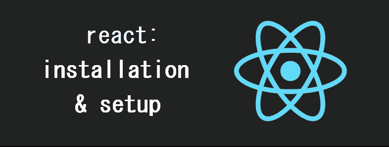
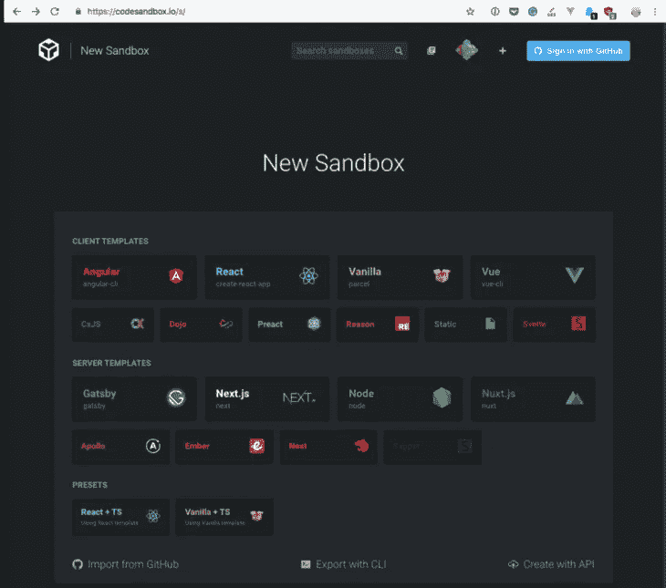
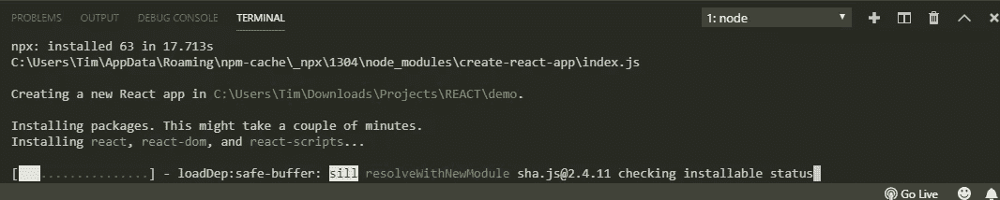
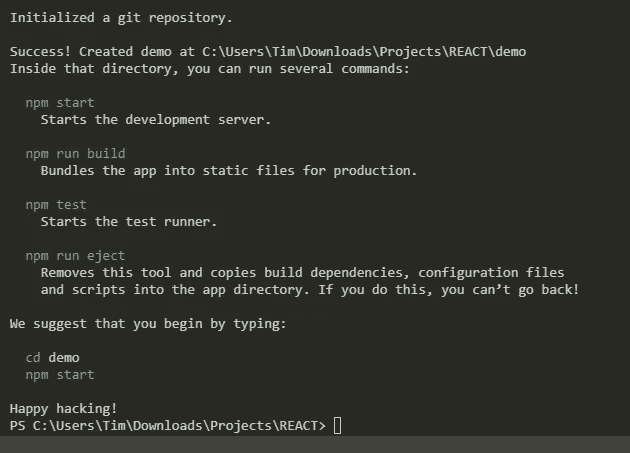
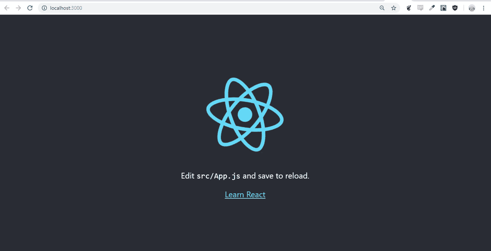
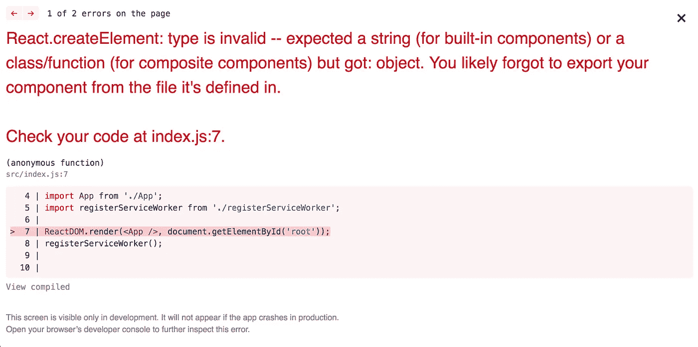

# 反应:安装和设置

> 原文：<https://itnext.io/react-installation-setup-3135fe8320a2?source=collection_archive---------4----------------------->



React 是目前最流行的用于构建 ui 的 JavaScript 库——在可预见的未来，这种趋势还将继续。在这篇文章中，我们将集中讨论如何快速、轻松地做出反应。所以我们可以直接进入编码了！

🤓想要了解最新的 web 开发吗？
🚀*想要将最新消息直接发送到您的收件箱吗？
🎉加入一个不断壮大的设计师&开发者社区！*

**在这里订阅我的简讯→**[**https://ease out . EO . page**](https://easeout.eo.page/)

**为什么反应？**

对于外行来说，React 允许我们通过使用虚拟 DOM 来构建速度极快的 web 应用程序——它本质上只呈现它需要的内容。为直接使用 [DOM](https://developer.mozilla.org/en-US/docs/Web/API/Document_Object_Model/Introduction) 的传统方式提供了一种轻量级的替代方式。

React 还促进了基于组件的工作流，这意味着你的 UI 本质上只是组件的集合。这是一种奇妙的建筑体验！当您使用模块化构建时，您的代码将会是整洁的自包含块。在团队中工作时，这也是非常有用的，个人可以在一个项目的一部分工作，同时仍然集体努力完成项目。

# 安装和设置

有许多方法可以启动并运行 React。首先，我们将看看 CodeSandbox 和 CodePen。如果您想立即开始玩代码，这是一个不错的方法！

然后，我们将重点关注使用 Create React 应用程序构建 React 项目——它为您的项目提供了一个极好的起点，而无需花费时间来设置构建环境。

# 在 CodeSandbox 中反应

CodeSandBox 是一个在线代码编辑器，您可以使用它来立即启动并运行 React 项目。

转到[https://codesandbox.io/s](https://codesandbox.io/s)并点击“反应”。



很快，您将处于一个 React 环境中，该环境已经配置了 *create-react-app* 结构。我们将在文章中进一步研究这个结构！如果您想在不设置本地安装的情况下开始编码，这是一个很好的方法！像传输文件、捆绑和依赖管理这样的任务都是自动化的，你可以很容易地分享你正在做的任何事情的链接！

# 在 CodePen 中反应

CodeSandBox 的一个替代方案是 [CodePen](https://codepen.io) 。许多开发人员使用 CodePen 来展示他们的工作，为快速代码演示创建“笔”,或为涉及多个文件时创建“项目”。CodeSandbox 对于使用 React 来说功能更加丰富，但是 CodePen 也是一个很好的解决方案。

我在这里创建了一个 CodePen React starter:

# 创建 React 应用

*Create React App* 是一款工具(由脸书的开发者开发)，它将在开发 React 应用时给你一个巨大的开端。它处理所有的配置，所以你不需要知道任何 Babel 或 Webpack。你只需运行初始安装&就可以马上进入本地开发环境了！

## 使用 Create React 应用程序安装

我们需要做的就是打开我们的终端，运行以下命令:

```
npx create-react-app <app-name>
```

其中`<app-name>`当然是您的应用程序的名称！

我们使用`npx`,因为它将下载并运行 Node.js 命令，而无需安装它们。如果你没有安装 Node，你可以[在这里](https://nodejs.org/en/download/)下载。

所以继续运行上面的命令开始安装吧！随便你给它起什么名字..



安装可能需要几分钟才能完成。现在它正在安装构建项目所需的所有依赖项。它还会生成您的初始项目结构。

☕️…



成功！现在您可以打开您的项目文件夹&检查创建的文件结构。

此外，已经为您创建了一个 Git 存储库。几个命令被添加到了`package.json`文件中:

*   `npm start`启动开发服务器，包括在您进行编辑时自动重新加载页面
*   `npm run build`将应用程序捆绑成静态文件，制作成`build`文件夹
*   `npm test`使用 [Jest](https://flaviocopes.com/jest/) 启动测试转轮
*   `npm run eject`从 create-react-app 设置中弹出您的应用程序，这允许您定制您的项目配置

## 启动 Create React 应用程序

现在让我们启动我们的本地服务器！从您的应用程序文件夹中，运行:

```
npm start
```

您的应用将于`localhost:3000.`在浏览器中启动



我们完事了。每次你用 *create-react-app* 启动一个新项目，你都会有最新版本的 react，React-DOM & React-Scripts。现在让我们简要看看 *create-react-app* 的一些特性。

# 创建-反应-应用程序功能

正如您将在生成的`package.json`中看到的，有许多命令可在您的应用中使用——现在让我们来看看这些命令..

## 生产建筑

当从开发转移到生产的时候，您可以通过运行`npm run build`来完成。一个`build`文件夹将会生成，其中包含将在生产服务器上使用的所有静态文件。

`build`命令本身会将你的 React 代码转换成浏览器能够理解的代码(使用 Babel)。它还可以通过将所有 JavaScript 文件捆绑到一个文件中来优化您的文件以获得最佳性能，该文件将被缩小以减少加载时间。

## 测试您的应用

包含在 *create-react-app* 中的是 [JEST](https://jestjs.io/) ，它允许你通过运行`npm test`来测试你的代码。它将以与`npm start`相似的方式启动，每次你做了更改，它都会重新运行你的测试。

如果你还没有运行单元测试，你现在可以放心地把它归档为一个“很好的提示”。对于那些对用 Jest 测试组件感兴趣的人来说，你需要做的就是在你需要的文件后面加上`.spec.js`或者`.test.js`，或者将你的测试文件放在一个`__tests__`文件夹中。Jest 将为您指定的文件运行您的测试。

## 喷射

每当你用 *create-react-app* 创建一个应用时，你的构建设置不能被改变，因为它们已经在 react-scripts 中预配置了。然而，通过运行`npm run eject`，您可以完全控制您的 *create-react-app* 配置。

配置将被复制到您的 apps 目录下的一个新的`config`文件夹中，而您的脚本将被复制到一个`scripts`文件夹中。然后你就可以随心所欲地编辑你的 Webpack、Babel 和 ESLint 配置。

*注意:*运行弹出是永久的！只有当你准备好单干时才这样做(你知道你在做什么！).

## 错误消息

另一个包含在 *create-react-app* 中的有用特性是生成到控制台和浏览器窗口的内置错误消息。

打字错误和语法错误将引发编译错误。如果你有一堆错误，你会得到一个覆盖图来分解每个错误，就像这样:



***你准备好让你的 JavaScript 技能更上一层楼了吗？*** *今天就开始用我的新电子书吧！无论你是想学习你的第一行代码，还是想扩展你的知识面并真正学习基础知识..*[*JavaScript 掌握完全指南*](https://gum.co/mastering-javascript) *带你从零到英雄！*


*现已上市！👉*[https://gum.co/mastering-javascript](https://gum.co/mastering-javascript)

# 结论

我们走吧！我们已经看到了如何在 CodeSandbox & CodePen 中开始使用 React。我们已经了解了如何使用 *create-react-app 建立本地开发环境。*您不需要花费任何时间来安装依赖项或配置构建过程——您可以直接进入编码！

我希望这篇文章对你有用！你可以在 Medium 上[关注我](https://medium.com/@timothyrobards)。我也在推特上。欢迎在下面的评论中留下任何问题。我很乐意帮忙！

# 关于我的一点点..

嘿，我是提姆！👋我是一名开发人员、技术作家和作家。如果你想看我所有的教程，可以在我的个人博客上找到。

我目前正在撰写我的[自由职业完整指南](http://www.easeout.co/freelance)。坏消息是它还不可用！但是如果是你可能感兴趣的东西，你可以[注册，当它可用的时候会通知你👍](https://easeout.eo.page/news)

感谢阅读🎉