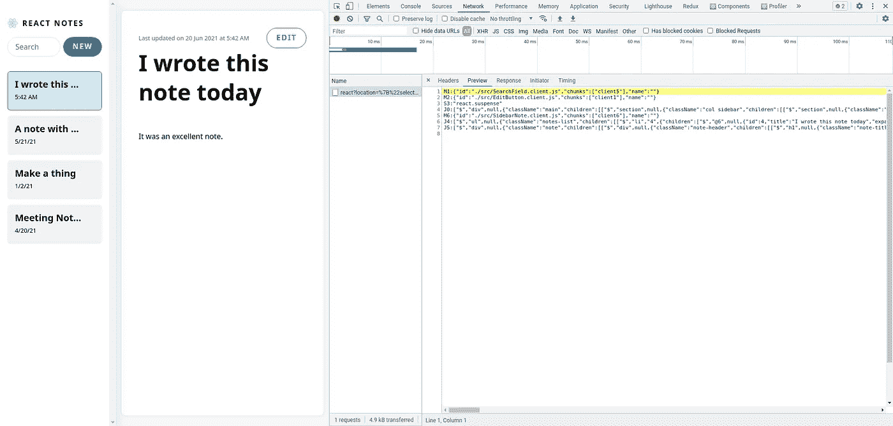
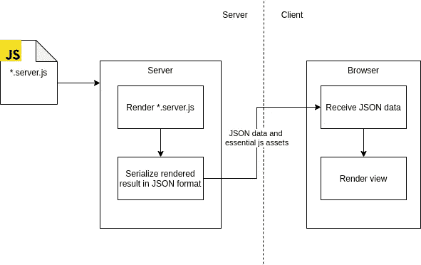

# React 内部:深入研究 React 服务器组件(按原样)

> 原文：<https://itnext.io/react-internals-deep-dive-react-server-components-as-it-is-d8e5f3d5c375?source=collection_archive---------5----------------------->

React 服务器组件是 2020 年 12 月发布的一个实验性功能，它是客户端渲染(CSR)和服务器端渲染(SSR)的一种混合。但是它是如何将它们混合在一起的，这正是我们在这篇文章中要探讨的。

> 免责声明:由于 react 服务器组件仍然是高度实验性的，并不时更新，这篇文章在 2021 年 6 月后可能不正确。

# CSR 与 SSR

CSR 和 SSR 之间的斗争永远不会结束，有大量的文章和讨论来分析它们的利弊。作为一名软件开发人员/架构师，开始一个全新的项目时，您可能总是会面临这样的困境:当没有过去的遗留或依赖时，选择使用哪一个。但是如果我们重新思考这个问题，实际上我们不必只选择其中一个，而是利用他们两个，因为他们比另一个做得更好。我个人的决策建议是:

> CSR 用于交互性，SSR 用于数据获取。

CSR 离用户很近，所以当你需要尽快与用户交互，甚至不需要从服务器获取任何数据时，使用更多的 CSR，因为它运行在浏览器内部，提供最好的交互性。

SSR 靠近数据存储，所以当从数据存储中检索数据时，计算并向用户呈现视图。使用 SSR 可能会节省一些网络传输时间，并且只向用户发送关键数据。

> 在比较 CSR 和 SSR 时，还有其他经常提到的重要话题(如 SEO ),在这里我不会讨论它们，因为我想保持简单，只强调一些基本特征。

从技术上讲，同时使用 CSR 和 SSR 是完全可行的，但是这种混合模式的维护成本通常很高，如果您喜欢更干净的前端架构，这看起来是不可行的。但是使用 React 服务器组件，可能更有可能以适当且低维护成本的方式实现 CSR 和 SSR 前端的混合。

# React 服务器组件如何工作

> 要了解 react 服务器组件的基础知识，强烈建议在这里观看视频[。](https://reactjs.org/blog/2020/12/21/data-fetching-with-react-server-components.html)

在 React 服务器组件约定中，组件被拆分为`*.server.js`和`*.client.js`来表示它们在哪里被执行。使用`*.server.js`组件可以加速数据获取(因为它靠近数据存储)并减少包的大小(一些非视图 js 库如 moment.js 不会被发送到客户端)。对于`*.client.js`组件，实际上它们就像你之前写的任何 react 组件一样，但是可以与`*.server.js`组件无缝集成，这是一个巨大的优势。但这些好处在技术上是如何来的，是我们接下来要讨论的关键话题。

要研究底层的魔力，最好的起点是[服务器-组件-演示](https://github.com/reactjs/server-components-demo)存储库。在克隆、运行和试验之后，你会很快在网络响应中发现一个 API `/react`在前端有一些交互时被调用。

这个 API 的响应非常有趣，因为它看起来像 react 组件的序列化版本:

这给我们带来了一个假设，即服务器组件可能以 JSON 中的序列化格式发送给客户机。详细信息可以在 react 存储库中的 [react-server](https://github.com/facebook/react/tree/master/packages/react-server) 包中找到:

 [## facebook/react

### 一个用于构建用户界面的声明式、高效且灵活的 JavaScript 库。- facebook/react

github.com](https://github.com/facebook/react/blob/master/packages/react-server/src/ReactFlightServerConfigStream.js#L23)  [## facebook/react

### 一个用于构建用户界面的声明式、高效且灵活的 JavaScript 库。- facebook/react

github.com](https://github.com/facebook/react/blob/master/packages/react-server/src/ReactFlightServer.js) 

总之，`*.server.js`组件实际上是在服务器端渲染的组件，渲染结果被序列化并以 JSON 格式发送到客户端。这意味着您不能在`*.server.js`组件中使用函数(包括事件处理程序)、引用和大多数挂钩，因为它们与`*.client.js`组件不在同一上下文中。

用一张图解释

# 结论

在我看来，我认为 React 服务器组件是一个打破 CSR 和 SSR 之间孤岛的新实验。这并不意味着取代它们中的任何一个，而是使开发者能够充分利用它们。它是否会成为一个流行的特性还不得而知，但至少作为开发者我们可以有一个新的选择，它的实现方式也可以成为未来任何具有类似目的的框架的一个很好的参考。