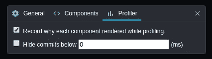
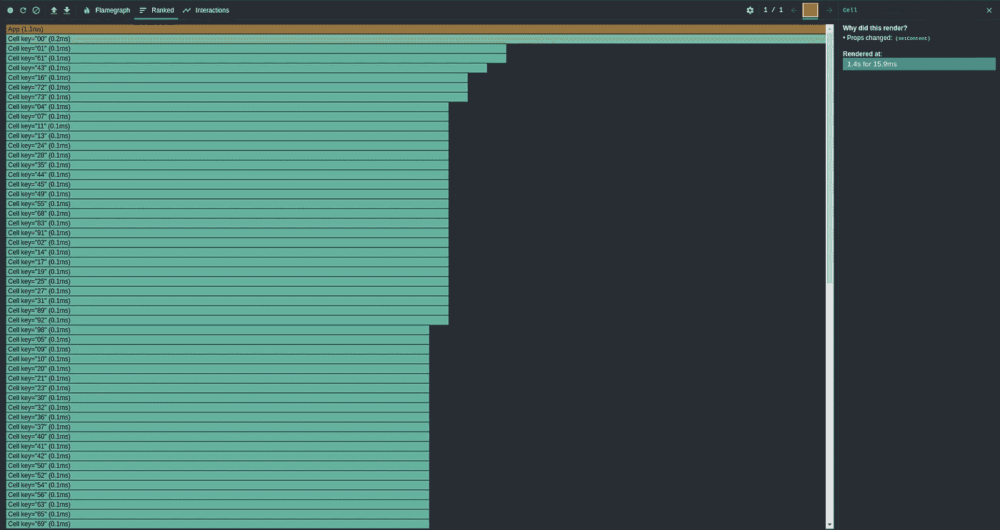
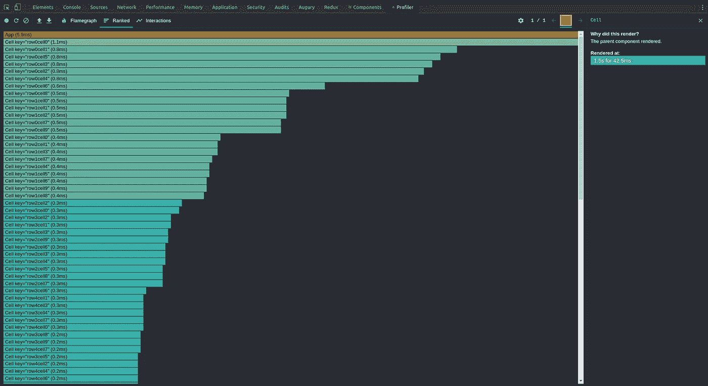
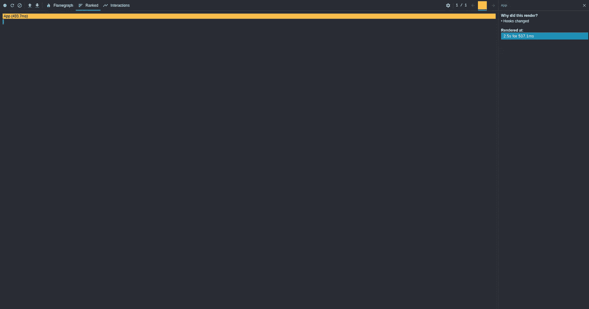
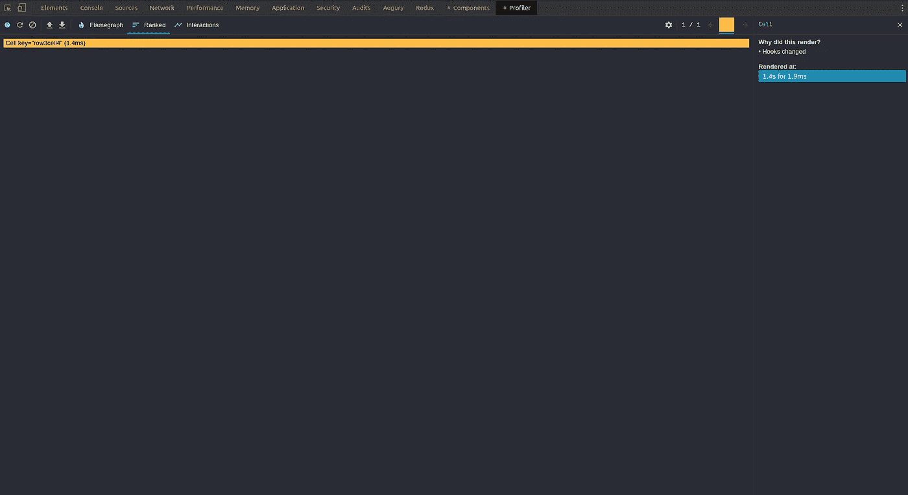

# 反应:提升状态会扼杀你的应用

> 原文：<https://itnext.io/react-lifting-state-up-is-killing-your-app-3ad6f0e1213d?source=collection_archive---------0----------------------->

>我现在有了一个闪亮的新博客。阅读这篇文章的最新更新[https://blog . goncharov . page/react-lifting-state-up-is-killing-your-app](https://blog.goncharov.page/react-lifting-state-up-is-killing-your-app)

你听说过“提升国家”吗？我猜你有，这就是你在这里的确切原因。React 官方文档中列出的 12 个主要概念之一[怎么可能导致糟糕的性能？在本文中，我们将考虑实际情况。](https://reactjs.org/docs/lifting-state-up.html)

# 第一步:抬起来

我建议你创建一个简单的井字游戏。对于游戏，我们需要:

1.  一些游戏状态。没有真正的游戏逻辑来判断我们是赢是输。只是一个简单的二维数组，填充了`undefined`、`”x”`或`”0”`。

2.一个父容器来存放我们游戏的状态。

3.显示单个单元格状态的子组件。

[现场演示#1](https://stackblitz.com/edit/lifting-state-up-is-killing-your-app-1)

到目前为止看起来不错。一个你能以光速与之互动的完美反应场:)我们来增大尺寸。比方说，到 100。是的，是时候点击演示链接并改变最上面的`size`变量了。对你来说还算快吗？试试 200 或者使用 Chrome 内置的 [CPU 节流。你现在是否发现在你点击一个单元格的时间和它的内容改变的时间之间有明显的延迟？](https://twitter.com/chromiumdev/status/961537247240753152?lang=en)

让我们将`size`改回 10，并添加一些分析来调查原因。

[现场演示#2](https://stackblitz.com/edit/lifting-state-up-is-killing-your-app-2)

对，就是这样。简单的`console.log`就足够了，因为它可以在每个渲染上运行。

那么我们看到了什么？根据我们控制台中“单元格渲染”语句的数量(对于`size` = N，应该是 N ),似乎每次单个单元格发生变化时，整个字段都会重新渲染。

最显而易见的做法是按照 React 文档的建议添加一些键。

[现场演示#3](https://stackblitz.com/edit/lifting-state-up-is-killing-your-app-3)

然而，在再次增加`size`后，我们发现问题仍然存在。如果我们能看到为什么任何组件呈现...幸运的是，我们可以在神奇的 [React DevTools](https://reactjs.org/blog/2019/08/15/new-react-devtools.html) 的帮助下。它能够记录组件被渲染的原因。不过，您必须手动启用它。

启用后，我们可以看到所有的单元格都被重新渲染了，因为它们的道具发生了变化，特别是，`setContent`道具。

每个细胞有两个道具:`content`和`setContent`。如果单元格[0][0]更改，单元格[0][1]的内容不会更改。另一方面，`setContent`在其结尾捕获了`field`、`cellI`和`rowI`。`cellI`和`rowI`保持不变，但`field`随着任何单元格的每次变化而变化。

让我们重构代码，保持`setContent`不变。

为了保持对`setContent`的引用不变，我们应该去掉闭包。我们可以通过使我们的`Cell`显式地将`cellI`和`rowI`传递给`setContent`来消除`cellI`和`rowI`闭包。至于`field`，我们可以利用`setState` - [的一个简洁特性，它接受回调](https://reactjs.org/docs/hooks-reference.html#functional-updates)。

这使得`App`看起来像这样

现在`Cell`必须将`cellI`和`rowI`传递给`setContent`。

[现场演示#4](https://stackblitz.com/edit/lifting-state-up-is-killing-your-app-4)

让我们来看看 DevTools 的报告。

什么？！为什么上面写着“父母道具改变”？所以事情是这样的，每次我们的字段被更新时`App`都会被重新渲染。因此，它的子组件被重新呈现。好的。stackoverflow 说了什么关于 React 性能优化的有用的东西吗？互联网建议使用`shouldComponentUpdate`或其近亲:`PureComponent`和`memo`。

[现场演示#5](https://stackblitz.com/edit/lifting-state-up-is-killing-your-app-5)

耶！现在，一旦内容发生变化，只有一个单元格被重新呈现。但是等等……有什么惊喜吗？我们遵循最佳实践，并获得了预期的结果。邪恶的笑声应该在这里。既然我不在你身边，请尽可能努力去想象。继续在[现场演示#5](https://stackblitz.com/edit/lifting-state-up-is-killing-your-app-5) 中增加`size`。这一次你可能要用大一点的数字。然而，滞后仍然存在。为什么？？？

让我们再来看看 DebTools 的报告。

只有一张`Cell`的渲染图，速度很快，但是还有一张`App`的渲染图，花了不少时间。事情是，每次重新渲染`App`时，每个`Cell`都必须将其新道具与之前的道具进行比较。即使它决定不呈现(这正是我们的情况)，这种比较仍然需要时间。O(1)，但 O(1)出现了`size` * `size`次！

# 第二步:向下移动

我们能做些什么来解决这个问题？如果渲染`App`花费我们太多，我们必须停止渲染`App`。如果继续使用`useState`在`App`中托管我们的状态是不可能的，因为这正是触发重新渲染的原因。所以我们必须将我们的状态下移，让每个`Cell`自己订阅状态。

让我们创建一个专用的类，它将成为我们状态的容器。

那么我们的`App`可能是这样的:

我们的`Cell`可以自己显示来自`field`的内容:

[现场演示#6](https://stackblitz.com/edit/lifting-state-up-is-killing-your-app-6)

在这一点上，我们可以看到我们的领域正在呈现。然而，如果我们点击一个单元格，什么都不会发生。在日志中，我们可以看到每次点击的“setCell ”,但是单元格保持空白。这里的原因是没有什么告诉细胞重新渲染。我们在 React 之外的状态发生了变化，但是 React 并不知道。这种情况必须改变。

我们如何以编程方式触发渲染？

对于类，我们有 [forceUpdate](https://reactjs.org/docs/react-component.html#forceupdate) 。这是否意味着我们必须重新编写类的代码？不完全是。我们对功能组件所能做的是引入一些虚拟状态，我们改变它只是为了迫使我们的组件重新呈现。

下面是我们如何创建一个自定义钩子来强制重新渲染。

为了在我们的字段更新时触发重新渲染，我们必须知道它何时更新。这意味着我们必须能够以某种方式订阅现场更新。

现在我们可以订阅现场更新。

[现场演示#7](https://stackblitz.com/edit/lifting-state-up-is-killing-your-app-7)

让我们用这个实现来玩一下`size`。尝试将它增加到之前感觉滞后的值。和...是时候开一瓶上好的香槟了！我们开发了一个应用程序，只在一个单元格的状态发生变化时才显示该单元格。

让我们来看看 DevTools 的报告。

正如我们现在看到的，只有`Cell`被渲染，而且速度非常快。

如果说我们的`Cell`的 now 代码是内存泄漏的潜在原因呢？如你所见，在`useEffect`中，我们订阅小区更新，但我们从不退订。这意味着即使`Cell`被摧毁，它的订阅仍然存在。让我们改变这一点。

首先，我们需要教`Field`什么是退订。

现在我们可以将`unsubscribeCellUpdates`应用于我们的`Cell`。

[现场演示#8](https://stackblitz.com/edit/lifting-state-up-is-killing-your-app-8)

那么这里的教训是什么呢？什么时候将状态向下移动到组件树中是有意义的？绝不！嗯，不尽然:)坚持最佳实践，直到它们失败，不要做任何过早的优化。老实说，我们上面考虑的情况有些特殊，但是，如果你需要显示一个非常大的列表，我希望你能回忆起来。

# 额外的一步:现实世界的重构

在[现场演示#8](https://stackblitz.com/edit/lifting-state-up-is-killing-your-app-8) 中，我们使用了全局`field`，这在现实应用中是不应该的。为了解决这个问题，我们可以在我们的`App`中托管`field`，并使用[上下文](https://reactjs.org/docs/context.html)沿着树向下传递它。

现在我们可以在我们的`Cell`中从上下文中消费`field`。

[现场演示#9](https://stackblitz.com/edit/lifting-state-up-is-killing-your-app-9)

希望你已经找到了对你的项目有用的东西。请随时将您的反馈传达给我！我非常感谢任何批评和问题。

请在 [Twitter](https://twitter.com/ai_goncharov) 或 [LinkedIn](https://www.linkedin.com/in/aigoncharov/) 上关注我，继续关注新文章！订阅我的[简讯](https://blog.goncharov.page/)或者 [RSS](https://blog.goncharov.page/rss.xml) 。如果你有任何问题，请给我发一封电子邮件。

UPD: [在 Reddit 上跟帖讨论](https://www.reddit.com/r/reactjs/comments/dhck3y/react_lifting_state_up_is_killing_your_app/)