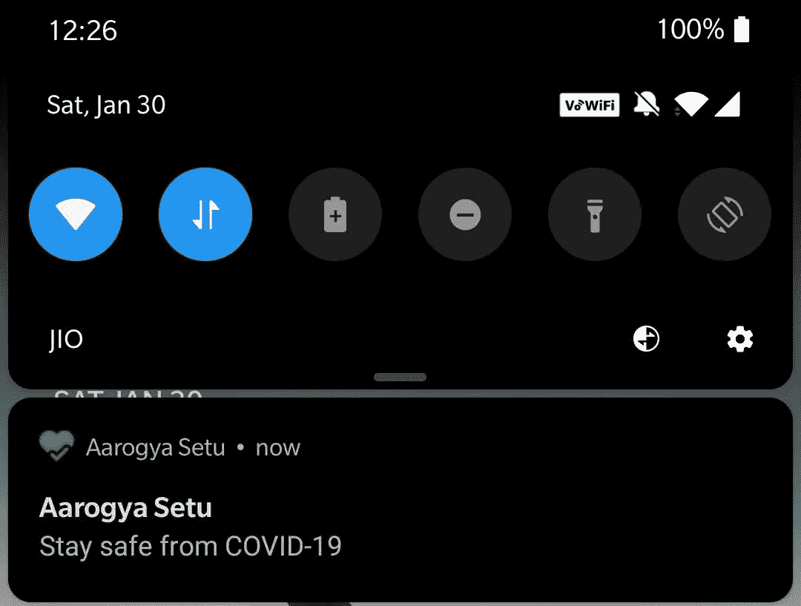
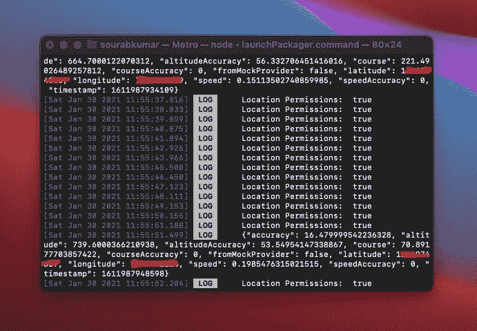

# 本地反应—后台位置跟踪，无超时，应用程序已关闭

> 原文：<https://itnext.io/react-native-background-location-tracking-without-timeout-and-with-app-killed-3dbfbc80ad01?source=collection_archive---------0----------------------->

**小背景:** 几个月前，我用 Java 开发了一个原生的 Android 应用程序，要求在后台或前台跟踪用户的位置，即使应用程序被关闭、关闭。在 Android 8 (API 级别 26)之前，这是很容易实现的，在用户不知情的情况下，在后台 ***获取用户的位置是没有限制的。
自 Android 8 以来，开发者和 Android 用户的情况发生了变化。现在，如果跟踪用户位置的应用程序后台服务发出太多 GPS 请求，或者在后台耗尽电池电量，这些服务就会被强行终止。这里进入 android 的**电池优化**功能。***

在这个时间点上，我有一个 onePlus 7T，这是一个 Android 10 设备，直到我从该应用程序的设置中禁用了电池优化，它不会让应用程序跟踪用户。我使用了一个每 10 秒运行一次的 [JobScheduler](https://developer.android.com/reference/android/app/job/JobScheduler) 来从设备获取 GPS 位置。我有一个使用 ForegroundService 的选项，但问题是用户无法关闭或滑动的持续通知。就像 Aarogya Setu App 里的那个。*(禁用电池优化对 MVP 来说已经足够好了)*

我被要求在 React-Native 中为 Android 和 iOS 构建相同的应用程序。

在过去的几天里，我努力从设备上访问地理位置，这里是我面临的一些问题以及我如何提出解决方案(特别是针对 Android)。

1.  ***应用程序关闭时保持服务运行——不禁用电池优化***
2.  **在某个时间点之后，图书馆失去了对 GPS 的访问。**
3.  ***当我运行一个连续循环的前台服务，每 10 秒访问一次 GPS 位置时，这并没有让应用程序关闭或关闭。它影响了 React 组件的生命周期。***

## ***1。当应用程序关闭时，保持服务运行——不禁用电池优化***

我从第一次的错误中吸取了教训，没有一种直接的(合法的)方法可以在用户不知情的情况下保持后台服务的运行。所以我不得不使用 ForegroundServices 来保持进程运行，这也让用户知道为什么这个服务在运行，即使在他们关闭应用程序之后。
我为此使用了[***@ supersami/rn-前台-服务***](https://www.npmjs.com/package/@supersami/rn-foreground-service) 库。这里有一个关于如何使用上面的库创建一个可以做后台任务的持久服务的博客。([链接到博客](https://medium.com/javascript-in-plain-english/react-native-foreground-service-f7fc8e617fba))

## ***3。当我运行一个连续循环的前台服务，每 10 秒访问一次 GPS 位置时，这并没有让应用程序关闭或关闭。它影响了 React 组件的生命周期。***

如果你阅读了库的上述博客，它要求你在 react 组件的生命周期之外初始化前台服务或后台任务。但是当我使用***@ react-native-community/geolocation***和***react-native-geolocation-service***来访问后台服务中的 GPS 位置时，它通常只在 react 组件的生命周期开始时进行初始化，从而使后台服务进入组件的生命周期。每一次，服务循环使用组件来重新渲染，你现在可以想象为什么我不能关闭应用程序，因为我让我的服务每 10 秒循环一次。
所以我尝试了这另一个库[***react-native-location***](https://www.npmjs.com/package/react-native-location)*它与后台任务配合得天衣无缝。*

## *2. ***每 10 秒访问一次设备 GPS，即使应用程序被终止也不会请求超时****

*以上所有的东西，在 Android 10 以上的设备上是行不通的，即使你正确实现了。因为，从 Android 10 开始，开发者应该请求另一个名为`[ACCESS_BACKGROUND_LOCATION](https://developer.android.com/training/location/receive-location-updates#request-background-location)`的权限来访问设备的位置，如果用户拒绝该权限，你就不能一次又一次地调用该权限请求。安卓不允许。所以你只有一次机会，所以要有充分的理由让它变得有价值，这样用户才能理解许可的重要性。
这就是*超时 ***发生的原因。*** 我没有请求用户的许可，但是我请求了 GPS 定位。**

# **代码:**

**访问后台位置的权限请求**

**带位置跟踪的前台服务**

# **结果:**

****

**这是应用程序被杀的时候，位置更新在接下来的 2-3 个小时内持续出现。**

**感谢您阅读本文，希望这对您有所帮助。我记录了这一点，因为我几乎在任何地方都没有找到任何合理的解决方案。花了将近两天的时间进行自我反省，并结合我的一些原生 android 开发经验，将 React-Native 的点点滴滴联系起来。**

**我实际上记录了我的母语学习旅程，我遇到了什么样的问题，我在哪里找到了我的解决方案，我从这些问题中学到了什么。这个博客只是一个具体问题的例子。请让我知道你是否喜欢这种形式的博客，这样我可以写更多。**

**你可以在推特上找到我:[https://twitter.com/sourav_bz](https://twitter.com/sourav_bz)**

**编辑:这个博客每周有近 500-600 的外部浏览量，你们中的一些人通过 Twitter DMs 联系我，帮助你完成你的项目(与位置服务相关)。因此，这里有一个 3 个问题的简短调查，它将帮助我理解这里的一个大问题。潜在的，这将反过来帮助我建立大众的东西，并把它给你的帮助。
[https://forms.gle/5fV3kC86y7gFPJuv5](https://forms.gle/5fV3kC86y7gFPJuv5)**

**如果你想和我联系，请发邮件到 s.kumar001997@gmail.com，不要犹豫。**