# React Native:利用 XDE 世博会打造极简气象应用

> 原文：<https://itnext.io/react-native-building-a-minimalist-weather-app-using-expo-xde-6ef92d9b27ec?source=collection_archive---------2----------------------->

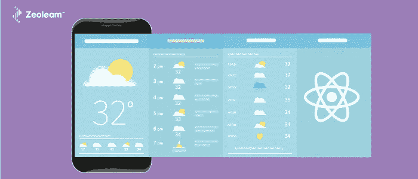

React Native 是为 iOS 和 Android 平台开发跨平台移动应用程序的一个很好的框架。在这篇文章中，我将带您通过获取实时数据，使用 React Native 构建一个“极简”天气应用程序的过程。如果您从未使用过 React Native，您可以将本演练作为成为移动应用程序开发人员的起点，这将是您的投资组合中一个很酷的项目。

# 入门:要求

如果您有一些使用 Reactjs 的经验，那么您在学习本教程时将不会有任何问题。如果你是 JavaScript 或 Reactjs 生态系统的新手，我想在这里停下来，浏览一下[这个很棒的资源](http://www.react.express/)，它可以帮助你理解本教程中的基本概念。如果您对使用 Reactjs 构建 web 应用程序不感兴趣，请不要花费太多时间，只需浏览一下细节。

请注意，React Native 不是像其他可用的混合移动应用程序框架。它在 Javascript 和特定平台的本地 API 之间架起了一座桥梁。一定要看看 [React 本地官方文件](https://facebook.github.io/react-native/docs/getting-started.html)来了解更多这方面的内容。

我将使用被描述为“构建应用程序最快的方式”的 Expo 。这是一套方便使用的开源工具和服务，尤其是在您开始接触 React Native 世界时。我将为世博会使用的开发工具是[XDE 世博会](https://expo.io/)。

**需求汇总**

*   你知道怎么写 JavaScript 吗
*   熟悉 React
*   安装在本地计算机上的节点
*   简单的`npm`命令

仅此而已。让我们开始开发过程。

# 开始:这次是真实的

安装完成后，打开 XDE 世博会，点击“创建新项目”。

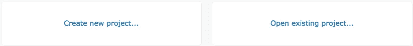

输入您的应用程序的名称，然后单击“创建”。应用程序的名称将是小写，我不知道为什么，XDE 世博会用户界面不支持大写字符。

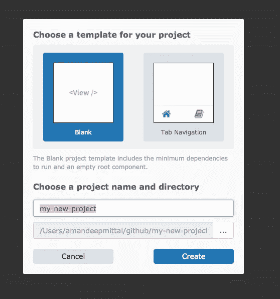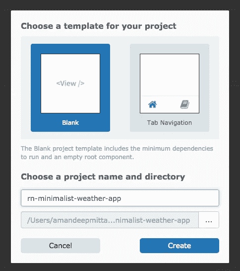

Expo，在幕后使用 React 原生包管理器模拟应用程序和来自应用程序的`package.json`文件的负载依赖。使用 XDE 世博会的好处是，你不必打开多个终端窗口，你可以在真实设备上测试应用程序。一旦生成应用程序源代码的过程完成，我们就可以在本地机器上的模拟器中启动它，查看它附带的默认应用程序。

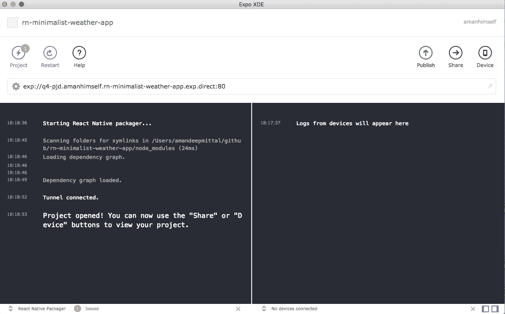

如果您使用的是 Mac，请确定您安装了 Xcode。如果您使用的是 Windows，请按照说明安装 Android Studio 来运行模拟器。

如果你想跳过模拟应用程序，在实际设备上运行而不生成任何`.apk`或`.ipa`，安装世博客户端，扫描 XDE 世博会默认生成的二维码。

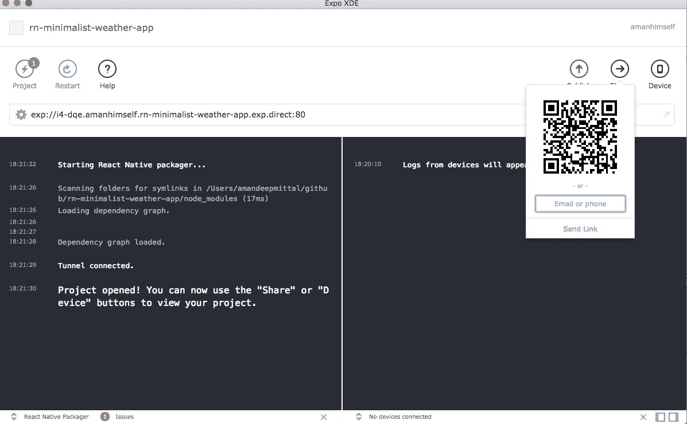

源代码捆绑完成后，XDE 世博会终端会提示您一条成功消息:

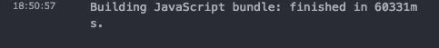

您将会看到我们的默认应用正在设备上运行:

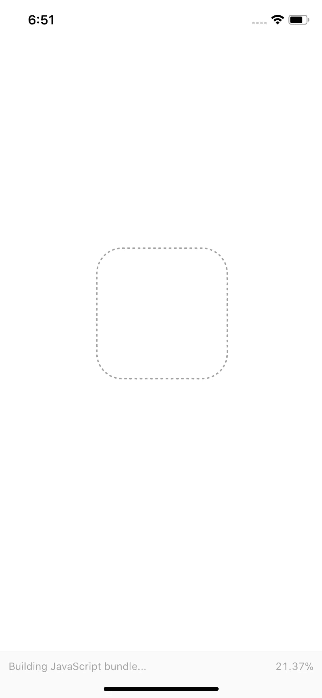

这里显示的消息是由我们的应用程序根目录中的`App.js`呈现的相同代码。

将`<Text>`改为

您将看到输出被渲染，应用程序被实时重新加载。您不必刷新它就可以看到更改。

这就完成了我们的第一个入门步骤。下一步，我们将为我们的应用程序构建一个静态原型。

# 原型

在这一步，我们将开发我们的第一个屏幕，这将是加载屏幕。

在你的`App.js`中，定义一个地方州:

上面的代码声明，当我们的本地状态对象`isLoading`为 false 时，我们将显示应用程序的名称。这就是我们要渲染的。稍后，一旦我们的 API 成功获取数据，我们将在这里显示天气，而不是显示应用程序的名称。现在，我坚持这条消息，因为首先，我们要做的是，如果我们的应用程序处于加载状态呢？让我们添加一条文本消息来表明应用程序正在获取数据。

当我们的应用程序完成从 API 加载数据时，我们将把`isLoading`的状态设置为 false。

# 第一屏

我们将在`./components/Weather.js`定义一个新的天气组件。每个天气状况屏幕的样板代码都是一样的。它将被分成两个视图，一个标题和一个正文。标题将显示天气状况图标和温度，正文将显示与天气状况相关的文本。

在 Weather.js 中，我们将从在主容器内部定义两个容器开始:`headerContainer`和`bodyContainer`。请注意，我们没有将`Weather`组件定义为一个类，而是定义为一个函数，以便接收 props，因为它不会管理状态。

我们将使用 expo 附带的`MatericalCommunityIcons`(额外津贴之一)作为一个名为`vector-icons`的庞大图书馆的子图书馆。

这就是我们的应用程序在原型阶段完成后的样子。

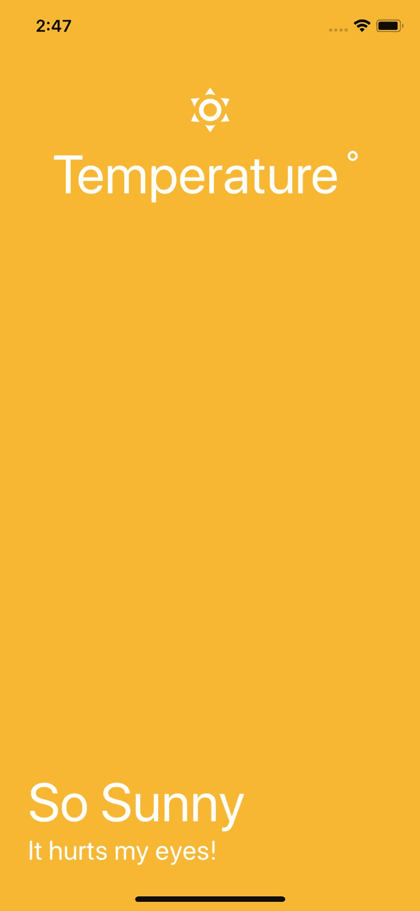

# 获取数据

为了获取实时天气数据，我发现[开放的天气地图 API](https://openweathermap.org/) 非常有用并且一致。要与 API 通信，您需要一个 API 密钥。在网站上注册成为用户，并获得 API 密钥。请注意，开放天气 API 激活 API 密钥至少需要 10 分钟。一旦有了，就跟着去。

转到 [API 部分](https://openweathermap.org/api)，你会看到当前的天气数据满足了我们的需求。我将把我的 API 密钥存储在`./utils/WeatherAPIKey.js`文件中。我不知道一个文件最好的名字。

开放式天气 API 的工作方式是，我们需要使用设备的经度和纬度位置来提供坐标。然后，它将从其服务器获取数据，这将是一个 JSON 对象。从服务器上，现在我们需要两样东西，温度和天气状况。在`App.js`中，我们应该将温度和天气状况存储在我们的本地状态中。

我们首先导入刚刚定义的 API 键，然后用`temperature`、`weatherCondition`和`error`更新我们的状态。我们正在使用`componentDidMount()`一种生命周期方法，一旦我们的 API 提取完数据，它就帮助我们重新渲染。它还将帮助我们更新状态。我们还使用 JavaScript `navigator` API 来获取当前位置。这是 JavaScript API 使用桥与本地 API 通信的地方。我们将纬度和经度的值传递给我们的自定义函数`fetchWeather`, Open Weather Map 的 API 在这里被调用。

我们得到的结果是 JSON 格式的，如果您控制台记录它，您将能够在 Expo terminal 中以 JSON 对象的形式看到结果，其中有许多值。我们只需要温度值和天气状况。然后，我们用获得的新值更新本地状态。`&units=metric`在我们的 API 调用结束时，将温度从开尔文转换为摄氏度。

现在，我们所要做的就是将本地状态的值 2 作为道具传递给`Weather`组件，然后更新它以便它可以接收这些道具。

首先，在`App.js`中:

更新`Weather.js`:

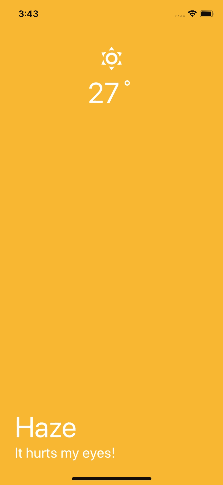

既然我们已经完成了获取实时数据的困难部分，我们必须让`Weather`组件动态地对它正在获取的值表现出[的行为。所有这些动态的部分，都将与我们从本地状态得到的一个东西有关，`weatherCondition`。](https://openweathermap.org/weather-conditions)

# 动态行为

使用`weatherCondition`我们可以定义背景变化，标题，副标题和天气图标的变化。让我们从在文件`./utils/WeatherConditions.js`中预定义天气条件开始。

这些天气状况是由这里的的开放天气 API [提供的。然后，让我们将这个文件导入到我们的`Weather.js`中。我们还将为从`App.js`接收的两个道具定义道具类型。看看下面，很简单。](https://openweathermap.org/weather-conditions)

大部分源代码都是一样的。我们现在只是通过使用天气条件下的可用道具来做一些添加，并动态地改变背景、图标、天气名称和字幕。你可以改变造型，让它看起来更简约或更精致，这取决于你。

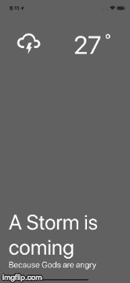

**注意:**在您的实际设备上运行该应用程序之前，请确保您的设备能够访问互联网并定位该应用程序。在本文中，我们还没有谈到应用程序权限，这也有点超出了范围。

此应用程序的完整代码可在此 [Github Repo](https://github.com/amandeepmittal/rn-minimalist-weather-app) 获得。我也在 [Expo Store 这里](https://expo.io/@amanhimself/rn-minimalist-weather-app)发布了应用程序供您测试。只需扫描二维码并运行应用程序，看看你将在本教程中工作。

我希望你在本教程中学到了一些关于 React Native 的东西。本文原载于**。**

> *🙏你可以在 [**Twitter**](https://twitter.com/amanhimself) 或者我的 [**博客**](http://readingbooks.blog) 或者 [**亚马逊**](https://www.amazon.com/Bloggers-Manifesto-Modern-Guide-Blogging-ebook/dp/B079DQ8TPN/ref=sr_1_1?ie=UTF8&qid=1517379651&sr=8-1&keywords=a+blogger%27s+manifesto) 找到我！*