# 反应原生糖果粉碎克隆

> 原文：<https://itnext.io/react-native-candy-crush-clone-c41a797fed0a?source=collection_archive---------1----------------------->

这是我们要做的

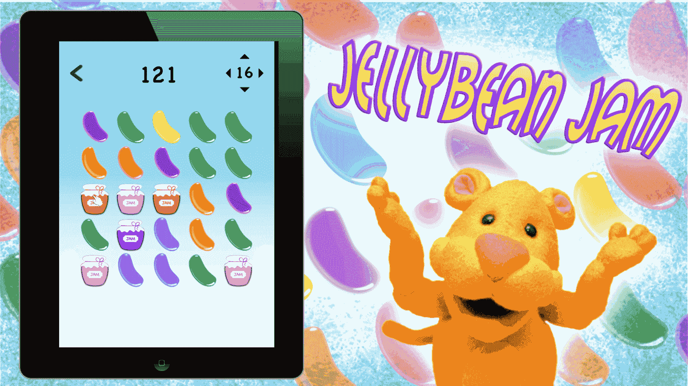

软糖果酱的宣传片

我开始制作[软糖果酱](https://itunes.apple.com/US/app/id1436558861?mt=8)作为[木偶艺术有限责任公司](http://www.puppetryarts.org/TuffyTiger/)的志愿者项目。我想在 React Native 中获得经验，这似乎是一个有趣的开始方式。

在我们开始之前，别忘了在 App Store 上免费下载[软糖果酱](https://itunes.apple.com/us/app/jellybean-jam/id1436558861?mt=8)并试用一下。我的最高分是 1400。

# 我们第一部分的目标

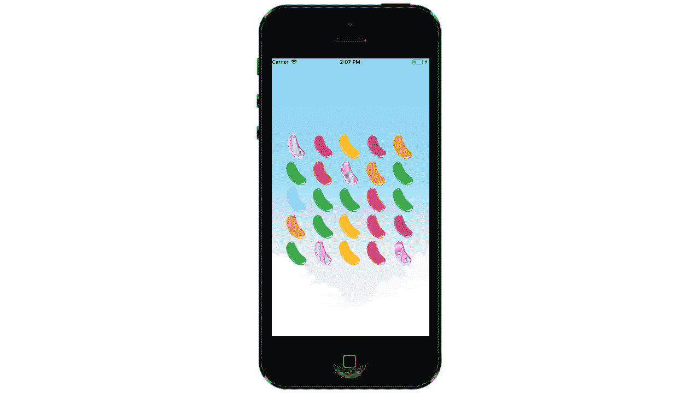

简单的可交换网格

在第 1 部分中，我们将用一些随机的糖豆构建一个简单的可交换网格。我们还将讨论如何使用滑动手势、动画值、资产管理和一些算法。

## 入门指南

当您准备好了，继续下载下面两个入门项目中的一个。

*   [ReactNativeCandyStarterProject](https://github.com/fennean1/ReactNativeCandyStarterProject)通过`react-native init`创建
*   [通过`create-react-native-app`创建的 ReactNativeCandyStarterProjectExpo](https://github.com/fennean1/ReactNativeCandyStarterProjectExpo)

不管你选哪个，跑`npm install`、`npm install react-navigation`、&、`npm install react-native-swipe-gestures`

## 那么有什么区别呢？

不同的是，ReactNativeCandyStarterProjectExpo 将在 [Expo](https://expo.io/tools) 上运行，而另一个将需要 Xcode 或 Android Studio。我通常为开发和测试保留我的应用程序的 Expo 版本，然后在以后将它们转换成“常规的”RN 项目。如果您需要创建到本机代码的桥梁，这不是一个选项，但是由于我们的项目(根据设计)具有很少的依赖性，在两者之间切换将会很容易。

## 四处打探

让我们快速看一下文件夹结构:

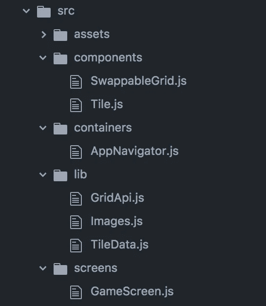

我们将要编辑的所有文件都在所示的`src`文件夹中，您会注意到`App.js`(未显示)只是我们的 AppNavigator 的包装器。它看起来是这样的:

```
// App.jsimport React from 'react';
import { StyleSheet, Text, View } from 'react-native';// Import AppContainer
import AppNavigator from "./src/containers/AppNavigator";export default class App extends React.Component {
  render() {
    return <AppNavigator />;
  }
}
```

这允许我们将`App.js`和`src`直接复制到任何新项目中，不管它是用`react-native init`还是`create-react-native-app.`创建的

## 航行

因为这不是 React 导航教程，所以我只给你一个根组件的样板代码，稍后我们会添加更多。

```
// AppNavigator.jsimport React from "react";
import ReactNative from "react-native";var GameScreen = require("../screens/GameScreen");import { createStackNavigator } from "react-navigation";const Game = ({navigation}) => {
  return <GameScreen navigation={navigation}  />;
};const AppNavigator = createStackNavigator({
  Root: {
    screen: Game,
    navigationOptions: {
      header: null
    }
  }
});module.exports = AppNavigator;
```

# 现在让我们写一些代码

## 游戏屏幕

在`GameScreen.js`里面，你会看到我用`<ImageBackground/>.`用一个漂亮的多云背景包裹了这个视图，这是我们要渲染组件`SwappableGrid.`的地方，当你运行它时，它应该是这样的:

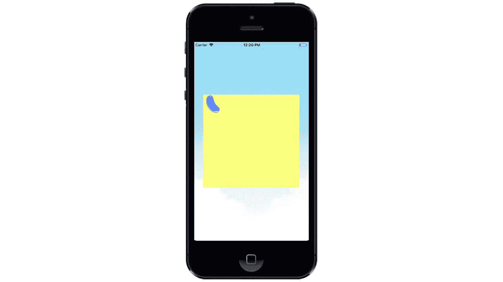

只是一颗孤独的豆子

还没什么好幻想的。为了把事情做好，我们需要在里面做一些工作

## 数据源

如果你在 SwappableGrid.js 中查找，你会注意到`tileDataSource: this.initializeDataSource()`一行已经被注释掉了。您还会看到，我们的 render()函数返回一个居中的手势容器，其中有一个蓝色的果冻豆瓷砖。

```
export default class SwappableGrid extends Component<{}> {
  constructor(props) {
    super(props);this.state = {
      // tileDataSource: this.initializeDataSource()
    };

  }
  render() {
    return (
      <GestureRecognizer style = {styles.gestureContainer}>
        <Tile img = {BLUE_BEAN} />
      </GestureRecognizer>
    );
  }
}// Need Gesture Container Style Here
```

为了初始化我们的数据源，我们需要创建一个二维的 TileData 类数组。如果您查看`lib`下的`TileData.js`，您会发现这个课程是为您创建的:

```
// TileData.jsimport {
  Animated,
} from "react-native";class TileData {
  constructor(image, key) {
    this.key = key;
    this.location = new Animated.ValueXY();
    this.img = image;
    this.scale = new Animated.Value(1);
  }
}
```

这是细目分类:

*   **key —** 由于我们的实际组件也将存储为一个数组，React Native 要求我们为每个组件提供一个唯一的键。在我们的例子中，它只是一个介于 0 和 24 之间的唯一整数。(因为网格是 5x5)
*   **location —** 它将组件位置的 x & y 值存储为动画，这一点也不奇怪。ValueXY()(稍后将详细介绍动画值)
*   **img —** 你猜对了！这是我们的图块在网格上时将呈现的图像。
*   **scale —** 这是另一个动画值，用于调整组件的比例，使其在匹配完成后可以向外“弹出”或“缩小”。

## 初始化数据源

一个有趣的方法是从 0 到 24 之间的 5x5 二维整数数组开始。然后，我们通过向构造函数提供图像和键，将这些键映射到 TileData 类的数组上。

```
// SwappableGrid.jsinitializeDataSource() {let keys = [
      [0, 1, 2, 3, 4],
      [5, 6, 7, 8, 9],
      [10, 11, 12, 13, 14],
      [15, 16, 17, 18, 19],
      [20, 21, 22, 23, 24]
    ];let tileData = keys.map((row, i) => {
       let dataRows = row.map((key, j) => {
          return new TileData(BLUE_BEAN, key);
       });
      return dataRows;
    });return tileData;
}
```

如您所见，我已经对键的数组进行了硬编码，因为我将在整个教程中使用 5x5 的网格。我将把它留给读者作为动态生成他们自己的键数组的练习。

## 资产

我使用图像 BLUE_BEAN 作为占位符，但是我们真正想要的是用随机的彩色豆子填充我们的网格。您会注意到，在`/lib/Images.js`中，我导出了一个包含所有 bean 图像的数组，称为 bean。

```
// Images.jsexport const PINK_BEAN = require("../assets/PinkJellyBean.png");
export const  PURPLE_BEAN = require("../assets/PurpleJellyBean.png");
export const BLUE_BEAN = require("../assets/BlueJellyBean.png");
export const  ORANGE_BEAN = require("../assets/OrangeJellyBean.png");
export const  GREEN_BEAN = require("../assets/GreenJellyBean.png");
export const YELLOW_BEAN = require("../assets/YellowJellyBean.png");
export const  RED_BEAN = require("../assets/RedJellyBean.png");export const BEANS = [PINK_BEAN,PURPLE_BEAN,BLUE_BEAN,ORANGE_BEAN,GREEN_BEAN,YELLOW_BEAN,RED_BEAN]
```

现在我们需要生成一个 0 到 6 之间的随机整数，并将其插入到 BEANS 数组中。我已经编写了自己的随机整数生成器，并从 GridApi 导入，grid API 是我们放置所有与管理网格相关的方法的地方，比如查找匹配和识别重复。

现在我们的`initializeDataSource`应该是这样的:

```
// SwappableGrid.jsinitializeDataSource() {let keys = [
      [0, 1, 2, 3, 4],
      [5, 6, 7, 8, 9],
      [10, 11, 12, 13, 14],
      [15, 16, 17, 18, 19],
      [20, 21, 22, 23, 24]
    ];let tileData = keys.map((row, i) => {
      let dataRows = row.map((key, j) => {
         let int = getRandomInt(7)
         let randomBean = BEANS[int]
         return new TileData(randomBean, key);
       });
      return dataRows;
    });return tileData;}
```

你会注意到`BLUE_BEAN`已经被一个随机生成的 bean 所取代，这个 bean 是从我们在`Images.js.`中创建的`BEANS`数组中挑选出来的

## 创建切片

重要的是要认识到，我们的瓷砖组件不需要二维数组。我们的数据源将决定它们是如何排列的，所以我们需要做的就是将它们连接到数据上，然后将它们转储到我们的网格中。我们通过遍历 tileDataSource 并为每个图块提供存储在每个 tileData 类中的属性来创建图块。

```
// SwappableGrid.jsrenderTiles(tileDataSource) {
    let tiles = [];
    tileDataSource.forEach((row, i) => {
      let rows = row.forEach((e, j) => {
       // e is a singular TileData class.
        tiles.push(
          <Tile
            location={e.location}
            scale={e.scale}
            key={e.key}
            img = {e.img}
          />
        );
      });
    });
    return tiles
  }
```

现在我们有了一个呈现实际组件的函数，回过头来用下面的代码替换 SwappableGrid 的呈现方法:

```
render() {
    return (
      <GestureRecognizer style = {styles.gestureContainer}>
        {this.renderTiles(this.state.tileDataSource)
      </GestureRecognizer>
    );
```

这将把所有的图块组件放置到网格上，但不会告诉它们去哪里。结果就是一堆不同颜色的瓷砖叠在一起。

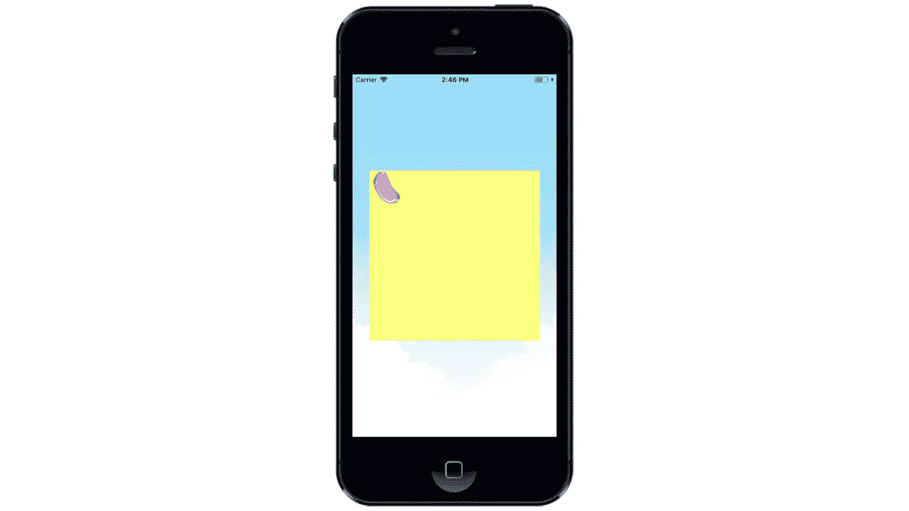

看起来很有希望，但是我们仍然需要把这些豆子放在正确的位置。要做到这一点，我们将不得不深入瓷砖组件内部，并挂接一些东西。现在它应该是这样的:

```
export default class Tile extends Component<{}> {render() {
    return <Animated.Image source = {this.props.img} style = {styles.tile}/>;
  }
}
```

你会注意到我用的是动画。图像，但我没有提供任何动画值。这里的语法有点挑战性，所以用这个替换`style = {styles.tile}`:

```
// Replace style ={styles.tile} with this.style={[
          styles.tile,
          { transform: [{ translateX: this.props.location.x }, { translateY: this.props.location.y }, { scale: this.props.scale}] }
        ]}
```

这为我们的样式添加了一组转换对象，这些对象与我们提供给 Tile 组件的道具相关联。`translateX`和`translateY`将控制图块在网格中的位置，而 scale 将控制图像的比例。现在它应该是这样的:

```
export default class Tile extends Component<{}> {render() {
    return <Animated.Image source = {this.props.img} style={[
          styles.tile,
          { transform: [{ translateX: this.props.location.x }, { translateY: this.props.location.y }, { scale: this.props.scale}] }
        ]}
/>
  }
}
```

回到`SwappableGrid`，我们将通过操纵`tileDataSource.`中的`location`属性，将每个图块组件动画化到其在网格上的正确位置。记住，`location`是作为道具提供给图块组件的，因此操纵它将导致图块组件更新其位置。

继续把它复制到 SwappableGrid 中，然后我们再来讨论它。

```
// SwappableGrid.jsanimateValuesToLocations() {
    this.state.tileDataSource.forEach((row, i) => {
      row.forEach((e, j) => {
        Animated.timing(e.location, {
          toValue: { x: TILE_WIDTH * i, y: TILE_WIDTH * j },
          duration: 250
        }).start();
      });
    });
  }
```

准备好了吗？

这里，我们将 tileData 元素的`[i,j]`索引转换为 XY 位置，方法是将它们乘以 TILE_WIDTH，然后使用 Animated.timing. [(或 Animated.spring 或 Animated.decay 等)将它们设置为该值。)](https://facebook.github.io/react-native/docs/animated)

## 快速笔记

您可以找到就在我们的样式表上方定义的 TILE_WIDTH，如下所示:

```
let Window = Dimensions.get("window");
let windowSpan = Math.min(Window.width, Window.height);
let TILE_WIDTH = windowSpan / 6;
```

您可以随意设置 TILE_WIDTH，我决定将其设为设备较小尺寸的六分之一。

## 开始了。

因为我想在组件安装后立即定位图块，所以我将像这样调用`componentWillMount`中的`animateValuesToLocation`:

```
// In SwappableGrid.jscomponentWillMount() {
    this.animateValuesToLocations();
  }
```

结果应该如下所示:(出于演示目的，持续时间设置为 1000)

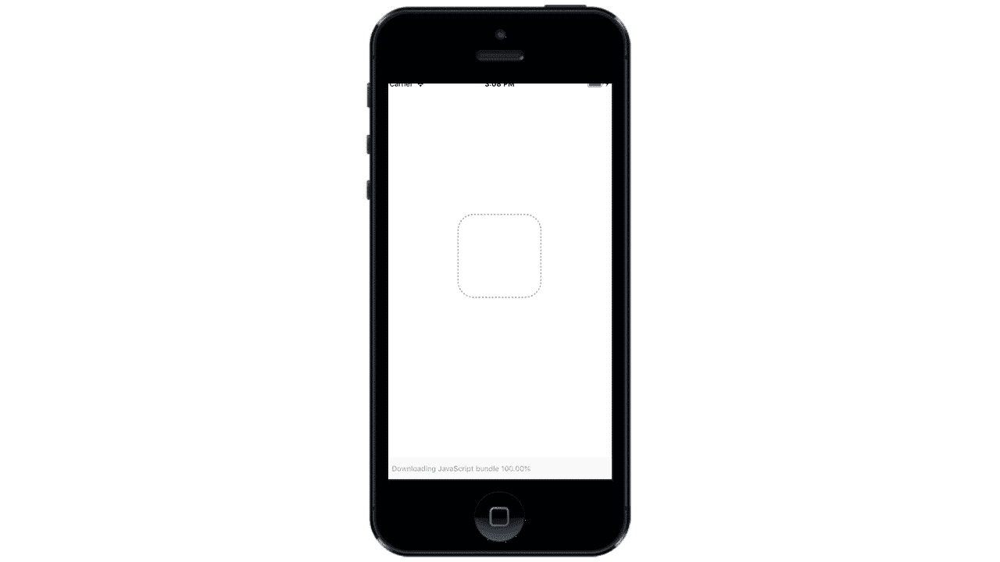

酷毙了。

## 味道平淡的低级啤酒

现在剩下要做的就是读取我们滑动手势的方向并执行交换。我已经成功地使用了[react-native-swipe-gestures](https://www.npmjs.com/package/react-native-swipe-gestures)来实现这一点，但它似乎没有得到积极的维护。您可以使用 React-Native PanGestures 编写自己的代码，但我们将把它留到以后再说。可以说，我仍然在寻找好的手势识别替代方案。

您可能已经注意到，React 原生滑动手势提供了一个手势识别器组件，该组件包装了我们试图从其接收触摸的任何视图。在这种情况下，我们的`SwappableGrid.`

```
<GestureRecognizer
            style={styles.gestureContainer}
            onSwipe={(direction, state) => this.onSwipe(direction, state)}
          >
            {this.renderTiles(this.state.tileDataSource)}
          </GestureRecognizer>.
```

我们现在的任务是配置手势识别器的`onSwipe`道具来执行交换。这意味着我们需要:

*   计算收到推送的分块的索引(数学)
*   根据滑动方向执行交换(switch 语句)

我的解决方案是这样的:

```
onSwipe(gestureName, gestureState) {// Swipe direction constants.
const { SWIPE_UP, SWIPE_DOWN, SWIPE_LEFT, SWIPE_RIGHT } = swipeDirections;let initialGestureX = gestureState.x0;
let initialGestureY = gestureState.y0;let i = Math.round((initialGestureX - 0.5 * TILE_WIDTH) / TILE_WIDTH);let j = Math.round((initialGestureY - 0.5 * TILE_WIDTH) / TILE_WIDTH);switch (gestureName) {
        case SWIPE_UP:
          break;
        case SWIPE_DOWN:
          break;
        case SWIPE_LEFT:
          break;
        case SWIPE_RIGHT:
          break;
      }
  }
```

很好，但是我忽略了一个关键点:

> 手势位置是从手势识别器的父组件测量的。

如果您还记得，我们的可切换网格的父组件是 GameScreen。事实上，这是目前 GameScreen 中唯一呈现的东西。这意味着为了在网格坐标系中找到`initialGestureX`和`initialGestureY`，我们需要在它的视图中减去网格的原点。

我们可以通过使用一个名为`onLayout`的可选属性来实现这一点，您可以将该属性提供给任何视图，以便在视图首次挂载时测量其属性。

像这样向手势识别器提供`onLayout`:

```
<GestureRecognizer
         style={styles.gestureContainer}
         onLayout={this.onLayout.bind(this)}      
         onSwipe={(direction, state) => this.onSwipe(direction, state)}
          >
               {this.renderTiles(this.state.tileDataSource)}
          </GestureRecognizer>
```

并这样定义它:

```
onLayout(event) {
    this.gridOrigin = [event.nativeEvent.layout.x, event.nativeEvent.layout.y];
}
```

现在我们将网格的原点存储为`this.gridOrigin`，我们可以用它来计算滑动的指数。回到你的`onSwipe`方法，从你的初始手势中减去 gridOrigin 的 x 和 y 分量，就像这样:

```
onSwipe(gestureName, gestureState) {const { SWIPE_UP, SWIPE_DOWN, SWIPE_LEFT, SWIPE_RIGHT } = swipeDirections;let initialGestureX = gestureState.x0;
let initialGestureY = gestureState.y0;// RIGHT HERE!
let i = Math.round((initialGestureX - this.gridOrigin[0] - 0.5 * TILE_WIDTH) / TILE_WIDTH);// ALSO HERE!
let j = Math.round((initialGestureY - this.gridOrigin[1] - 0.5 * TILE_WIDTH) / TILE_WIDTH);switch (gestureName) {
        case SWIPE_UP:
          break;
        case SWIPE_DOWN:
          break;
        case SWIPE_LEFT:
          break;
        case SWIPE_RIGHT:
          break;
      }
  }
```

完美！现在，我们能够从我们的 SwappableGrid 中准确地检测到滑动的索引。

## 交换

我们已经做了很好的准备工作，所以这一部分会很简单。

为了执行实际的交换，我们将编写一个单独的方法来获取交换的索引和方向。看看

```
swap(i,j,di,dj){const swapStarter = this.state.tileDataSource[i][j];
const swapEnder = this.state.tileDataSource[i + di][j + dj];this.state.tileDataSource[i][j] = swapEnder;
this.state.tileDataSource[i+di][j+dj] = swapStarter;this.animateValuesToLocations()
}
```

为了了解这里到底发生了什么，我们应该分解一下`swap`的论点

*   `i,j` —在其上注册交换的区块的索引。
*   `di,dj` —瓷砖需要在`i`或`j`方向移动多少。

我们使用这个信息来交换注册交换的元素和交换指向的元素的位置。回到您的`onSwipe`函数，在 switch 语句中添加以下对`swap`的调用。

```
switch (gestureName) {
        case SWIPE_UP:this.swap(i,j,0,-1)break;
        case SWIPE_DOWN:this.swap(i,j,0,1)break;
        case SWIPE_LEFT:this.swap(i,j,-1,0)break;
        case SWIPE_RIGHT:this.swap(i,j,1,0)break;
```

请注意，向上滑动具有负的`dj`值，因为索引是从左上角开始测量的。还记得`animateValuesToLocation`根据元素在`tileDataSource`数组中的位置来定位元素。由于元素被交换了，一旦动画运行，它们将会假定彼此的位置。

现在它应该是这样的:


## 看起来不错，但是…

在大多数 iOS 设备上，这将运行得相当流畅。尝试在 Android 上运行它，你可能会看到动画延迟或跳过帧。这有几个原因:

## 原因一:效率低下

您可能已经注意到，即使只有两个图块被动画显示，我们的`animateValuesToLocations`函数也会更新网格上的每一个图块。当我们需要布置网格时，这很有用，但是当我们只制作两个物体的动画时，这就太过分了。

因此，让我们修复我们的交换函数，以便它只激活参与交换的图块:

```
swap(i,j,dx,dy){let newData = this.state.tileDataSourceconst swapStarter = this.state.tileDataSource[i][j];
    const swapEnder = this.state.tileDataSource[i + dx][j + dy];// Swap the tiles in the data source
    newData[i][j] = swapEnder;
    newData[i+dx][j+dy] = swapStarter;// Animate the two tiles in parallel
Animated.parallel([
      Animated.timing(swapStarter.location, {
        toValue: {x: TILE_WIDTH*(i+dx),y: TILE_WIDTH*(j+dy)},
        duration: 120,
      }),
      Animated.timing(swapEnder.location, {
        toValue: {x: TILE_WIDTH*i,y: TILE_WIDTH*j},
        duration: 120,
      }),
    ]).start()// Set state with newData
   this.setState({tileDataSource: newData})// No need to call animateValuesToLocations() 

}
```

我们添加了一个动画块来并行执行交换。这意味着我们实际上只运行了一个动画块，而不是 25 个(太棒了！)这也意味着我们可以删除`this.animateValuesToLocation`，因为我们已经完成了动画。

## 原因二:原生驱动

我们需要做的最后一件事是确保我们使用的是本地驱动程序。为此，只需将`useNativeDriver: true`添加到动画属性中。

```
// Animate the two tiles in parallel
Animated.parallel([
      Animated.timing(swapStarter.location, {
        toValue: {x: TILE_WIDTH*(i+dx),y: TILE_WIDTH*(j+dy)},
        duration: 120,
        useNativeDriver: true}),
      Animated.timing(swapEnder.location, {
        toValue: {x: TILE_WIDTH*i,y: TILE_WIDTH*j},
        duration: 120,
        useNativeDriver: true}),
    ]).start()
```

你可以在这里阅读更多关于使用原生驱动[的内容，但这里是官方文档的要点:](https://facebook.github.io/react-native/blog/2017/02/14/using-native-driver-for-animated)

> 动画 API 的设计考虑了一个非常重要的约束，它是可序列化的。这意味着我们可以在动画开始之前就将有关动画的所有内容发送到本机，并允许本机代码在 UI 线程上执行动画，而不必在每一帧上都通过桥。这非常有用，因为一旦动画开始，JS 线程可以被阻塞，动画仍然可以流畅地运行。

将动画推送到原生 UI 线程将使我们的动画运行得更快，但这也意味着我们所有的动画都需要在原生上运行。因此，确保您返回到`animateValuesToLocation`并设置`useNativeDriver = true`

```
// SwappableGrid.jsanimateValuesToLocations() {
    this.state.tileDataSource.forEach((row, i) => {
      row.forEach((elem, j) => {
        Animated.timing(elem.location, {
          toValue: { x: TILE_WIDTH * i, y: TILE_WIDTH * j },
          duration: 250,
          useNativeDriver: true <----- HERE
        }).start();
      });
    });
  }
```

## 配对

现在，我们应该有一个简单的网格，使用滑动手势交换豆子。接下来，我们必须检测匹配，并在新的豆子落入它们的位置时将它们消灭掉。让我们重温一下`Images.js`

```
// Images.js// Beans
export const PINK_BEAN = require("../assets/PinkJellyBean.png");
export const PURPLE_BEAN = require("../assets/PurpleJellyBean.png");
export const BLUE_BEAN = require("../assets/BlueJellyBean.png");
export const ORANGE_BEAN = require("../assets/OrangeJellyBean.png");
export const GREEN_BEAN = require("../assets/GreenJellyBean.png");
export const YELLOW_BEAN = require("../assets/YellowJellyBean.png");
export const  RED_BEAN = require("../assets/RedJellyBean.png");export const BEANS = [PINK_BEAN,PURPLE_BEAN,BLUE_BEAN,ORANGE_BEAN,GREEN_BEAN,YELLOW_BEAN,RED_BEAN]
```

信不信由你，我可以直接比较这些图像常数来决定它们是否匹配。因此，下面的代码可以工作:

```
isMatch(imageOne,ImageTwo) {
  if imageOne == imageTwo {
    return true
   } else {
     return false 
   }  
}
```

但有时我们可能希望根据其他标准来比较图像。如果你玩过最初的[软糖果酱](https://itunes.apple.com/us/app/jellybean-jam/id1436558861?mt=8)(我推荐你这么做)，连续三罐也算一次比赛，不管颜色如何。

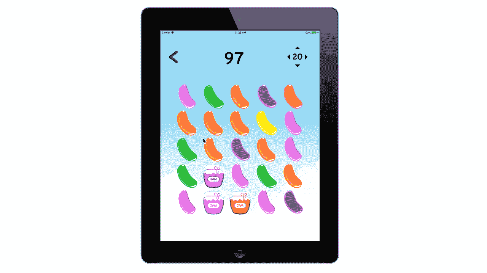

因此，直接比较图像并不总是有效的。您可以编写一些助手函数来解决这些情况，但我个人不建议这样做。

为了获得成功和可伸缩性，我们将把每个图像重新定义为存储图像属性的对象。为此，将以下代码添加到`Images.js`

```
// Enum
const COLORS = {
  BLUE: 1,
  RED: 2,
  YELLOW: 3,
  PINK: 4,
  PURPLE: 5,
  ORANGE: 6,
  GREEN: 7,
}
export const PINK_BEAN_OBJ =  {
  image: PINK_BEAN,
  color: COLORS.PINK,
  isJar: false
}export const BLUE_BEAN_OBJ=  {
  image: BLUE_BEAN,
  color: COLORS.BLUE,
  isJar: false
}export const RED_BEAN_OBJ =  {
  image: RED_BEAN,
  color: COLORS.RED,
  isJar: false
}export const PURPLE_BEAN_OBJ =  {
  image: PURPLE_BEAN,
  color: COLORS.PURPLE,
  isJar: false
}export const YELLOW_BEAN_OBJ =  {
  image: YELLOW_BEAN,
  color: COLORS.YELLOW,
  isJar: false
}export const GREEN_BEAN_OBJ =  {
  image: GREEN_BEAN,
  color: COLORS.GREEN,
  isJar: false
}export const ORANGE_BEAN_OBJ =  {
  image: ORANGE_BEAN,
  color: COLORS.ORANGE,
  isJar: false
}export const BEAN_OBJS = [PINK_BEAN_OBJ,PURPLE_BEAN_OBJ,BLUE_BEAN_OBJ,ORANGE_BEAN_OBJ,GREEN_BEAN_OBJ,YELLOW_BEAN_OBJ,RED_BEAN_OBJ]
```

如您所见，我们的资产对象现在存储颜色、图像和一个布尔变量，该变量告诉我们图像是否是一个罐子。您可以使用这种策略来存储关于您的图像的所有类型的元数据，但这是我们目前所需要的。

## 让我们稍微整理一下

为了区分我们的常规图像资产和资产对象，我们使用了格式`IMG_NAME_OBJS.`，我们还导出了一个名为`BEAN_OBJS`的所有这些对象的数组，以取代我们到目前为止一直使用的`BEANS`数组。

回到`SwappableGrid`中，导入`BEAN_OBJS`而不是`BEANS`，并用`let randomBean = BEAN_OBJS[int]`替换行`let randomBeans = BEANS[int]`

此外，不要忘记确保更新您的 TileData 类，以反映我们现在传递的是一个图像对象，而不仅仅是一个图像:

```
// TileData.jsexport class TileData {
    constructor(imgObj, key) {
    this.key = key;
    this.location = new Animated.ValueXY();
    this.imgObj = imgObj; <------ Used to be this.image
    this.scale = new Animated.Value(1);
  }
}
```

现在我们准备开始检测匹配。

## 查找匹配项

我们将通过与网格上的坐标相对应的索引数组来定义“匹配”。例如，如果第一行的前三个牌是匹配的，则记录如下:

```
firstThreeOfFirstRow = [[0,0],[0,1],[0,2]]
```

为了定义匹配的标准，我们将在`GridApi.js`中放置一个名为`isMatch`的函数，并确保它执行以下操作:

*   如果任一对象为`null`，则返回`false`
*   如果图像相同，则返回`true`。
*   如果图像都是罐子，则返回`true`。

```
// In GridApi.jsexport const isMatch = (objOne,objTwo) => {if (objOne != null && objTwo != null) {
  if (objOne.image == objTwo.image) {
    return true
  } else if (objOne.isJar && objTwo.isJar) {
    return true
  } else {
    return false
  }
 }
}
```

因为我们的对象也存储它是否是一个罐子，所以我们可以很容易地比较我们正在查看的两个对象是罐子还是仅仅是同一个图像。我们检查 null，因为这将有助于在下一节中处理我们的一个边缘情况。

## 匹配算法

既然我们已经完全具备了构成匹配和不匹配的标准，我们就可以开始遍历数据源并收集匹配。

由于网格的维度不够大，无法在同一行中进行两次匹配，我们可以假设在给定的行或列中只有一次匹配。我将把这个方法推广到同一行或同一列中的多个匹配，作为一个练习留给读者。

计划是这样的:

*   记录我们行中第一个图块的对象和索引。
*   将索引添加到名为`potentialMatch`的空数组中
*   检查下一个图像是否匹配。
*   将索引添加到数组中。
*   当我们发现下一个图块与我们正在计数的图像不匹配时，我们会检查潜在匹配的数组是否大于或等于 3。
*   如果我们找到一个有效的匹配，将它添加到名为`matches`的匹配数组中
*   通过用下一个元素的索引填充来重置`potentialMatch`数组
*   对每一行都这样做。

看起来是这样的:

```
// Iterates through each row to look for a match.
export const checkRowsForMatch = (tileData) => {
    // Store the array of matches
    let matches = []// Iterate through the rows from top to bottom.
    for (var j = 0; j < 5; j++) {
      // Record the first index in the row.
      let firstIndex = [0,j]
      // Add the index to our potentialMatch
      let potentialMatch = [firstIndex]
      // Record the imgage object corresponding to the first element in our potentialMatch
      let currentImageObj = tileData[0][j].imgObj// Traverse the elements of the row.
      for (var i = 0; i < 5; i++) {// Get the object stored in the next tile. Set to null if the next index is out of range.
      let nextTileObj = (i+1) < 5 ? tileData[i+1][j].imgObj: nullif (isMatch(currentImageObj,nextTileObj)) {
        // Add the next index to our potential Match.
        potentialMatch.push([i+1,j])} else {
        // Check to see if the potentialMatch is greater than 3.
        if (potentialMatch.length >= 3) {
          matches.push(potentialMatch)
        }
          // Reset the first index.
          firstIndex = [i+1,j]
          // Add it to the potentialMatch
          potentialMatch = [firstElement]
          // Reset the current imageObj to that of the next image.
          currentImageObj = (i+1) < 5 ? tileData[i+1][j].imgObj: null
      }
    }
  }
  return matches
}
```

还记得我们如何给我们的`isMatch`函数添加一个空检查吗？原因如下:

```
// Assigning next tileObject
let nextTileObj = (i+1) < 5 ? tileData[i+1][j].imgObj: null
```

如果我们的索引超出范围，我们使用这个三元运算符返回 null。这允许我们安全地查看行中的下一个元素。

为了检查每一列，我们可以使用相同的算法并交换 I 和 j 的角色，如下所示:

```
// Iterates through each row to look for a match.
export const checkColsForMatch = (tileData) => {
    // Store the array of matches
    let matches = []// Iterate through the rows from top to bottom.
    for (var i = 0; i < 5; i++) {
      // Record the first index in the row.
      let firstIndex = [i,0]
      // Add the index to our potentialMatch
      let potentialMatch = [firstIndex]
      // Record the imgage object corresponding to the first element in our potentialMatch
      let currentImageObj = tileData[i][0].imgObj// Traverse the elements of the row.
      for (var j = 0; j < 5; j++) {// Get the object stored in the next tile. Set to null if the next index is out of range.
      let nextTileObj = (j+1) < 5 ? tileData[i][j+1].imgObj: nullif (isMatch(currentImageObj,nextTileObj)) {
        // Add the next index to our potential Match.
        potentialMatch.push([i,j+1])} else {
        // Check to see if the potentialMatch is greater than 3.
        if (potentialMatch.length >= 3) {
          matches.push(potentialMatch)
        }
          // Reset the first index.
          firstIndex = [i,j+1]
          // Add it to the potentialMatch
          potentialMatch = [firstIndex]
          // Reset the current imageObj to that of the next image.
          currentImageObj = (j+1) < 5 ? tileData[i][j+1].imgObj: null
      }
    }
  }
  return matches
}
```

## 尝试一下

在`SwappableGrid.js`中，导入我们的两个匹配函数，并在`viewDidLoad()`中调用它们。

```
// SwappableGrid.js inside swap(i,j,dx,dy)console.log("Row Matches",checkRowsForMatch(newData))
console.log("Column Matches",checkColsForMatch(newData))
```

摆弄它，确保数据看起来是正确的。作为参考，如果您的网格看起来像这样:

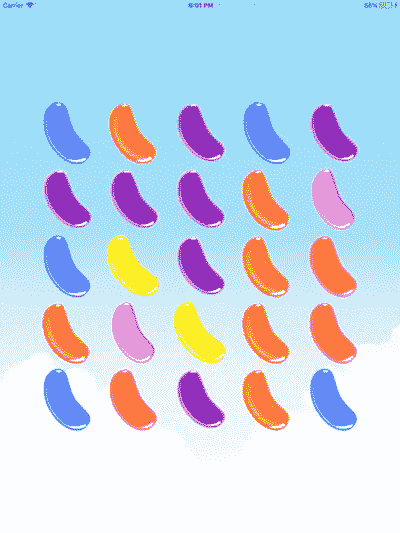

那么输出应该是这样的:

```
Row Matches = [[[0,1],[1,1],[2,1]]]
Column Matches = [[[2,0],[2,1],[2,2]],[[3,1],[3,2],[3,3],[3,4]]]
```

为了方便起见，让我们也创建一个小助手函数，通过调用两个`checkRowsForMatch` & `checkColsForMatch.`来返回所有匹配

```
export const getAllMatches = (tileData) => {let rowMatches = checkRowsForMatch(tileData)
  let colMatches = checkColsForMatch(tileData)return [...rowMatches,...colMatches]}
```

别忘了在`SwappableGrid.`里面导入`getAllMatches`

## 处理匹配

那么当我们找到匹配时会发生什么呢？嗯，我们首先必须删除匹配的 beans，使列就位，然后检查其他匹配。当我们完成时，它将看起来像这样:

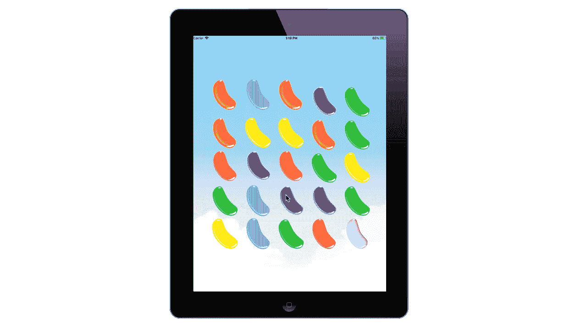

## 冷凝塔

我把刷新棋盘和填充火柴留下的空白空间的过程称为“浓缩”列。这是因为一个有空的空间的柱子必须“压缩”才能腾出空间让新的豆子放在上面。

因为我们要在`GridApi.js`中定义这个函数，我们需要将我们的 tileDataSource 传递给它。然而，它还需要知道哪些索引是匹配的一部分。让我们使用`TileData`类来标记哪些图块需要更新，而不是同时传递图块数据和匹配。回到`TileData.js`，添加一个名为`markedAsMatch.`的新布尔属性

```
// In TileData.jsexport class TileData {
  constructor(imgObj, key) {
    this.key = key;
    this.markedAsMatch = false <---- HERE
    this.location = new Animated.ValueXY();
    this.imgObj = imgObj;
    this.scale = new Animated.Value(1);
  }
}
```

现在，我们将创建一个函数，该函数获取我们的图块数据源以及匹配项，并标记它们以便更新。在`gridApi`中，我们需要以下内容:

```
// In gridApi.jsexport const markAsMatch = (matches,tileData) => {
  matches.forEach(match => {
    match.forEach(e => {
    let i = e[0]
    let j = e[1]
    tileData[i][j].markedAsMatch = true})
  })
}
```

因为我们要传递一个匹配数组，所以我们需要两个语句。一个用于提取匹配，另一个用于遍历匹配的元素。

既然我们的 tile 数据源知道哪些元素是匹配的一部分，我们就可以开始压缩列了。在最一般的意义上，我们通过遍历列，并根据每个 bean 下面的空白空间的数量向下移动每个 bean 来实现这一点。

例如，如果一个 bean 位于`[2,1]`并且在两个空格之上，那么它将被移动到`[2,3]`等等。这就是事情的真相:

```
// DON'T FORGET TO IMPORT TILE WIDTH:
import {TILE_WIDTH} from "../components/SwappableGrid"export const condenseColumns = (tileData) => {
    // Get number of rows and number of columns.
    let numOfRows = tileData[0].length
    let numOfCols = tileData.lengthlet spotsToFill = 0;
    for (let i = 0; i < numOfRows; i++) {
      spotsToFill = 0;// Iterate through each column
      for (let j = numOfCols-1; j >= 0; j--) {// Check to see if the element is a spot that needs filling.
        if (tileData[i][j].markedAsMatch == true) {
          // Increment the spots to fill since we found a spot to fill.
          spotsToFill++;
          // Place the location above the top of the screen for when it "falls"
          tileData[i][j].location.setValue({
            x: TILE_WIDTH * i,
            y: -4 * TILE_WIDTH
          });} else if (spotsToFill > 0) {
          // Move bean downward
          const currentSpot = tileData[i][j];
          const newSpot = tileData[i][j + spotsToFill];tileData[i][j] = newSpot;
          tileData[i][j + spotsToFill] = currentSpot;
        }
      }
    }
  }
```

请注意，当我找到一个已被标记为匹配的图块时，我不仅增加了`spotsToFill`的值，还将 bean 放置在屏幕上方四个图块宽度的位置。这确保了一旦动画出现，豆子看起来是从上面“落下”的。这也意味着你将不得不在顶层从我们的`SwappableGrid`中导入`TILE_WIDTH`。

通过将下面的代码一直放在`SwappableGrid.js`内的`swap`函数的末尾来尝试一下

```
// In SwappableGrid at the end of swap(i,j,di,dj)let allMatches = getAllMatches(this.state.tileDataSource)if (allMatches.length != 0) {
      markAsMatch(matches,this.state.tileDataSource)
      condenseColumns(this.state.tileDataSource)
      this.animateValuesToLocations()
    }
```

我们在这里所做的就是提取所有匹配，标记它们以便更新，压缩列，然后执行动画。结果相当酷。看一看:

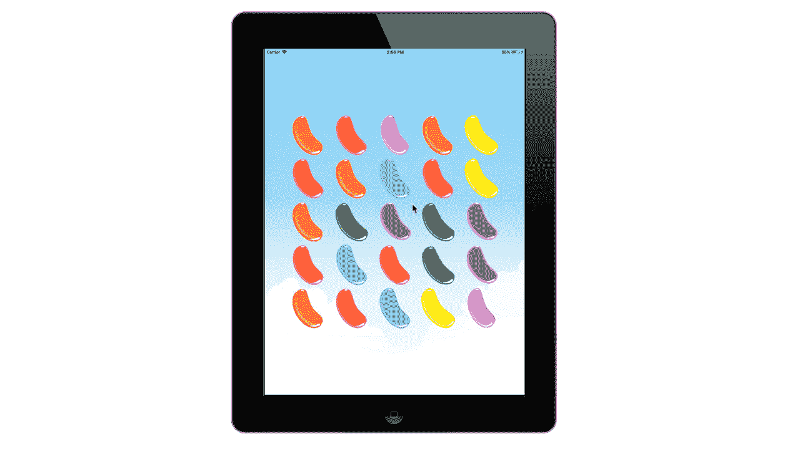

进展不错，但我们仍有一些问题:

*   新豆子不会变色(我们知道)
*   所有以前的匹配都被视为仍然匹配。(你能猜到为什么吗？)
*   动画甚至在交换完成之前就出现了。

之前的匹配即使在处理后仍然保持动画的原因是因为我还没有将`markedAsMatch`属性重置回(简单修复)然而，如果我要用新的颜色补充网格，我还有很多工作要做。

## 改变颜色

到目前为止，我们还没有对`setState`进行一次调用，尽管整个网格依赖于一个状态变量`tileDataSource.`这是因为我们对 tileDataSource 所做的只是…

1.  交换数组中的元素
2.  操纵动画值

事实上，自从我们的组件第一次挂载以来，`this.renderTiles`甚至还没有被调用过。不相信我？继续把一个`console.log("rendering Tiles")`放在里面，然后去玩网格。我会等…

但是现在我们必须考虑如何改变在我们的 tile 组件上呈现的图像。在我们这样做之前，让我们先提醒自己图像是如何出现。这一切都是从`renderTiles`开始的，当时我们从`tileDataSource:`中提供了图片作为道具

```
// SwappableGrid.js
renderTiles(tileData) {
    console.log("Render Tiles Called")
    let tiles = [];
    tileData.forEach((row, i) => {
      let rows = row.forEach((e, j) => {
       // e is a singular TileData class.
        tiles.push(
          <Tile
            location={e.location}
            scale={e.scale}
            key={e.key}
            img = {e.imgObj.image}
          />
        );
      });
    });
    return tiles
  }
```

为了用新图像重新渲染，我们需要调用`setState,`，但是首先，我们必须配置新图块数据源的状态。新切片数据源将是原始切片数据源的副本，但有两处修改:

*   对应于匹配的索引将被分配新的随机图像对象。
*   `markedAsMatch`属性将被重置为假。

我们将使用一个名为`recolorMatches`的函数来完成这项工作，该函数遍历 tile 数据源并执行前面提到的更新。

```
// In SwappableGrid.jsrecolorMatches(tileData) {
    tileData.forEach(row => {
      row.forEach(e=> {
      if (e.markedAsMatch == true){
        let randIndex = getRandomInt(7);
        let randomBeanObj = BEAN_OBJS[randIndex]
        e.markedAsMatch = false
        e.imgObj = randomBeanObj
      }
    })
    });
  }
```

当我写这个函数时，我体内的 Swift 开发人员突然想让函数返回一个新的 tile 数据源，而不仅仅是操纵输入。这是因为默认情况下，Swift 中的所有内容都是作为副本传递的，但在 Javascript 中，任何对象都是通过引用传递的。实际上，当我们将数据传递给`GridApi`中的函数时，我们一直都在这么做

## 准备好

现在我们已经准备好让整个事情开始运行了。现在，我们用来处理匹配的代码被填充在我们的`swap`函数中。因为不是每一次交换都会产生一个匹配，所以让我们创建一个名为`processMatches`的独立函数，当棋盘上有匹配时就会调用这个函数。我们将从一个精简的版本开始，然后添加关键细节。将以下代码放入可交换网格中:

```
// SwappableGridprocessMatches(matches) {this.setState((state => {
      // Create a copy to our existing tileDataSource
      let newTileDataSource = state.tileDataSource.slice()// Mark matches for update.
      markAsMatch(matches,newTileDataSource)// Repositioning tiles marked for update.
      condenseColumns(newTileDataSource)// Recoloring those tiles & reseting update status.
      this.recolorMatches(newTileDataSource)// Set the new state animate the tiles.
      return {tileDataSource: newTileDataSource}}),()=>{this.animateValuesToLocations()})}
```

现在，在我们检查棋盘上是否有匹配之后，在`swap`中添加一个对它的调用。

```
// In SwappableGrid at the end of swap(i,j,di,dj)let allMatches = getAllMatches(this.state.tileDataSource)if (allMatches.length != 0) {
      this.processMatches(allMatches) <--- Here
   }
```

继续运行它，您会看到:

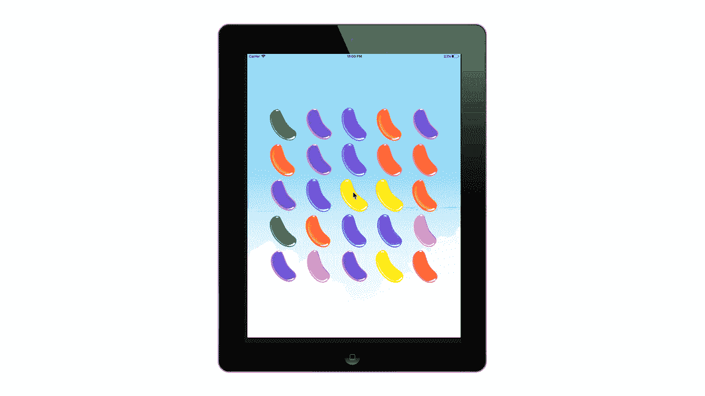

很好，但是还有两个问题:

*   在补充 beans 之前，交换动画没有机会完成。
*   在注册新的交换之前，不会评估网格的新状态中包含的匹配。

谢天谢地，这两个都很容易修复，但是首先我们应该仔细看看我们的`processMatch`函数到底在做什么。

```
processMatches(matches) {this.setState((state => {// Create a copy to our existing tileDataSource
      let newTileDataSource = state.tileDataSource.slice()// Mark matches for update.
      markAsMatch(matches,newTileDataSource)// Repositioning tiles marked for update.
      condenseColumns(newTileDataSource)// Recoloring those tiles & reseting update status.
      this.recolorMatches(newTileDataSource)let nextMatches = getAllMatches(newTileDataSource)// Set the new state animate the tiles.
      return {tileDataSource: newTileDataSource}}),()=>{this.animateValuesToLocations()})}
```

您可能已经注意到我们的`setState`采用了一个接收当前状态并返回包含新状态的对象的箭头函数。在该函数中，我们使用`state.tileDataSource.slice()`复制当前状态，并对其执行以下更新:

1.  使用`markAsMatch`标记需要更新的匹配项
2.  使用`condenseColumns`浓缩色谱柱
3.  给火柴重新上色。(这也将`markedAsMatch`属性重置为`false`)
4.  计算`nextMatches`以查看新数据中是否有任何匹配。

在调用`setState.`之前计算`newTileDataSource`中的所有匹配很重要，这是因为`setState`是异步的，我们不能保证在我们开始寻找新的匹配时它会被更新。因此，使用我们知道新状态最终会变成的值比等待它被设置更安全。

## 动画回调

确保交换动画完成的解决方案隐藏在动画块本身中。

```
swap(i,j,dx,dy){const swapStarter = this.state.tileDataSource[i][j];
    const swapEnder = this.state.tileDataSource[i + dx][j + dy];this.state.tileDataSource[i][j] = swapEnder;
    this.state.tileDataSource[i+dx][j+dy] = swapStarter;Animated.parallel([
      Animated.timing(swapStarter.location, {
        toValue: {x: TILE_WIDTH*(i+dx),y: TILE_WIDTH*(j+dy)},
        duration: 120,
        useNativeDriver: true
      }),
      Animated.timing(swapEnder.location, {
        toValue: {x: TILE_WIDTH*i,y: TILE_WIDTH*j},
        duration: 120,
        useNativeDriver: true
      }),
    ]).start() <------- RIGHT HERE
```

如果我们不调用`.start()`，我们的动画块将什么也不做。这样，您可以在运行动画之前定义它们。也许你注意到了这一点，但是你可能没有注意到的是`start()`实际上接受了一个在动画完成时执行的回调。因此，如果我们检查匹配并在回调中调用`processMatch`,它应该确保动画首先完成。

我们可以通过将动画块定义为一个常量，然后单独调用它，使其更具可读性。像这样:

```
swap(i,j,dx,dy){const swapStarter = this.state.tileDataSource[i][j];
    const swapEnder = this.state.tileDataSource[i + dx][j + dy];this.state.tileDataSource[i][j] = swapEnder;
    this.state.tileDataSource[i+dx][j+dy] = swapStarter;// Define the block
const animateSwap = Animated.parallel([
      Animated.timing(swapStarter.location, {
        toValue: {x: TILE_WIDTH*(i+dx),y: TILE_WIDTH*(j+dy)},
        duration: 120,
        useNativeDriver: true
      }),
      Animated.timing(swapEnder.location, {
        toValue: {x: TILE_WIDTH*i,y: TILE_WIDTH*j},
        duration: 120,
        useNativeDriver: true
      }),
    ])// Call it
animateSwap.start(()=> {
        let allMatches = getAllMatches(this.state.tileDataSource)
        if (allMatches.length != 0) {
          this.processMatches(allMatches)
        }})
  }
```

现在可以清楚地看到，只有在交换动画完成之后，我们才使用回调来检查新的匹配。现在我们所要做的就是确保我们检查在棋盘“浓缩”后形成的新匹配。

## 递归

我们很幸运在这里有一个使用递归的好例子。但是我们必须小心一件事。“浓缩”动画需要在我们再次调用`processMatch`之前完成。上次我们使用动画回调函数来确保这一点，但是如果你看一下我们的`animateValuesToLocations`函数，你就会明白为什么那不是一个选项。

```
animateValuesToLocations() {
    this.state.tileDataSource.forEach((row, i) => {
      row.forEach((elem, j) => {
        Animated.timing(elem.location, {
          toValue: { x: TILE_WIDTH * i, y: TILE_WIDTH * j },
          duration: 250,
          useNativeDriver: true
        }).start(); <---- Executed 25 times.
      });
    });
  }
```

看到了吗？每次我们调用`processMatch.`时，动画块会被执行 25 次，这对于我们需要一次更新电路板上的一大堆东西来说非常方便，但这并不是一个放置函数调用的好地方。

所以对于我最后一个肮脏的小把戏，我们将让`processMatch`在`setTimout.`内部调用它自己

```
// At the end of processMatchif (nextMatches.length != 0) {
        setTimeout(()=>{this.processMatches(nextMatches)},250)
      }
```

这将阻止`processMatch`进行递归调用，直到动画需要完成的 250 毫秒之后。继续运行，它应该是这样的:

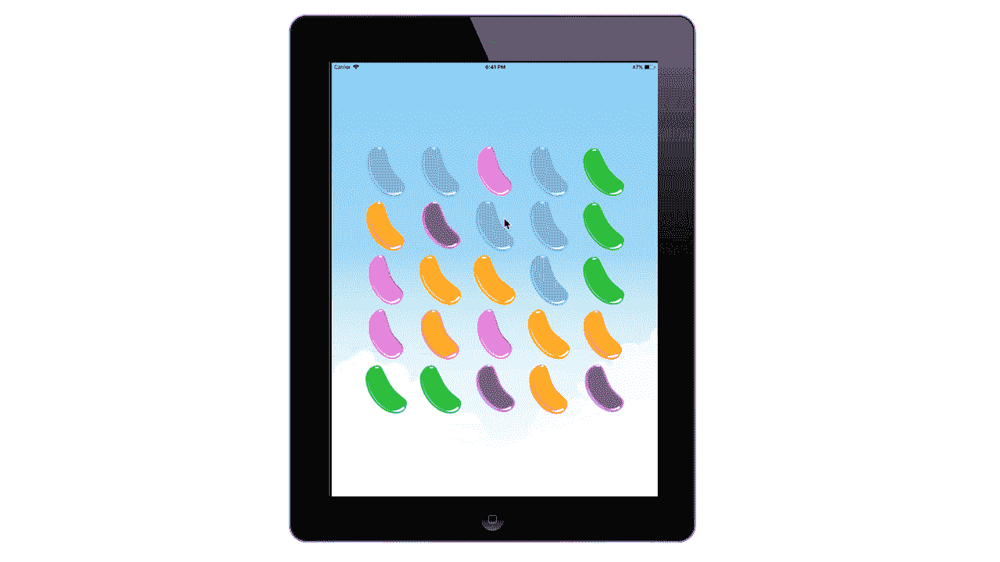

一切都好吗？这就结束了本教程的第一部分。希望你已经有了很多工作要做，但是不要忘记关注我们的第二部分，在那里我们会更深入地让这感觉像一个真正的游戏。

# 请继续关注第二部分

*   制作罐子&添加游戏逻辑
*   错误检查
*   重复算法
*   分数跟踪
*   航行