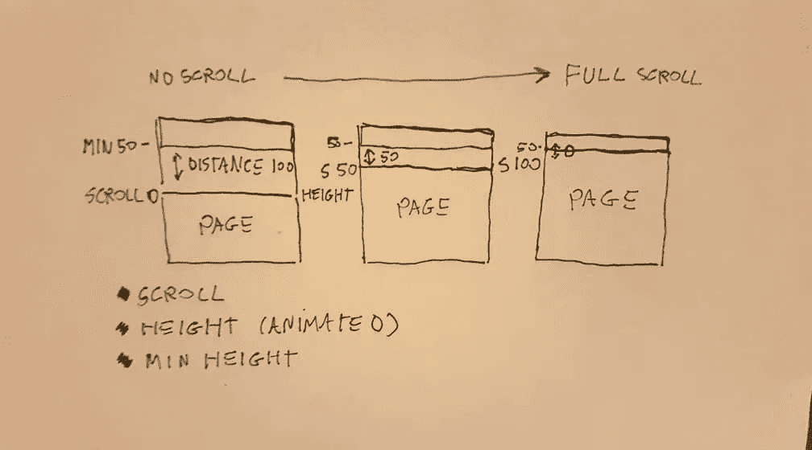
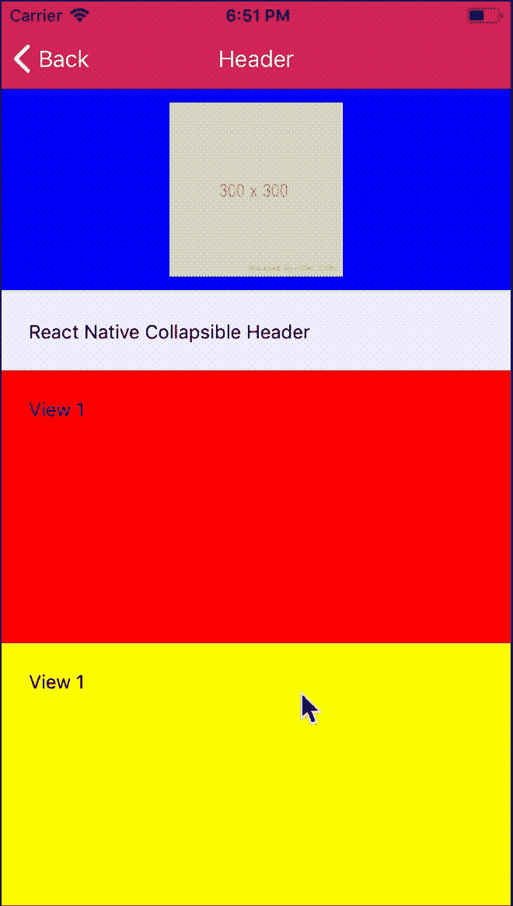

# React 本机可折叠标题—显示专业知识

> 原文：<https://itnext.io/react-native-collapsible-headers-explained-78584ff133d8?source=collection_archive---------0----------------------->

近年来，可折叠标题模式在应用程序中变得非常流行，但重要的问题是…我们如何在 React Native 中实现这一点？


革命(左)-现在奖励我(右)

不要担心，因为今天您将学习纯 JavaScript 的可折叠标题的秘方。混合香料、一些糖和少许盐，🧂全“酱”码[可在本文末尾获得。](https://gist.github.com/lukebrandonfarrell/866f208718c1326035df4e694c17b2da)

首先，我们需要在 react 本地组件中定义三个常量，理论上，这些常量可以根据高级可折叠头的用户设置而动态变化，但在我们的示例中，这些值是常量。

```
const H_MAX_HEIGHT = 150;
const H_MIN_HEIGHT = 52;
const H_SCROLL_DISTANCE = H_MAX_HEIGHT - H_MIN_HEIGHT;
```

*   `H_MAX_HEIGHT`将用于配置我们的页眉的最大高度。
*   `H_MIN_HEIGHT`将用于配置我们的页眉可以折叠的最小高度。
*   `H_SCROLL_DISTANCE`是割台的最大高度和最小高度之间的距离，将与`scrollOffsetY`一起用于插值。

我们将使用钩子来构建这个头，因为它极大地简化了代码，如果你没有使用钩子，那么你可以通过使用`this.state`中的`Animated` API 将它转换成一个类组件。

```
const scrollOffsetY = useRef(new Animated.Value(0)).current;
```

在上面的代码中，我们设置了一个引用来跟踪我们的`scrollOffsetY`作为一个动画值。然后下面的代码使用`scrollOffsetY`(这个值随着我们的滚动视图的移动而更新)并从最大高度到最小高度进行插值。

```
const headerScrollHeight = scrollOffsetY.interpolate({
    inputRange: [0, H_SCROLL_DISTANCE],
    outputRange: [H_MAX_HEIGHT, H_MIN_HEIGHT],
    extrapolate: "clamp"
});
```

这是因为我们从`0`开始`scrollOffsetY`，我们希望以页面滚动的相同速度在最大和最小高度之间制作标题动画，这可能很难理解，下图说明了这个概念。



动画值图表

为了完成可折叠标题，我们必须将上面定义的值应用到组件中。首先是标题组件，它是`absolute`并且有一个由我们的动画`headerScrollHeight`控制的动态高度。

```
<Animated.View
  style={{
    position: "absolute",
    left: 0,
    right: 0,
    top: 0,
    height: headerScrollHeight,
    width: "100%",
    overflow: "hidden",
    zIndex: 999,
    // STYLE
    borderBottomColor: "#EFEFF4",
    borderBottomWidth: 2,
    padding: 10,
    backgroundColor: "blue"
   }}
>
  <Image
    source={{ uri: "[https://via.placeholder.com/300](https://via.placeholder.com/300)" }}
    style={{ flex: 1 }}
    resizeMode={"contain"}
  />
</Animated.View>
```

在构建了我们的 header 组件之后，我们需要在我们的`<ScrollView />`中为`<View />`添加一个填充。这定义了我们的滚动视图内容应该从哪一点开始，这应该是页眉的初始高度，这是最大高度。

```
<ScrollView ...
  <View style={{ paddingTop: H_MAX_HEIGHT }}>
   ... // rest of content
```

最后，我们将一个`Animated.event`附加到我们的`ScrollView`上来更新`scrollOffsetY`(记住这个值将被插入来激活我们的标题)。我们需要使用`scrollEventThrottle`事件每 16 毫秒触发一次`onScroll`事件，而不是默认的每次滚动后触发。降低`scrollEventThrottle`(1–16)将会给你一个更平滑的标题，但是会花费你的应用更多的资源。

```
<ScrollView        
   onScroll={Animated.event([
     { nativeEvent: { contentOffset: { y: scrollOffsetY }}}              
    ])
   }
   scrollEventThrottle={16}
/>
```



最终的结果…好吃！

以下链接是在应用程序的组件中实现可折叠头的完整源代码。与你的朋友分享这个食谱，用对家人的爱来烹饪它，或者把它带到工作中🥙

[https://gist . github . com/lukebrandonfarrell/866 f 208718 c 1326035 df 4 e 694 c 17 B2 da](https://gist.github.com/lukebrandonfarrell/866f208718c1326035df4e694c17b2da)