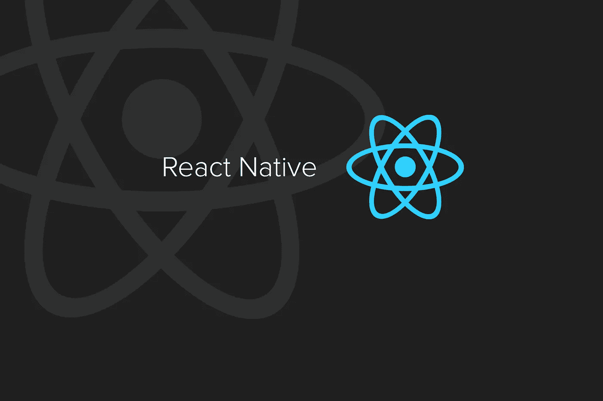

# React Native for iOS(给懂 React 的人)

> 原文：<https://itnext.io/react-native-for-ios-for-people-who-know-react-31c369650665?source=collection_archive---------7----------------------->



[*点击这里在 LinkedIn* 上分享这篇文章](https://www.linkedin.com/cws/share?url=https%3A%2F%2Fitnext.io%2Freact-native-for-ios-for-people-who-know-react-31c369650665)

如果你开始阅读关于 React Native 的教程或文档，你会发现其中很大一部分都在谈论 React。然而，如果你知道 React，筛选你已经知道的东西可能会很麻烦。所以，如果你知道 react，我决定让你了解 React 特有的东西。

首先，我们来了解一下 React Native 给了我们什么。React native 不能替代 React。React Native 为您提供了工具，因此您可以使用 Javascript 编写 iOS 应用程序(Objective-C)或 Andriod 应用程序(Java)的构建模块。

所以，既然知道了 React Native 是什么，那就来装吧！

以下是我们必须安装/更新的东西:Xcode、Homebrew、Node/NPM、watchman 和 RN CLI，按此顺序。Xcode 可以通过 app store 下载或更新。以下是如何得到其余的。

```
HomeBrew:
/usr/bin/ruby -e "$(curl -fsSL https://raw.githubusercontent.com/Homebrew/install/master/install)"
or update:
brew updateNode:
brew install nodeWatchman:
brew install watchmanCLI:
npm install -g react-native-clito make the project:
react-native init [project name]
```

现在我们可以运行一个模拟器，看看我们的项目在 iPhone 上会是什么样子。在您的项目目录中，运行以下命令:

```
react-native run-ios
```

我们有一个小 iPhone 来看我们的东西！

和 React 一样，index.js 将是我们的切入点。而不是做出反应。Dom 来呈现我们的组件，我们使用 react-native 模块中的 AppRegistry。

```
import React from 'react'
import {AppRegistry} from 'react-native'
import App from './App'AppRegistry.registerComponent('myProject', ()=> App)
```

现在，让我们制作一个快速的应用程序组件进行渲染:

```
import React, {Component} from 'react'
import {Text} from 'react-native'class App extends Component{
   render(){
      return()
    }}
```

看起来像普通人的反应，对吗？你会注意到唯一的不同是我们从 React Native 导入的东西。这里，我正在导入一个名为 Text 的组件。这是我们为手机应用程序制作文本的方式，而不是使用“p”或“h”HTML 标签。

```
import React, {Component} from 'react'
import {Text} from 'react-native'class App extends Component{
   render(){
      return(
         <Text>This is my awesome app</Text>    
     )
    }}
```

和 react 一样，我们只能返回一个组件。除了 div，您还可以使用一个视图组件作为容器。

```
import React, {Component} from 'react'
import {Text, View} from 'react-native'class App extends Component{
   render(){
      return(
         <View>
         <Text>This is my awesome app</Text>
         <Text>... in the making</Text> 
         </View>   
     )
    }}
```

所以如果你知道反应，这开始变得熟悉。我不打算解释每一件小事让你感到厌烦，所以我打算做一个 React-Native 组件的快速备忘单来使用。

文本输入用于表单。onPress 和 title 是必需的道具

```
<TextInput
onPress = {()=> console.log('I have been submited')}
title = 'Username'
placeholder = 'enter username here'/>
```

按钮看起来也一样:

```
<Button
onPress = {()=> console.log('I have been pressed')}
title = 'Click me'
style = {styles.buttonStyle}/>
```

有许多不同类型的按钮可以根据用户触摸按钮的方式做出不同的响应。那是在文档中。

当你需要用户滚动时，如果有内容越过手机屏幕，ScrollView 容器是很好的选择。

```
<ScrollView>
............
............
............
............
............
</ScrollView>
```

所以现在我相信你已经很好的体验了从 React 到 React Native 的过程。反应性文档非常好，所以现在您已经准备好填补空白了！