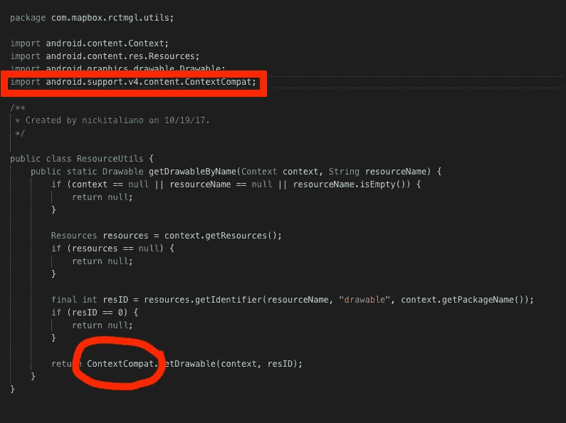
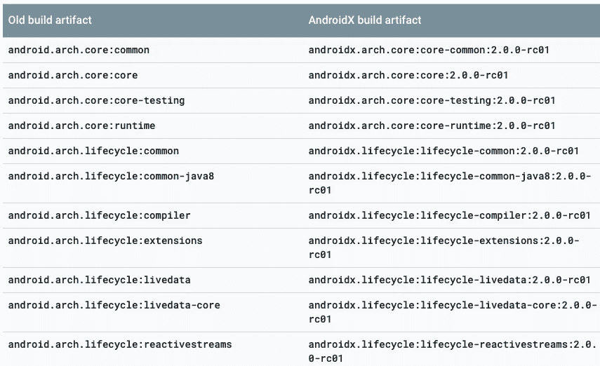
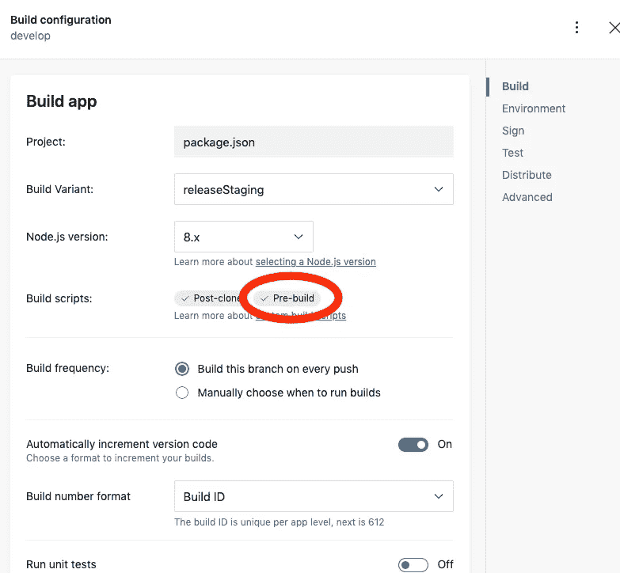
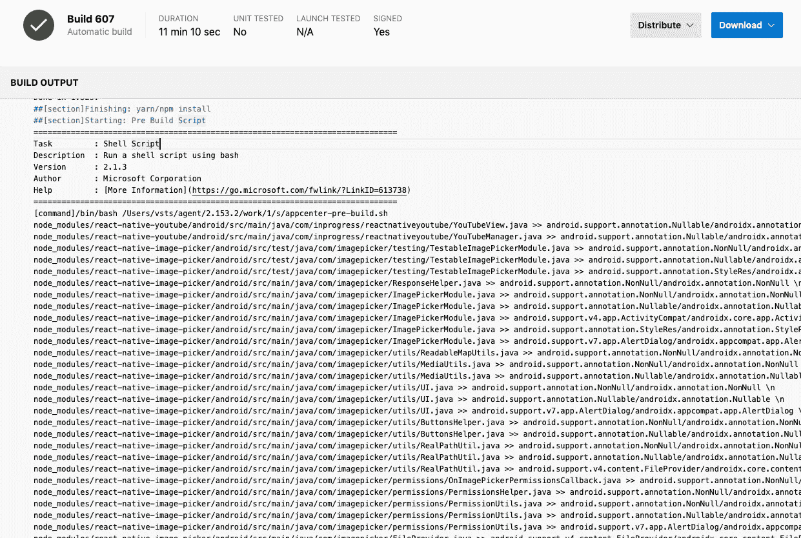

# react Native——如何处理同时具有 pre-AndroidX 和 AndroidX 依赖项的应用程序(RN60)

> 原文：<https://itnext.io/react-native-how-to-handle-an-app-with-both-pre-androidx-and-androidx-dependencies-rn60-bf4df7ea0dd2?source=collection_archive---------0----------------------->

在开始和深入研究如何处理一个具有非 Android 和 Android 依赖性的应用程序的原因/方法/解决方案之前，有必要花一点时间讨论一下 Android 是什么。

如果你还没听说过这个术语， [AndroidX](https://developer.android.com/jetpack/androidx) 是谷歌推出的用 Jetpack 打包图书的新程序。本质上，旧的图书馆管理方式变得过于复杂，所以谷歌决定开始清理他们的行为，并使用新的系统，以及新的图书馆名称。

因此，如果您的项目依赖于一个名为`com.android.support:appcompat-v7`的库，并且您想迁移到 AndroidX，那么您必须调用`androidx.appcompat:appcompat:1.0.0`。谷歌很有帮助，甚至在这里提供了一个新旧名字的列表:[https://developer.android.com/jetpack/androidx/migrate](https://developer.android.com/jetpack/androidx/migrate)

那么这对您的 React 原生项目意味着什么呢？如果你像我们一样使用一些第三方库(Firebase，Auth0，Mapbox 等等)。)那么，要么你的项目直接引入 Google librairies，要么你的一些第三方依赖 Google librairies。

这意味着在你的 android 项目中的某个地方，在你的 build.gradle 中，你可能有这样一行:

```
implementation "com.android.support:appcompat-v7:<version-name>"
```

或者在你的依赖关系树中(在 Android Studio 中，点击终端，然后运行`./gradlew app:dependencies`,这将显示如下内容:

```
+--- project :react-native-code-push
|    +--- com.facebook.react:react-native:+ -> 0.57.5
|    |    +--- com.facebook.infer.annotation:infer-annotation:0.11.2
|    |    |    \--- com.google.code.findbugs:jsr305:3.0.1 -> 3.0.2
|    |    +--- javax.inject:javax.inject:1
|    |    +--- com.android.support:appcompat-v7:27.1.1
|    |    |    +--- com.android.support:support-annotations:27.1.1
|    |    |    +--- com.android.support:support-core-utils:27.1.1
|    |    |    |    +--- com.android.support:support-annotations:27.1.1
|    |    |    |    \--- com.android.support:support-compat:27.1.1
|    |    |    |         +--- com.android.support:support-annotations:27.1.1
|    |    |    |         \--- android.arch.lifecycle:runtime:1.1.0
|    |    |    |              +--- android.arch.lifecycle:common:1.1.0
|    |    |    |              \--- android.arch.core:common:1.1.0
|    |    |    +--- com.android.support:support-fragment:27.1.1
|    |    |    |    +--- com.android.support:support-compat:27.1.1 (***)
```

如您所见，`react-native-code-push`依赖项依赖于 React Native，而 React Native 本身又依赖于 com . Android . support:appcompat-v7，而 app compat-V7 又依赖于 com . Android . support:support-core-utils

这一切都很好，只要:

*   所有的依赖项和第三方库都依赖于 AndroidX 之前的名称空间(即`com.android.support...)`

运筹学

*   你所有的依赖依赖于 AndroidX 命名空间(例如`androidx.appcompat...)`

发生在我们身上的事情是，我们发现自己被推到了一种状态，在这种状态下，我们的依赖使用了两者的混合。

# **怎么就开始出问题了**

发生了什么事？好吧，不要说太多细节，我们需要升级我们的一些图书馆来修复一些错误。我们需要的版本已经开始在幕后使用 AndroidX，这让我们陷入了这种宿命的境地。

我认为这也会发生在许多迁移到 React Native 59(或 60)的人身上，他们会发现尽管 React Native 现在使用 AndroidX，但一些第三方模块可能仍然不支持 AndroidX。

我们最初看到的是一个与我们的 AndroidManifest 相关的错误:

```
ERROR: Manifest merger failed : Attribute application@appComponentFactory value=(android.support.v4.app.CoreComponentFactory) from [com.android.support:support-compat:28.0.0] AndroidManifest.xml:22:18-91
 is also present at [androidx.core:core:1.0.0] AndroidManifest.xml:22:18-86 value=(androidx.core.app.CoreComponentFactory).
 Suggestion: add 'tools:replace="android:appComponentFactory"' to <application> element at manifestMerger4756582261911642725.xml:7:5-9:19 to override.
```

正如您在这里看到的，该消息告诉我们，两个图书馆试图写入清单的同一个密钥，导致合并失败。你还会注意到，试图写入同一个键的两个库是 pre-AndroidX 和 AndroidX，但是*它们实际上是同一个库*——因此它们都试图做同样的事情！

唯一的解决方案是“选择一边”并强制我们的项目使用 AndroidX 名称空间。谢天谢地，谷歌已经想到了这一点，并提供了一个解决方案。只需将下面这些密钥添加到您的`android > gradle.properties`文件中:

```
**android.useAndroidX**=**true
android.enableJetifier**=**true**
```

理论上，这些代码行所做的是“拦截”您的项目和第三方模块所需的旧名称空间，并用新的 AndroidX 名称空间替换它们。换句话说，当构建依赖树时，它会“看到”需要`com.android.support:support-compat`，而不是加载它，它会加载`androidx.core.app`。很棒吧？

只是下一步引入了一个新问题:

```
> Task :@mapbox_react-native-mapbox-gl:compileReleaseJavaWithJavac/Users/vsts/agent/2.153.2/work/1/s/node_modules/@mapbox/react-native-mapbox-gl/android/rctmgl/src/main/java/com/mapbox/rctmgl/utils/ResourceUtils.java:6: error: package android.support.v4.content does not existimport android.support.v4.content.ContextCompat;^/Users/vsts/agent/2.153.2/work/1/s/node_modules/@mapbox/react-native-mapbox-gl/android/rctmgl/src/main/java/com/mapbox/rctmgl/components/camera/constants/CameraMode.java:3: error: package android.support.annotation does not existimport android.support.annotation.IntDef;^/Users/vsts/agent/2.153.2/work/1/s/node_modules/@mapbox/react-native-mapbox-gl/android/rctmgl/src/main/java/com/mapbox/rctmgl/components/camera/constants/CameraMode.java:14: error: cannot find symbol@IntDef({ FLIGHT, EASE, NONE })^symbol:   class IntDeflocation: class CameraMode/Users/vsts/agent/2.153.2/work/1/s/node_modules/@mapbox/react-native-mapbox-gl/android/rctmgl/src/main/java/com/mapbox/rctmgl/components/camera/CameraStop.java:4: error: package android.support.annotation does not existimport android.support.annotation.NonNull;
```

现在我们有了一个不同的问题:`useAndroidX`标志已经动态地进行了交换，但是一些第三方库(通过 npm 安装并使用 react-native link 链接)现在显式地调用模块，这些模块不再能被找到，因为它们不是项目的一部分。

因此，如果您导航到文件`node_modules/@mapbox/react-native-mapbox-gl/android/rctmgl/src/main/java/com/mapbox/rctmgl/utils/ResourceUtils.java`，您确实会看到:



因此，在该文件中，我们有两条错误消息:

*   `android.support.v4.content`不再存在，因为它在构建时被`androidx.core.content`交换了。因此，您不能导入上下文兼容
*   `return ContextCompat.getDrawable()`显然也不行

如果您将导入替换为(同样，您可以在此处找到旧名称/新名称的映射):

```
import androidx.core.content.ContextCompat;
```

一切都会好的。

好了，问题很明显了:你需要更新你的第三方库的代码来构建这个项目。所以我们的选择是:

*   确保你使用最新版本的图书馆，因为有些可能已经支持 AndroidX:我们这样做了，解决了一些问题。
*   对于没有支持 AndroidX 版本的图书馆，让开发者更新他们的图书馆以支持 AndroidX。有些人可能要等几周，有些人可能要等几个月。这不是一个有效的策略
*   手动找到所有专门导入 Android 前版本库的 Java 文件，并更改代码以使用新的 Android 命名空间。

# 奋力营救

虽然选项 3 运行良好，尽管这是一项耗时、费力的工作，但它并不能真正扩展。

我们不手动构建我们的 apk，我们使用 AppCenter 来完成，所以这已经是一个阻碍。AppCenter 在每次构建之前都会执行一次清理`npm install`,因此在 node_modules 内部重写代码可以在本地工作，但不能在 CI 环境中工作。

此外，我们在一个团队中工作，我们不希望必须在每台机器上重新编写 node_module 代码。

另外，每次你不得不做一个`npm install`，你会覆盖你的改变，并不得不重新做一遍。

因此，我们必须找到一种可以在 CI 环境中使用的自动化方式。和往常一样，bash 脚本最终成为首选。最终，所要做的就是一个`search and replace.`,如果你看一下映射表，它非常简单明了:



AndroidX 映射表

我们需要的是找到旧名称表左栏中的值(见完整列表[此处](https://developer.android.com/jetpack/androidx/migrate))，并用新名称栏中给出的新值替换它们。另外，我们知道导入只发生在`.java`文件中，即(在 99.9%的情况下)可以在`node_modules/.../android/..`文件结构中找到。

不过，有一点需要注意，谷歌给出的名单很长:它有近 2000 个条目。所以搜索每一个名字要花很长时间。另外，我们从构建阶段的错误消息中知道，我们只需要搜索几个特定的字符串。

所以我们做的是:

*   我们通过一次替换一个 node_modules 文件中的导入来手动修复错误(听起来很可怕，但只花了大约 1 个小时)
*   我们记下了所有用旧名字进口的艺术品
*   我们在一个 txt 文件中写了一个旧名字->新名字的列表
*   然后我们编写了下面的脚本，在我们的项目中搜索并替换这些字符串

```
#!/bin/bashfor f in $(find node_modules -wholename "*/android/*.java");do cat androidxNodeModuleReplaceList.txt| while read line || [ -n   "$line" ] do if grep -q $(echo $line | sed 's/\/.*//') $f; then sed s/$line/g $f > $f.new && mv $f.new $f echo "$f >> $line \n" fi donedone
```

这个简单的脚本实现了它在 tin 上所说的功能:search。node_module/下的 java 文件../安卓/..当它找到一个文件时，它会搜索我们的引用文件`androidxNodeModuleReplaceList.txt`中的任何键。用新字符串替换旧字符串。控制台记录更换并继续。

作为参考，这里是我们的`androidxNodeModuleReplaceList.txt:`

```
android.support.v4.content.ContextCompat/androidx.core.content.ContextCompat
android.support.annotation.IntDef/androidx.annotation.IntDef
android.support.annotation.NonNull/androidx.annotation.NonNull
android.support.annotation.Nullable/androidx.annotation.Nullable
android.support.v4.app.NotificationManagerCompat/androidx.core.app.NotificationManagerCompat
android.support.v4.app.NotificationCompat/androidx.core.app.NotificationCompat
android.support.v4.content.res.ResourcesCompat/androidx.core.content.res.ResourcesCompat
android.support.annotation.RequiresApi/androidx.annotation.RequiresApi
android.support.v4.app.ActivityCompat/androidx.core.app.ActivityCompat
android.support.v4.content.FileProvider/androidx.core.content.FileProvider
android.support.v4.net.ConnectivityManagerCompat/androidx.core.net.ConnectivityManagerCompat
android.support.customtabs.CustomTabsIntent/androidx.browser.customtabs.CustomTabsIntent
android.support.v4.util.Pools/androidx.core.util.Pools
android.support.annotation.Keep/androidx.annotation.Keep
android.support.annotation.RequiresPermission/androidx.annotation.RequiresPermission
android.support.v4.content.LocalBroadcastManager/androidx.localbroadcastmanager.content.LocalBroadcastManager
android.support.v4.app.RemoteInput/androidx.core.app.RemoteInput
android.support.annotation.StyleRes/androidx.annotation.StyleRes
android.support.v7.app.AlertDialog/androidx.appcompat.app.AlertDialog
android.support.annotation.MainThread/androidx.annotation.MainThread
```

现在，只需将 txt 文件放在项目的根目录下，并将 bash 脚本放在项目的根目录下。

为了在本地构建，只需在控制台中调用就可以运行 bash 脚本。我们称之为`appcenter-pre-build.sh`,所以你只需在命令行输入`./appcenter-pre-build.sh`,然后按回车键。您将看到该脚本将替换整个文件结构中的许多导入。

# 如何在 AppCenter 中运行它

AppCenter 提供了构建脚本工具，这在 CI 领域非常普遍，在 Circle CI 和其他领域也将存在。

为了让 AppCenter 识别您的脚本，您需要给它一个特定的名称，这取决于您想在哪里调用它。在我们的例子中，脚本需要在`npm install`之后和`build`之前运行。这就是我们使用`appcenter-pre-build.sh`的原因。你可以在这里看到更多的文档:[https://docs . Microsoft . com/en-us/app center/build/custom/scripts/](https://docs.microsoft.com/en-us/appcenter/build/custom/scripts/)

不过，有一点需要注意，要将您的脚本考虑在内，您需要:

*   提交包括新文件在内的更改，并推入远程分支。
*   登录到 AppCenter，并导航到该分支的构建设置
*   您将看到一个视觉指示，即您的脚本通过看到蓝色的小勾号被识别出来(见下文)]
*   您仍然需要“保存”或“保存并构建”，即使不做任何更改，否则脚本将不会运行。有点奇怪，但是给你..



AppCenter 构建设置

瞧啊。您的分支现在将构建并使用该脚本。您可以检查日志，应该能够看到类似这样的内容:



带有预构建脚本的 AppCenter 构建

# 处理特殊情况

有时更新 Java 文件的代码可能还不够。通常，如果您使用`react-native-image-crop-picker` ，那么您可能会得到与 AndroidManifest.xml 相关的错误消息。这是因为库试图在引用旧类的主 AndroidManifest.xml 中插入一些代码:

```
<manifest xmlns:android="http://schemas.android.com/apk/res/android"package="com.reactnative.ivpusic.imagepicker"><uses-permission android:name="android.permission.WRITE_EXTERNAL_STORAGE" /><application><providerandroid:name="android.support.v4.content.FileProvider"android:authorities="${applicationId}.provider"android:exported="false"android:grantUriPermissions="true"><meta-dataandroid:name="android.support.FILE_PROVIDER_PATHS"android:resource="@xml/provider_paths" /></provider><activityandroid:name="com.yalantis.ucrop.UCropActivity"android:theme="@style/Theme.AppCompat.Light.NoActionBar" /></application></manifest>
```

如你所见，`provider`键正在使用`android:name="android.support.v4.content.FileProvider"`

如上所述，一旦`useAndroidX`被设置为 true，该引用将不起作用，因此构建将起作用，但是当在设备或模拟器上安装应用程序时，您可能会遇到以下消息:

```
E/AndroidRuntime: FATAL EXCEPTION: main
    Process: net.communityapp, PID: 5107
    java.lang.RuntimeException: Unable to get provider android.support.v4.content.FileProvider: java.lang.ClassNotFoundException: Didn't find class "android.support.v4.content.FileProvider" on path: DexPathList[[zip file "/data/app/<your-app-id>-EANMnjI7DZQI_uIRCAQ7Sg==/base.apk", zip file "/data/app/net
```

同样，关于找不到类的错误..

这个问题实际上很容易解决。Android 提供了一些工具来帮助你操作由不同图书馆插入到清单中的数据，并提供了处理这些数据的工具。

在我们的例子中，您需要做的就是在清单中使用 xmlns:tools = " http://schemas . Android . com/tools ",并在清单中强制使用新的 AndroidX 名称空间。

为此，请将这段代码插入您的清单:

```
<!-- Necessary to override the react-native-image-croper Manifest which still references the old android.support... instead of androidx... --><!-- Remove whenever that library gets updated to androidx --><providerandroid:name="androidx.core.content.FileProvider"android:authorities="${applicationId}.provider"android:enabled="true"android:exported="false"android:grantUriPermissions="true"tools:replace="android:name"><meta-dataandroid:name="android.support.FILE_PROVIDER_PATHS"android:resource="@xml/provider_paths" /></provider>
```

这可以添加到清单中的结束标签`</application>` 之前。这是指定一个使用 AndroidX 引用的提供者密钥。您还需要确保您的清单引用了“工具”:

```
<manifest xmlns:android="http://schemas.android.com/apk/res/android"**xmlns:tools="http://schemas.android.com/tools"**package="net.communityapp">
```

这里有更多关于 AndroidManifest 文件相关工具的细节:[https://developer.android.com/studio/build/manifest-merge](https://developer.android.com/studio/build/manifest-merge)

# 结论

虽然这个解决方案“有效”,并让我们重新构建和部署，但它只是一个临时的解决方案。

我们将密切关注我们使用的各种第三方图书馆发布的更新，并尝试慢慢地完全摆脱这个脚本。

希望对你有帮助，如果你有问题，或者改进的建议，请告诉我！我们仍然是相当新的反应原生，所以也许有更好，更有效的方法来处理这一点。