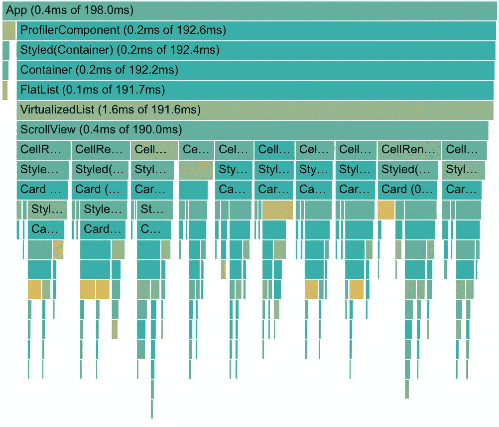

# React Native 中的性能跟踪

> 原文：<https://itnext.io/react-native-profiler-43d131130c5c?source=collection_archive---------3----------------------->


尼克·雷诺兹在 [Unsplash](https://unsplash.com/search/photos/fast?utm_source=unsplash&utm_medium=referral&utm_content=creditCopyText) 上的照片

**更新:**关于 React Profiler API 和设置，请遵循官方文档:[https://reactjs.org/docs/profiler.html](https://reactjs.org/docs/profiler.html)。请注意，**稳定的**分析器是在**React Native**[**0 . 61 . 0**](https://github.com/react-native-community/releases/blob/master/CHANGELOG.md#0610)**([React-16 . 9 . 0](https://github.com/facebook/react/releases/tag/v16.9.0))中发布的**

# **动机**

**每当我致力于优化某个组件以使其性能更好时，我都希望看到度量的结果，最好是来自用户的结果。**

**不幸的是，在 React Native 的早期版本中，我只能在自己的设备或模拟器上测量性能。**

**在最近的 React Native v57 版本中，我发现了一个不错的重要组件:**

**剖析器组件将为所有包装组件提供用户度量。**

```
<Profiler id={"ProfileComponent"} onRender={this.onRender}>
  <View>
   <Text>Hi</Text>
  </View>
</Profiler>
```

**关于这个组件最好的部分不是容易看到我们组件的度量，而是我们可以在**生产**中使用它！**

> **请注意，目前的分析器组件还不稳定。**

**让我们从实现**分析器**和 **Firebase 性能工具的简单示例开始。****

# ****要求👈****

*   **反应本土 **^0.57.3🔪**(从 0.56 开始也有可能，但还没测试过)**
*   **弹出的 React 本地项目**
*   **记录指标的工具(即: [Firebase 性能工具](https://rnfirebase.io/docs/v5.x.x/perf-mon/example)**

# **简单实现🤓**

## ****1。为 react-dom/profiler 添加别名****

**为了在生产环境中进行概要分析，我们需要在`.babelrc`文件中添加`react-dom/profiler`和`scheduler/tracing`的别名。**

**在我们编辑文件之前，我们需要安装这个包`babel-plugin-module-resolver`，它给我们带来了别名功能。**

**`yarn add -D babel-plugin-module-resolver`**

**一旦我们安装了 babel 插件，我们就像这样修改`.babelrc`:**

## **2.添加探查器组件**

**我们将从`React`导入`unstable_Profiler`，并创建一个别名以使我们的代码更具可读性。**

**实现 Profiler 本身非常简单。只需包装您想要测量的代码的任何部分。**

**最后一步是用`logMeasurement`函数监听`onRender`回调和 console.log 指标。正如您所看到的，函数是异步的，这部分是为了稍后实现 Firebase 性能。**

**下面是`onRender`函数将返回的内容的快速概述:**

*   **`id: string` -被测量的`Profiler`标签的`id`值。**
*   **`phase: “mount" | “update"` -识别该组件是否由于`state`或`props`的变化而被安装或重新渲染。**
*   **`actualDuration: number` -最近一次“挂载”或“更新”渲染花费在渲染`Profiler`及其后代上的时间。**
*   **`baseDuration: number`-`Profiler`树中每个单独组件最近`render`时间的持续时间。**

> **📖更多详情请咨询官方[侧写员 RFCS](https://github.com/bvaughn/rfcs/blob/profiler/text/0000-profiler.md)**

# **添加性能监控**

**为了记录分析器指标，我选择了 Firebase 性能工具([通过转化酶包](https://github.com/invertase/react-native-firebase)在 RN 中实现)**

**我把最后的代码放在前面，所以我可以单独检查每个部分。**

**由于我在`componentDidMount`中初始化跟踪，我必须在变量`initialMount`和`initialUpdates`中缓存初始渲染的值。然后记录这些数据(第 21、22 行)。**

**我还使用`traceStarted`变量来跟踪跟踪是否已经开始。Firebase 性能工具的当前实现是异步的。好消息是，在即将发布的版本中，perf 工具应该变得同步(我会关注那些[发布说明](https://rnfirebase.io/docs/v5.x.x/release-notes))**

**为了使这个例子非常简单，我只记录挂载时间`initialMount`(如果组件重新挂载，它将记录最后一次挂载)和计数器`updates`测量组件重新渲染的次数。**

> **我们能够记录的另一件事是每次重新渲染需要多长时间。可能性几乎是无限的🤩**

**通过这个简单的方法，我们可以将性能跟踪添加到我们最重要的组件中。**

**为了提高代码的可重用性，我们可以为 Profiler 创建自己的 HOC 组件，并包含所有附加的逻辑。**

# **我应该在生产中使用它吗？🙇‍**

**在写这篇文章的时候，这是一个相当棘手的问题。因为整个特性仍然被标记为不稳定，并且 React 没有使用异步渲染。**

**在生产中使用 profiler 时，我们可以预料到一些小的缺点。让我们仔细看看我最关心的两个问题。**

**首先是 Profiler 会给我们的组件增加多少额外的提交时间，其次我们可能想看看我们的包大小会增加多少。**

## ****Profiler 适合生产吗？****

**要回答这个问题，我们可以尝试使用[React Developer Tools Profiler](https://github.com/facebook/react-devtools)来测量添加`<Profiler>`组件之前/之后的影响。**

**我的测试用例由`FlatList`和渲染 10 倍的`native-base` `<Card />`组件组成。**

**出于测试目的，我创建了两个组件。用相同的代码。唯一的区别是在`<ProfilerComponent />`上增加了一个`<Profiler />`组件。**

****

**一次测试运行的真实数据示例**

**一旦我为每个组件运行这个测试 10 次，我得到了组件的 AVG 提交时间。**

*   **提交时间**与**分析器:**174 毫秒****
*   **提交时间**没有**分析器:**166 毫秒****

**我们可以看到，分析器组件增加了大约 5%的额外提交时间。**

**这个结果出乎我的意料。**

## ****捆尺寸****

**由于 React 本机渲染器是从上游 repo 同步的，所以最好总是根据 RN 版本检查实际大小。**

**最新渲染器:**

*   **[ReactNativeRenderer-prod . js](https://github.com/facebook/react-native/blob/master/Libraries/Renderer/implementations/ReactNativeRenderer-prod.js)**
*   **[ReactNativeRenderer-profiling . js](https://github.com/facebook/react-native/blob/master/Libraries/Renderer/implementations/ReactNativeRenderer-profiling.js)**

**在撰写本文时，产品渲染器的包大小比较为 **260kB** ，概要渲染器的包大小比较为 **272kB** 。这几乎没有增加额外的包大小，即使相对较小的 RN 应用程序也只有几兆字节的代码。**

## ****结论****

**基于这两个结果，我会毫不犹豫地在生产中使用 Profiler。**

**唯一需要记住的是，过度使用 Profiler 将不可避免地导致性能下降。**

> **快乐的侧写时间！🎄**

# **资源**

**我用来收集有关 Profiler 信息的所有资源:**

*   **[侧写员 RFCS](https://github.com/bvaughn/rfcs/blob/profiler/text/0000-profiler.md)**
*   **[如何在生产中启用性能分析](https://gist.github.com/bvaughn/25e6233aeb1b4f0cdb8d8366e54a3977#profiling-in-production)**
*   **[将分析器投入使用的拉请求🤓](https://github.com/facebook/react/pull/12745/files)**

> **你有什么想法？如果你觉得这篇文章有用，别忘了分享并给予一些赞扬！❤️️️️️**