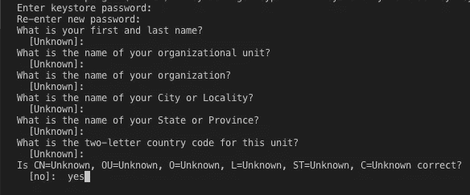

# React Native —发布签名的 APK Android 密钥库

> 原文：<https://itnext.io/react-native-publish-signed-android-apk-c374e09e3fd7?source=collection_archive---------0----------------------->


照片由[丁昆](https://unsplash.com/@tinhkhuong?utm_source=medium&utm_medium=referral)在 [Unsplash](https://unsplash.com?utm_source=medium&utm_medium=referral) 拍摄

您刚刚开发了所有的 react-native 代码并测试了所有的应用程序，并且想要在您的真实设备中进行尝试？

现在是时候创建 Android APK 来在真实设备中测试您的应用程序了。

Android 设备要求所有应用程序都必须用证书进行数字签名。我将解释如何创建您自己的证书，并用您的数字签名签署您漂亮的应用程序。

认证你的应用程序后，你可以将你的应用程序分发给**谷歌 Play 商店**。

## **让我们从生成登录密钥**开始

您可以使用`keytool`生成私有签名密钥。在 Windows 上`keytool`必须从`C:\Program Files\Java\jdkx.x.x_x\bin`运行。

```
keytool -genkeypair -v -keystore my-release-key.keystore -alias my-key-alias -keyalg RSA -keysize 2048 -validity 10000
```

Keytool 会问你

*   密码
*   名字和姓氏
*   企业中各管理部门
*   组织
*   城市或地区
*   州或省
*   两个字母的国家代码

**密码**是那里必需的一个*



Keytool 将为您创建**my-release-key . keystore**文件。

你的证书有效期为 10000 天。

## **用创建的密钥签名应用**

现在是放置所需目录的键的时候了。

如果你使用的是 mac，你可以用这个命令找到你的 **jdk** 路径

```
$ /usr/libexec/java_home
```

现在使用 cd 到该目录

```
$ cd /your/jdk/path
```

将您的**my-release-key . keystore**文件粘贴到那里。

我们还需要将密钥放入 React 本地应用程序，打开您的项目根文件夹，并将目录更改为，

```
$ cd android/app
```

现在编辑**Android/gradle . properties**文件

```
MYAPP_RELEASE_STORE_FILE=my-release-key.keystore MYAPP_RELEASE_KEY_ALIAS=my-key-alias MYAPP_RELEASE_STORE_PASSWORD=******
MYAPP_RELEASE_KEY_PASSWORD=******
```

不要忘记将 ********** 替换为您真实的店铺密码和钥匙密码。

## 将签名配置添加到你的应用的 gradle 配置

打开**Android/app/build . gradle**文件。

添加**符号配置版本**和**构建类型版本**如下。

```
Edit the file android/app/build.gradle in your project folder, and add the signing config,...
android {
    ...
    defaultConfig { ... }
    signingConfigs {
        release {
            if (project.hasProperty('MYAPP_RELEASE_STORE_FILE')) {
                storeFile file(MYAPP_RELEASE_STORE_FILE)
                storePassword MYAPP_RELEASE_STORE_PASSWORD
                keyAlias MYAPP_RELEASE_KEY_ALIAS
                keyPassword MYAPP_RELEASE_KEY_PASSWORD
            }
        }
    }
    buildTypes {
        release {
            ...
            signingConfig signingConfigs.release
        }
    }
}
...
```

## 一切准备就绪！

现在让我们创建签名的 React-Native 应用程序 APK！😎

```
$ cd android 
$ ./gradlew assembleRelease
```

这将创建您的项目 apk！

**让我们打开我们在真实设备中创建的应用**

```
react-native run-android --variant=release
```

现在你可以开始在真正的 android 设备上测试你的应用了！

*如果你觉得这篇文章很有帮助，你* [***可以通过使用我的推荐链接注册一个***](https://medium.com/@melihyumak) **[***中级会员来访问类似的文章***](https://melihyumak.medium.com/membership) *。***

***跟我上*** [**推特**](https://twitter.com/hadnazzar)


在 Youtube 上订阅更多内容

# 编码快乐！

梅利赫