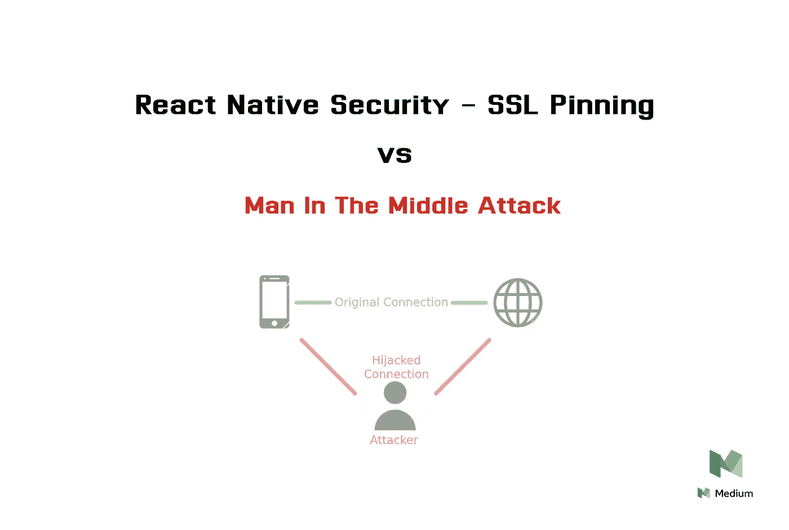
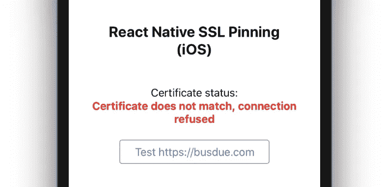
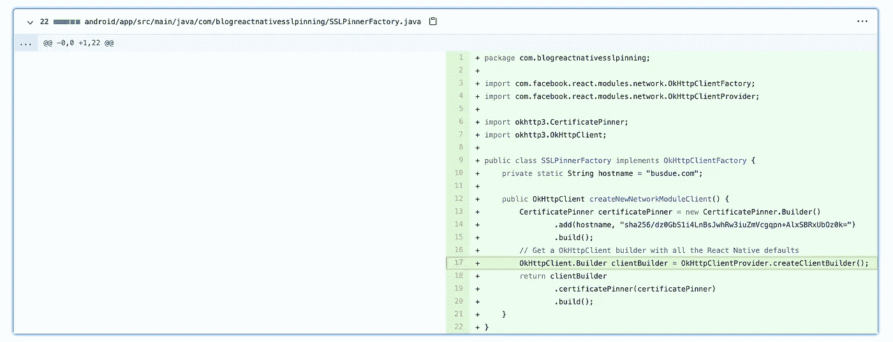
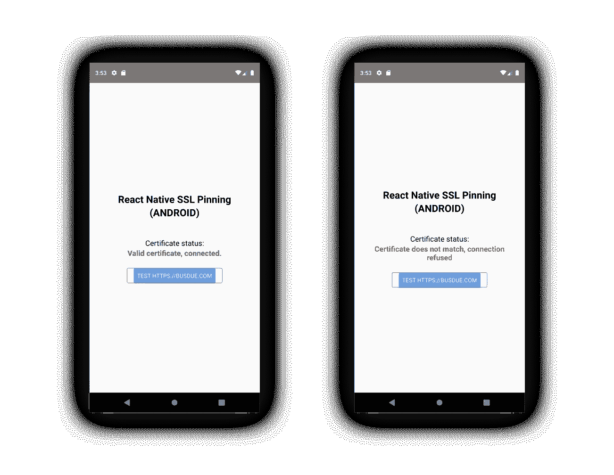

# 反应本机安全性:SSL 锁定

> 原文：<https://itnext.io/react-native-security-ssl-pinning-cde086210d58?source=collection_archive---------0----------------------->



反应本机安全性— SSL 锁定

# 介绍

在本文中，我们将了解如何在 React Native **iOS** 和 **Android** 应用中实现 **SSL Pinning** ，以保护其免受[中间人](https://en.wikipedia.org/wiki/Man-in-the-middle_attack)攻击。互联网上有大量精彩的文章深入讨论 SSL 证书锁定和移动安全的内部工作原理，因此我们不会讨论其原因或试图说服您为什么需要在您的应用程序中使用它。很有可能，你们大多数人在这里是因为你的项目需要它，所以让我们直接跳到好的部分😉

> 本指南中的示例代码[可从 Github](https://github.com/ywongweb/BlogReactNativeSSLPinning) 获得。克隆这个项目并遵循它可能会对您有所帮助。

# 提取证书的公钥

在设置 SSL 锁定逻辑之前，我们首先需要检索服务器证书的**公钥**。打开一个终端会话，输入下面的命令，用您的名字替换`server domain`名。

```
openssl s_client -servername busdue.com -connect busdue.com:443 | openssl x509 -pubkey -noout | openssl pkey -pubin -outform der | openssl dgst -sha256 -binary | openssl enc -base64
```

如果成功，您应该会看到类似下面的输出。复制 base64 **公钥**，我们将在接下来的步骤中用到它。

```
...
depth=0 CN = [www.busdue.com](http://www.busdue.com)
verify return:1
**dz0GbS1i4LnBsJwhRw3iuZmVcgqpn+AlxSBRxUbOz0k=**
```

# **iOS**

*(特别大喊到*[*Daniel Imber*](https://www.linkedin.com/in/daniel-imber-3066858/)*与我分享他关于这个话题的大量 iOS 知识)*

对于我们的 iOS 版本，我们将使用一个流行的名为 [TrustKit](https://github.com/datatheorem/TrustKit) 的本地库来处理 SSL 锁定和验证。首先进入 React 本地项目的`src/ios`文件夹，将下面的`TrustKit`条目添加到`Podfile`

```
...
target 'MediumSSLPinning' do
  *config* = use_native_modules!

  use_react_native!(:path => *config*["reactNativePath"])
 **pod 'TrustKit', '1.6.5'** ...
```

做一个`pod install`,让库正确的链接到你的项目。

## **1。在 AppDelegate.m 中设置 SSL 固定**

在 XCode 和`AppDelegate.m`中打开项目，将[这些 TrustKit 设置代码](https://github.com/ywongweb/BlogReactNativeSSLPinning/commit/be2871eae4f4fe7ab45b7c43d31086e89f8f653e#diff-032da2fda8147e17cc00fe6a2f310de8)复制到 React 本地应用程序初始化方法的开头。


你可以从这个 GitHub 提交中抓取这些代码

## **2。关于 iOS 方法 Swizzling 的快速说明**

在上面的提交中，你可能已经注意到我们已经启用了**方法 swizzling。**

```
kTSKSwizzleNetworkDelegates: @YES,
```

原因是，为了拦截网络连接并向我们的应用程序流量添加 SSL 公钥验证步骤，我们需要访问 React Native 的`NSURLConnection`和`NSURLSession`委托。不幸的是，[在撰写本文时，这在 iOS 上还无法实现](https://github.com/facebook/react-native/pull/27701)。因此，我们将利用 iOS **方法 Swizzling** 来改变运行时的`NSURLConnection`和`NSURLSession`。

> 根据你的应用程序的组成，**方法重组可能不适合你**。如果是这种情况，查看库文档中的[其他建议](https://datatheorem.github.io/TrustKit/documentation/Global%20Configuration%20Keys.html#/c:@kTSKSwizzleNetworkDelegates)。

## **3。确认 SSL 固定正在工作**

如果您正在使用[演示应用代码](https://github.com/ywongweb/BlogReactNativeSSLPinning)，现在运行它并按下**测试按钮**。您应该看到固定检查通过，并且屏幕上显示一条成功消息。


## 4.测试失败案例和一个陷阱！

好吧，现在你可能会问:

> 看到连接通过并不能证明安全性在起作用，我们需要测试失败的情况。SSL 固定安全性的全部目的是在证书不匹配时阻止连接。

你是对的！因此，让我们用一个无效的公钥替换我们的工作公钥。

```
@"AAAAAAAAAAAAAAAAAAAAAAAAAAAAAAAAAAAAAAAAAAA=",
```


用假的密钥替换当前的工作密钥

重新构建应用程序并再次运行。知道了我们的假的`AAAA`键应该没有通过锁定检查，你现在可能会期待在屏幕上看到一些错误信息。但是很有可能，你还在盯着同样的**成功**消息，有点迷茫。别担心，你没做错什么，继续读下去。


啊啊啊啊啊啊！

## **5。问题是:为什么即使密钥无效，连接仍然被允许？**

造成这种混乱的原因是因为 iOS **NSURLSession 维护自己的 TLS 会话缓存**。因此，即使我们在上一步中替换了密钥，缓存仍然没有获得更改。在开发期间强制缓存重置的一种方法是简单地从模拟器中删除应用程序，然后重新构建它。完成后，再次按下**测试按钮**，我们现在应该会看到预期的**连接被拒绝**消息。



这就是本指南 iOS 部分的全部内容。

# **安卓，简单多了****。**

在 Android 方面，事情要简单得多，因为 React 原生 Android 已经公开了启用 SSL 锁定所需的方法。此外，React 原生 Android 使用 OKHttp 进行网络调用，这个库带有官方的 SSL pin 支持。

## 1.使用 SSL 固定创建 OkHttpClientFactory

在与您的 Android 应用程序的`MainApplication.java`文件相同的文件夹中，创建一个新的 Java 文件并命名为`SSLPinnerFactory.java`，粘贴 [this commit](https://github.com/ywongweb/BlogReactNativeSSLPinning/commit/7ca12ad8100ef8dd86e0d7e089935bfac397cda5#diff-538b54548ab8353cbc639d28933dcff4) 的内容。



在 OkHttp 上启用 SSL 固定只是在客户端构建器构造器期间提供一个`CertificatePinner`配置的问题(参见 L19)。

我想在上面的代码中强调的一点是[第 17 行](https://github.com/ywongweb/BlogReactNativeSSLPinning/commit/7ca12ad8100ef8dd86e0d7e089935bfac397cda5#diff-538b54548ab8353cbc639d28933dcff4R17)，我们将使用 React Native `OkHttpClientProvider`上公开的一个公共方法，返回一个`OkHttpClientBuilder` [和所有默认的](https://github.com/facebook/react-native/blob/9b34aa261c272d96829c9a7d5b166594b3162f9d/ReactAndroid/src/main/java/com/facebook/react/modules/network/OkHttpClientProvider.java#L62)，而不是通过提供确切的起始值来构建我们自己的`OKHttpClient`构建器。这使得我们的代码更加经得起未来的考验，因为未来 React 本机版本中的任何更改都将自动包含在内。

## 2.指示 React Native 使用我们增强的 OkHttpClient

在`MainApplication.java`的`OnCreate()`方法中，添加来自[的代码，this commit](https://github.com/ywongweb/BlogReactNativeSSLPinning/commit/7ca12ad8100ef8dd86e0d7e089935bfac397cda5#diff-03011bf906df867defe5a8b6e38b95ddR49) 和 React Native [现在将使用](https://github.com/facebook/react-native/blob/9b34aa261c272d96829c9a7d5b166594b3162f9d/ReactAndroid/src/main/java/com/facebook/react/modules/network/OkHttpClientProvider.java#L56)提供的客户端工厂来代替。

```
OkHttpClientProvider.setOkHttpClientFactory(new SSLPinnerFactory());
```

现在运行并测试应用程序，就像我们对 iOS 版本所做的那样，一切都应该正常工作。Android HTTP 客户端没有与 iOS 相同的 SSL 会话缓存问题，因此无需在每次更改后删除应用程序，只需从 Android Studio 重新运行应用程序即可。



Android SSL 固定

# 你已经到达文章的结尾。

谢谢你看完。如果你觉得这个指南有用，请留下几个(或 50 个)掌声👏这样就能接触到更多的人。欢迎所有的意见和建议，保持安全和快乐的编码！