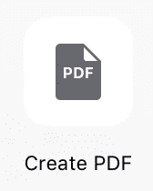
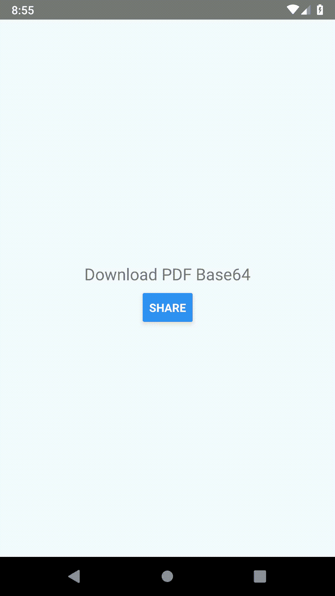

# React 本机共享 PDF

> 原文：<https://itnext.io/react-native-share-pdf-b58a0c4211ea?source=collection_archive---------3----------------------->

> *TL；DR:使用*[*react-native-share-PDF*](https://github.com/MadeinFrance/react-native-share-pdf)*库在 Android/iOS 上共享 base64 PDF。*


# 语境

在 ING Investments，我们使用 **React Native** 在两个平台上发布移动投资应用。移动应用程序是一个交易应用程序，允许在荷兰市场买卖不同的金融工具。没有注册帐户，你可以尝试公共环境，给一个可用功能的潜行高峰。有兴趣的话可以在这里找到这个游乐场:( [iOS](https://itunes.apple.com/app/id1231921275) — [Android](https://play.google.com/store/apps/details?id=com.ing.investment) )。

作为 ING Investments 的一个小型多学科团队的全栈开发人员，我们致力于所有金融交易的成本透明。作为这一关键功能的一部分，我们遇到了对时间敏感的挑战，即**共享一个 PDF 文件**(编码为`base64`)，以便用户可以在他的首选目的地保存一个本地副本，这在税收等方面非常有用。

**在 iOS 上分享文档确实有效，但在 Android 上却不行**。让我们检查一下为什么以及如何解决这个问题。

# 为什么反应原生？

React Native 是一个有价值的框架，它借用 React 的范例和设计原则来实现快速、跨平台的快速 ui 开发。[脸书、优步、Instagram、Tesla、Skype 和许多其他公司](https://facebook.github.io/react-native/showcase)已经为 iOS 和 Android 用户开发了基于 React Native 的最新应用&。作为首批使用 React Native 的荷兰团队之一，我们对这项技术和其他原生模块的体验是最佳的。

# 在 React Native 中共享

我们的目标是打开 native Share[action sheet](https://developer.apple.com/design/human-interface-guidelines/ios/views/action-sheets/)(或 activity)，这样系统就可以推荐支持 PDF 格式的应用。之后，用户可以选择哪个应用程序将被用来存储文件。

在 iOS 上，React Native 允许我们使用 [< url >](https://facebook.github.io/react-native/docs/share#ios) 属性轻松共享 base64 编码的文件。

以下代码片段打开本机共享操作表。

系统解释<url>类型和数据，并给出创建 PDF 的选项。</url>



**遗憾的是，在 Android 上不支持**[**<URL>**](https://facebook.github.io/react-native/docs/share#android)**属性。**

# ING 投资解决方案

React Native 的设计方式使您能够执行跨语言的函数调用。您可以从 JavaScript 执行自定义本机代码，反之亦然。

➡️:让我们描述一下我们的本地解决方案，以便在客户的设备上共享 PDF 文件。

检索 base64 数据后，Android 的原生 Java 解决方案包括以下步骤:

1.  **清理以前共享的 PDF 文件。** 我们不想在设备上积累太多文件，所以我们清理了之前共享的 PDF 文件:

**2。将 PDF 文件写入设备系统。** 我们可以通过将`base64`字符串解码为`byte array`来做到这一点:

**3。开始分享活动。**

在 Android 中，我们必须通过用`ACTION_SEND`指定 PDF mime 类型来构建一个[意图](https://developer.android.com/reference/android/content/Intent)，以便将 PDF 文件数据从一个活动发送到另一个活动。`EXTRA_STREAM`用于指定将要共享的实际二进制数据。

```
Uri outputFileUri = FileProvider.getUriForFile(reactContext, "com.maximegerbe.reactnative.sharefile.provider", file);Intent intentShareFile = new Intent(Intent.ACTION_SEND);
intentShareFile.setType(TYPE_PDF);
intentShareFile.putExtra(Intent.EXTRA_STREAM, outputFileUri);reactContext.startActivity(Intent.createChooser(intentShareFile, ""));
```

为了向设备系统写入/读取 PDF 文件，我们需要在`AndroidManifest.xml`中创建一个 [FileProvider](https://developer.android.com/reference/android/support/v4/content/FileProvider) 组件。为了指定可用文件的目录，我们使用了`<paths>`元素的子元素。例如，下面的`paths`元素告诉`FileProvider`您打算为私有文件区域的`pdf_documents_for_sharing/`子目录请求内容 URIs。

`ShareFile`将处理上述 3 个步骤。Java 类的完整实现可以在[这里](https://github.com/MadeinFrance/react-native-share-pdf/blob/master/android/src/main/java/com/maximegerbe/reactnative/sharefile/ShareFile.java)找到。

从本机模块中，我们导出了`RNShareFile`对象，并公开了可以从 JavaScript 层调用的下面的`share()`方法。你可以在这里阅读更多关于有案可稽的原生模块设置[的内容。](https://facebook.github.io/react-native/docs/native-modules-android)

共享方法签名:

在`App.js`的用法:

这开启了本地共享活动(更多[演示](https://github.com/MadeinFrance/react-native-share-pdf/blob/master/README.md#demo)



机器人

*在本例中，我们将 PDF 文件共享给 GMail。*

# 单元测试

目标是验证`sharePDF()`方法为每个平台做了一件事:

*   调用 iOS 平台 API。
*   在 Android 上调用我们本机模块的`share()`方法。

我们可以通过模仿 React 本地库`Platform.select`和`Share.share`用 [Jest](https://jestjs.io/) 来实现这一点:

覆盖率结果:


# 结论

PDF 用例表明，有时应用程序需要访问平台 API，如果 React Native 不提供相应的模块，我们可以随时编写本机代码，并获得平台的全部功能。其他示例包括:重用现有的本机代码、多线程代码等。

目前我们只能共享 mime 类型为`application/pdf`的文件。我们可以通过提供 mime 类型作为参数来改进这一点。由于 React Native 是一个开源项目，将来我们可以通过将这个库集成到项目中来做出贡献。

这个库以 NPM 包的形式分发: [NPM](https://www.npmjs.com/package/react-native-share-pdf) (4.2 kB)，源代码可以在 GitHub:[https://github.com/MadeinFrance/react-native-share-pdf](https://github.com/MadeinFrance/react-native-share-pdf)上获得

如果这篇文章引起了你的注意，你可以在这里找到一个演示项目[。](https://github.com/MadeinFrance/react-native-share-pdf/tree/master/demo)

对于任何问题或反馈，请在下面的评论中告诉我。如果这有用，请点击拍手👏按钮，以示支持。

*感谢阅读，
Maxime Gerbe。*