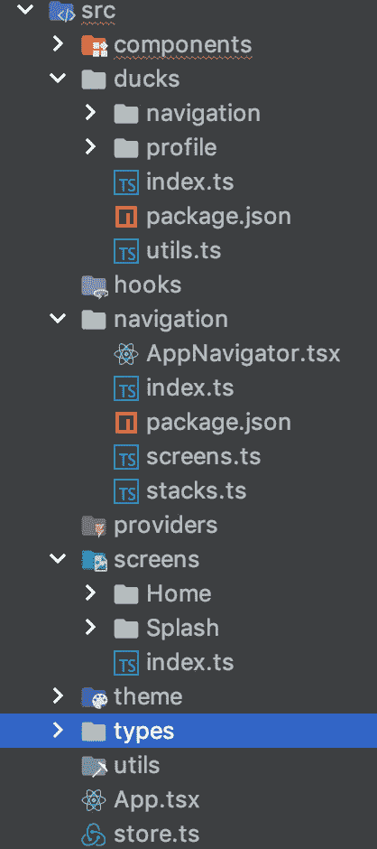

# React-Native —为您的项目提供提示、结构和解决方案

> 原文：<https://itnext.io/react-native-tips-structure-solutions-for-your-project-cecf5d7ef733?source=collection_archive---------2----------------------->

## 为您的 redux+react navigation+typescript RN 项目提供更好的结构和提示！


一段时间以来，我一直在从我使用 React Native 框架开发的所有应用程序中收集信息，包括我正在做的好的和坏的实践。所以我决定我可以分享一些信息，可能会帮助那里的人！

## **在项目早期使用类型**

不管你的项目一开始是大是小，如果你认为你的应用程序在将来可以扩展，尽早开始是好的。当您的应用程序处于活动状态时，类型可以帮助您避免错误，因为发布新版本会使调试变得困难，并且对其进行任何修复也会变得缓慢。同样，很难将一个现有的项目缓慢地转换成 typescript 并保持你的类型结构。

## 导航，导航，导航

这将是你的系统的核心。没有任何应用程序没有从一个屏幕到另一个屏幕的导航(除了 hello world RN 示例应用程序😃).在 react native 生态系统中，没有多少库受到关注，但我认为 RN 正在推广的一个库是 React Navigation，我认为这是值得的，它将会是你所寻找的 99%。我同时使用了原生和 javascript 解决方案，我认为这是最具扩展性的解决方案，因为你可以对它进行大量定制，而且在 v3 上非常快。

## **多个导入常见问题和绝对路径**

正如你将在下一点“构建你的项目”中看到的，我的每个文件夹都有一个 package.json。这个 package.json 有那个文件夹的名称，所以我可以在应用程序中使用绝对路径。

```
{
  "name": "theme"
}
```

你可以读一下[大卫·伍迪](https://medium.com/u/fea4322d14f9?source=post_page-----cecf5d7ef733--------------------------------)的精彩[帖子](https://medium.com/@davidjwoody/how-to-use-absolute-paths-in-react-native-6b06ae3f65d1)

此外，为了在 react native 中实现多个导入，您必须使用这个 babel.config.js，否则您必须逐个导入它们，因为 babel + metro 有编译器错误。

```
module.exports = {
  presets: ['module:metro-react-native-babel-preset'],
  plugins: [
    [
      '@babel/plugin-transform-modules-commonjs',
      {
        strictMode: false,
        allowTopLevelThis: true,
        loose: true,
      },
    ],
  ],
};
```

如果你使用 react-native 矢量图标，这将再次失败。一个临时的修复方法是从它们的 dist 文件夹中显式地导入它们。

```
import FeatherIcon from 'react-native-vector-icons/dist/Feather';
```

您还需要为它定义一个全局类型

```
declare module 'react-native-vector-icons/dist/Feather';
```

## 构建您的项目



我一直认为构建项目文件夹是最关键的时刻之一，因为这是你在项目中做出的第一个架构决策。当然，当谈到 RN 时，如果你已经熟悉 React，你不需要做太多的改变，但这也是我的建议。

每个文件夹必须有一个可以导出所有必要文件的索引文件，这样您就可以对其他文件进行多次导入。当然，这是不可行的，直到今年，你必须分别导入每个模块，但在巴别塔的帮助下，你可以使用这个技巧，你将能够像下面这样导入。

```
import { Player, Header } from 'components';
```

**屏幕**:屏幕是我们应用的容器组件，是应用的实际屏幕。最好有他们自己的，这样我们就知道我们有哪些屏幕，也知道我们的容器

**组件:**在这里你可以拥有你的应用程序中不止一次使用的或者不是屏幕的所有全局组件。

**鸭子**:这个文件夹包含了我们所有的应用程序逻辑，因为它保存了我们的 redux 状态。它以 redux 的 ducks 模块化范例命名，redux 允许您毫无问题地扩展您的应用程序。一篇好文章可以在这里找到[。我的每只鸭子都由以下文件组成，我如何使用 type 来绑定 redux 和 typescript，在我的另一篇文章](https://www.freecodecamp.org/news/scaling-your-redux-app-with-ducks-6115955638be/)中也提到了

```
actions - reducer - selectors - types
```

除了这些文件之外，还有一个 ***可选的*** 文件，名为 epics，它保存了所有使用 RxJS 的副作用逻辑。考虑在这里看一下[。](https://medium.com/@panagiotisvrs/handling-redux-side-effects-the-rxjs-way-59c057b12cd4)

**钩子:**我的应用程序正在使用的所有定制钩子

**服务:**(可选)这通常包含几个服务的实例——推送通知、google tracker 等

**提供者:**这里我保存了所有为我的应用程序提供数据的函数，比如 API 调用。

**类型:**我的 app 需要的全局类型。通常这些是这个文件的起始内容，以避免对图像进行类型检查。

```
declare module '*.png';
declare module '*.jpg';
```

**utils** :任何用于规范化数据或从数组中选取 id 的全局 util。在这里，我将它分解成不同的函数或实用程序等。

导航:由于导航是你的应用程序的一个重要组成部分，它需要自己的空间。在这里，我打破了我的导航向下屏幕和堆栈命名。所以如果你打开其中一个文件，你会看到

```
export const HOME_SCREEN = 'HOME_SCREEN';orexport const INITIAL_STACK = 'INITIAL_STACK';
export const HOME_STACK = 'HOME_STACK';
```

这些是非常有用的，因为您可以将它们导入到应用程序的每个部分，以避免为您的应用程序提供将来可能会更改的字符串。

您的 appNavigation 创建了一个组件，它保存了所有连接到 redux 的导航(如果您不使用它，也可以不连接),在这里您可以用上面定义的名称定义堆栈和屏幕

```
const HomeStack = createBottomTabNavigator(
  {
    [HOME_SCREEN]: Home,
  }
);
```

**主题:**是我为应用程序使用的全局主题属性和功能。因为我在 JS 中使用 CSS，这个文件夹通常包含两个文件 functions 和 globals。函数拥有创建 flex 等的所有函数，全局函数是颜色、间距等。例如

```
export const flex = css`
  flex: 1;
`;

export const flexCenter = css`
  align-items: center;
  justify-content: center;
`;
```

**资产**:不在我的截图上，但总有一个资产文件夹保存你所有的本地声音、图像、视频等

## 应用动画简单和困难的方式

动画对于任何应用程序都是至关重要的。是那些能让你的应用感觉很自然的东西(当然是！)而且会给人更好的感觉。但是你要确保不要搬起石头砸自己的脚，因为有库可以用，洛蒂和 RN 动画 API。

Lottie 会给你一个非常简单的方法来在你的应用程序上显示动画，但是当你构建你的屏幕堆栈时，它会很容易地拖累你的系统。这是因为每个屏幕都会转到上一个屏幕的顶部。这样，你的前一个屏幕仍然是安装的，所以如果你有两个屏幕，动画背景洛蒂动画，你在第二个屏幕两个动画都在运行。所以猜猜当越来越多的时候会发生什么。

像 animatable 这样的库是非常方便的，当然你总是需要把 useNativeDriver。[脸书做了一个很棒的帖子解释为什么](https://facebook.github.io/react-native/blog/2017/02/14/using-native-driver-for-animated)。

如果你认为你需要一些定制的东西，那么动画 API 是你唯一的方法。

请记住，当涉及到动画时，避免远程调试，这将降低您的应用程序的速度，并始终通过检查帧在真实设备上进行测试。

总结一下，这些都不是可以毫无疑问地接受的，我只是说，这些是我在使用 React Native 为 iOS 和 Android 构建应用程序时面临的问题以及我用来处理的技巧和结构。

你正在使用的是什么？你觉得这些有用吗？让我知道你的想法！

> 如果你喜欢这篇文章，可以考虑点击 clap👏你可以随时访问我的其他文章🔥