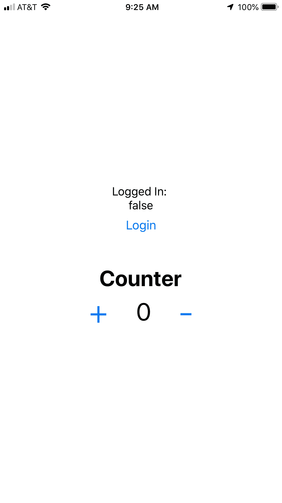

# React Native + Redux:为什么应该使用 Redux-Persist (6.x)来避免 Redux 存储消失

> 原文：<https://itnext.io/react-native-why-you-should-be-using-redux-persist-8ad1d68fa48b?source=collection_archive---------0----------------------->

## 作者:杰夫·刘易斯(更新时间:2019 年 10 月 30 日)


**备注:**

*   本指南假设你知道**反应原生**和**还原**。
*   Github 回购:[https://github.com/jefelewis/redux-persist-demo](https://github.com/jefelewis/redux-persist-demo)

# 1.什么是 Redux-Persist？

假设您正在使用您的应用程序，在某个时候，您决定清除所有应用程序，因为您有太多打开的应用程序。然后你点击你的应用程序图标，它就会启动，但现在你会看到一个登录屏幕。

你没有按退出，那你为什么退出？这是因为当应用程序关闭时，状态没有被保存。 **Redux-Persist 在 iPhone 模拟器中关闭或刷新应用程序时保存 Redux 商店。**

# 2.我们如何使用 Redux Persist？

## A.NPM 依赖地解释道:

*   **redux** (全球商店)( [NPM 链接](https://www.npmjs.com/package/redux))
*   **react-redux** (用于 React/React Native) ( [NPM 链接](https://www.npmjs.com/package/react-redux))
*   **redux-persist** (持久化 redux 全球商店)( [NPM 链接](https://www.npmjs.com/package/redux-persist))
*   **redux-logger** (开发时记录 redux 状态)( [NPM 链接](https://www.npmjs.com/package/redux-logger))

## **B .安装依赖关系:**

```
npm install redux react-redux redux-persist @react-native-community/async-storage --save
```

## C.安装依赖项(开发):

```
npm install redux-logger --save-dev
```

# 3.示例应用+代码

**Github 回购:**https://github.com/jefelewis/redux-persist-test

## A.应用概述

App 将有**两个减速器** : **主减速器**和**副减速器**。在我们的 store.js 文件中，我们可以**将**列入黑名单或者**将**列入白名单，只保存来自特定 reducer 的数据。在我们的例子中，我们只保存来自 authReducer 的数据。

为了测试 Redux Persist 是否在我们的应用程序中工作，我们可以单击 login 按钮(状态应该变为 true)并将计数器增加到 5。当我们刷新我们的应用程序时，登录状态应该保持为真(白名单)，计数器应该重置为 0(黑名单)。

## B.App 截图



App 截图

## C.应用程序文件结构

本例将使用 8 个文件:

1.  App.js (React 原生应用)
2.  Counter.js(计数器屏幕)
3.  store.js (Redux 商店)
4.  index.js (Redux Root Reducer)
5.  authActions.js(验证操作)
6.  反制措施
7.  Auth reduce . js(Redux Auth Reducer)
8.  counterReducer.js (Redux 计数器 Reducer)

## D.应用程序文件

**App.js**

```
// Imports: Dependencies
import React from 'react';
**import { PersistGate } from 'redux-persist/integration/react';
import { Provider } from 'react-redux';**// Imports: Screens
import Counter from './screens/Counter';*// Imports: Redux Persist Persister* **import { store, persistor } from './store/store';**// React Native: App
export default function App() {
  return (    // Redux: Global Store
 **<Provider store={store}>**
 **<PersistGate loading={null} persistor={persistor}>**        <Counter />
 **</PersistGate>
    </Provider>**  );
};
```

**Counter.js**

```
// Imports: Dependencies
import React, { Component } from 'react';
import { Button, Dimensions, SafeAreaView, StyleSheet, Text, TouchableOpacity, View } from 'react-native';
import { connect } from 'react-redux';*// Screen Dimensions* const { height, width } = Dimensions.get('window');*// Screen: Counter* class Counter extends React.Component {
  render() {
    return (
      <SafeAreaView style={styles.container}>
        <View style={styles.loggedInContainer}>
          <Text style={styles.loggedInText}>Logged In: </Text>
          <Text style={styles.loggedInText}>{`${this.props.loggedIn}`}</Text> <Button
            title="Login"
            onPress={this.props.loggedIn === false ? () => this.props.reduxLogin(true) : () => this.props.reduxLogin(false)}
            style={styles.loginButton}
          />
        </View> <Text style={styles.counterTitle}>Counter</Text> <View style={styles.counterContainer}>
          <TouchableOpacity onPress={() => this.props.reduxIncreaseCounter()}>
            <Text style={styles.buttonText}>+</Text>
          </TouchableOpacity> <Text style={styles.counterText}>{this.props.counter}</Text <TouchableOpacity onPress={() => this.props.reduxDecreaseCounter()}>
            <Text style={styles.buttonText}>-</Text>
          </TouchableOpacity>
        </View>
      </SafeAreaView>
    )
  }
}*// Styles* const styles = StyleSheet.create({
  container: {
    flex: 1,
    justifyContent: 'center',
    alignItems: 'center',
   },
   loggedInContainer: {
     display: 'flex',
     flexDirection: 'column',
     justifyContent: 'center',
     alignItems: 'center',
     marginBottom: 40,
   },
   loginButton: {
     marginTop: 20,
     paddingTop: 20,
   },
   counterContainer: {
     display: 'flex',
     flexDirection: 'row',
     justifyContent: 'center',
     alignItems: 'center',
   },
   loggedInText: {
     fontFamily: 'System',
     fontSize: 17,
     fontWeight: '400',
     color: '#000',
   },
   counterTitle: {
     fontFamily: 'System',
     fontSize: 32,
     fontWeight: '700',
     color: '#000',
   },
   counterText: {
     fontFamily: 'System',
     fontSize: 36,
     fontWeight: '400',
     color: '#000',
   },
   buttonText: {
     fontFamily: 'System',
     fontSize: 50,
     fontWeight: '300',
     color: '#007AFF',
     marginLeft: 40,
     marginRight: 40,
   },
});*// Map State To Props (Redux Store Passes State To Component)* const mapStateToProps = (state) => {
 *// Redux Store --> Component* return {
    counter: state.counterReducer.counter,
    loggedIn: state.authReducer.loggedIn,
  };
};*// Map Dispatch To Props (Dispatch Actions To Reducers. Reducers Then Modify The Data And Assign It To Your Props)* const mapDispatchToProps = (dispatch) => {
  *// Action* return {
    *// Increase Counter* reduxIncreaseCounter: () => dispatch(increaseCounter()),
    *// Decrease Counter* reduxDecreaseCounter: () => dispatch(decreaseCounter()),
    *// Login* reduxLogin: (trueFalse) => dispatch(login(trueFalse)),
  };
};*// Exports* export default connect(mapStateToProps, mapDispatchToProps)(Counter);
```

**store.js**

```
// Imports: Dependencies
import AsyncStorage from '@react-native-community/async-storage';
import { createStore, applyMiddleware } from 'redux';
import { createLogger } from 'redux-logger';
**import { persistStore, persistReducer } from 'redux-persist';**// Imports: Redux
import rootReducer from '../reducers/index';*// Middleware: Redux Persist Config* **const persistConfig = {
**  *// Root* key: 'root',
  *// Storage Method (React Native)
***storage: AsyncStorage,
**  *// Whitelist (Save Specific Reducers)
***whitelist: [
    'authReducer',
  ],** *// Blacklist (Don't Save Specific Reducers)
***blacklist: [
    'counterReducer',
  ],**
};*// Middleware: Redux Persist Persisted Reducer* **const persistedReducer = persistReducer(persistConfig, rootReducer);***// Redux: Store* const store = createStore(
 **persistedReducer,**  applyMiddleware(
    createLogger(),
  ),
);*// Middleware: Redux Persist Persister* **let persistor = persistStore(store);***// Exports* export {
  store,
 **persistor,** };
```

**index.js**

```
// Imports: Dependencies
import { combineReducers } from 'redux';// Imports: Reducers
import authReducer from './authReducer';
import counterReducer from './counterReducer';

// Redux: Root Reducer
const rootReducer = combineReducers({
  authReducer: authReducer,
  counterReducer: counterReducer,
});// Exports
export default rootReducer;
```

**authActions.js**

```
*// Login* export const login = (trueFalse) => ({
  type: 'LOGIN',
  trueFalse: trueFalse,
});
```

**反作用. js**

```
*// Increase Counter* export const increaseCounter = () => ({
  type: 'INCREASE_COUNTER',
});*// Decrease Counter* export const decreaseCounter = () => ({
  type: 'DECREASE_COUNTER',
});
```

**authReducer.js**

```
// Initial State
const initialState = {
  loggedIn: false,
};// Reducers (Modifies The State And Returns A New State)
const authReducer = (state = initialState, action) => {
  switch (action.type) { // Login
    case 'LOGIN': {
      return {
        // State
        ...state,
        // Redux Store
        loggedIn: action.trueFalse,
      }
    } // Default
    default: {
      return state;
    }
  }
};// Exports
export default authReducer;
```

**counterReducer.js**

```
// Initial State
const initialState = {
  counter: 0,
};// Reducers (Modifies The State And Returns A New State)
const counterReducer = (state = initialState, action) => {
  switch (action.type) { // Increase Counter
    case 'INCREASE_COUNTER': {
      return {
        // State
        ...state,
        // Redux Store
        counter: state.counter + 1,
      }
    } // Decrease Counter
    case 'DECREASE_COUNTER': {
      return {
        // State
        ...state,
        // Redux Store
        counter: state.counter - 1,
      }
    } // Default
    default: {
      return state;
    }
  }
};// Exports
export default counterReducer;
```

# 继续坚持

就是这样！Redux Persist 现在可以在您的应用程序中工作，您的 Redux 存储现在可以在刷新时保存。

没有人是完美的。如果您发现了任何错误，想要提出改进建议，或者扩展某个主题，请随时给我发消息。我一定会包括任何改进或纠正任何问题。