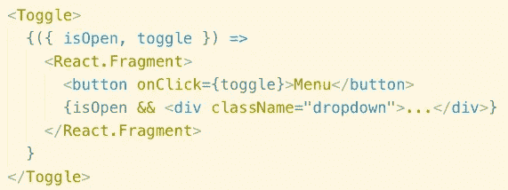

# 反应模式—lambda 组件和渲染道具

> 原文：<https://itnext.io/react-patterns-lambda-components-and-render-props-c4dce3903a52?source=collection_archive---------3----------------------->



“渲染道具”模式

观察开发人员如何在 React 中不断发现新的组件组合模式是很棒的。一些曾经被认为是反模式的模式突然获得了一个名字，开发人员开始使用它。另一方面，一些成熟的模式变得过时，因为有更好的方法来解决问题。

我开始在 [jsLingui](https://github.com/lingui/js-lingui) i18n 库中使用所谓的渲染道具来定制翻译的渲染。我不知道这种模式被称为“渲染道具”，但它很快在 React 生态系统中流行起来。几天前，我收到一个关于 withI18n 高阶组件是否有“渲染属性”变体的问题，很自然地，我将用户指向 Trans 组件的[渲染属性](https://lingui.github.io/js-lingui/ref/react.html#local-configuration)。他的回答很有趣:

> 这已经是一种渲染道具了，尽管这是一种有趣变化，我还没有见过

我想:什么？它是一个道具，叫做 render，用来自定义渲染。还有什么能更“渲染道具”呢？于是我开始谷歌搜索，在官方 React 文档中找到了一篇关于[渲染道具](https://reactjs.org/docs/render-props.html)的文章。

我不想责怪任何人，因为命名是编程中最难的事情之一。相反，我想写下我自己对“渲染道具”模式的观点。

# React 文档中定义的“渲染道具”

术语“渲染道具”通常用于以下模式:

```
<DataProvider>
  {(data) => data.map(item => <li key={item.id}>{item.value}</li>)}
</DataProvider>
```

我们有一个数据提供者(data provider ),它可以封装数据获取、复杂的行为，但是将渲染委托给子进程。有一个单独的子函数，一个以数据为参数的函数。

简单的实现可能如下所示:

```
function DataProvider({ children }) {
  const data = /* fetch data somehow: state, derive from props, … */
  return children(data)
}
```

术语“渲染道具”源自类似的用例，其中使用道具`render`代替子道具:

```
<DataProvider render={
  (data) => data.map(item => <li key={item.id}>{item.value}</li>)
} />
```

毕竟，孩子只是道具的特例。

问题是，为什么这种模式被称为“渲染道具”？

> 重要的不是名为`render`的道具，而是这个道具的值是一个函数这个事实。

不是任何函数，而是在 render 方法中定义的匿名函数。为什么不叫它**λ分量**？

我们去兔子洞吧。

## 用组件和元素替换 lambda 组件

想象一下，函数将接受一个对象作为第一个(也是唯一的)参数:

```
<DataProvider>
  {({ data }) => data.map(i => <li key={i.id}>{i.value}</li>)}
</DataProvider>
```

现在 lambda 组件看起来非常像函数组件:

```
const DataRenderer = ({ data }) => 
  data.map(i => <li key={i.id}>{i.value}</li>)<DataProvider>
  <DataRenderer />
</DataProvider>
```

有道理，对吧？除了它不能工作，因为我们的`DataProvider`的实现期望孩子作为一个函数，但是现在我们传递的甚至不是一个函数组件，而是一个元素。

*注:组件为* `*DataRenderer*` *，元素为* `*<DataRenderer />*` *。* `*<DataRenderer />*` *在 JSX 被改造成* `*React.createElement(DataRenderer)*` *。*

让我们更新一下我们的`DataProvider`:

```
function DataProvider({ children }) {
  const data = /* fetch data somehow: state, derive from props, … */
  const props = { data } return React.isValidElement(children)
    ? React.cloneElement(children, props)  // element as children
    : React.createElement(children, props) // component as children
}
```

现在`DataProvider`支持两种模式。经典组合，但内部组件从父组件获取注入数据:

```
const DataRenderer = ({ data }) => 
  data.map(i => <li key={i.id}>{i.value}</li>)<DataProvider>
  <DataRenderer />
</DataProvider>
```

和“渲染属性”模式，其中我们将 lambda 组件作为子组件传递:

```
<DataProvider>
  {({ data }) => data.map(i => <li key={i.id}>{i.value}</li>)}
</DataProvider>
```

因此，我们可能有一个“渲染道具”行为，但没有 lambda 组件，问题仍然是:有什么区别？范围！

## 通过作用域传递数据

我们可以将前面示例中的函数提取到函数组件中，因为该函数是“纯”的:它不使用范围之外的数据，即使它可以访问这些数据。想象一个不同的组件:

```
function DataPage(props) {
  const computedProperty = compute(props)

  return (
    <DataProvider>
      {({ data }) => (
        <div>
          {computedProperty}
          {data.map(i => <li key={i.id}>{i.value}</li>)}
        </div>
      )}
    </DataProvider>
  )
}
```

Lambda 组件使用父作用域中的数据！如果我们在`DataPage`范围之外声明它，我们需要显式传递所需的数据:

```
const DataRenderer = {({ data, computedProperty }) => (
  <div>
    {computedProperty}
    {data.map(i => <li key={i.id}>{i.value}</li>)}
  </div>
)}function DataPage(props) {
  const computedProperty = compute(props)

  return (
    <DataProvider>
      <DataRenderer computedProperty={computedProperty} />
    </DataProvider>
  )
}
```

我们又回到了良好的旧组件构成。不太明显的是，`DataProvider`实际上将`data` prop 注入到了`DataRenderer`，但这是相同的模式，相同的行为，只是没有 lambda 组件。

在 React 中，我们似乎有三种传递数据的方式:

*   通过道具
*   通过上下文
*   通过范围

它们都有优点和缺点，取决于具体的用例。

# 结论

我花了几个小时写这篇短文，因为我完全迷失在不同的模式中。我还发现了一些我不知道存在于 React 中的模式。无论如何，这是我对“渲染道具”的观点，也是为什么我觉得这个名字很混乱。

你对名称**λ组件**有什么看法？

最后一个问题是:如何命名`DataProvider`，这个组件消耗组件或元素并向其注入数据？它是一个容器吗？提供商？“渲染道具”组件？就我个人而言，我倾向于使用**容器**，因为它通常定义一种行为或业务逻辑，而不是表示逻辑。

“渲染属性”模式不是 HOC 最终替代品，因为您不能在生命周期方法中使用容器中的数据。在某些情况下，它仍然是有用的模式，并且肯定是每个 React 开发人员都应该拥有的模式。

嘿！我正在开发 [jsLingui](https://github.com/lingui/js-lingui) ，这是一个用于 JavaScript 的 i18n 库。该库从头到尾解决了 i18n，提供了用于翻译的组件、用于管理消息目录的 CLI 以及离线编译消息以节省包大小。它是 react-intl 的替代方案，但也适用于普通 JS。看看 [React 教程](https://lingui.github.io/js-lingui/tutorials/react.html)或者说[和 react-intl](https://lingui.github.io/js-lingui/misc/react-intl.html) 有什么不同。