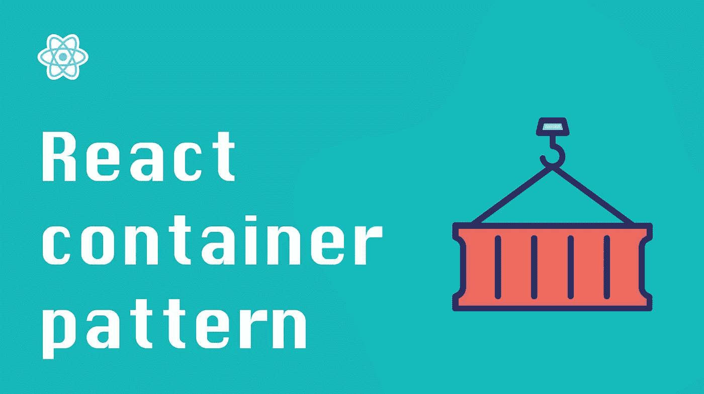

# 反应模式:容器模式

> 原文：<https://itnext.io/react-patterns-the-container-pattern-4d8b5b6f0127?source=collection_archive---------2----------------------->



容器模式是 React 中最有用的模式之一。您可以使用它实现一种声明性的方式来重用自定义功能，如获取数据、身份验证、布局等。

让我们来看看它是如何工作的！

# 容器模式是什么？

该模式背后的思想很简单:您有一个容器组件，它提供自定义功能，并使用`children` prop 呈现您输入的任何 React 节点。

该模式的一些用例是:

*   Loader——当某个条件为真时，容器将显示一个 loader，否则，它将呈现内容。
*   身份验证门—如果用户未经身份验证，容器将不会呈现其子级。
*   布局和样式——容器充当提供一致样式的包装器。假设您有多个具有不同内容的仪表板页面，并且您希望它们具有相同的仪表板处理方式。

现在我们已经了解了容器模式，让我们来看一个简单的实现。

# 动作中的容器模式

让我们构建一个简单的门控容器，它将在呈现内容之前检查以确保用户已经过身份验证。

下面是我们的容器组件的样子:

```
import React from "react";
import { useGetUserSession } from "./useGetUserSession";const GateComponent = ({ children }) => {
  const { isAuthenticated } = useGetUserSession();if (!isAuthenticated) return null;return <>{children}</>;
};export default GateComponent;
```

如您所见，这非常简单:我们使用一个 React 钩子从我们的应用程序状态中获取`isAuthenticated`布尔值。如果是福尔西，我们简单地返回`null`。如果`isAuthenticated`是真实的，我们渲染`children`道具。

现在，您可以使用简单的声明性代码将 UI 页面置于身份验证层之后:

```
const PrivateComponent = () => {
  return (
    <GateComponent>
      <p>Secret data here, shhhh!</p>
    </GateComponent>
  );
};
```

这种方法的另一个好处是很容易向身份验证添加更复杂的逻辑，而无需更改客户端代码。

如果您想了解更多关于为 React 应用程序构建一个健壮的权限系统的知识，请查看我的另一篇关于在 React 中处理角色和权限的干净方法的帖子。

# 具有多个子容器的容器

在某些情况下，您可能需要创建带有两个内容占位符的容器。例如，您可能有一个允许提供自定义侧栏和主要内容的仪表板。

```
const Dashboard = ({ SidebarComponent, ContentComponent }) => {
  return (
    <div className="dashboard">
      <div className="sidebar">
        <SidebarComponent />
      </div>
      <div className="content">
        <ContentComponent />
      </div>
    </div>
  );
};
```

代码非常简单:我们的`Dashboard`容器接受侧栏和仪表板主体的自定义 React 节点。

**注意:将组件属性名大写很重要。**这就是 React 如何确定`Dashboard`收到的道具实际上是否是 function 的一个组件。

# 结论

React 容器模式是从 UI 代码中抽象复杂逻辑的一种便捷方式。它允许您以声明的方式重用应用程序的公共逻辑。

*原载于 2022 年 3 月 28 日*[*【https://isamatov.com】*](https://isamatov.com/react-patterns-container/)*。*